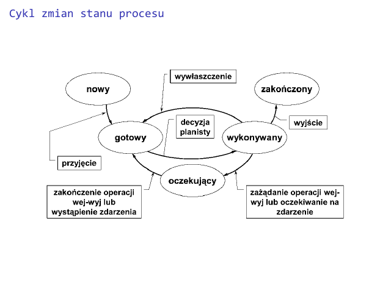

---

- [Zasób](#zasób)
- [Proces](#proces)
- [Zarządcy](#zarządcy)
- [Deskryptor](#deskryptor)
- [Stan procesu](#stan-procesu)
- [Wątek **(thread)**](#wątek-thread)
    - [Synchronizacja wątków](#synchronizacja-wątków)

---

## Zasób

Zasobem jest element sprzętowy lub programowy systemu komputerowego, którego brak może potencjalnie zablokować wykonywanie programu (przetwarzanie)

Przykłady zasobów:
- Procesor
- Pamięć
- Plik

## Proces

- elementarna jednostka pracy (aktywności) zarządzaną przez system operacyjny, która ubiega się o zasoby systemu komputerowego w celu wykonania programu
- elementy składowe
  - **program** *definiuje zachowanie procesu*
  - **dane** *zbiór wartości przetwarzanych oraz wyniki*
  - *zbiór zasobów tworzących środowisko wykonawcze*
  - *blok kontrolny procesu (PCB, [deskryptor](#deskryptor)) - opis bieżącego stanu procesu*

## Zarządcy

1. **Zarządca procesów** *(process manager)*
   - kontroluje stany procesów w celu efektywnego i bezpiecznego wykorzystania zasobów systemu
2. **Zarządca zasobów** *(resource manager)*
   - realizuje przydział zasobów stosownie do żądań procesów, aktualnego stanu systemów oraz ogólnosystemowej polityki przydziału

## Deskryptor

- Identyfikator procesu
- Stan procesu *(nowy, gotowy, oczekujący, etc.)*
- Identyfikator właściciela
- Identyfikator przodka
- Lista przydzielonych zasobów
- Zawartość rejestrów procesora
- Prawa dostępu (domena ochrony)
- Informacje na potrzeby zarządzania pamięcią
- Informacje na potrzeby planowania *(np. priorytet)*
- Informacje do rozliczeń
- Wskaźniki do kolejek porządkujących

## Stan procesu

## Wątek **(thread)**

Lekki proces, który jest obiektem w obrębie procesu ciężkiego posiadającym własne sterowanie i współdzielącym z innymi wątkami tego procesu przydzielone (procesowi) zasoby:
- Segment kodu i segment danych w pamięci
- Tablicę otwartych plików
- Tablicę sygnałów

**W jądrze systemu Linux nie odróżnia się pojęcia wątku od procesu.**

**Jednakże, podczas kiedy dwa procesy w systemie Unix mogą komunikować się tylko przez system operacyjny (pliki, potoki, gniazda, dodatkowa pamięć współdzielona) to dwa wątki są wykonywane w tej samej przestrzeni adresowej i *mają dostęp do tej samej pamięci***

### Synchronizacja wątków

1. **Wyścigi** *wynik działania procedur wykonywanych przez wątki zależy od kolejności ich wykonania*
2. **Synchronizacja** *mechnizm, który zapewnia, ze kilka wykonujących się wątków*:
   - nie będzie równocześnie działać na jednym obiekcie
   - nie będzie wykonywać równocześnie tego samego kodu

Kod, który może być wykonywany w danym momencie tylko przez jeden wątek, nazywa się **sekcją krytyczną (mutual exclusion)**
