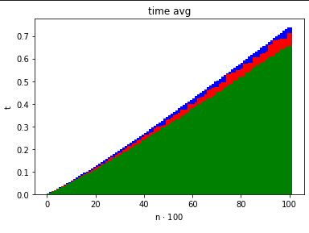
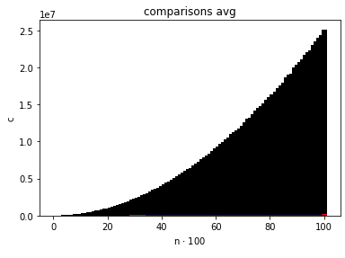

# Lista 2

## Opis

Cały kod źródłowy jest zawarty głównie w funkcji [`main.cpp`](main.cpp), [`ex-1.cpp`](ex-1.cpp), [`ex-2.cpp`](ex-2.cpp) oraz plikach w katalogu `shared`.

W celu kompilacji programu należy użyć `make main.out`. *(Możliwe jest uprzednie posprzątanie `make clean`)*\
Żeby uruchomić program należy użyć `./main.out <params>`, gdzie `<params>`:

- `--type` - uruchom program z algorytmem:
  - `quick` dla `QuickSort` *(domyślny)*
  - `insert` dla `InsertSort`
  - `merge` dla `MergeSort`
  - `dual-pivot-quick` dla `DualPivotQuickSort`
- `--comp` - kolejność elementów:
  - `'>='` malejąca
  - `'<='` rosnąca *(domyślna)*
- `--stat nazwa_pliku k`
  - `nazwa_pliku` plik do którego program ma zapisać statystyki
  - `k` ile razy ma wykonać pętlę opisaną w [zadaniu](https://cs.pwr.edu.pl/golebiewski/teaching/1920/aisd/lab2.pdf)

## Zadanie 1

> Celem zadani jest zaimplementowanie i przetestowanie następujących algorytmów sortowania:
> - InsertionSort
> - MergeSort
> - QuickSort
>
> Program przyjmuje dwa parametry wejściowe `--type insert|merge|quick` – określający wykorzystywany algorytm sortowania oraz `--comp '>='|'<='` – określający porządek sortowania.\
> Wejściem dla programu są kolejno:
> - liczba $n$ – długość sortowanej tablicy
> - tablica elementów do posortowania (niech elementy tej tablicy zostaną nazwane kluczami).
>
> Program powinien sortować tablicę wybranym algorytmem i wypisywać na standardowym wyjściu błędów wykonywane operacje (porównania, przestawienia). Po zakończeniu sortowania, na standardowym wyjściu błędów powinna zostać wypisana łączna liczba porównań między kluczami, łączna liczba przestawień kluczy oraz czas działania algorytmu sortującego. Finalnie, program sprawdza, czy wynikowy ciąg jest posortowany zgodnie z wybranym porządkiem, a następnie wypisuje na standardowe wyjście liczbę posortowanych elementów oraz posortowaną tablicę.\
> Przykładowe wywołanie:
> ```
> ./main --type quick --comp '>='
> 5
> 9 1 -7 1000 4
> ```
>

[kod](ex-1.cpp)

## Zadanie 2

> Uzupełnij program z [zadania 1](#zadanie-1) o możliwość wywołania go z dodatkowym parametrem uruchomienia `--stat nazwa_pliku k`, wtedy pomija on wczytywanie danych i dla każdego $n \in \{100,200,300,\dots,10000\}$ wykonuje po $k$ niezależnych powtórzeń:
> - generowania losowej tablicy $n$ elementowej (zadbaj o dobry generator pseudo-losowy)
> - sortowania kopii wygenerowanej tablicy
> - dla każdego z sortowań, zapisania do pliku `nazwa_pliku` statystyk odnośnie rozmiaru danych $n$, liczby wykonanych porównań między kluczami, liczby przestawień kluczy oraz czasu działania algorytmu sortującego.
>
> Po zakończeniu programu, korzystając z zebranych danych przedstaw na wykresach, za pomocą wybranego narzędzia (np. `numpy`, Matlab, Mathematica):
> - średnią liczbę wykonanych porównań kluczy $(c)$ w zależności od $n$,
> - średnią liczbę przestawień kluczy $(s)$ w zależności od $n$
> - średni czas działania algorytmu w zależności od $n$
> iloraz $\frac{c}{n}$ w zależności od $n$
> iloraz $\frac{s}{n}$ w zależności od $n$
>
> Zadbaj o to, by dane dotyczące różnych algorytmów sortujących można było nakładać na te same osie i porównywać. Sprawdź, jak wykresy zmieniają się dla różnych $k$ (np. $k=1,k=10,k=1000$).

[kod](ex-2.cpp)

Wykresy wykonałem w [Jupyter Notebook](ex-2-stats/charts.ipynb) (`numpy`) na podstawie [logów wygenerowanych przy pomocy mojego programu](ex-2-stats/logs/dual-k-10.log).

Zrzuty ekranu wykresów są dostępne bezpośrednio w [Jupyter Notebook](ex-2-stats/charts.ipynb) albo poniżej:

- 
- 
- 
- 
- 

gdzie:
- kolor czerwony -> `QuickSort`
- kolor zielony -> `DualPivotQuickSort`
- kolor niebieski -> `MergeSort`
- kolor czarny -> `InsertionSort` *(nie wyświetlony, bo ma za duże wartości w porównaniu do innych)*

Istnieje możliwość zobaczenia jak zadziałał `InsertionSort` po uruchomieniu go w [Jupyter Notebook](ex-2-stats/charts.ipynb) *(odkomentowanie odpowiednich linijek)* jednakże wszystkie wykresy wskazują na to, że `InsertionSort` jest najgorszym algorytmem z wszystkich:



jako, że pozostałych wykresów praktycznie nie widać bo są tak małe w porównaniu z `InsertionSort`em.

## Zadanie 3

> Uzupełnij [zadanie 1](#zadanie-1) o algorytm Dual-pivot QuickSort używając strategii Count:
> - Mamy dwa pivoty $p$ i $q$ oraz załóżmy, że $p < q$.
> - Załóżmy, że w procedurze `partition` klasyfikując $i$-ty element tablicy mamy $s_{i-1}$ elementów małych (mniejszych od $p$) oraz $l_{i-1}$ elementów dużych (większych od $q$).
> - Jeśli $l_{i-1} > s_{i-1}$: porównuj $i$-ty element w pierwszej kolejności z $q$, a następnie, jeśli jest taka potrzeba, z $p$.
> - Jeśli $l_{i-1} \le s_{i-1}$: porównuj $i$-ty element w pierwszej kolejności z $p$, a następnie jeśli jest taka potrzeba z $q$.
>
> Dokonaj szczegółowych porównań otrzymanych statystyk dla algorytmu QuickSort i Dual-pivot QuickSort. Eksperymentalnie wyznacz stałą stojącą przy czynniku $n\ln(n)$ dla liczby porównań między kluczami.

[kod `DualPivotQuickSort`](shared/algorithms/dual-pivot-quick-sort.cpp)

Stała przy `n ln(n)` dla `QuickSort`a wyniosła `1.6554738137365612`\
za to dla `DualPivotQuickSort`a wyniosła `1.5186710672510784`.
