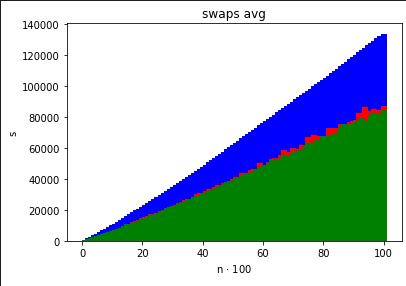
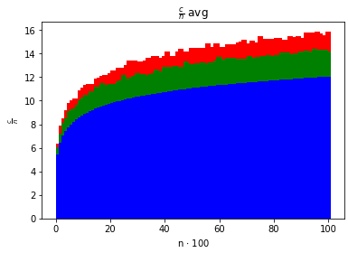

# Lista 2

## Opis

Cały kod źródłowy jest zawarty głównie w funkcji [`main.cpp`](main.cpp), [`ex-1.cpp`](ex-1.cpp), [`ex-2.cpp`](ex-2.cpp) oraz plikach w katalogu `shared`.

W celu kompilacji programu należy użyć `make main.out`. *(Możliwe jest uprzednie posprzątanie `make clean`)*\
Żeby uruchomić program należy użyć `./main.out <params>`, gdzie `<params>`:

- `--type` - uruchom program z algorytmem:
  - `quick` dla `QuickSort` *(domyślny)*
  - `insert` dla `InsertSort`
  - `merge` dla `MergeSort`
  - `dual-pivot-quick` dla `DualPivotQuickSort`
- `--comp` - kolejność elementów:
  - `'>='` malejąca
  - `'<='` rosnąca *(domyślna)*
- `--stat nazwa_pliku k`
  - `nazwa_pliku` plik do którego program ma zapisać statystyki
  - `k` ile razy ma wykonać pętlę opisaną w [zadaniu](https://cs.pwr.edu.pl/golebiewski/teaching/1920/aisd/lab2.pdf)

## Zadanie 1

[kod](ex-1.cpp)

## Zadanie 2

[kod](ex-2.cpp)

Wykresy wykonałem w [Jupyter Notebook](ex-2-stats/charts.ipynb) (`numpy`) na podstawie [logów wygenerowanych przy pomocy mojego programu](ex-2-stats/logs/dual-k-10.log).

Zrzuty ekranu wykresów są dostępne bezpośrednio w [Jupyter Notebook](ex-2-stats/charts.ipynb) albo poniżej:

- 
- 
- 
- 
- 

gdzie:
- kolor czerwony -> `QuickSort`
- kolor zielony -> `DualPivotQuickSort`
- kolor niebieski -> `MergeSort`
- kolor czarny -> `InsertionSort` *(nie wyświetlony, bo ma za duże wartości w porównaniu do innych)*

Istnieje możliwość zobaczenia jak zadziałał `InsertionSort` po uruchomieniu go w [Jupyter Notebook](ex-2-stats/charts.ipynb) *(odkomentowanie odpowiednich linijek)* jednakże wszystkie wykresy wskazują na to, że `InsertionSort` jest najgorszym algorytmem z wszystkich:

jako, że pozostałych wykresów praktycznie nie widać bo są tak małe w porównaniu z `InsertionSort`em.

## Zadanie 3

[kod `DualPivotQuickSort`](shared/algorithms/dual-pivot-quick-sort.cpp)

Stała przy `n ln(n)` dla `QuickSort`a wyniosła `1.6554738137365612`\
za to dla `DualPivotQuickSort`a wyniosła `1.5186710672510784`.
