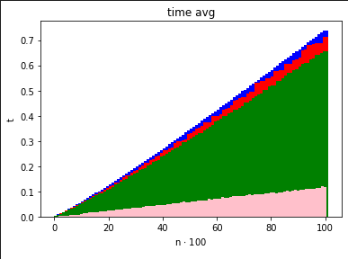

# Lista-3

## Zadanie 1

*Jako, że jest to zadanie rozszerzające, praktycznie rzecz biorąc, całą poprzednią listę folder na zadanie 1 ma w sobie kopię całej listy 2 rozszerzonej o zadanie 1 z listy 3.*\
*Dlatego też nazwy takie jak `ex-1` czy też `ex-2` odwołują się do odpowiednich zadań z listy 2. Mowa tutaj oczywiście tylko o plikach w folderze na zadanie 1.*

W celu kompilacji programu należy użyć `make`. *(Możliwe jest uprzednie posprzątanie `make clean`)*\
Żeby uruchomić program należy użyć `./main.out <params>`, gdzie `<params>`:

- `--type` - uruchom program z algorytmem:
  - `quick` dla `QuickSort` *(domyślny)*
  - `insert` dla `InsertSort`
  - `merge` dla `MergeSort`
  - `dual-pivot-quick` dla `DualPivotQuickSort`
  - `radix` dla `RadixSort`
- `--comp` - kolejność elementów:
  - `'>='` malejąca
  - `'<='` rosnąca *(domyślna)*
- `--stat nazwa_pliku k`
  - `nazwa_pliku` plik do którego program ma zapisać statystyki
  - `k` ile razy ma wykonać pętlę opisaną w [zadaniu 2 listy 2](https://cs.pwr.edu.pl/golebiewski/teaching/1920/aisd/lab2.pdf)

### Czas i liczba przestawień

Poniższe wykresy pokazują, że w przypadku sortowania liczb `RadixSort` radzi sobie najlepiej w porównaniu z poprzednio zaimplementowanymi algorytmami.

**Liczba przestawień**\

**Czas**\

**Liczba przestawień nad `n`**\

gdzie:
- kolor czerwony -> `QuickSort`
- kolor zielony -> `DualPivotQuickSort`
- kolor niebieski -> `MergeSort`
- kolor różowy -> `RadixSort`

### Zużycie pamięci

Do zmierzenia ilości zużywanej pamięci wykorzystywałem programu `ps -p <PID> -o vsz` w celu odczytania ilości wykorzystywanej pamięci wirtualnej.\
Zmodyfikowałem program z listy 2 w ten sposób, żeby po jego uruchomieniu z parametrem `--stat` wyświetlał na samym początku działania swoje `PID`.

Program uruchamiałem z parametrem `k = 10` poszczególne algorytmy i śledziłem zużycie pamięci procesów.

Algorytm `RadixSort` na końcu działania zużywał aż `111 772 kB` wirtualnej pamięci (parametr VSZ).\
Za to `QuickSort` zużywał jedynie `33 716 kB` wirtualnej pamięci. Podobnie zachowywał się `DualPivotQuickSort` oraz `InsertionSort`.

Co ciekawe, zużycie pamięci w przypadku `MergeSort` rosło bardzo szybko przekraczając zużycie pamięci `RadixSort`a. Domyślam się jednak, że to wynika ze słabego działania *garbage collector*'a a nie z samego algorytmu.

Oczywiście w przypadku pamięci wchodzi też tutaj *overhead* w postaci innych komponentów programu, bo program nie składa się tylko z samego czystego algorytmu.\
Jednakże różnica jest jak najbardziej zauważalna - po wyjściu z *comparison model* uzyskujemy sortowanie w czasie liniowym, jednak tracimy na wielkości potrzebnej pamięci.

### Wpływ zakresu

Przy zmniejszeniu zakresu, z którego są losowane liczby do sortowania następuje nawet dwukrotne zmniejszenie się liczby przestawień oraz znacznie krótszy czas działania. Dzieje się tak nawet przy ciągach bardzo dużych rozmiarów.

---

## Zadanie 2

W celu ułatwienia korzystania z programu algorytmy nie są uruchamiane jeden po drugim, a raczej na podstawie argumentów `--select` oraz `--randomized-select`.

W celu uruchomienia programu należy wykonać `make` oraz `./main.out <-p|-r> <--select|--randomized-select>`.\
Następnie należy podać liczby $n$ oraz $k$ oddzielone spacją lub nową linijką.

### Zadanie 2 - statystyki

Do skompilowania poniższych statystyk uruchamiałem program na danych $n = 128$, $k = 32$ przy uruchamianiu programu z parametrem `-p`.

**Liczba porównań:**
|                      . | SELECT | RANDOMIZED SELECT |
| ---------------------: | :----: | :---------------: |
|                Maximum |  840   |        606        |
|                Minimum |  636   |        189        |
|                Średnia | 751.8  |        380        |
| Odchylenie standardowe | 70.153 |      147.742      |

---

## Zadanie 3

W celu uruchomieniu programu należy użyć `./main.py`.

Program zwraca wynik testu opisany [w zadaniu](https://cs.pwr.edu.pl/golebiewski/teaching/1920/aisd/lab3.pdf).
