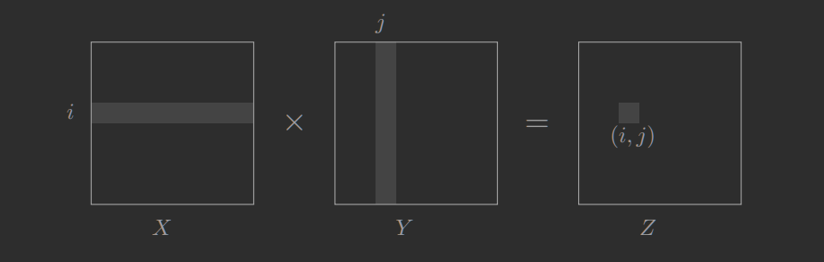

---

Należy zauważyć, że standardowe podejście do mnożenia macierzy daje algorytm o złożoności obliczeniowej $O(n^3)$.

$X,Y$ - macierze $n\times n$\
chcemy $Z = XY$
$$
Z_{ij} = \sum_{k=1}^{n}X_{ik}Y_{kj}
$$

Bezmyślny algorytm typu [dziel i zwyciężaj (D&C)](../2020-03-09/divide-and-conquer.md) również ma złożoność $O(n^3)$. Należy pamiętać, że najważniejsza praca w podejściu *D&C* dzieje się podczas podziału problemu na mniejsze pod-problemy lub łączenia rozwiązanych pod-problemów.

Algorytm niemieckiego matematyka *Volker Strassen*'a łączy pod-problemy w zmyślny sposób dzięki czemu ma złożoność $O\big(n^{\log_27}\big)$, gdzie $\log_27 \approx 2.81$.

Mnożenie macierzy jest szczególnie proste do podziału na pod-problemy, np. do podziału na cztery bloki:

$$
X =
\begin{bmatrix}
  A & B \\
  C & D
\end{bmatrix}
$$
$$
Y =
\begin{bmatrix}
  E & F \\
  G & H
\end{bmatrix}
$$

Wówczas $XY$ jest równe
$$
\begin{bmatrix}
  A & B \\
  C & D
\end{bmatrix}
\begin{bmatrix}
  E & F \\
  G & H
\end{bmatrix}
=
\begin{bmatrix}
  AE + BG & AF + BH \\
  CE + DG & CF + DH
\end{bmatrix}
$$
Nadal mamy złożoność $T(n) = 8 \cdot T\big(\frac{n}{2}\big) + O(n^2) = O(n^3)$.

Jednakże *Strassen* wpadł na pomysł, dzięki któremu udało się zmniejszyć **ilość mnożeń z ośmiu do siedmiu**!

$$
XY =
\begin{bmatrix}
  P_5 + P_4 - P_2 + P_6 & P_1 + P_2 \\
  P_3 + P_4 & P_1 + P_5 - P_3 - P_7
\end{bmatrix}
$$
gdzie
- $P_1 = A(F-H)$
- $P_2 = (A+B)H$
- $P_3 = (C+D)E$
- $P_4 = D(G-E)$
- $P_5 = (A+D)(E+H)$
- $P_6 = (B-D)(G+H)$
- $P_7 = (A-C)(E+F)$

Wówczas złożoność obliczeniowa $T(n) = 7\cdot T\big(\frac{n}{2}\big) + O(n^2)$ co dzięki [*Master Theorem*](../2020-03-09/master-theorem.md) możemy zapisać jako $O\big(n^{\log_27}\big) \approx O\big(n^{2.81}\big)$ co jest znacznie lepszym wynikiem od $O(n^3)$ rzecz jasna.

Source: [Algorithms: Dasgupta, Papadimitriou, Vazirani](http://algorithmics.lsi.upc.edu/docs/Dasgupta-Papadimitriou-Vazirani.pdf) - paragraph 2.5
