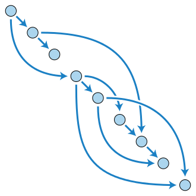

# Najkrótsza ścieżka w DAG
*(2020-04-08)*

## Problem

Znalezienie najkrótszej ścieżki w skierowanym grafie acyklicznym ([DAG](https://en.wikipedia.org/wiki/Directed_acyclic_graph)).

## Input

Graf $G = (V,E,c)$, gdzie:
- $V$ to zbiór wierzchołków grafu
- $E$ to zbiór krawędzi grafu
- $c: E \to \reals$ to funkcja wagi krawędzi
- $v_s \in V$ to wierzchołek startowy ($\mathrm{root}$)

## Output

Dla ustalonego wierzchołka startowego $v_s \in V$ długość najkrótszej ścieżki do wszystkich wierzchołków $v_i \in V$ oznaczana przez $d(v_s, v_i)$

## Remarks

- Ważną własnością grafu DAG jest możliwość jego *„linearyzacji”*, czyli ustawienia wierzchołków w takiej kolejności $(v_1, v_2,\dots,v_n)$, że krawędzie będą zawsze skierowane od wcześniejszych wierzchołków do późniejszych $\forall(v_i, v_j) \in E: i<j$.\
\
Dzięki tej własności chcąc policzyć długość najkrótszej ścieżki od wierzchołka startowego $v_s$ do zadanego wierzchołka $v_j$ wystarczy użyć wcześniej obliczonych $d(v_s, v_i)$ dla każdego wierzchołka $(v_i, v_j) \in E$:
    $$
    d(v_s, v_j) = \min\{d(v_s,v_i) + c(v_i,v_j): (v_i,v_j) \in E\}
    $$

- Zauważmy, że każdy wierzchołek odpowiada pod-problemowi, więc jeśli rozwiążemy te pod-problemy od najmniejszych do największych (od pierwszych w ustalonej kolejności do ostatnich) zapamiętując i wykorzystując ich rozwiązania to otrzymamy rozwiązanie problemu znalezienia najkrótszych dróg w DAG.

## Pseudocode

```
for each v in V:
  d(v_s, v) = Infinity
d(v_s, v_s) = 0

for each v in V \ {v_s} in linearized order:
  d(v_s, v) = min{ d(v_s, u) + c(u, v): (u,v) in E }
```

- Złoż. obli. takiego algorytmu to $O(|E|)$, ponieważ w pętli musimy sprawdzić koszty powstałe dla każdej krawędzi w grafie.
- Zapamiętując dla każdego wierzchołka nie tylko najkrótszą odległość do niego, ale również z którego sąsiada do niego powinniśmy dojść (czyli dla jakiego $u$ osiągamy $\min\{d(v_s, u) + c(u,v): (u,v) \in E\}$) możemy odtworzyć najkrótsze ścieżki w zadanym grafie.

## Summary

Problem obliczania najkrótszych ścieżek w **DAG leży u podstawy wszystkich** algorytmów stworzonych przy użyciu metodologii programowania dynamicznego, ale **na ogół DAG nie jest zadany explicite i jednym z zadań jest poprawne go zdefiniowanie.**
