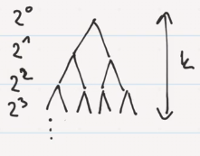
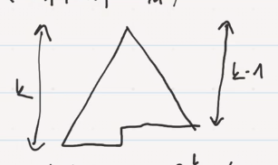
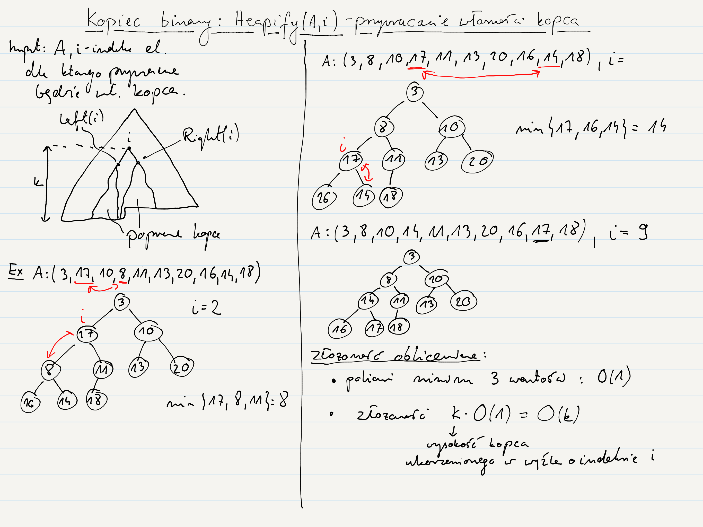
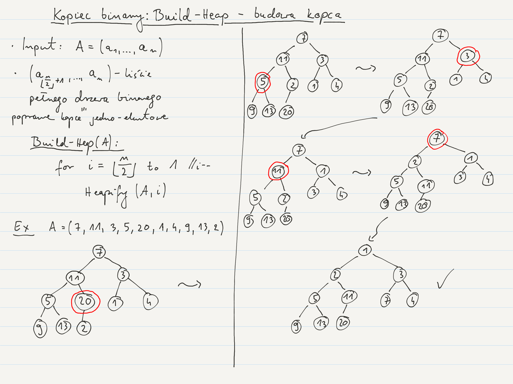
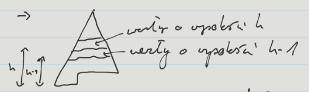

---

- [Własność kopca minimalnego](#własność-kopca-minimalnego)
- [Przykład](#przykład)
- [Poruszanie się po binary heap](#poruszanie-się-po-binary-heap)
- [$\text {Def}$ wysokość węzła](#text-def-wysokość-węzła)
- [`Heapify`$(A,i)$](#heapifyai)
- [`BuildHeap`$(A)$](#buildheapa)
    - [Złożoność obliczeniowa `BuildHeap`](#złożoność-obliczeniowa-buildheap)
        - [$\text {Fakt}$ #1](#text-fakt-1)
            - [D-d $\text {Fakt}$u #1](#d-d-text-faktu-1)
    - [Złożoność obliczeniowa `BuildHeap` c.d.](#złożoność-obliczeniowa-buildheap-cd)
- [Kopiec $d$-arny](#kopiec-d-arny)
- [Więcej o kopcach](#więcej-o-kopcach)
- [`HeapSort`$(A)$](#heapsorta)
    - [Złożoność obliczeniowa `HeapSort`$(A)$](#złożoność-obliczeniowa-heapsorta)
- [More](#more)

---

Kopiec binarny (binary heap) to pełne drzewo binarne. Poziom $i$ty ma $2^i$ elementów (liczymy od $i=0$).

Liczba węzłów wówczas wynosi
$$
\#\text{węzłów} = \sum_{i=0}^{k-1}2^i = 2^k - 1
$$

Kopiec budujemy na tablicy $A=[a_1,\dots,a_n]$. Liczba elementów tablicy $n$ nie musi być równa $2^k-1$. Wówczas kopiec wygląda następująco:

Jak można zauważyć $n$ można ograniczyć:
$$
2^{k-1} \le n < 2^k
$$
Wówczas wysokość kopca o $n$ elementach jest asymptotycznie równa $\Theta(\log n)$.

## Własność kopca minimalnego

$$
A[i] \ge A[~\mathrm{parent}(i)~]
$$

## Przykład

Weźmy
$$
A = [~\underbrace{2}_{1},\underbrace{4}_{2},\underbrace{3}_{3},\underbrace{8,19,13,11,15,22}_{\dots},\underbrace{20}_{10}~]
$$

Wtedy mamy następujący kopiec:

Chcemy się poruszać po takim drzewie binarnym.

## Poruszanie się po binary heap

Będąc w jakimś węźle, potrzebne są wskaźniki umożliwiające nam przejście do parent-a tego węzła oraz lewego i prawego potomka. Warto zauważyć, że mamy do czynienia z pełnym drzewem binarnym, przez co mamy pewność, że na kolejnym poziomie mamy zawsze *dwa razy więcej elementów* niż na poprzednim (poza ostatnim poziomem).\
Wówczas, możemy używać następujących prostych makr:

$$
\mathrm{parent}(i) = \left\lfloor \frac{i}{2} \right\rfloor
\\
\mathrm{left}(i) = 2\cdot i
\\
\mathrm{right}(i) = 2\cdot i + 1
$$

Powyższe makra są bardzo szybkie, bo możemy użyć prostych operacji na bitach.

Nie potrzebujemy już budować struktur węzłów, tak jak miało to w przypadku BST i pochodnych — wystarczą nam tablica wraz z powyższymi makrami.

## $\text {Def}$ wysokość węzła
Wysokością węzła nazywamy liczbę krawędzi na najdłuższej prostej ścieżce prowadzącej od tego węzła do liścia.

## `Heapify`$(A,i)$

Procedura przywracająca własność kopca dla węzła o indeksie $i$ w tablicy $A$. Zakładamy, że kopce ukorzenione w lewym i prawym potomku węzła $i$ zachowuję własność kopca.

`Heapify`$(A,i)$:
1. Sprawdź czy $\mathrm{left}(i)$ lub $\mathrm{right}(i)$ nie są większe niż rozmiar kopca
2. $x=$ wybierz ze zbioru $\{i, \mathrm{left}(i), \mathrm{right}(i)\}$ indeks węzła, dla którego będzie zachowana własność kopca pomiędzy elementami $\{A[i], A[\mathrm{left}(i)], A[\mathrm{right}(i)]\}$
3. `if` $x\neq i$:
   1. `swap`$(A[i], A[x])$
   2. `Heapify`$(A,x)$

## `BuildHeap`$(A)$

$n =$ `length`$(A)$

1. `for` $i\gets\left\lfloor\frac{n}{2}\right\rfloor$ `to` $1$
   1. `Heapify`$(A,i)$
   2. $i\gets i-1$

### Złożoność obliczeniowa `BuildHeap`

Grube oszacowanie: $\frac{n}{2}$ razy wykonujemy operację `Heapify` o złożoności $O(\log n)$ czyli mamy $O(n \log n)$.

#### $\text {Fakt}$ #1
W $n$-elementowym kopcu binarnym występuje co najwyżej $\left\lceil\frac{n}{2^{h+1}}\right\rceil$ węzłów o wysokości $h$.

##### D-d $\text {Fakt}$u #1
Indukcja po $h$

1. Dla $h = 0$: $\left\lceil\frac{n}{2}\right\rceil$ liści — O.K.
2. Zał. indukcyjne $\forall_{k<h}$ występuje co najwyżej $\left\lceil\frac{n}{2^{k+1}}\right\rceil$ węzłów o wysokości $k$

Krok indukcyjny:

z zał. ind. na wysokości $h-1$ mamy $\le \left\lceil\frac{n}{2^{k-1+1}}\right\rceil = \left\lceil\frac{n}{2^k}\right\rceil$ węzłów

Zatem węzłów o wysokości $h$ jest co najwyżej $\frac{1}{2}\cdot \left\lceil\frac{n}{2^k}\right\rceil \le \left\lceil\frac{n}{2^{h+1}}\right\rceil$.

$\blacksquare$

### Złożoność obliczeniowa `BuildHeap` c.d.

$$
\sum_{h=0}^{\lg n}\left\lceil\frac{n}{2^{h+1}}\right\rceil \cdot O(h) = O\left(n\cdot \underbrace{\sum_{h=0}^{\lg n}\frac{h}{2^h}}_{\text{ograniczone przez stałą}}\right) = O(n)
$$

Dla $|x| < 1$:
$$
\sum_{k\ge 0}x^k = \frac{1}{1-x} ~~/~ ()' ~~/~\cdot x
\\
\sum_{k\le 0}k\cdot x^k = \frac{x}{(1-x)^2}
$$

Zatem dla $x=\frac{1}{2}$:
$$
\sum_{k\le 0}\frac{k}{2^k} = \frac{\frac{1}{2}}{(1-\frac{1}{2})^2} = 2.
$$

## Kopiec $d$-arny

Kopiec binarny w łatwy sposób uogólnia się na kopiec $d$-arny, czyli taki, w którym węzły nie będące liśćmi mają po $d$ potomków.

## Więcej o kopcach

[Chapter 19 & 20](https://web.ist.utl.pt/~fabio.ferreira/material/asa/clrs.pdf)

## `HeapSort`$(A)$

Jednym z zastosowań kopców jest sortowanie przez kopcowanie `HeapSort`$(A)$. Wykorzystuje się do tego kopiec maksymalny (w kopcu maksymalnym własność kopca to: $A[\mathrm{parent}(i)] \ge A[i]$). Najpierw budujemy kopiec, a potem ściągamy z niego korzeń, po czym przywracamy własność kopca dla pozostałych elementów.

`HeapSort`$(A)$:
1. `BuildHeap`$(A)$
2. `for` $i=$ `length`$(A)$ `to` $2$
   1. `swap`$(A[1], A[i])$
   2. `heap_size`$(A)$`--`
   3. `Heapify`$(A,1)$
   4. $i$`--`

### Złożoność obliczeniowa `HeapSort`$(A)$

Dla tablicy $A$ wielkości $n$ wywołanie `BuildHeap` ma złożoność $O(n)$.
Każde z $n-1$ wywołań `Heapify` ma pesymistyczną złożoność $O(\log n)$.
Zatem w sumie złożoność wynosi:
$$
O(n) + (n-1)\cdot O(\log n) = O(n\log n)
$$

## More

- [Chapters 7, 20, 21](https://web.ist.utl.pt/~fabio.ferreira/material/asa/clrs.pdf)
- [Chapter 4.5.2](http://algorithmics.lsi.upc.edu/docs/Dasgupta-Papadimitriou-Vazirani.pdf)
- [aisd02.pdf, aisd09.pdf](https://drive.google.com/drive/folders/0B83LMR1NBoUXLXdYZ2hsNFBqTTA)
