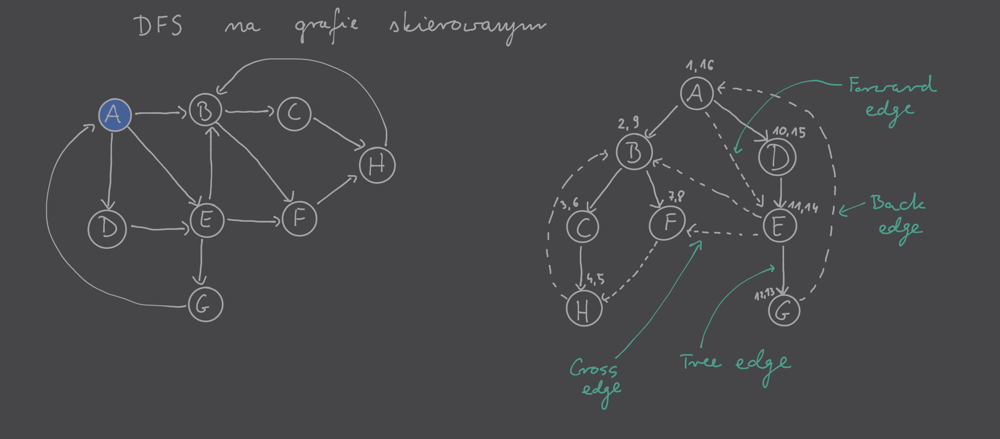

---

- [`pre` oraz `post`](#pre-oraz-post)
- [Rodzaje krawędzi](#rodzaje-krawędzi)
- [Przykład](#przykład)

---

## `pre` oraz `post`

Dodajemy do każdego wierzchołka parametry `pre` oraz `post`, które będą przechowywać wartości zegara gdy odpowiednio pierwszy raz odwiedzamy wierzchołek i gdy go opuszczamy. Wykonuje się to przez zainicjowani zmiennej `clock = 1` na początku [DFS](depth-first-search.md)a oraz następujące wersje procedur:

`previsit`$(v)$:
1. $v.$`pre = clock`
2. `clock++`

`postvisit`$(v)$:
1. $v.$`.post = clock`
2. `clock++`

## Rodzaje krawędzi

1. Tree edges – krawędzie należące do zbioru drzew DFS
2. Forward edges – krawędzie od wierzchołka do jego potomka w drzewie DFS, ale nie należące do drzewa DFS
3. Back edges – krawędzie od wierzchołka do jego poprzednika w drzewie DFS, ale nie należące do drzewa DFS
4. Cross edges – krawędzie od wierzchołka do innego wierzchołka nie będącego jego potomkiem lub poprzednikiem (czyli wierzchołka wcześniej odwiedzonego i opuszczonego), ale nie należące do drzewa DFS

Wykrywanie rodzajów krawędzi $(u,v) \in E$:
- Tree/Forward | $u.\mathrm{pre} < v.\mathrm{pre} < v.\mathrm{post} < u.\mathrm{post}$
- Back | $v.\mathrm{pre} < u.\mathrm{pre} < u.\mathrm{post} < v.\mathrm{post}$
- Cross | $v.\mathrm{pre} < v.\mathrm{post} < u.\mathrm{pre} < u.\mathrm{post}$

## Przykład

