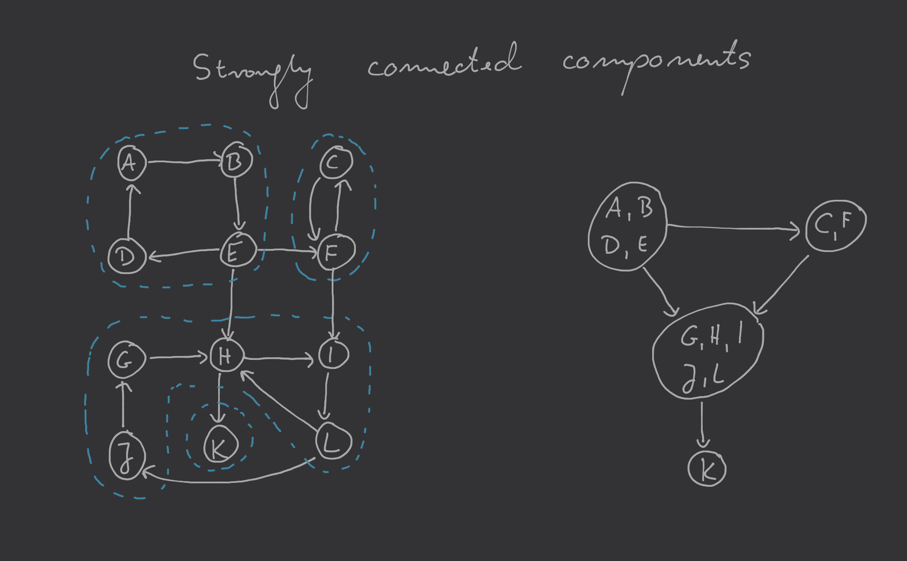

# Skierowane grafy acykliczne

## $\text {Fakt}$ #1

Graf skierowany posiada cykl iff gdy podczas wykonywania procedury DFS zostanie wykryta [back edge](dfs-directed-graphs.md#rodzaje-kraw%c4%99dzi)

### Szkic d-d $\text {Faktu}$

Jeśli $\exists$ back edge $\implies$ graf skierowany posiada cykl; jeśli $(u,v)$ jest typu back edge, wówczas mamy cykl zawierający krawędź $(u,v)$ oraz krawędzie występujące pomiędzy $v$ i $u$ w drzewie DFS

Graf skierowany posiada cykl\
$C: v_0 \to v_1 \to \dotsb \to v_k \to v_0 \implies$ back edge: znajdźmy wierzchołek należący do tego cyklu (powiedzmy $v_i$), który został jako pierwszy odkryty podczas wykonywania procedury DFS (czyli wartość $v_i.\mathrm{pre}$ jest mniejsza od wszystkich innych wartości $v_j.\mathrm{pre}$ dla wierzchołków $v_j$ należących do tego cyklu). Wszystkie inne wierzchołki $v_j$ należące do tego cyklu będą potomkami wierzchołka $v_i$ w drzewie DFS. Wśród potomków będzie również wierzchołek $v_{i-1}$ (lub $v_k$ jeśli $i=0$) z którego można dojść do $v_i$ (ponieważ $v_{i-1} \to v_i \in C$) i krawędź $(v_{i-1}, v_i) \in E$ jest z definicji back edge.

Zatem wykonując DFS możemy wykrywać czy skierowany graf ma cykl wykrywając krawędź typu back edge.

## Linearyzacja DAGa (sortowanie topologiczne)

Wierzchołki skierowanego grafu acyklicznego można uporządkować w taki sposób, że wszystkie krawędzie grafu będą skierowane od wierzchołków będących wcześniej w porządku do wierzchołków będących później w tym porządku.

Jest to jedna z pierwszych rzeczy, które należy wykonać m.in. podczas realizacji metodologii [programowania dynamicznego](../2020-04-08/programowanie-dynamiczne.md).

## $\text {Fakt}$ #2

W skierowanym grafie acyklicznym dla każdej krawędzi $(u,v) \in E$ zachodzi $u.\mathrm{post} > v.\mathrm{post}$.

## `linearizeDAG`$(G)$

Powyższy fakt daje łatwy przepis na algorytm zwracający interesujący nas porządek wierzchołków w DAGu:

`linearizeDAG`$(G)$:
1. Wykonaj [DFS](dfs-directed-graphs.md) uzupełniając wartości $\mathrm{post}$ w procedurze `postvisit`
2. `return` porządek wierzchołków od największej wartości $\mathrm{post}$ do najmniejszej

### Example of `linearizeDAG`

## Strongly connected components

Spójność grafu skierowanego definiujemy przy użyciu następującej relacji:

> Wierzchołki $u$ oraz $v$ należące do $G$ skierowanego są połączone jeśli istnieje ścieżka od $u$ do $v$ oraz ścieżka od $v$ do $u$.

Relacja ta dzieli zbiór wierzchołków $V$ na rozłączne podzbiory, gdzie w każdym podzbiorze występują wierzchołki, które są ze sobą połączone. Podzbiory te nazywamy *składowymi silnie spójnymi* i tworzą one meta-graf będący skierowanym grafem acyklicznym.

### Własności

#### Własność #1

Procedura [`explore`](../2020-05-06/depth-first-search.md#exploregv) rozpoczęta w wierzchołku $u \in V$ zakończy się gdy wszystkie wierzchołki, do których można dojść z $u$, zostaną odwiedzone.

Własność ta mówi nam, że jeśli wykonamy procedurę `explore` w wierzchołku należącym do składowej będącej ujściem (wierzchołkiem, z którego już nigdzie nie można przejść) w meta-grafie to przejdziemy przez wszystkie wierzchołki należące do tej składowej. Sugeruje to nam w jaki sposób możemy znajdować silnie spójne składowe, ale zostają jeszcze dwa nierozwiązane problemy:
- w jaki sposób znajdziemy wierzchołek należący do składowej będącej ujściem w meta-grafie składowych silnie spójnych
- w jaki sposób będziemy kontynuować odkrywanie silnie spójnych składowych po odkryciu jednej z nich będącej ujściem

#### Własność #2

Wierzchołek mający największą wartość $\mathrm{post}$ po wykonaniu procedury [DFS](../2020-05-06/depth-first-search.md) musi leżeć w źródle (czyli wierzchołku do którego nie wchodzą żadne krawędzie) meta-grafu skłądowych silnie spójnych.

Własność ta wynika z [własności #3](#w%c5%82asno%c5%9b%c4%87-3), która będzie dowiedziona w następnym punkcie. Własność ta pozwala nam zidentyfikować wierzchołek grafu $G$ należący do źródła meta-grafu składowych silnie spójnych, czyli odwrotności ujścia, na którym nam zależy. Zatem jeśli rozważymy graf $G^R$, w którym odwrócimy kierunki wszystkich krawędzi to DFS zwróci nam największą wartość $\mathrm{post}$ dla wierzchołka należącego do źródła $G^R$, a z relacji pomiędzy grafami $G$ i $G^R$ wiemy, że źródło meta-grafu stworzonego z $G^R$ jest ujściem meta-grafu stworzonego z $G$. To rozwiązuje nam [problem pierwszy z własności #1](#w%c5%82asno%c5%9b%c4%87-1) znalezienia wierzchołka należącego do ujścia meta-grafu składowych silnie spójnych grafu $G$.

#### Własność #3

Niech $C$ i $C'$ będą składowymi silnie spójnymi grafu $G = (V,E)$ oraz niech istnieje krawędź $(u,v) \in E$ taka, że $u\in C$, a $v \in C'$, wtedy największa wartość $\mathrm{post}$ spośród wierzchołków należących do $C$ jest większa niż największa wartość $\mathrm{post}$ spośród wierzchołków należących do $C'$ (czyli $\max\{x.\mathrm{post}: x\in C\} > \max\{y.\mathrm{post}: y \in C'\}$).

Szkic dowodu:\
Jeśli spośród wierzchołków należących do $C$ i $C'$ pierwszy odwiedzony będzie $u\in C$ wtedy z [własności 1](#w%c5%82asno%c5%9b%c4%87-1) wiemy, że procedura `explore`$(u)$ nada wartość $u.\mathrm{post}$ po odwiedzeniu wszystkich innych wierzchołków należących do $C$ i $C'$ będzie miał wierzchołek $u \in C$.\
Jeśli spośród wierzchołków należących do $C$ i $C'$ pierwszy odwiedzony będzie wierzchołek $v \in C'$ to najpierw odwiedzimy wszystkie inne należące do $C'$ i procedura `explore`$(v)$ zakończy działania. Następnie DFS wykona procedurę `explore`$(u)$ na wierzchołku $u \in C$ i odwiedzi wszystkie inne wierzchołki należące do $C$. Stąd wierzchołki należące do $C$ będą miały większe wartości $\mathrm{post}$ od wierzchołków należących do $C'$.

Własność 3 można odczytać również jako:\
składowe silnie spójne meta-grafu mogą zostać uporządkowane (linearyzowane) w kolejności malejącej po największych wartościach $\mathrm{post}$ wierzchołków należących do tych składowych. Własność 3 pozwala nam na rozwiązanie [problemu drugiego z własności 1](#w%c5%82asno%c5%9b%c4%87-1): po znalezieniu i eksploracji śladowej silnie spójnej będącej ujściem w meta-grafie możemy usunąć należące do niej wierzchołki grafu $G$ i rozpocząć znajdowanie kolejnej składowej silnie spójnej od wierzchołka z największą wartością $\mathrm{post}$ spośród wierzchołków, które nie zostały usunięte z grafu $G$.

## `FindStronglyConnectedComponents`$(G)$

Teraz możemy określić algorytm znajdujący silnie połączone składowe grafu:

`FindStronglyConnectedComponents`$(G)$:
1. Wykonaj DFS na grafie $G^R$ zapisując wartości $\mathrm{post}$ dla węzłów
2. Wykonaj algorytm sprawdzania spójności grafu (wersja dla grafu nieskierowanego) na grafie $G$ przy użyciu procedury DFS używając przy tym kolejności malejącej wartości $\mathrm{post}$ wyznaczone wyżej

Złożoność obliczeniowa:\
Algorytm wyznaczania składowych silnie spójnych polega na dwukrotnym wykonaniu procedury DFS, która działa w czasie liniowym. Zatem złożoność obliczeniowa algorytmu wyznaczania składowych silnie spójnych to $O(|V| + |E|)$.

## Przykład

## More

- [Chapter 3](http://algorithmics.lsi.upc.edu/docs/Dasgupta-Papadimitriou-Vazirani.pdf)
- [Chapter 22](https://web.ist.utl.pt/~fabio.ferreira/material/asa/clrs.pdf)

