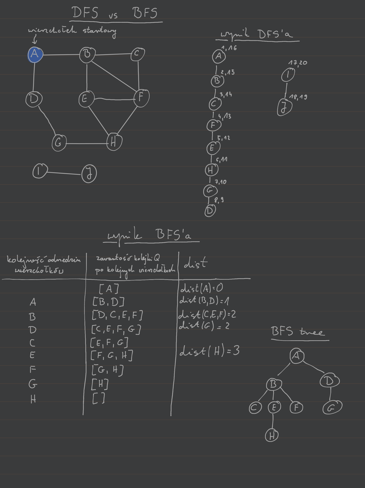

---

- [`BFS`$(G, s)$](#bfsg-s)
    - [Złożoność obliczeniowa](#złożoność-obliczeniowa)
    - [Przykład](#przykład)
- [More](#more)

---

## `BFS`$(G, s)$

Mamy graf $G = (V,E,l)$ gdzie $l: E \to \mathbb{R}$ jest funkcją mierzącą długość krawędzi.

Odległością między wierzchołkami $v,u \in V$ nazywamy długość najkrótszej ścieżki pomiędzy $v$ i $u$. *Na początek założymy, że wszystkie krawędzie będą miały długość $1$ czyli $\forall_{e \in E}~l(e) = 1$ i będziemy pomijać funkcję $l$ dla uproszczenia.*

BFS jest procedurą pozwalającą dla grafu $G = (V,E)$ wyznaczyć drzewo najkrótszych ścieżek od wierzchołka startowego $s\in V$. Intuicja stojąca za BFS jest taka, że będziemy przeszukiwać graf warstwa po warstwie, gdzie warstwa będzie rozumiana jako podzbiór wierzchołków w tej samej odległości od wierzchołka startowego $s$.

`BFS`$(G,s)$:
1. `for all` $v \in V$:
   1. `dist`$(v) \gets \infty$
   2. $v.\mathrm{prev} \gets$ `null`
2. `dist`$(s) \gets 0$
3. $s.\mathrm{prev} \gets s$
4. $Q \gets [s]$
5. `while` $|Q| > 0$:
   1. $u \gets Q$.`eject`$()$
   2. `for all` $(u,v) \in E$:
      1. `if dist`$(v) = \infty$:
         1. $Q$`.inject`$(v)$
         2. `dist`$(v) \gets$ `dist`$(u) + 1$
         3. $v.\mathrm{prev} \gets u$

Powyższa procedura na początku inicjuje odległości wszystkich wierzchołków na $\infty$ poza odległością do wierzchołka startowego $s$, która ustalana jest na $0$. Dodatkowo, ustala rodziców węzłów w wynikowym drzewie BFS na `null` poza węzłem startowym, którego rodzica możemy ustalić na niego samego. Następnie inicjujemy kolejkę FIFO (first in frist out) $Q$, która na początku zawiera tylko wierzchołek startowy $s$. Następnie ściągamy pierwszy wierzchołek z kolejki i sprawdzamy czy odwiedziliśmy już wcześniej jego sąsiadów. Jeśli tak to nic nie robimy, bo oznacza to, że znaleźliśmy do nich krótszą ścieżkę, w przeciwnym przypadku wrzucamy nowo odkryte wierzchołki na koniec kolejki $Q$ i ustawiamy odległość do nich na odległość do wierzchołka, z którego do nich doszliśmy $+1$ oraz ustalamy z jakiego wierzchołka doszliśmy najkrótszą ścieżką do nich. Ustalenie $v.\mathrm{prev}$ pozwala odtworzyć najkrótszą ścieżkę od zadanego wierzchołka do wierzchołka startowego $s$ (czyli w praktyce zbudować wynikowe drzewo BFS).

Zauważmy, że procedura ta spełnia następujące warunki:\
$\forall~d = 0,1,2,\dots$ istnieje moment w którym:
- wszystkie węzły grafu $G$ będące w odległości $\le d$ od wierzchołka startowego $s$ mają poprawnie wyznaczoną odległość od $s$
- wszystkie pozostałe węzły grafu $G$ (będące w odległości $> d$ od wierzchołka startowego $s$) mają odległość od $s$ ustawioną na $\infty$
- kolejka $Q$ zawiera jedynie wierzchołki będące w odległości $d$ od wierzchołka startowego $s$

Używając powyższych własności jako założenia indukcyjnego dla ustalonego $d$ możemy łatwo zauważyć, że po ewaluacji wierzchołków będących w kolejce $Q$ (w ostatnim punkcie) przez algorytm, wszystkie te trzy własności zostaną spełnione dla odległości $d+1$. Daje nam to dowód indukcyjny poprawności wyznaczania drzewa najkrótszych ścieżek przez procedurę BFS dla grafu wejściowego $G$ i wierzchołka startowego $s$.

Zauważmy, że jeśli jakiś podzbiór wierzchołków grafu $G$ nie jest dostępny z wierzchołka startowego $s$ to po zakończeniu BFSa wierzchołki te nie zostaną odwiedzone, a odległość do nich pozostanie równa $\infty$.

### Złożoność obliczeniowa
- pierwsza pętla przechodzi po wszystkich wierzchołkach, co generuje złożoność $O(|V|)$
- następnie każdy wierzchołek jest jeden raz wkładany do kolejki $Q$ i jeden raz z niej zdejmowany (większość tych operacji dzieje się w pętli `while`) co daje $2|V|$ operacji na kolejce $Q$\
ponieważ $Q$ jest kolejką FIFO operacja wkładania i zdejmowania elementu na/ z kolejki ma złożoność $O(1)$
- reszta pracy wykonywana jest w pętli `for` (będącej w pętli `while`), w której sprawdzana jest każda krawędź (dla grafu skierowanego raz, dla grafu nieskierowanego dwa razy) co generuje złożoność $O(|E|)$
- sumując złożoność procedury BFS wynosi $O(|V| + |E|)$, czyli jest liniowa od wielkości grafu wejściowego $G$.

### Przykład

## More

- [Algorithms DPV~ Chapters 4.1 and 4.2](http://algorithmics.lsi.upc.edu/docs/Dasgupta-Papadimitriou-Vazirani.pdf)
- [CLRS~ Chapter 22.2](https://web.ist.utl.pt/~fabio.ferreira/material/asa/clrs.pdf)
