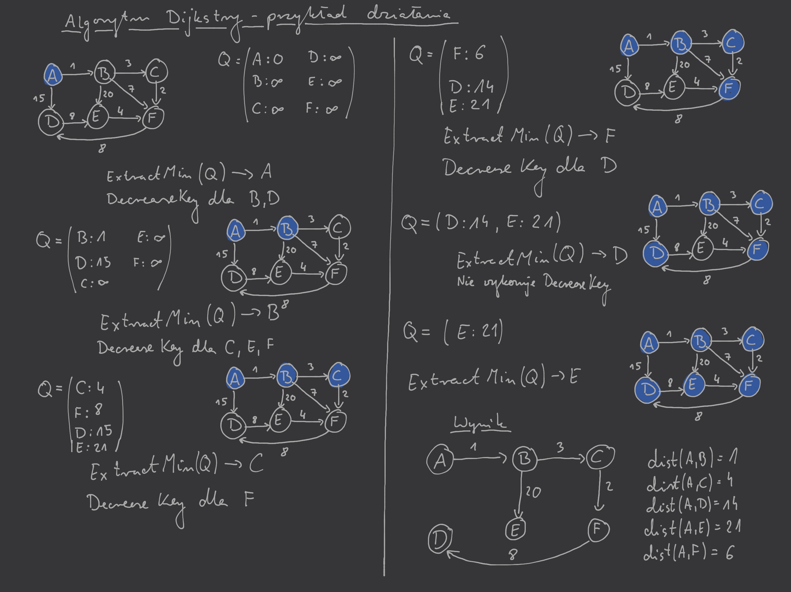

# Dijkstra's algorithm

Algorytm [BFS](../2020-05-18/breadth-first-search.md) pozwala na wyznaczanie najkrótszych ścieżek od jednego startowego wierzchołka $s$ do wszystkich innych wierzchołków (do którego możemy dotrzeć z $s$) dla grafu, którego wszystkie krawędzie mają taką samą wagę. Uogólnienie tego algorytmu tak aby mógł wyszukiwać najkrótsze ścieżki w grafie $G = (V,E,l)$, gdzie $l: E\to \mathbb{R}_+$ jest funkcją wagi/długości krawędzi. Na ten moment zakładamy, że waga krawędzi jest dodatnią liczbą rzeczywistą.

## Concept

Algorytm Dijkstry pozwala na znajdowanie najkrótszych ścieżek w grafie $G = (V,E,l)$, gidze $l: E\to \mathbb{R}_+$. Jest on prostą modyfikacją procedury [BFS](../2020-05-18/breadth-first-search.md) i w gruncie rzeczy polega na zastąpieniu kolejki FIFO w algorytmie BFS, kolejką priorytetową. Implementacje [kolejki priorytetowej na bazie kopca minimalnego zostały przedstawione na poprzednich wykładach](../2020-05-04/kolejka-priorytetowa.md).

## Implementacja

W algorytmie Dijkstry zostaną użyte następujące operacje na kolejce priorytetowej:
- `MakeQueue`$(A)$ – buduje kolejkę priorytetową z wejściowej tablicy traktując odpowiednie klucze w tablicy $A$ jako priorytety (im mniejszy klucz tym wyższy priorytet).
- `ExtractMin`$(Q)$ – zwraca i usuwa z kolejko element o najwyższym priorytecie, czyli w tym przypadku najmniejszym kluczu.
- `DecreaseKey`$(Q,i)$ – informuje kolejkę, że element $Q[i]$ ma zmniejszony klucz i w razie potrzeby przesuwa go na odpowiednie miejsce w kolejce.

`Dijkstra`$(G,s)$:
1. `for all` $v \in V$:
   1. $v.\mathrm{dist} \gets \infty$
   2. $v.\mathrm{prev} \gets$ `null`
2. $s.\mathrm{dist} \gets 0$
3. $s.\mathrm{prev} \gets s$
4. $Q \gets$ `MakeQueue`$(V)$\
    \# używa $v.\mathrm{dist}$ jako kluczy w kolejce priorytetowej; im mniejsza wartość $\mathrm{dist}$ tym wyższy priorytet
5. `while` $|Q| > 0$:
   1. $u \gets$ `ExtractMin`$(Q)$
   2. `for all` $(u,v) \in E$
      1. `if` $v.\mathrm{dist} > u.\mathrm{dist} + l(u,v)$
         1. $v.\mathrm{dist} \gets u.\mathrm{dist} + l(u,v)$
         2. $v.\mathrm{prev} \gets u$
         3. `DecreaseKey`$(Q,v)$

Dla każdego $v\in V$ algorytm Dijkstry zapisuje w $v.\mathrm{dist}$ długość najkrótszej ściezki od wierzchołka startwoeg $s \in V$ (jeśli do jakiegoś wierzchołka nie da się dojść od wierzchołka $s$ to długość ta jest ustawiona na $\infty$). Dodatkowo, dla każdego $v \in V$ w polach $v.\mathrm{prev}$ znajduje się wierzchołek, z którego bezpośrednio dojdziemy po najkrótszej ścieżce od $s$ do $v$. Pozwala nam to na odtworzenie najkrótszych ścieżek od $s$ do dowolnego innego wierzchołka grafu $G$ (jeśli do jakiegoś wierzchołka nie możemy dojść z $s$ to wartość $\mathrm{prev}$ pozostanie `null`em).

Analogia do budzików w [książce Algorithms DPV~ Chapter 4.4.1](http://algorithmics.lsi.upc.edu/docs/Dasgupta-Papadimitriou-Vazirani.pdf)

## Przykład

## Alternatywna interpretacja

Możemy popatrzeć na problem znajdowania najkrótszej ścieżki w grafie $G = (V,E,l)$ od wierzchołka startowego $s \in V$ jak na powiększanie podzbioru wierzchołków $R$, dla których znamy już najkrótsze ścieżki.

- Początkowo $R = s$ jest zbiorem zawierającym wierzchołek startowy.
- Powiedzmy, że w pewnym momencie mamy już jakieś wierzchołki w zbiorze $R$ i chcemy go powiększyć o kolejny wierzchołek, który należy do $V\setminus R$. Następnym dodanym do $R$ wierzchołkiem (czyli wierzchołkiem, dla którego najkrótsza ścieżka od $s$ jest już znana) powinien być wierzchołek $v\in V\setminus R$, którego odległość od wierzchołka startowego $s$ jest najmniejsze spośród wierzchołków należących do $R \setminus V$. Wynika to z założenia, że wszystkie krawędzie mają dodatnią wagę i dlatego jeśli $v \in V\setminus R$ ma najmniejszą odległość od $s$ w zbiorze wierzchołków $V\setminus R$ to nie jest możliwe znalezienie krótszej ścięzki do niego przechodzącej przez inne wierzchołki należące do $V\setminus R$.\
W jaki sposób zidentyfikować wierzchołke $v$, który chcemy dodać do zbioru wierzchołków, dla którego znamy już najkrótsze ścieżki? Rozpatrzmy wierzchołek $u$, który jest bezpośrednio przed $v$ na najkrótszej ścieżce od $s$ do $v$. Używając założenia, że wagi krawędzi są dodatnie wiemy, że $\mathrm{dist}(s,u) < \mathrm{dist}(s,v)$. Oznacza to, że $u\in R$, bo w przeciwnym wypadku $v$ nie byłby wierzchołkiem najbliższym wierzchołka startowego $s$ spoza zbioru $R$. Zatem najkrótsza ścieżka od $s$ do $v$ może być wyznaczona przez przedłużenie o jedną krawędź znanej już najkrótszej ścieżki do innego wierzchołka $u$. Zatem wiemy, że wierzchołek, który będzie dodawany do zbioru $R$ wierzchołków, dla których znamy już najkrótsze ścieżki musi mieć najmniejszą wartość $\mathrm{dist}(s,u) + l(u,v)$.

## Poprawność działania algorytmu

W celu formalnego udowodnienia poprawności działania algorytmu Dijkstry powinniśmy przeprowadzić dowód indukcyjny ([opierający się na rozumowaniu z powyższych punktów](#alternatywna-interpretacja)) z następującym założeniem indukcyjnym:\
Na końcu każdej iteracji pętli `while` w pseudokodzie algorytmu spełnione są następujące własności:
1. Istnieje wartość $d$, taka że wierzchołki należące do zbioru $R$ (czyli elementy, których nie ma już w kolejce $Q$), mają odległość $\le d$ od wierzchołka startowego $s$.
2. Dla każdego wierzchołka $u \in V$ wartość $u.\mathrm{dist}$ jest długością najkrótszej ścieżki od $s$ do $u$, gdzie na ścieżce tej znajdują się tylko wierzchołki należące do zbioru $R$ (jeśli taka ścieżka nei istnieje to $u.\mathrm{dist} \gets \infty$)

## Złożoność obliczeniowa

- Na początku (pierwsza pętla `for`) inicjujemy wszystkie zmienne co będzie miało złożoność $O(|V|)$.
- Procedura `MakeQueue` ma złożoność obliczeniową zależącą od implementacji kolejki priorytetowej (np. wykorzystując kopce binarne i `BuildHeap` mamy złożoność $O(|V|)$), ale ogólnie można ją ograniczyć przez $|V| \cdot$ `Insert` operacji.
- Następnie w głównej pętli `while` wykona się $|V|\cdot$ `ExtractMin` operacji.
- W wewnętrznej pętli `for` wykona się co najwyżej $|V|\cdot$ `DecreaseKey` operacji.

Zatem w sumie dostajemy górne ograniczenie na złożoność obliczeniową w postaci $|V|\cdot$ `Insert` $+ |V|\cdot$ `ExtractMin` $+ |E|\cdot$ `DecreaseKey`.

Porównanie złożoności obliczeniowej algorytmu Dijkstry dla różnych implementacji kolejki priorytetowej:

| Struktura           | Złożoność `ExtractMin`                              | Złożoność `Insert` i `DecreaseKey`                  | Złożoność Dijkstry                                                                                |
| ------------------- | --------------------------------------------------- | --------------------------------------------------- | ------------------------------------------------------------------------------------------------- |
| Tablica             | $O(\lvert V\rvert)$                                 | $O(1)$                                              | $O(\lvert V\rvert^2)$                                                                             |
| Kopiec binarny      | $O(\log \lvert V\rvert)$                            | $O(\log \lvert V\rvert)$                            | $O((\lvert V\rvert + \lvert E\rvert)\cdot \log\lvert V\rvert)$                                    |
| Kopiec $d$-arny     | $O\left(\frac{d\log \lvert V\rvert}{\log d}\right)$ | $O\left(\frac{d\log \lvert V\rvert}{\log d}\right)$ | $O\left((\lvert V\rvert \cdot d + \lvert E\rvert)\cdot \frac{\log \lvert V\rvert}{\log d}\right)$ |
| Kopiec Fibonacciego | $O(\log \lvert V\rvert)$                            | $O(1)$ (zł. zamortyzowana)                          | $O(\lvert V\rvert \log \lvert V\rvert +\lvert E\rvert)$                                           |

Warto zauważyć, że złożoność ta ostatecznie zależy od gęstości grafu (liczby krawędzi do liczby wierzchołków). Zauważmy, że jeśli $|E| = \Omega(|V|^2)$ (graf gęsty) to implementacja kolejki priorytetowej na prostej tablicy ma asymptotycznie najlepszą złożoność. Implementacja przy pomocy kopca binarnego ma lepszą niż przy pomocy tablicy jeśli $|E| < \frac{|V|^2}{\log |V|}$. Kopiec $d$-arny będący uogólnieniem kopca binarnego ma złożoność zależną od $d$. Jeśli ustalimy $d \approx \frac{|E|}{|V|}$, czyli na średni stopień wierzchołka w grafie wejściowym otrzymujemy implementację, która dla grafów gęstych (czyli takich gdzie $|E| = \Omega(|V|^2)$) jest asymptotycznie równie dobra jak tablica (złożoność Dijkstry $O(|V|^2)$), a dla grafów rzadkich (czyli takich gdzie $|E| = O(|V|)$) jest asymptotycznie równie dobra jak kopiec binarny (złożoność Dijkstry $O(|V|\log |V|)$). Dodatkowo dla grafów będących pomiędzy (czyli takich gdzie $|E| = |V|^{1+\delta}$, $\delta \in (0,1)$) złożoność Dijkstry wynosi asymptotycznie $O(|E|)$, czyli jest liniowa względem wielkości grafu. W celu implementacji kolejki priorytetowej można użyć również np. kopca Fibonacciego. Asymptotyczna złożoność zamortyzowana będzie w tym przypadku najlepsza, ale należy pamiętać, że kopiec Fibonacciego jest znacznie bardziej skomplikowaną strukturą, wymaga więcej pracy podczas implementacji i w praktyce często przegrywa z prostszymi strukturami.

## More

- [Algorithms DPV~ Chapter 4.4](http://algorithmics.lsi.upc.edu/docs/Dasgupta-Papadimitriou-Vazirani.pdf)
- [Introduction to Algorithms CLRS~ Chapter 24](https://web.ist.utl.pt/~fabio.ferreira/material/asa/clrs.pdf)

