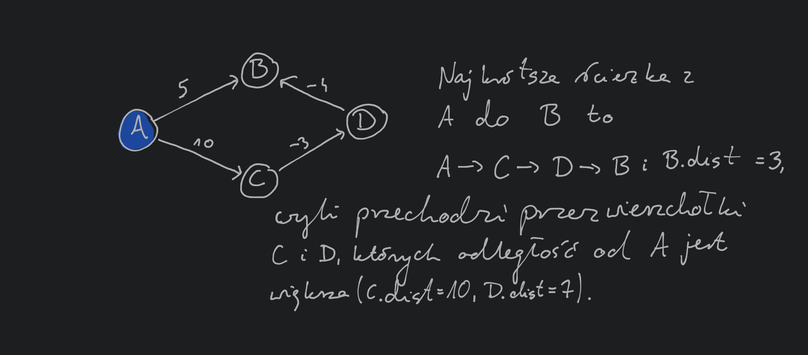
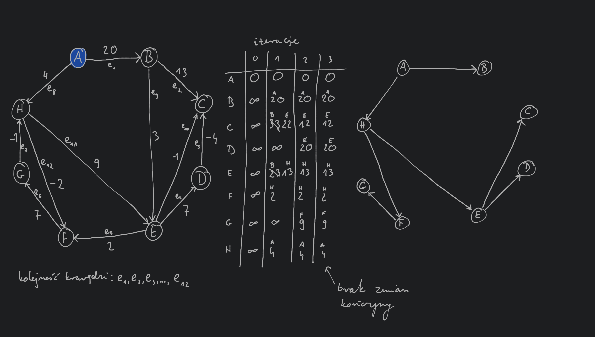

---

- [Dijkstra's algorithm](#dijkstras-algorithm)
- [Algorytm Bellmana-Forda](#algorytm-bellmana-forda)
    - [Przykład (Algorytm Bellmana-Forda)](#przykład-algorytm-bellmana-forda)
- [More](#more)

---

Wspomniany na [wcześniejszym wykładzie](../2020-05-20/dijkstras-algorithm.md) algorytm Dijkstry pozwala na wyznaczenie najkrótszych ścieżek od startowego wierzchołka do wszystkich innych wierzchołków w grafie $G = (V,E,l)$, w przypadku gdzie wagi krawędzi są dodatnie ($l: E\to \mathbb{R}_+$). Teraz będziemy rozważać grafy, gdzie mamy również ujemne wagi krawędzi ($l: E \to \mathbb{R}$).

## Dijkstra's algorithm

W algorytmie Dijkstry wykorzystywany był następujący fakt:\
*najkrótsza ścieżka od wierzchołka startowego $s$ do wierzchołka $v$ może przechodzić tylko przez wierzchołki będące w mniejszej odległości od $s$ nie wierzchołek $v$.*\
Własność ta nie jest prawdziwa jeśli dopuścimy ujemne wagi krawędzi grafu:

Zauważmy, że algorytm Dijkstry wykonuje pewną sekwencję procedur
`update`$((u,v) \in E)$:
1. $v.\mathrm{dist} = \min \{ v.\mathrm{dist}, u.\mathrm{dist} + l(u,v) \}$

Procedura `update` ma następujące własności:
- ustawia prawidłową wartość $v.\mathrm{dist}$ jeśli $u$ jest przedostatnim wierzchołkiem na najkrótszej ścieżce z $s$ do $v$, czyli najkrótsza ścieżka wygląda tak: $s \to \dotsb \to u \to v$.
- Nigdy nie ustawi $v.\mathrm{dist}$ na wartość mniejszą niż prawidłowa. Oznacza to, że procedura `update` może zostać wykonana nadmiarową liczbę razy.

Widzimy zatem, że wykonując dowolną sekwencję procedur `update` wartości $v.\mathrm{dist}$ dla każdego wierzchołka $v \in V$ przyjmuje wartość większą lub równą prawdziwej najkrótszej odległości od wierzchołka startowego $s$.

Na poprzedniej ilustracji widzieliśmy przykład grafu, dla którego sekwencja wykonań procedur `update` wykonywana przez algorytm Dijkstry nie pozwoli wyznaczyć prawidłowej najkrótszej ścieżki od wierzchołka $S$ do $A$. Zastanówmy się jakie własności musi mieć najkrótsza ścieżka od wierzchołka $s$ do $v$ (powiedzmy, że będzie ona wyglądać następująco $s \to u_1 \to u_2 \to \dotsb \to u_k \to v$) oraz sekwencja procedur `update` pozwalająca ją wyznaczyć:
- długość najkrótszej ścieżki pomiędzy dwoma wierzchołkami nie będzie dłuższa niż $|V| - 1$ (ścieżka długości $|V| - 1$ przechodzi przez wszystkie wierzchołki)
- jeśli sekwencja procedur `update` zostanie wykonana na krawędziach $(s,u_1),~(u_1,u_2),\dots,(u_k,v)$ w tej kolejności, to z pierwszej własności procedury `update` wiemy, że odległość od $s$ do $t$ zostanie poprawnie wyliczona (bez względu na to dla jakich innych krawędzi grafu zostanie wykonana procedura `update`)

## Algorytm Bellmana-Forda

W celu uniknięcia zastanawiania się czy wykonamy procedurę `update` w odpowiedniej kolejności możemy wykonać ją dla każdej krawędzi w grafie $|V| - 1$ razy. Zauważmy jednak, że w przypadku wielu grafów ścieżki będą miały mnie krawędzi niż $|V| - 1$, czyli mniejsza liczba (niż $|V| - 1$) powtórzeń procedury `update` dla każdego wierzchołka wystarczy aby wyznaczyć najkrótsze ścieżki. Zauważmy, że jeśli wykonamy procedurę `update` dla każdej krawędzi w grafie, ale nie zmodyfikujemy żadnej ścieżki to dalsze wykonywanie procedury `update` już nic nie zmieni.

`Bellman-Ford`$(G,s)$:
1. `for all` $v \in V$:
   1. $v.\mathrm{dist} \gets \infty$
   2. $v.\mathrm{prev} \gets$ `null`
2. $s.\mathrm{dist} \gets 0$
3. $s.\mathrm{prev} \gets s$
4. `repeat until` $\mathrm{change} = True$:
   1. $\mathrm{change} \gets False$
   2. `for all` $(u,v) \in E$:
      1. `if` $v.\mathrm{dist} > u.\mathrm{dist} + l(u,v)$
         1. $v.\mathrm{dist} = u.\mathrm{dist} + l(u,v)$
         2. $v.\mathrm{prev} = u$
         3. $\mathrm{change} = True$

Złożoność obliczeniowa: wewnętrzna pętla ma złożoność obliczeniową $O(|E|)$ i jest wykonywana co najwyżej $O(|V|)$ razy co daje złożoność obliczeniową całego algorytmu $O(|E| \cdot |V|)$.

### Przykład (Algorytm Bellmana-Forda)

Zauważmy, że jeśli w grafie istnieje ujemny cykl (tzn. suma wag krawędzi w cyklu jest ujemna) to przechodzenie w kolejne razy tego ujemnego cyklu będzie zmniejszać długość ścieżek w grafie. W takim przypadku zakładamy, że najkrótsza ścieżka nie istnieje. Aby sprawdzić, czy graf posiada ujemny cykl wystarczy powtórzyć wykonanie procedury `update` dla każdej krawędzi $|V|$ razy. Jeśli w ostatniej rundzie wykonywania procedury `update` któraś wartość $v.\mathrm{dist}$ ulegnie zmianie to wiemy, że w grafie mamy ujemny cykl (ponieważ jak wcześniej zauważyliśmy najkrótsza ścieżka może mieć co najwyżej $|V| - 1$ krawędzi).

## More

- [Algorithms DPV~ Chapter 4.6](http://algorithmics.lsi.upc.edu/docs/Dasgupta-Papadimitriou-Vazirani.pdf)
- [Introduction to Algorithms CLRS~ Chapter 24](https://web.ist.utl.pt/~fabio.ferreira/material/asa/clrs.pdf)
