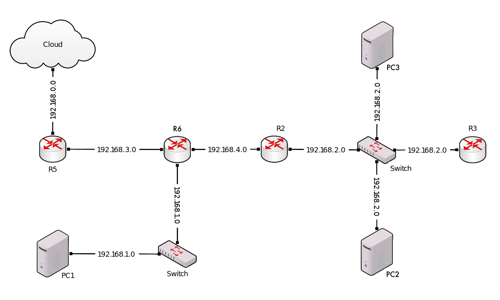

# Lista-4

- [Lista-4](#lista-4)
  - [The original task *(in polish)*](#the-original-task-in-polish)
    - [Translated task](#translated-task)
  - [Useful commands](#useful-commands)
  - [Setting up](#setting-up)
  - [Testing](#testing)
  - [Other caveats](#other-caveats)
  - [Devices' configs](#devices-configs)
    - [`R5` (last router before `Cloud`)](#r5-last-router-before-cloud)
    - [`R6`](#r6)
    - [`R2`](#r2)
    - [`R3`](#r3)
    - [`PC-1`](#pc-1)
    - [`PC-2`](#pc-2)
    - [`PC-3`](#pc-3)

## The original task *(in polish)*
[»English«](#translated-task)
> 1. W symulatorze GNS3 skonfiguruj wirtualną sieć o podanej topologii, tak aby:
>    
>    1. Wirtualna sieć była połączona z zewnętrzną („fizyczną”) siecią `Cloud`.
>    2. Ruter `R5` uzyskiwał dynamiczny adres IP z sieci `Cloud`.
>    3. Pozostałe urządzenia posiadały statyczne adresy w swoich sieciach.
>    4. Możliwe było wysyłanie komunikatów `ping` pomiędzy dowolna parą urządzeń sieci wirtualnej.
>    5. Możliwe było wysyłanie komunikatów `ping` z dowolnego urządzenia w sieci wirtualnej na zewnętrzny adres, np. `google.com`.
> 2. Ustaw przechwytywanie komunikatów w sieciach: `192.168.0.0`, `192.168.2.0`, `192.168.3.0`.
> 3. Przeanalizuj przechwycone komunikaty dla zapytania wysłanego z komputera PC2: `ping google.com`.

### Translated task

> 1. In GNS3 simulation program create a virtual network with a given topology such that:
>    
>    1. the virtual network is connected with the outside „physical” network represented by device named `Cloud`.
>    2. `R5` has a dynamic IP address given by `Cloud`
>    3. other devices have their static IP address inside their local networks
>    4. all devices are able to communicate with each other via `ping`
>    5. all devices are able to communicate with the outside world e.g. `google.com`
> 2. Setup packet capture on networks `192.168.0.0.`, `192.168.2.0`, `192.168.3.0`.
> 3. Analyse captured packets sent and received due to executing `ping google.com` in the terminal of PC2.

## Useful commands

1. After executing `conf t`:
   1. After executing `int X`, where `X` is a network interface e.g. `f0/0`:
      1. `no ip address` deletes current settings for chosen network interface
  2. `do` execute a command like outside `conf t`
2. `sh` show (`show`):
   1. `ip route` currently active internet interfaces
   2. `access-list` views the list of IPs with their access mode

## Setting up

**Important:** in order for this simulation to run an image of the CISCO `c3725` router has to bo installed into GNS3. Download it from [here](https://yaser-rahmati.gitbook.io/gns3/cisco-ios-images-for-dynamips) or just run attached [bash script with `wget` in it](download-router-image.sh).

Obviously, on every computer the configuration of the `Cloud` will be different thus the gateway and the subnet will be different (hence they need to be reconfigured a little in order to work on your machine).\
However, the inside of this network of smaller networks should work out of the box. If it's not [below are setup commands](#devices-configs) that have to be run consecutively in each device's terminal to be setup properly.

## Testing

After the setup you can test the simulated network. Open selected device's terminal and use `ping` to test the connection to another device in the network. DNS is set to either `8.8.8.8` (Google) or `1.1.1.1` so `ping`ing outside web should also not be a problem.

## Other caveats

Devices marked as `PC-X` where `X` $\in \{1,2,3\}$ are not actual GNS3's `VPCS`s. They are the CISCO `c3725` routers with `ip routing` turned off so they *act* like a `VPCS`.\
*This is sufficient for testing purposes of this simulation.*\
*(normal GNS3's `VPCS`s are genuinely broken)*

## Devices' configs

### `R5` (last router before `Cloud`)
```
conf t
int f0/0
ip address dhcp
ip nat outside
no shut
end

conf t
ip domain-lookup
ip name-server 8.8.8.8
end

conf t
int f0/1
ip add 192.168.3.3 255.255.255.0
ip nat inside
no shut
end

conf t
router rip
version 2
no auto-summary
network 192.168.42.0
network 192.168.3.0
default-information originate
end

conf t
access-list 10 permit 192.168.1.0 0.0.254.255
access-list 10 permit 192.168.2.0 0.0.253.255
access-list 10 permit 192.168.3.0 0.0.252.255
access-list 10 permit 192.168.4.0 0.0.251.255

ip nat inside source list 10 interface f0/0 overload
end
```

### `R6`

```
conf t
int f0/0
no shut
ip add 192.168.3.1 255.255.255.0
end

conf t
ip domain-lookup source-interface f0/0
ip name-server 8.8.8.8
end

conf t
int f1/0
no shut
ip add 192.168.1.1 255.255.255.0
end

conf t
int f0/1
no shut
ip add 192.168.4.1 255.255.255.0
end

conf t
router rip
version 2
no auto-summary
network 192.168.1.0
network 192.168.4.0
network 192.168.3.0
end
```

### `R2`

```
conf t
int f0/1
ip add 192.168.2.1 255.255.255.0
no shut
int f0/0
ip add 192.168.4.2 255.255.255.0
no shut
end

conf t
router rip
version 2
no auto-summary
network 192.168.2.0
network 192.168.4.0
end

conf t
ip domain-lookup
ip name-server 8.8.8.8
end
```

### `R3`

```
conf t
int f0/0
ip add 192.168.2.3 255.255.255.0
no shut
end

conf t
router rip
version 2
no auto-summary
network 192.168.2.0
end

conf t
ip domain-lookup
ip name-server 192.168.42.129
end
write memory
```

### `PC-1`

```
conf t
no ip routing
int f0/0
ip add 192.168.1.2 255.255.255.0
no shut
exit
ip default-gateway 192.168.1.1
ip domain-lookup
ip name-server 8.8.8.8
end
write memory
```

### `PC-2`

```
conf t
no ip routing
int f0/0
ip add 192.168.2.4 255.255.255.0
no shut
exit
ip default-gateway 192.168.2.1
ip domain-lookup
ip name-server 8.8.8.8
end
write memory
```

### `PC-3`

```
conf t
no ip routing
int f0/0
ip add 192.168.2.5 255.255.255.0
no shut
exit
ip default-gateway 192.168.2.1
ip domain-lookup
ip name-server 8.8.8.8
end
write memory
```
