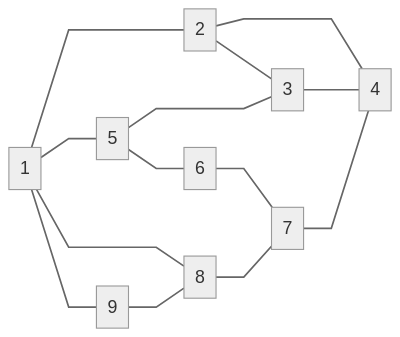

---

```pseudo

for i = 1 to N
  foreach e \in E
    r = $[0,1]
    if r > P(e)
      E = E \ {e}
  S = check_connectivity of 'G'
  if S
    success++

```

$\frac{success}{N}$

```pseudo

for i =1 to {liczba eksperymentów Monte Carlo}

  connectivity of G'

```

$$
N =
\begin{array}{c}
\begin{matrix}
\\
1 \\
2 \\
3 \\
\end{matrix}
\begin{array}{r}
\begin{matrix}
1 & 2 & 3~~~~~
\end{matrix} \\
\begin{Bmatrix}
  - & 1 & 2 \\
  1 & - & 3 \\
  2 & 3 & -
\end{Bmatrix}
\end{array}
\end{array}
$$


$\frac{success}{liczba eksperymentów Monte Carlo}$



### Opóźnienie średnie
$T_{średnie} = \frac{1}{|N|}*\sum\frac{\lambda}{\frac{c}{\mu}-\lambda}$ gdzie
- $\lambda \equiv$ przepływ
- $c \equiv$ przepustowość

???:

- dobierz trasy dla każdej pary wierzchołków
- policz $\lambda_{e}$
- $\lambda_e \ge c_p$
-

$T_{średnie} \le T_{dopuszczalne}$ - sukces
