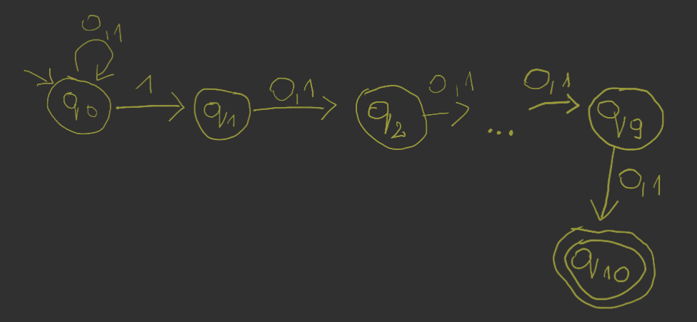

---

- [Zadanie 1.](#zadanie-1)
    - [1.1.](#11)
    - [1.2.](#12)
    - [1.3.](#13)
    - [1.4.](#14)
    - [1.5.](#15)
- [Zadanie 2.](#zadanie-2)
- [Zadanie 3.](#zadanie-3)
    - [3.1.](#31)
    - [3.2.](#32)
    - [3.3.](#33)
- [Zadanie 4.](#zadanie-4)
    - [4.1.](#41)
    - [4.2.](#42)
- [Zadanie 5.](#zadanie-5)
    - [5.1.](#51)
    - [5.2.](#52)
- [Zadanie 6.](#zadanie-6)
    - [6.1.](#61)
    - [6.2.](#62)
    - [6.3.](#63)
- [Zadanie 7.](#zadanie-7)
- [Zadanie 8.](#zadanie-8)

---

## Zadanie 1.

> Podać deterministyczne automaty skończone (DFA) akceptujące następujące języki nad alfabetem $\{0,1\}$.

### 1.1.

> zbiór wszystkich łańcuchów o zakończeniu $101$

- na początku mamy stan oczekujący aż nie zostanie wykryty początek żądanego suffiksu
- następne stany reprezentują poszczególne etapy w wykrywaniu suffiksu
- mamy też powroty, kiedy żądany pattern zostanie złamany

### 1.2.

> zbiór wszystkich łańcuchów zawierających trzy kolejne jedynki

- na początku oczekujemy na żądany pattern
- kolejne stany to poszczególny etapy wykrywania infiksu
- mamy powroty, kiedy pattern zostanie złamany
- po dojściu do stanu akceptującego, infiks jest już gwarantowany — ciąg może iść dalej lub się skończyć

### 1.3.

> zbiór wszystkich łańcuchów, w których każdy blok złożony z pięciu kolejnych symboli zawiera co najmniej dwa zera

*Zakładamy, że słowa krótsze niż 5 nie należą do języka.*

- DFA $M = (Q, \Sigma, \delta, q_{\epsilon}, F)$
- Stany $Q = \left\{ q_a, q_{ab}, q_{abc}, q_{abcd}, q_{abcde}: a,b,c,d,e \in \{0,1\} \right\} \cup \{q_{\epsilon}, q_{s}\}$
- Alfabet $\Sigma = \{0,1\}$
- Funkcja przejścia:
    $$
    \delta(q_\epsilon, a) = q_a\\
    \delta(q_a, b) = q_{ab}\\
    \delta(q_{ab}, c) = q_{abc}\\
    \delta(q_{abc}, d) = q_{abcd}\\
    \delta(q_{abcd}, e) =
    \begin{cases}
        q_{abcde} & a+b+c+d+e \le 3\\
        q_s & \text{oth.}
    \end{cases}\\
    \delta(q_{abcde}, f) =
    \begin{cases}
        q_{bcdef} & b+c+d+e+f \le 3\\
        q_s & \text{oth.}
    \end{cases}\\
    \delta(q_s, a) = q_s
    $$
    gdzie $a,b,c,d,e,f \in \{0,1\}$
- Stany akceptujące $F = \left\{ a+b+c+d+e \le 3 \right\}$ gdzie $a,b,c,d,e,f \in \{0,1\}$

### 1.4.

> zbiór wszystkich łańcuchów zaczynających się od $1$, które interpretowane jako binarna reprezentacja liczby całkowitej są wielokrotnością $7$

- dopisanie $0$ na końcu oznacza przemnożenie przez $2$
- dopisanie $1$ na końcu oznacza przemnożenie przez $2$ i dodanie $1$
- stany $q_0, \dots, q_6$ symbolizują reszty $\operatorname{mod} 7$

### 1.5.

> zbiór wszystkich łańcuchów, w których piąty symbol od końca jest zerem

- DFA $M = (Q, \Sigma, \delta, q_{11111}, F)$
- Stany $Q = \left\{ q_{abcde}: a,b,c,d,e \in \{0,1\} \right\}$
- Alfabet $\Sigma = \{0,1\}$
- Funkcja przejścia $\delta(q_{abcde}, f) = a_{bcdef}$ gdzie $a,b,c,d,e,f \in \{0,1\}$
- Stany akceptujące $F = \left\{ q_{abcde}: a = 0 \land b,c,d,e \in \{0,1\} \right\}$

---

## Zadanie 2.

> Podać niedeterministyczny automat skończony (NFA) akceptujący następujący język: zbiór wszystkich łańcuchów zer i jedynek, w których dziesiąty symbol od końca jest jest jedynką. Jaki jest związek między rozwiązaniem tego zadania a [zadania 1.5.](#15)?

W [zadaniu 1.5.](#zadanie-1) liczba stanów rośnie wykładniczo właśnie przez to, że mamy tam DFA. Tutaj mamy NFA i możemy pozwolić na taki „niedeterminizm” przy stanie $q_0$ gdzie znak $1$ może oznaczać przejście do następnego stanu, ale może też tego nie oznaczać.

---

## Zadanie 3.

> Skonstruować automaty skończone równoważne z następującymi wyrażeniami regularnymi:

### 3.1.
> $10 + (0 + 11)0*1$

### 3.2.
> $01\big[ ((10)^* + 111)^* + 0 \big]^*1$

(bez części na różowo mamy NFA)

### 3.3.
> $((0 + 1)(0 + 1))^∗ + ((0 + 1)(0 + 1)(0 + 1))^∗$

NFA z $\epsilon$-przejściami\

NFA\

DFA\

---

## Zadanie 4.

> Skonstruować wyrażenia regularne odpowiadające następującym automatom:

### 4.1.
> $(\{A, B, C\}, \{0, 1\}, \{(A, 0) \to A,(A, 1) \to B,(B, 0) \to C,(B, 1) \to B,(C, 0) \to A,(C, 1) \to B \}, A, \{A\})$

$(1+0)^*00 + 0 \epsilon$\

### 4.2.
> $(\left\{ A,B,C \right\}, \left\{ 0,1 \right\},\\\left\{ (A,0) \to B, (A,1) \to C, (B,0) \to A, (B,1) \to C, (C,0) \to B, (C,1) \to A, \right\},\\ A, \left\{ B,C \right\})$

$(0+1)^* (10 + 01) + 0 + 1$\

---

## Zadanie 5.

> Udowodnić następujące tożsamości dla wyrażeń regularnych $r$, $s$ i $t$, przy czym $r = s$ oznacza identyczność języków opisywanych przez $r$ i $s$.

- $r,s,t$ reprezentują odpowiednio języki $R$, $S$, $T$
- $r+s$ reprezentuje język $R \cup S$
- $rs$ reprezentuje złożenie $RS = \left\{ xy: x \in R, y \in S \right\}$
- $r^*$ reprezentuje domknięcie Kleene’ego $R^* = \bigcup_{i=0}^{\infty} R^i$, gdzie $R^0 = \{\epsilon\}$, $R^i = RR^{i-1}$ dla $i \ge 1$
- $\emptyset$ reprezentuje $\emptyset$
- $\epsilon$ reprezentuje $\{\epsilon\}$

### 5.1.

> $(r + s) + t = r + (s+t)$

- $x \in (R\cup S) \cup T \iff x \in (R\cup S) \lor x \in T$
- $x \in R \lor x \in S \lor x \in T$
- $x \in R \cup (S\cup T)$

### 5.2.

> $(rs)t = r(st)$

- $x \in (RS)T \iff \exists x_1, x_2 \enspace (x = x_1 x_2 \land x_1 \in RS \land x_2 \in T) \iff \exists x_1, x_2 \enspace (x = x_1x_2 \land (\exists y_1, y_2 \enspace (x_1 = y_1 y_2 \land y_1 \in R \land y_2 \in S) \land x_2 \in T) \iff \dots$
- $x \in R(ST)$

$$
\dots
$$

---

## Zadanie 6.

> Udowodnić lub obalić następujące tożsamości dla wyrażeń regularnych r, s i t:

### 6.1.

> $(rs + r)^* r = r(sr + r)^*$

Pokażemy indukcyjnie, że $(rs + r)^n r = r(sr + r)^n$.

1. $n = 1$

    - $(rs + r) r = r (sr + r)$
    - $rsr + r = rsr + r$
    - czyli OK

2. $n \implies n+1$

    - zakładamy, że $(rs + r)^n r = r(sr + r)^n$
    - $(rs + r)^{n+1} r = (rs + r) r (sr + r)^n$
    - $(rs + r)^{n+1} r = (rsr + rr) (sr + r)^n$
    - $(rs + r)^{n+1} r = r(sr + r) (sr + r)^n$
    - $(rs + r)^{n+1} r = r(sr + r)^{n+1}$
    - $\blacksquare$

### 6.2.

> $(r + s)^* = r^* + s^*$

Wyrażenie nieprawdziwe.

Po lewej stronie możemy mieć słowo $rsrs$, które nie jest akceptowane przez prawą stronę.\
Lewa strona zezwala na mieszanie się znaków, prawa strona dzieli litery na dwie homogeniczne części.

### 6.3.

> $s(rs + s)^* r = rr^* s(rr^* s)^*$

Wyrażenie nieprawdziwe.

Lewa strona zawsze zaczyna się od $s$, kiedy prawa zaczyna od $r$.

---

## Zadanie 7.

> Udowodnić, że DFA akceptujący język słów nad alfabetem $\{0, 1\}$, w których piąty symbol
od prawego końca jest jedynką, musi mieć co najmniej $32$ stany.

Załóżmy, że istnieje DFA $M$ o $31$ stanach. Rozważmy dwa różne słowa długości $5$ należące do rozpatrywanego języka:
- $s_1 = i_1\dots i_5$
- $s_2 = j_1\dots j_5$

Zatem istnieją dwa różne słowa długości $5$, które wczytywane prowadzą do tego samego stanu $q$.
1. Jeśli różnią się na pierwszej pozycji $(i_1 \neq j_1)$, to sprzeczność z założeniem, że oba słowa należą do języka (jedno z nich ma zero na początku).
2. Załóżmy, że $i_1 = j_1$. Dopisujemy na końcu obu słów ten sam znak $a \in \{0,1\}$

Wczytujemy $a$. W przypadku obu słów, wychodząc z tego samego stanu $q$ z literą $a$ automat powinien przejść do tego samego stanu $p$ (bo to DFA). Zatem $i_2 = j_2$ (stan nie może być jednocześnie akceptujący i nieakceptujący).

Idąc dalej podobnym tokiem rozumowania, dostaniemy $\forall x \enspace i_x = j_x$ co jest sprzeczne z założeniem, że $s_1 \neq s_2$.

W [zadaniu 1.5.](#15) pokazaliśmy, że $32$ stany są wystarczające dla tego typu języka.

---

## Zadanie 8.

> Skonstruuj NFA rozpoznający język tych słów nad $\{0, 1\}^*$ które jako liczba w systemie dwójkowym dzielą się przez $5$, przy czym liczba jest wczytywana, począwszy od najmniej znaczącego bitu.

Budujemy automat dla modelu wczytywania od najbardziej znaczącego bitu, a następnie aplikujemy metodę inwersji:
1. Zbiór stanów może zostać rozszerzony o $q_0'$, z którego prowadzimy $\epsilon$-przejścia do stanów akceptujących w automacie $M$
2. Stan początkowy z $M$ czynimy w $M'$ stanem akceptującym.
3. „Odwracamy” w automacie $M'$ ścieżki z $M$.

---
