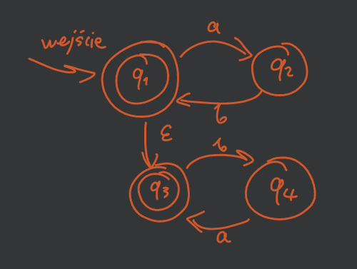
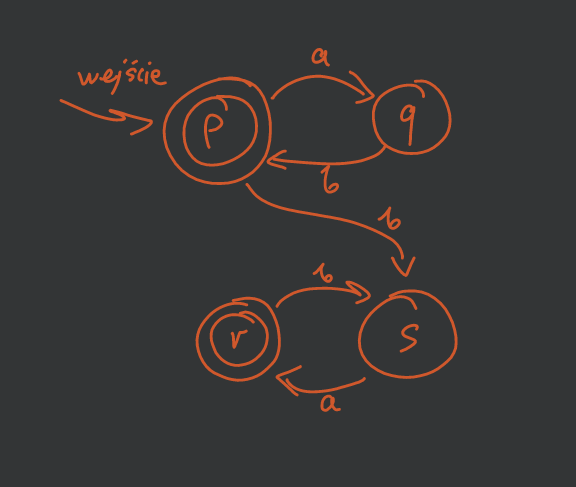

---

- [Zadanie 1.](#zadanie-1)
- [Zadanie 3.](#zadanie-3)
- [Zadanie 4.](#zadanie-4)
- [Zadanie 5.](#zadanie-5)
- [Zadanie 6.](#zadanie-6)
- [Zadanie 7.](#zadanie-7)
- [Zadanie 8.](#zadanie-8)

[lemat-o-pompowaniu]: ../../wyk/2020-10-22/własności-języków-regularnych.md#1-lemat-o-pompowaniu

---

## Zadanie 1.

> Zbuduj NFA $M_1$ akceptujący język $(ab)^∗$ i $M_2$ akceptujący język $(ba)^∗$. Połącz je $\epsilon$-przejściami tak, aby otrzymać NFA$_\epsilon$ $M$ akceptujący $(ab)^∗(ba)^∗$. Przekształć $M$ do DFA i zminimalizuj.

Najpierw robimy NFA$_\epsilon$:\

Następnie zauważamy, że ze stanu $p$ możemy przejść do stanu $s$ przy pomocy $\epsilon b$ co daje nam NFA:\

Teraz stosujemy [twierdzenia](../../wyk/2020-10-15/równoważność-dfa-nfa-re.md#4-twierdzenie2). Definiujemy nową funkcję przejść:\
\
oraz nowy zbiór stanów akceptujących $F'' = \left\{ \{p\}, \{r\}, \{p,q\}, \{p,s\}, \dots, \{p,q,r,s\} \right\}$ czyli zbiór wszystkich nowych stanów zawierających dawne stany akceptujące $p$ i $r$.

Teraz minimalizujemy powstały automat $M''$ przy pomocy [algorytmu](../../wyk/2020-10-15/minimalny-dfa.md#3-algorytm-minimalizacji).

1. Oznaczamy pary stanów, które nie są równoważne.
2. Stany równoważne „sklejamy”.
3. Usuwamy stany nieosiągalne.

Ostateczny automat minimalny:\

---

## Zadanie 3.

> Udowodnij, że język $L = \left\{ x: x \in \{0,1\}^* \land |x|_0 \le |x|_1 \le 2 |x|_0 \right\}$ nie jest regularny.

*«Lemat o pompowaniu»*

Weźmy słowo $z = 0^{n} 1^{n}$ dla $n \ge 2$.\
Podzielmy je według [lematu o pompowaniu][lemat-o-pompowaniu] na części $uvw$, rozpatrujemy wszystkie podziały spełniające warunki lematu:
- $|uv| \le n$
- $|v| \ge 1$

gdzie $u$ oraz $v$ składają się z samych zer.

„Pompujemy” część $v$ (przynajmniej jedno zero):\
bierzemy słowo $z' = uv^{i}w$ np. dla $i = 2$.

Bierzemy słowo $z' = 0^{m}1^n$ dla $m > n$ gdzie mamy więcej zer niż jedynek, co daje nam $z' \notin L \implies L$ nie jest regularny.

---

## Zadanie 4.

> Czy język $\{0^{n!}: n \in \mathbb{N}\}$ jest regularny?

*«Lemat o pompowaniu»*

Weźmy słowo $z = 0^{n!}$ dla $n \ge 2$.\
Podzielmy je według [lematu o pompowaniu][lemat-o-pompowaniu] na części $uvw$:
- $|uv| \le n$
- $j = |v| \ge 1$
„Pompujemy” część $v$:\
bierzemy słowo $z' = uv^2w$.

Wówczas mamy
$$
0^k (0^j)^2 0^{n!-k-j} = 0^{2j} 0^{n! - j}
$$
dla $1 \le j \le n$ co daje długość $|z'| = 2j + n! - j = n! + j$.

Dalej wystarczy zauważyć, że
$$
\left(\forall 1 \le j \le n\right) \enspace n! < n! + j \le n! + n < n! + n \cdot n! = (n+1)!
$$
czyli $n! + j$ jest zamknięta *pomiędzy* możliwymi wartościami, ale nie jest żadnej z nich równa, co daje $z' \notin L \implies L$ jest nieregularny.

---

## Zadanie 5.

> Czy język $L = \{ww^Rx : w, x \in \{0,1\}^* \land w,x \neq \varepsilon\}$ gdzie $w^R$ oznacza odwrócenie kolejności liter w słowie $w$, jest regularny?

~~«Lemat o pompowaniu»~~

Język nie jest regularny.

**D-d**

Załóżmy, że $L$ jest regularny. Wówczas istnieje DFA $M = (Q, \Sigma, \delta, q_0, F)$, który go rozpoznaje. Niech $n = |Q|$. Wybierzmy słowo $z = (01)^n (10)^n 1111$, oczywiście $z \in L$. Ponieważ automat ma tylko $n$ stanów, to wczytując nasze słowo $z$, które ma blok $(10)^n$ zaczynający się w stanie $q_i$ a kończący w $q_j$, któreś stany na ścieżce $q_i$ do $q_j$ muszą się powtórzyć.
Ścieżka wygląda następująco:
$$
q_i \dots q_k \dots q_k \dots q_j
$$

Zatem słowo $z$ uboższe o znaki, z którymi przechodziliśmy po pętli $q_k \dots q_k$ również będzie przez automat $M$ zaakceptowane. Jednak należy zauważyć, że to słowo nie może być postaci $ww^R x$, więc nie należy do języka. Mamy sprzeczność.

---

## Zadanie 6.

> Udowodnij, że jeśli dla pewnego języka $L$ istnieje niedeterministyczny automat skończony rozpoznający go, to istnieje również niedeterministyczny automat skończony rozpoznający język $L^R = \{w: w^R \in L\}$.

Niech NFA $M = (Q, \Sigma, \delta, q_0, F)$ rozpoznaje $L$:\

Konstrukcja NFA$_\epsilon$ $M' = (Q', \Sigma, \delta', q_0', F')$ rozpoznającego $L^R$:\
\
gdzie:
- $Q' = Q \cup \{q_0'\}$
- $F' = \{q_0\}$.
- $$
  \delta' = \begin{cases}
      \left( \forall q \in Q \right) \enspace \delta'(q, a) = \{p: \delta(p,a) = q\}\\
      \left( \forall q \in F \right) \enspace \delta'(q_0', \epsilon) = q\\
  \end{cases}
  $$

Przez to, że NFA i NFA$_\epsilon$ są równoważne jesteśmy w stanie z NFA$_\epsilon$ $M'$ zrobić NFA $M''$ akceptującą język $L^R$.

---

## Zadanie 7.

> Czy klasa języków regularnych jest zamknięta na sumę nieskończoną?

Nie jest zamknięta na sumę.

Rozważmy języki:
$$
\begin{aligned}
    L_0 &= \{\epsilon\}\\
    L_1 &= \{ab\}\\
    L_2 &= \{aabb\}\\
    &\vdots\\
    L_i &= \{a^i b^i\}
\end{aligned}
$$
gdzie każdy z nich jest regularny (każdy zawiera po prostu jedno słowo). Ale ich suma nie jest już regularna:
$$
L = \bigcup_{i\ge0} L_i = \{a^nb^n: n \in \mathbb{N}\}.
$$
A dowód nieregularności takiego języka jest łatwo udowodnić z [lematu o pompowaniu][lemat-o-pompowaniu].

---

## Zadanie 8.

> Udowodnij, że klasa języków regularnych jest zamknięta na operację różnicy (zbiorów).

Weźmy języki regularne $L_1, L_2$, które mają swoje DFA:
- $M_1 = (Q, \Sigma, \delta, q_0, F)$
- $M_2 = (Q', \Sigma, \delta', q_0', F')$

Chcemy pokazać, że $L_1 \setminus L_2$ to też język regularny (ma swoje DFA).\
My pokażemy, że $L_1 \cap \overline{L_2}$ jest regularny.

Najpierw konstruujemy automat $M_2'$ rozpoznający $\overline{L_2}$:
$$
M_3 = (Q', \Sigma, \delta', q_0, \hat{F})
$$
gdzie $\hat{F} = Q'\setminus F'$.

Zatem automat $M$ rozpoznający $L_1 \cap \overline{L_2}$:
$$
M = (Q'', \Sigma, \delta'', q_0'', F'')
$$
gdzie:
- $Q'' = Q \times Q' = \left\{ \{p,q\}: p \in Q, q\in Q' \right\}$ — iloczyn kartezjański zbiorów stanów $M_1$ i $M_3$
- $q_0'' = \{q_0, q_0'\}$
- $(\forall p \in Q)(\forall q \in Q')(\forall a \in \Sigma) \enspace \delta''\left( \{p,q\}, a \right) = \left\{ \delta(p,a), \delta'(q,a) \right\}$
- $F'' = \left\{ \{p,q\}: p \in F \land q \in \hat{F} \right\}$

---
