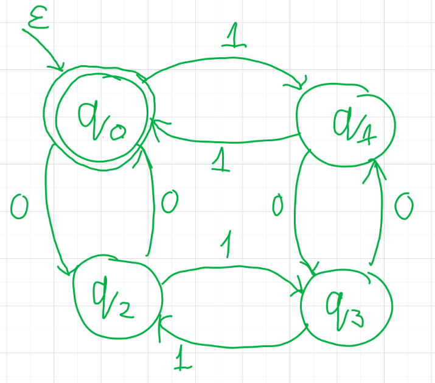
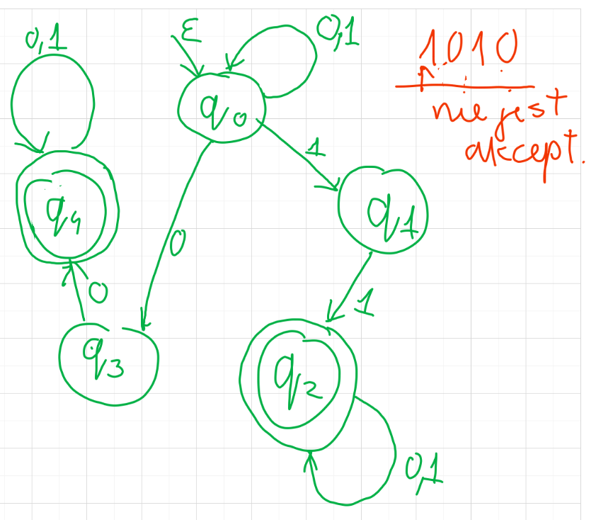

# Języki formalne — wprowadzenie

*(2020-10-08)*

- [1. Podstawowe definicje](#1-podstawowe-definicje)
- [2. Deterministyczny Automat Skończony (DFA)](#2-deterministyczny-automat-skończony-dfa)
    - [2.1. Rozszerzenie funkcji przejścia](#21-rozszerzenie-funkcji-przejścia)
    - [2.2. Przykład DFA](#22-przykład-dfa)
- [3. Niedeterministyczny Automat Skończony (NFA)](#3-niedeterministyczny-automat-skończony-nfa)
    - [3.1. Przykład NFA](#31-przykład-nfa)
- [4. $\text{NFA}_\epsilon$](#4-textnfa_epsilon)
- [5. Wyrażenia regularne (RE)](#5-wyrażenia-regularne-re)
    - [5.1. DEF](#51-def)
    - [5.2. Działania](#52-działania)
    - [5.3. Przykłady](#53-przykłady)

---

## 1. Podstawowe definicje

1. Alfabet ($\Sigma$) — skończony zbiór symboli
2. Słowo — skończony ciąg symboli z alfabetu
3. Język — zbiór słów nad danym alfabetem ($\emptyset$ — język pusty)
4. $\epsilon$ — słowo puste

---

## 2. Deterministyczny Automat Skończony (DFA)
— uporządkowana piątka $(Q, \Sigma, \delta, q_0, F)$ gdzie
- $Q$ — skończony zbiór stanów
- $\Sigma$ — skończony alfabet wejściowy
- $\delta$ — funkcja przejścia postaci $Q \times \Sigma \to Q$
- $q_0$ — stan początkowy
- $F \subseteq Q$ — zbiór stanów akceptujących

### 2.1. Rozszerzenie funkcji przejścia

Funkcję $\delta$ możemy rozszerzyć w taki sposób, żeby akceptowała całe słowa (możemy tak zrobić jeśli $\hat\delta(q, \epsilon) = q$):
$$
\hat{\delta}(q, wa) = \delta(\hat{\delta}(q,w),a)
$$

*Automat akceptuje słowo $w$ jeśli $\hat{delta}(q_0, w) \in F$.*

---

### 2.2. Przykład DFA

Mamy DFA $M = (\{q_0, q_1, q_2, q_3\}, \{0,1\}, \delta, q_0, \{q_0\})$

| $\delta$ | $0$   | $1$   |
| -------- | ----- | ----- |
| $q_0$    | $q_2$ | $q_1$ |
| $q_1$    | $q_3$ | $q_0$ |
| $q_2$    | $q_0$ | $q_3$ |
| $q_3$    | $q_1$ | $q_2$ |

Maszyna ta pozwala tylko na takie ciągi, w których mamy parzystą liczbę $0$ oraz parzystą liczbę $1$.

---

## 3. Niedeterministyczny Automat Skończony (NFA)

Modyfikacja [DFA](#2-deterministyczny-automat-skończony-dfa):\
istnieje `*` przejść ze stanu przy tym samym symbolu wejściowym.
$$
\delta: Q \times \Sigma \to 2^Q
$$

Automat niedeterministyczny akceptuje słowo $w$ jeżeli istnieje odpowiadający mu ciąg przejść ze stanu początkowego do stanu akceptującego.

### 3.1. Przykład NFA

Mamy NFA $M = (\{q_0, q_1, q_2, q_3, q_4\}, \{0,1\}, \delta, q_0, \{q_2, q_4\})$

| $\delta$ | $0$            | $1$            |
| -------- | -------------- | -------------- |
| $q_0$    | $\{q_0, q_3\}$ | $\{q_0, q_1\}$ |
| $q_1$    | $\emptyset$    | $\{q_2\}$      |
| $q_2$    | $\{q_2\}$      | $\{q_2\}$      |
| $q_3$    | $\{q_4\}$      | $\emptyset$    |
| $q_4$    | $\{q_4\}$      | $\emptyset$    |
| $q_5$    | $\{q_4\}$      | $\{q_4\}$      |

*Maszyna ta akceptuje tylko ciągi z infiksem $00$ lub z infiksem $11$.*

---

## 4. $\text{NFA}_\epsilon$

Wprowadzamy dodatkową modyfikację: dopuszczamy przejścia między stanami bez symboli wejściowych.
$$
\delta: Q \times (\Sigma \cup \{\epsilon\}) \to 2^Q
$$

---

## 5. Wyrażenia regularne (RE)

Niech $L, L_1, L_2$ — języki nad alfabetem $\Sigma$.\
Wówczas
$$
\begin{aligned}
    L_1L_2 &= \{xy : x\in L_1 \land y \in L_2\}\\
    L^0 &= \{\epsilon\}\\
    L^{i+1} &= LL^i \quad \text{dla } i > 0\\
    L^* &= \bigcup_{i=0}^{\infty} L^i \quad \text{domknięcie Kleene’ego} \quad \left( L^+ = \bigcup_{i=1}^{\infty} L^i \right)
\end{aligned}\\
$$

### 5.1. DEF

Wyrażenia regularne:
- $\emptyset$ — język pusty
- $\epsilon$ — język $\{\epsilon\}$
- $a$ — język $\{a\}$ dla $a \in \Sigma$

### 5.2. Działania
Mamy wyrażenia regularne $r$ oraz $s$ reprezentujące odpowiednio języki $R$ oraz $S$, wówczas:
- $(r+s)$ reprezentuje język $R \cup S$
- $(rs)$ reprezentuje język $RS$
- $r&*$ reprezentuje język $R^*$

---

### 5.3. Przykłady

- $\emptyset^* = \{\epsilon\} \cup \emptyset \cup \dotsb = \{\epsilon\}$
- $(0+1)^*$ – wszystkie ciągi nad alfabetem $\{0, 1\}$ (w tym $\epsilon$)
- $00 = 00\epsilon\epsilon$
- $11 = \epsilon\epsilon11$

---
