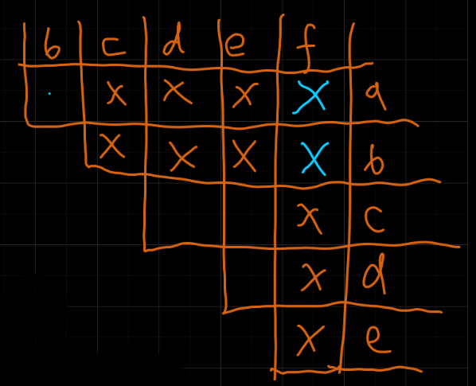
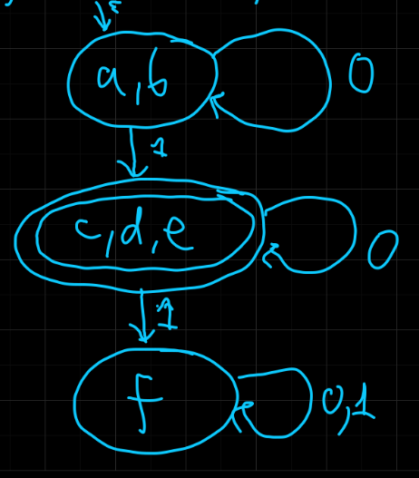

---

- [1. Minimalny DFA](#1-minimalny-dfa)
- [2. Idea algorytmu](#2-idea-algorytmu)
- [3. Algorytm minimalizacji](#3-algorytm-minimalizacji)
- [4. Przykład](#4-przykład)

---

## 1. Minimalny DFA

Dla każdego języka regularnego istnieje dokładnie jeden (z dokładnością do izomorfizmów) DFA o minimalnej liczbie stanów.\
*(Własność ta wynika z twierdzenia Myhill-Nerode, które jednak zostanie pominięte na wykładzie.)*

## 2. Idea algorytmu

Chcemy znaleźć takie stany, które można ze sobą połączyć (stan równoważne). Dwa stany równoważne to takie, że dla każdego $x$ startujące z tych stanów albo znajdziemy się równocześnie w stanach akceptujących, albo nieakceptujących.

## 3. Algorytm minimalizacji

Oznaczamy pary stanów, które nie są równoważne.

1. `for all` $p \in F \land q \in Q\setminus F$ `do` `flag` $(p,q)$
2. `for all` $p, q \in (F\times F) \cup (Q \setminus F \times Q \setminus F)$ takich że $p \neq q$ `do`:
    1. `if` $\exists a\in \Sigma$ taki że $(\delta(p,a), \delta(q,a))$ `is flagged then`:
        1. `flag` $(p,q)$
        2. `flag` w sposób rekurencyjny wszystkie nieoznaczone pary na liście $(p,q)$
    2. `else` (żadna para $(\delta(p,a),\delta(q,a))$ nie jest oznaczona)
        1. `for all` $a \in \Sigma$ `do`:
            1. umieść parę $(p,q)$ na liście $(\delta(p,a),\delta(q,a))$ pod warunkiem, że $\delta(p, a) \neq \delta(q,a)$

DFA uzyskany przez złączenie stanów równoważnych uzyskanych przez powyższy algorytm, z usuniętymi stanami nieosiągalnymi, jest minimalnym DFA dla danego języka.

---

## 4. Przykład

$M = \left( \{ a,b,c,d,e,f \}, \{ 0,1 \}, \delta, a, \{ c,d,e \} \right)$

| $\delta$ |     | $0$ | $1$ |
| -------: | --- | --- | --- |
|      $a$ |     | $b$ | $c$ |
|      $b$ |     | $a$ | $d$ |
|      $c$ |     | $e$ | $f$ |
|      $d$ |     | $e$ | $f$ |
|      $e$ |     | $e$ | $f$ |
|      $f$ |     | $f$ | $f$ |

---

Pomarańczowe X — pierwszy etap\
Niebieskie X — drugi etap\

- $(a,b)$
    - $0$: $(a,b)$ — nie to nam nie mówi
    - $1$: $(c,d)$ — na razie nieoznaczone
- $(a,f)$
    - $0$: $(b,f)$ — na razie nieoznaczone
    - $1$: $(c,f)$ — oznaczone
- $(b,f)$
    - $1$: $(d,f)$ — oznaczone
- $(c,d)$, $(c,e)$, $(d,e)$ — nic nie mogę

Czyli sklejamy:
- $(a,b)$
- $(c,d)$, $(c,e)$, $(d,e)$

---

Uproszczony DFA: $M' = (\{ ab, cde, f \}, \{ 0,1 \}, \delta, ab, \{ cde \})$

| $\delta$ |     | $0$   | $1$   |
| -------: | --- | ----- | ----- |
|     $ab$ |     | $ab$  | $cde$ |
|    $cde$ |     | $cde$ | $f$   |
|      $f$ |     | $f$   | $f$   |

---
