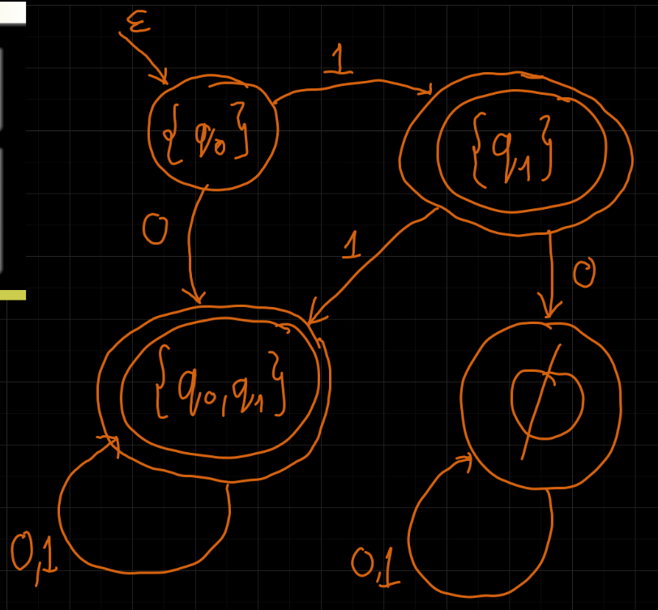
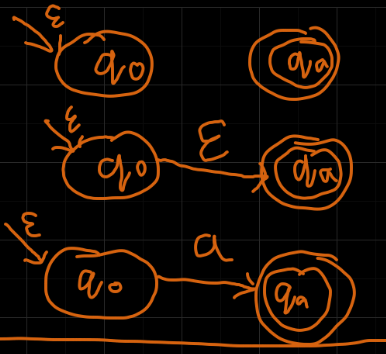
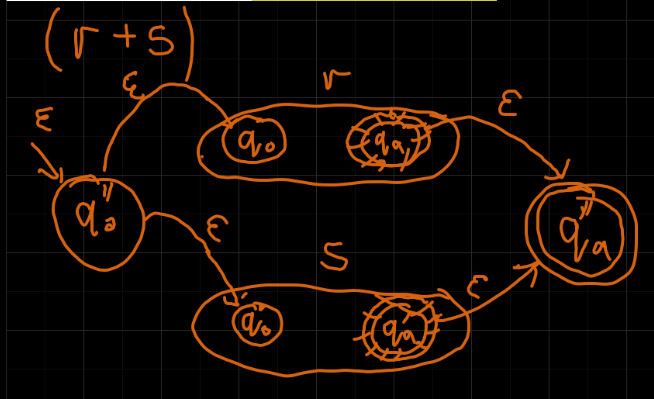
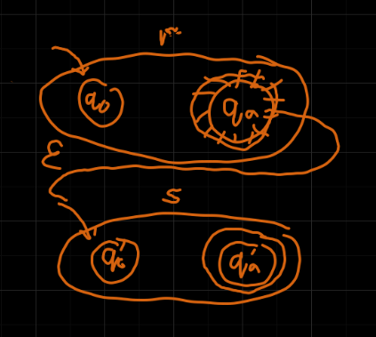
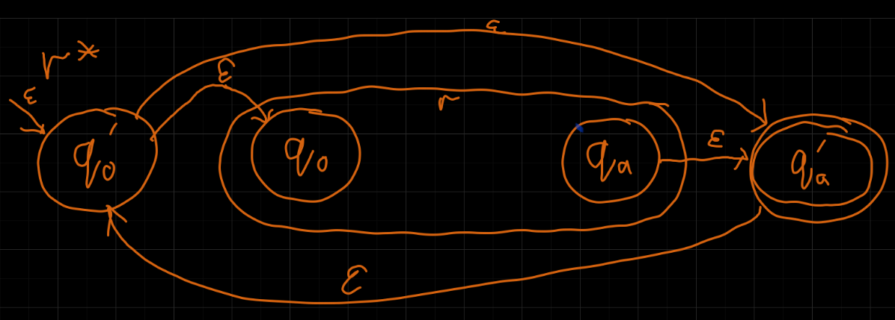

---

- [1. Fakt: Każdy DFA jest NFA](#1-fakt-każdy-dfa-jest-nfa)
- [2. Twierdzenie#1](#2-twierdzenie1)
    - [2.1. D-d](#21-d-d)
    - [2.2. Przykład NFA → DFA](#22-przykład-nfa--dfa)
- [3. Fakt: Każdy NFA jest NFA$_\epsilon$](#3-fakt-każdy-nfa-jest-nfa_epsilon)
- [4. Twierdzenie#2](#4-twierdzenie2)
    - [4.1. D-d](#41-d-d)
- [5. Twierdzenie#3](#5-twierdzenie3)
    - [5.1. D-d](#51-d-d)
- [6. Twierdzenie#4](#6-twierdzenie4)
    - [6.1. D-d](#61-d-d)
    - [6.2. Przykład](#62-przykład)

---

## 1. Fakt: Każdy DFA jest NFA

---

## 2. Twierdzenie#1

Niech $L$ będzie językiem akceptowanym przez NFA. Wówczas istnieje DFA akceptujący język $L$.**

### 2.1. D-d

Niech
- NFA $M = (Q, \Sigma, \delta, q_0, F)$
- DFA $M' = (Q', \Sigma, \delta', q_0', F')$ symulujący równoległe wszystkie przejścia przez automat $M$.

$$
\begin{aligned}
    Q' = 2^Q & \quad \text{śledzimy wszystkie podzbiory stanów} M\\
    F' \subseteq Q' &\quad q \in F' \Leftrightarrow \exists p\in q \enspace p\in F\\
    q_0' = \{q_0\}\\
    \delta'(q,a) &= \bigcup_{p\in q} \delta(p,a)
\end{aligned}
$$

*>Dowód indukcyjny po długości wczytywanego słowa.*

---

### 2.2. Przykład NFA → DFA

Mamy NFA $M = (\{q_0, q_1\}, \{0,1\}, \delta, q_0, \{q_1\})$
| $\delta$ | $0$            | $1$            |
| -------- | -------------- | -------------- |
| $q_0$    | $\{q_0, q_1\}$ | $\{q_1\}$      |
| $q_1$    | $\emptyset$    | $\{q_0, q_1\}$ |

Równoważny DFA $M' = \left(\big\{ \{q_0\}, \{q_1\}, \{q_0, q_1\}, \emptyset \big\}, \{0,1\}, \delta', \{q_0\}, \big\{\{q_1\}\big\}\right)$
| $\delta'$      | $0$            | $1$            |
| -------------- | -------------- | -------------- |
| $\{q_0\}$      | $\{q_0, q_1\}$ | $\{q_1\}$      |
| $\{q_1\}$      | $\emptyset$    | $\{q_0, q_1\}$ |
| $\{q_0, q_1\}$ | $\{q_0, q_1\}$ | $\{q_0, q_1\}$ |
| $\empty$       | $\empty$       | $\empty$       |

---

## 3. Fakt: Każdy NFA jest NFA$_\epsilon$

---

## 4. Twierdzenie#2

Jeśli $L$ jest językiem akceptowanym przez NFA$_\epsilon$ to jest również akceptowany przez NFA.

### 4.1. D-d

Niech
- NFA$_\epsilon$ $M = (Q, \Sigma, \delta, q_0, F)$
- NFA $M' = (Q, \Sigma, \delta', q_0, F')$

$$
F' =
\begin{cases}
    F \cup \{q_0\} & \text{jeśli z } q_0 \text{ można dojść do } q \in F ~\epsilon\text{-przejściami}\\
    F & \text{oth.}
\end{cases}
$$

$$
\delta'(q,a) = \bigcup_{x \in (\epsilon^*a\epsilon^*)}\hat{\delta}(q,x)
$$

$M'$ nie ma $\epsilon$-przejść. Równość języków przez dowód indukcyjny po długości słowa.

---

## 5. Twierdzenie#3

Niech $r$ będzie wyrażeniem regularnym opisującym język $L$. Wówczas istnieje NFA$_\epsilon$, który akceptuje $L$.

### 5.1. D-d

Indukcja po budowie wyrażenia regularnego.

- $\emptyset$
- $\epsilon = \{\epsilon\}$
- $\forall a \in \Sigma \enspace a = \{a\}$

---

$(r+s)$

*doklejamy nowe stany początkowe i końcowe*

---

$rs$

*łączymy w łańcuch*

---

$r^*$

$|r| = n$ jak duży, ile stanów ma automat\
$O(n)$

---

## 6. Twierdzenie#4

Jeżeli $L$ jest akceptowany przez DFA, to $L$ jest reprezentowany przez wyrażenie regularne.

### 6.1. D-d

Niech $L$ będzie akceptowany przez DFA $M = (\{ q_1,\dots, q_n \}, \Sigma, \delta, q_1, F)$.

Zdefiniujmy
$$
R_{ij}^k =
\{ x \in \Sigma^*:~ \hat{\delta}(q_i, x) = q_j \land \\
\land~ (\forall y=\mathrm{prefix}(x), y\neq \epsilon, y\neq x)(\hat{\delta}(q_i, y) = q_l \implies l \le k) \}
$$

Innymi słowy, $R_{ij}^k$ to zbiór wszystkich słów, z jakimi można przejść ze stanu $q_i$ do stanu $q_j$ używając po drodze tylko pierwszych $k$ stanów ($i,j$ mogą być większe od $k$).\
$R_{ij}^k$ — wszystkie łańcuchy, z którymi możemy przejść z $q_i$ do $q_j$.

$$
L = \bigcup_{q_j \in F} R_{1j}^n
$$

Definicja rekurencyjna:
$$
R_{ij}^0 =
\begin{cases}
    \{ a:~ \delta(q_1, a) = q_j \} & i \neq j\\
    \{ a:~ \delta(q_i, a) = q_i \} \cup \{ \epsilon \} & i = j
\end{cases}
$$
$R_{ij}^k = R_{ik}^{k-1} \left( R_{kk}^{k-1} \right)^* R_{kj}^{k-1} \cup R_{ij}^{k-1} \quad k>0$

Łatwo skonstruować wyrażenie regularne $r_{ij}^{k}$ opisujące $R_{ij}^k$.

Dowód poprawności przez indukcję po $k$.

---

### 6.2. Przykład
~ dla $( \{ q_1, q_2 \}, \{ 0, 1 \},\\ \{ ((q_1, 0), q_1), ((q_1, 1), q_2), ((q_2, 0), q_1), ((q_2, 1), q_2) \}, q_1, \{ q_1 \} )$

$r_{ij}^k = r_{ik}^{k-1} \left( r_{kk}^{k-1} \right)^* r_{kj}^{k-1} + r_{ij}^{k-1} \quad k>0$

$$
\begin{aligned}
    r_{11}^0 &= 0 + \epsilon\\
    r_{12}^0 &= 1\\
    r_{21}^0 &= 0\\
    r_{22}^0 &= 1 + \epsilon\\
    r_{11}^1 &= (0 + \epsilon) + (0 + \epsilon)(0 + \epsilon)^* (0 + \epsilon) \equiv 0^*\\
    r_{12}^1 &= 1 + (0 + \epsilon)(0 + \epsilon)^* 1 \equiv 0^*1\\
    r_{21}^1 &= 0 + 0(0 + \epsilon)^*(0 + \epsilon) \equiv 00^*\\
    r_{22}^1 &= (1 + \epsilon) + 0(0 + \epsilon)^* 1 \equiv \epsilon + 0^*1\\
    r_{11}^2 &= 0^* + 0^*1(0^*1)^*0^*0
\end{aligned}
$$

A tak naprawdę, najprostszym wyrażeniem regularnym dla tego języka jest $\epsilon + (0 + 1)^*0$

---
