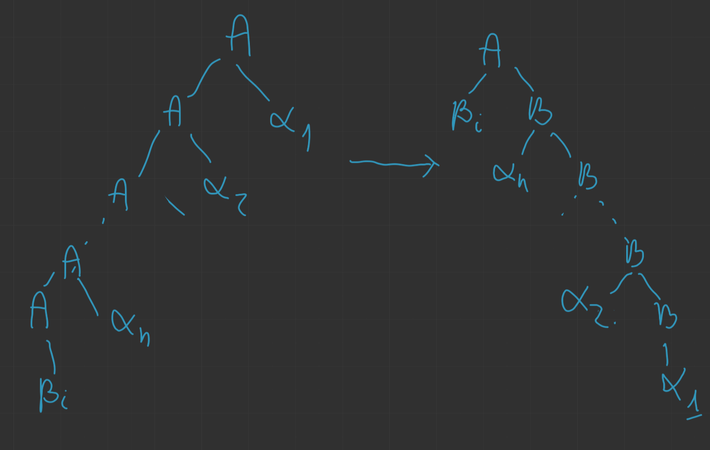

# Gramatyki bezkontekstowe

*(2020-10-29)*

- [1. DEF](#1-def)
- [2. Relacja wyprowadzenia $\underset{G}{\Rightarrow}$](#2-relacja-wyprowadzenia-undersetgrightarrow)
- [3. DEF: Język generowany przez $G$](#3-def-język-generowany-przez-g)
    - [3.1. Przykład](#31-przykład)
- [4. Drzewo wyprowadzania](#4-drzewo-wyprowadzania)
    - [4.1. Przykład](#41-przykład)
    - [4.2. Przykład](#42-przykład)
- [5. Twierdzenie o istnieniu drzewa wyprowadzenia dla gramatyki $G$](#5-twierdzenie-o-istnieniu-drzewa-wyprowadzenia-dla-gramatyki-g)
    - [5.1. D-d](#51-d-d)
    - [5.2. DEF: Lewo- i prawostronne wyprowadzanie](#52-def-lewo--i-prawostronne-wyprowadzanie)
        - [5.2.1. Przykład](#521-przykład)
    - [5.3. DEF: Gramatyka wieloznaczna](#53-def-gramatyka-wieloznaczna)
- [6. DEF: Symbole bezużyteczne](#6-def-symbole-bezużyteczne)
- [7. Lemat o usuwaniu symboli bezużytecznych#1](#7-lemat-o-usuwaniu-symboli-bezużytecznych1)
    - [7.1. D-d (szkic)](#71-d-d-szkic)
- [8. Lemat o usuwaniu symboli bezużytecznych#2](#8-lemat-o-usuwaniu-symboli-bezużytecznych2)
    - [8.1. D-d (szkic)](#81-d-d-szkic)
- [9. Twierdzenie#2](#9-twierdzenie2)
- [10. Twierdzenie#3](#10-twierdzenie3)
    - [10.1. D-d](#101-d-d)
- [11. Twierdzenie#4](#11-twierdzenie4)
    - [11.1. D-d](#111-d-d)
- [12. Postać normalna Chomsky’ego](#12-postać-normalna-chomskyego)
    - [12.1. D-d](#121-d-d)
    - [12.2. Przykład](#122-przykład)
- [13. Postać normalna Greibach](#13-postać-normalna-greibach)
    - [13.1. Lemat#1](#131-lemat1)
        - [13.1.1. D-d](#1311-d-d)
    - [13.2. Lemat#2](#132-lemat2)
        - [13.2.1. D-d](#1321-d-d)
    - [13.3. Twierdzenie#5](#133-twierdzenie5)
        - [13.3.1. D-d](#1331-d-d)
    - [13.4. Przykład](#134-przykład)

---

## 1. DEF

Gramatyka bezkontekstowe $G$ to czwórka $G = (N, T, P, S)$ gdzie
- $N$ — skończony zbiór zmiennych (**nieterminale**)
- $T$ — skończony zbiór symboli końcowych (**terminale**, alfabet)
- $P$ — skończony zbiór produkcji postaci $A \to \alpha$ , gdzie $A \in N$ oraz $\alpha \in (N \cup T)^*$
- $S \in N$ — symbol początkowy

## 2. Relacja wyprowadzenia $\underset{G}{\Rightarrow}$

Jeśli $A \to \beta$ jest produkcją w $G$ oraz $\alpha, \gamma \in (N \cup T)^*$ wówczas $\alpha A \gamma \underset{G}{\Rightarrow} \alpha\beta\gamma$.\
($\alpha\beta\gamma$ jest bezpośrednio wyprowadzany z $\alpha A \gamma$ w gramatyce $G$).

Notacja:
- Będziemy pisać tylko $\Rightarrow$ gdy gramatyka jest oczywista.
- $\Rightarrow^*$ — zwrotne i przechodnie domknięcie $\Rightarrow$.

---

## 3. DEF: Język generowany przez $G$

$$
L(G) = \left\{ w: w \in T^* \land S \underset{G}{\Rightarrow}^* w \right\}.
$$

Język $L$ nazywamy bezkontekstowym jeśli jest identyczny z $L(G)$ dla pewnej gramatyki bezkontekstowej $G$.\
$G_1$ i $G_2$ są równoważne, jeżeli $L(G_1) = L(G_2)$.

### 3.1. Przykład

$$
G = \big(~ \{S\}, \{0,1\}, \left\{ S \to \varepsilon, S \to 1, S \to 0S0, S \to 1S1 \right\}, S ~\big)
$$
lub inaczej (krócej) zapisując
$$
S \to \epsilon|0|1|0S0|1S1.
$$

Wyprowadzenie słowa $0110$:
$$
S \Rightarrow 0S0 \Rightarrow 01S10 \Rightarrow 0110.
$$

---

## 4. Drzewo wyprowadzania

Drzewo o następujących własnościach
1. każdy wierzchołek ma etykietę z $N \cup T \cup \{\varepsilon\}$
2. korzeń ma etykietę $S$ (symbol początkowy)
3. wierzchołki wewnętrzne mają etykiety z $N$
4. jeżeli wierzchołek wewnętrzny ma etykietę $A$ a jego potomkowie od lewej mają kolejno etykiety $X_1, \dots, X_n$ to $A \to X_1 \dots X_n$ jest produkcją w $P$

Jeśli konkatenacja wszystkich liści czytanych od lewej do prawej daje $\alpha$ to drzewo nazywamy drzewem wyprowadzenia $\alpha$.

---

### 4.1. Przykład

*kontynuacja [przykładu wcześniejszego](#31-przykład)*\

---

### 4.2. Przykład

Mamy:
- gramatykę $E \to (E + E) | (E * E) | id$
- chcemy uzyskać $id + id * id$

Jak widać, możemy uzyskać dwa drzewa dla tego słowa w tej gramatyce.\
Oznacza to, że *gramatyka jest niejednoznaczna*.

---

## 5. Twierdzenie o istnieniu drzewa wyprowadzenia dla gramatyki $G$

Niech $G = (N,T,P,S)$ będzie gramatyką bezkontekstową. Wówczas $S \Rightarrow^* \alpha \iff$ istnieje drzewo wyprowadzenia $\alpha$ w gramatyce $G$.

### 5.1. D-d

«Indukcja względem liczby wierzchołków wewnętrznych w drzewie.»

---

### 5.2. DEF: Lewo- i prawostronne wyprowadzanie

Jeżeli w każdym kroku wyprowadzenia stosujemy produkcję do nieterminala leżącego najbardziej na lewo (prawo), to wyprowadzenie nazywamy lewostronnym (prawostronnym). Jeżeli $w \in L(G)$ to w ma co najmniej jedno drzewo wyprowadzenia. Każdemu drzewu wyprowadzenia odpowiada dokładnie jedno wyprowadzenie lewostronne (prawostronne).

#### 5.2.1. Przykład

*kontynuacja [przykładu wcześniejszego](#42-przykład)*

1. Lewostronne wyprowadzenie:\
    $E \Rightarrow \underline{E} + E \Rightarrow id + E \Rightarrow id + E * E \Rightarrow id + id * E \Rightarrow id + id * E$
2. Prawostronne wyprowadzenie:\
    $E \Rightarrow E + \underline{E} \Rightarrow E + E * E \Rightarrow E + E * id \Rightarrow E + id * id \Rightarrow id + id * id$

---

### 5.3. DEF: Gramatyka wieloznaczna

Jeśli $L(G)$ istnieje słowo mające dwa różne drzewa wyprowadzenia to $G$ nazywamy *wieloznaczną* (niejednoznaczną).

---

## 6. DEF: Symbole bezużyteczne

Symbol $X$ jest użyteczny, jeśli istnieje wyprowadzenie postaci $S \Rightarrow^* \alpha X \gamma w$ gdzie $w \in T^*$\
otherwise $X$ jest *bezużyteczny*.

Niech $L$ — niepusty język bezkontekstowy, wówczas $L$ można wygenerować za pomocą gramatyki $G$ o następujących własnościach:
1. każdy symbol pojawia się w wyprowadzeniu jakiegoś słowa z $L$
2. nie ma produkcji postaci $A \to B$ (produkcje jednostkowe), gdzie $A, B \in N$

Co więcej, jeśli $\varepsilon \notin L$ to w $G$ nie ma produkcji postaci $A \to \varepsilon$.

---

## 7. Lemat o usuwaniu symboli bezużytecznych#1

Dla dowolnej gramatyki bezkontekstowej $G = (N,T,P,S)$ z $L(G) \neq \emptyset$ można efektywnie znaleźć równoważną gramatykę bezkontekstową $G' = (N', T, P', S)$ taką, że dla dowolnego $A \in N'$ istnieje $w \in T^*$ takie, że $A \Rightarrow^* w$.

### 7.1. D-d (szkic)

1. $N_S \gets \emptyset$
2. $N_n \gets \left\{ A: (A \to w) \in P \land w \in T^* \right\}$
3. `while` $N_S \neq N_n$:
    1. $N_S \gets N_n$
    2. $N_n \gets N_S \cup \left\{ A: (A \to \alpha) \in P \land \alpha \in (T \cup N_S)^* \right\}$
4. $N' \gets N_n$
5. $P' \gets \left\{ (A \to \alpha) \in P: A \in N_n \land \alpha \in (T \cup N_S)^* \right\}$

---

## 8. Lemat o usuwaniu symboli bezużytecznych#2

Dla dowolnej gramatyki bezkontekstowej $G = (N,T,P,S)$ można efektywnie znaleźć równoważną gramatykę bezkontekstową $G' = (N', T', P', S)$ taką, że dla każdego $X \in (N' \cup T')$ istnieją $\alpha, \beta \in (N' \cup T')^*$ takie, że $S \Rightarrow^* \alpha X \beta$.

### 8.1. D-d (szkic)

1. $N' \gets \{S\}$
2. `while` można zmienić $N'$:
    1. Jeśli $A \in N'$ oraz $A \gets \alpha_1|\dots|\alpha_n$ to dodaje wszystkie nieterminale z $\alpha_1,\dots,\alpha_n$ do $N'$ a terminale do $T'$
3. Do $P'$ przenieś tylko te produkcje z $P$, które zawierają symbole z $N' \cup T' \cup \{\varepsilon\}$.

---

## 9. Twierdzenie#2
Każdy niepusty język bezkontekstowy jest generowany przez gramatykę bezkontekstową niezawierającą symboli bezużytecznych.

---

## 10. Twierdzenie#3
Jeżeli $L = L(G)$ dla gramatyki bezkontekstowej $G = (N,T,P,S)$ to dla $L \setminus \{\varepsilon\}$ istnieje gramatyka bezkontekstowa $G'$ niezawierająca $\varepsilon$-produkcji i symboli bezużytecznych.

---

### 10.1. D-d

Symbole bezużyteczne usunęliśmy dzięki [poprzedniemu twierdzeniu](#9-twierdzenie2).

Dla każdego nieterminala $A$ sprawdzamy czy $A \Rightarrow^* \varepsilon$. Jeśli tak to każdą produkcję $B \to \alpha A \beta$ zastępujemy produkcjami $B \to \alpha A \beta$ oraz $B \to \alpha \beta$ (ale nie dołączamy $B \to \varepsilon$).\
Następnie usuwamy wszystkie $\varepsilon$-produkcje

---

## 11. Twierdzenie#4
Każdy język bezkontekstowy niezawierający $\varepsilon$ jest definiowany za pomocą gramatyki niezawierającej symboli bezużytecznych, $\varepsilon$-produkcji oraz produkcji jednostkowych.

### 11.1. D-d

Jeżeli dla nieterminala $A$ mamy $A \Rightarrow^* B$ oraz $A \neq B$,\
to dla każdej niejednostkowej produkcji $B \to \alpha$ dodajemy produkcję $A \to \alpha$.

Następnie usuwamy produkcje jednostkowe.

---

## 12. Postać normalna Chomsky’ego

Dowolny język bezkontekstowy niezawierający $\varepsilon$ jest generowany przez gramatykę, której wszystkie produkcje są postaci $A \to BC$ lub $A \to a$, gdzie $A,B,C \in N$ oraz $a \in T$.

### 12.1. D-d

Niech $G$ będzie gramatyką bez symboli bezużytecznych, $\varepsilon$-produkcji i produkcji jednostkowych. Wówczas jeśli prawa strona produkcji jest długości $1$ to jest postaci $A \to a$.

Dla pozostałych produkcji wykonujemy następujące operacje:
1. Jeśli po prawej stronie występuje terminal $a$ to dodajemy do $N$ nowy nieterminal $C_a$ a do produkcji $C_a \to a$ i zastępujemy $a przez C_a$.
2. Teraz jeśli prawa strona produkcji jest dłuższa niż $1$ to zawiera tylko nieterminale. Jeśli jest postaci $A \to B_1\dots B_n$ dla $n > 2$, to tworzymy nowe nieterminale $D_1,\dots,D_{n-2}$ i zastępujemy tę produkcję przez $A \to B_1 D_1, D_1 \to B_2 D_2, \dots, D_{n-3} \to B_{n-2}D_{n-2}, D_{n-2} \to B_{n-1}B_n$.

---

### 12.2. Przykład

Mamy:
- $S \to bA|aB$
- $A \to bAA|aS|a$
- $B \to aBB|bS|b$

Wówczas, postać normalna Chomsky’ego:
- $S \to C_b A | C_a B$
- $A \to C_b D_A | C_a S | a$
- $B \to C_a D_B | C_b S | b$
- $C_a \to a$
- $C_b \to b$
- $D_A \to AA$
- $D_B \to BB$

---

## 13. Postać normalna Greibach

Produkcje są postaci $A \to a\alpha$, gdzie $A \in N,\enspace a \in T,\enspace, \alpha \in N^*$.

Określmy jako $A$-produkcje wszystkie produkcje z nieterminalem $A$ po lewej stronie.

### 13.1. Lemat#1
Niech $G = (N,T,P,S)$ będzie gramatyką bezkontekstową.\
Niech $A \to \alpha_1 B \alpha_2$ będzie produkcją w $P$ i niech $B \to \beta_1|\dots|\beta_r$ będzie zbiorem wszystkich $B$-produkcji.\
Niech $G' = (N,T,P',S)$ będzie gramatyką otrzymaną z $G$ przez usunięcie produkcji $A \to \alpha_1 B \alpha_2$ i dodanie produkcji $A \to \alpha_1 \beta_1 \alpha_2 | \dots | \alpha_1 \beta_r \alpha_2$. Wówczas $L(G) = L(G')$.

#### 13.1.1. D-d
*Dowód po strukturze drzewa wyprowadzenia.*

---

### 13.2. Lemat#2
Niech $G = (N,T,P,S)$ będzie gramatyką bezkontekstową.

Niech $A \to A \alpha_1 | \dots | A \alpha_r$ będzie zbiorem tych $A$-produkcji, których prawe strony zaczynają się od $A$. Niech $A \to \beta_1 | \dots | \beta_S$ będzie zbiorem pozostałych $A$-produkcji. Niech $G' = (N \cup \{B\}, T, P', S)$ będzie gramatyką utworzoną poprzez dodanie nowego nieterminala $B$ i zastąpienie wszystkich $A$-produkcji przez następujące produkcje
$$
\begin{aligned}
    A \to \beta_i|\beta_i B &\quad& 1 \le i \le s\\
    B \to \alpha_j | \alpha_j B &\quad& 1 \le j \le r\\
\end{aligned}
$$
Wówczas $L(G) = L(G')$.

#### 13.2.1. D-d

W wyprowadzeniu lewostronnym ciąg produkcji postaci $A \to A \alpha_i$ musi kiedyś skończyć się produkcją $A \to \beta_j$:
$$
A \Rightarrow A \alpha_{i_1} \Rightarrow A \alpha_{i_2} \alpha_{i_1} \Rightarrow \dots \Rightarrow A \alpha_{i_n} \dots \alpha_{i_1} \Rightarrow \beta_j \alpha_{i_n} \dots \alpha_{i_1}
$$
Można to zastąpić przez
$$
A \Rightarrow \beta_j B \Rightarrow \beta_j \alpha_{i_n} B \Rightarrow \dots \Rightarrow \beta_j\alpha_{i_n} \dots \alpha_{i_2}B \Rightarrow \Beta_j \alpha_{i_n} \dots \alpha_{i_1}
$$

Ponieważ transformacja ta jest obustronna to $L(G) = L(G')$.

---

### 13.3. Twierdzenie#5

Każdy język bezkontekstowy $L$ niezawierający $\varepsilon$ jest generowany przez pewną gramatykę, w której każda produkcja jest postaci $A \to a \alpha$, gdzie $a \in T,\enspace A \in N,\enspace \alpha \in N^*$.

#### 13.3.1. D-d

Niech $G + (N,T,P,S)$ będzie gramatyką w [postaci normalnej Chomsky’ego](#12-postać-normalna-chomskyego).\
Załóżmy, że $N = \{A_1, \dots, A_n\}$.\
Modyfikujemy produkcje tak, aby jeśli produkcja jest postaci $A_i \to A_j \alpha$ to $i < j$.

1. `for` $k \gets 1$ `to` $n$:
    1. `for` $j \gets 1$ `to` $(k-1)$:
        1. Za każdą produkcję postaci $A_k \to A_j \alpha$ wstaw produkcje $A_k \to \beta \alpha$ dla wszystkich produkcji $A_j \to \beta$ ([Lemat#1](#131-lemat1)).
        2. Dla produkcji postaci $A_k \to A_k \alpha$ wykonaj [Lemat 2](#132-lemat2) używając nowy nieterminal $B_k$.

Po wykonaniu tego algorytmu mamy gramatykę równoważną o produkcjach w postaci:
1. $A_i \to A_j \gamma$, gdzie zawsze $i < j$
2. $A_i \to a \gamma$, gdzie $a \in T$
3. $B_i \to \gamma$, dzie $\gamma \in (N \cup \{B_1, \dots, B_{i-1}\})^*$.

Zauważmy, że $A_n$-produkcje muszą zaczynać się terminalem.

Teraz rozważmy $A_{n-1}$–produkcje: ich lewe strony muszą zaczynać się terminalem lub nieterminalem $A_n$ więc możemy je z [Lematu#1](#131-lemat1) zastąpić prawymi stronami $A_n$-produkcji (wszystkie zaczynają się terminalem). I tak do $A_1$.

Łatwo zauważyć, że $B$-produkcje nigdy nie zaczynają się nieterminalem $B$, więc też z [Lemat#1](#131-lemat1) możemy je zastąpić prawymi stronami $A$-produkcji.

---

### 13.4. Przykład

Mamy:
- $A_1 \to A_2 A_3$
- $A_2 \to A_3 A_1 | b$
- $A_3 \to A_1 A_2 | a$

Nie pasuje $A_3 \to A_1 A_2$ więc z [Lemat#1](#131-lemat1) dostajemy $A_3 \to A_2 A_3 A_2$.

Dalej nie pasuje, więc ponownie z [Lemat#1](#131-lemat1) otrzymujemy $A_3 \to A_3 A_1 A_3 A_2 | b A_3 A_2$.

Teraz mamy $A_3 \to A_3 A_1 A_3 A_2 | b A_3 A_2 | a$, korzystamy z [Lemat#2](#132-lemat2) i otrzymujemy\
$A_3 \to a| aB_3 | b A_3 A_2 | b A_3 A_2 B_3$ oraz $B_3 \to A_1 A_3 A_2 | A_1 A_3 A_2 B_3$.

Teraz odpowiednio podstawiając zgodnie z [Lemat#1](#131-lemat1) otrzymujemy:
- $A_3 \to a | aB_3 | b A_3 A_2 | b A_3 A_2 B_3$
- $A_2 \to a A_1 | a B_3 A_1 | b A_3 A_2 A_1 | b A_3 A_2 B_3 A_1 | b$
- $A_1 \to a A_1 A_3 | a B_3 A_1 A_3 | b A_3 A_2 A_1 A_3 | b A_3 A_2 B_3 A_1 A_3 | b A_3$
- $B_3 \to a A_1 A_3 A_3 A_2 \\| a B_3 A_1 A_3 A_3 A_2 \\| b A_3 A_2 A_1 A_3 A_3 A_2 \\| b A_3 A_2 B_3 A_1 A_3 A_3 A_2 \\| bA_3 A_3 A_2 \\|a A_1 A_3 A_3 A_2 B_3 \\| a B_3 A_1 A_3 A_3 A_2 B_3 \\| b A_3 A_2 A_1 A_3 A_3 A_2 B_3 \\| b A_3 A_2 B_3 A_1 A_3 A_3 A_2 B_3 \\| b A_3 A_3 A_2 B_3$

---
