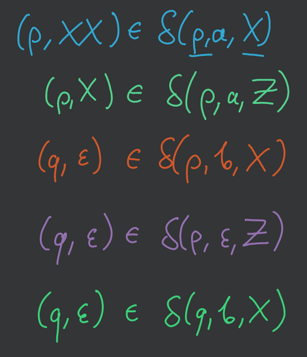

# Automat ze stosem (PDA)

*(2020-11-05)*

- [1. DEF: PDA](#1-def-pda)
    - [1.1. DEF: Opis chwilowy automatu](#11-def-opis-chwilowy-automatu)
    - [1.2. DEF: Relacja przejścia w jednym kroku $\vdash_M$](#12-def-relacja-przejścia-w-jednym-kroku-vdash_m)
    - [1.3. Sposoby akceptowania słów języka](#13-sposoby-akceptowania-słów-języka)
- [2. Przykład](#2-przykład)
- [3. Przykład](#3-przykład)
- [4. Deterministyczny PDA](#4-deterministyczny-pda)
- [5. Twierdzenie: język bezkontekstowy $\implies$ PDA](#5-twierdzenie-język-bezkontekstowy-implies-pda)
    - [5.1. D-d](#51-d-d)
    - [5.2. Przykład](#52-przykład)
- [6. Twierdzenie: PDA $\implies$ język bezkontekstowy](#6-twierdzenie-pda-implies-język-bezkontekstowy)
    - [6.1. D-d](#61-d-d)
    - [6.2. Przykład](#62-przykład)

---

## 1. DEF: PDA

Automat z dodatkową pamięcią w postaci stosu (widać tylko ostatnio włożony symbol).

Automatem ze stosem nazywamy $M = (Q,\Sigma, \Gamma, \delta, q_0, Z_0, F)$, gdzie
- $Q$ — skończony zbiór stanów
- $\Sigma$ — alfabet wejściowy
- $\Gamma$ — alfabet stosowy
- $q_0 \in Q$ — stan początkowy
- $Z_0 \in \Gamma$ — symbol początkowy na stosie
- $F \in Q$ — zbiór stanów akceptujących (jeśli $F = \emptyset$ to akceptujemy przez pusty stos)
- $\delta$ funkcja przejścia postaci: $\delta: Q\times\left( \Sigma \cup \{\epsilon\} \right) \times \Gamma \to 2^{Q \times \Gamma^*}$

### 1.1. DEF: Opis chwilowy automatu
— to trójka $(q, \alpha, \gamma)$, gdzie
- $q \in Q$ — stan automatu
- $\alpha \in \Sigma^*$ — nieprzeczytane jeszcze wejście
- $\gamma \in \Gamma^*$ — zawartość stosu (szczyt stosu z lewej strony)

### 1.2. DEF: Relacja przejścia w jednym kroku $\vdash_M$

$\vdash^*$ — zwrotne i przechodnie domknięcie $\vdash$,\
$\vdash^i$ — $i$-krotne złożenie $\vdash$.

- $(q, a\alpha, Z_\gamma) \vdash_M (p_i, \alpha, \gamma_i\gamma)$ jeśli istnieje przejście $\delta(q, a, Z) = \left\{ (p_1,\gamma_1), \dots, (p_m, \gamma_m) \right\}$ i wybraliśmy $i$-tą możliwość.
- $(q, \alpha, Z_\gamma) \vdash_M (p_i, \alpha, \gamma_i\gamma)$ jeśli istnieje przejście $\delta(q, \epsilon, Z) = \left\{ (p_1, \gamma_1), \dots, (p_m, \gamma_m) \right\}$ i wybraliśmy $i$-tą możliwość.

---

### 1.3. Sposoby akceptowania słów języka

1. Język Akceptowany przez PDA $M$ przy pustym stosie ($F = \emptyset$) to
$$
N(M) = \left\{ w \in \Sigma^*: \exists p\in Q \enspace (q_0, w, Z_0) \vdash^* (p, \epsilon, \epsilon) \right\}
$$

2. Język akceptowany przez PDA $M$ przez stan końcowy to
$$
L(M) = \left\{ w \in \Sigma^*: \exists p\in F \enspace \exists \gamma\in \Gamma^* \enspace (q, w, Z_0) \vdash^* (p, \epsilon, \gamma) \right\}
$$

**Oba sposoby akceptowania są równoważne.**

---

## 2. Przykład
*Palindrom z gramatyką $S \to 0S0|1S1|\#$*

1. Automat startuje z pustym stosem i w stanie $q_1$.
2. Jeżeli jesteśmy w stanie $q_1$ i na wejściu widzimy $a \in \{0,1\}$ to wstawiamy $a$ na stos, pozostajemy w stanie $q_1$ i idziemy do następnego symbolu wejściowego.
3. Jeżeli jesteśmy w stanie $q_1$ i na wejściu widzimy $\#$ to przechodzimy do stanu $q_2$ i idziemy do następnego symbolu wejściowego.
4. Jeżeli jesteśmy w stanie $q_2$ i na wejściu widzimy $a \in \{0,1\}$ i na stosie jest także $a$ to pozostajemy w stanie $q_2$, ściągamy $a$ ze stosu i idziemy do następnego symbolu wejściowego.
5. Jeżeli jesteśmy w stanie $q_2$, skończyliśmy czytać wejście i stos jest pusty, to akceptujemy słowo wejściowe.
6. W każdym innym przypadku odrzucamy słowo wejściowe.

---

## 3. Przykład

Mamy maszynę $M = \left( \{q_1,q_2\}, \{0,1\}, \{A,B,Z\}, \delta, q_1, Z, \emptyset \right)$

| $\delta$ |     | $(0, A)$          | $(0, B)$    | $(0, Z)$   | $(1, A)$    | $(1, B)$          | $(1, Z)$   |
| -------- | --- | ----------------- | ----------- | ---------- | ----------- | ----------------- | ---------- |
| $q_1$    |     | $(q_1, AA)$       | $(q_1, AB)$ | $(q_1, A)$ | $(q_1, BA)$ | $(q_1, BB)$       | $(q_1, B)$ |
| $q_2$    |     | $(q_2, \epsilon)$ | —           | —          | —           | $(q_2, \epsilon)$ | —          |

---
| $\delta$ |     | $(\epsilon, A)$ | $(\epsilon, B)$ | $(\epsilon, Z)$   |
| -------- | --- | --------------- | --------------- | ----------------- |
| $q_1$    |     | $(q_2, A)$      | $(q_2, B)$      | $(q_2, \epsilon)$ |
| $q_2$    |     | —               | —               | —                 |

Przykładowo dla $0110$:\
$(q_1, 0110, Z) \vdash (q_1, 110, A) \vdash (q_1, 10, BA) \vdash (q_2, 10, BA) \vdash (q_2, 0, A) \vdash (q_2, \epsilon, \epsilon)$

Za to $110$ nie należy do języka:
1. $(q_1, 110, Z) \vdash (q_1, 10, B) \vdash (q_1, 0, BB) \vdash (q_1, \epsilon, ABB) \vdash (q_2, \epsilon, ABB) \vdash ?$
2. $(q_1, 110, Z) \vdash (q_1, 10, B) \vdash (q_1, 0, BB) \vdash (q_2, 0, BB) \vdash ?$
3. $(q_1, 110, Z) \vdash (q_1, 10, B) \vdash (q_2, 10, B) \vdash (q_2, 0, \epsilon) \vdash ?$
4. $(q_1, 110, Z) \vdash (q_2, 100, \epsilon) \vdash ?$

---

Oczywiście mamy język $N(M) = \left\{ ww^R: w \in \{0,1\}^* \right\}$.

---

## 4. Deterministyczny PDA

PDA może być deterministyczny, jeśli w każdym przypadku możemy wykonać co najwyżej jedno przejście (czyli może też być zero przejść w przeciwieństwie do [zwykłego DFA](../2020-10-08/języki-formalne-wprowadzenie.md#2-deterministyczny-automat-skończony-dfa)):
1. $\forall q \in Q \enspace \forall Z \in \Gamma \enspace \delta(q, \epsilon, Z) \neq \emptyset \implies \forall a \in \Sigma \enspace \delta(q,a,Z) = \emptyset$
2. $\forall q \in Q \enspace \forall a \in \Sigma \cup \{\epsilon\} \enspace \forall Z \in \Gamma \enspace \left\lvert \delta(q, a, Z) \right\rvert \le 1$

**Niestety takie DPDA są słabsze od PDA.**\
**Np. język z [przykładu](#3-przykład) nie jest rozpoznawalny przez żaden DPDA.**

---

## 5. Twierdzenie: język bezkontekstowy $\implies$ PDA

*Jeśli $L$ jest językiem bezkontekstowym to istnieje PDA $M$ taki, że $L = N(M)$.*

### 5.1. D-d

Załóżmy, że $L$ nie zawiera $\epsilon$ i jest zdefiniowany przez gramatykę bezkontekstową w [postaci Greibach](../2020-10-29/gramatyki-bezkontekstowe.md#13-postać-normalna-greibach) $G = (N, T, P, S)$. Definiujemy PDA $M$ następująco:
- $M = \left( \{q\}, T, N, \delta, q, S, \emptyset \right)$
- $\delta(q, a, A) = \left\{ (q, \gamma): (A \to a\gamma) \in P \right\}$.

$M$ symuluje wprowadzenie lewostronne gramatyki $G$. Ponieważ $G$ jest typu Greibach każdy kolejny napis w wyprowadzeniu lewostronnym ma formę $x\alpha$, gdzie $x \in T^*$ oraz $\alpha \in N^*$. Maszyna $M$ przechowuje $\alpha$ na stosie po przeczytaniu przedrostka $x$.

Teraz d-d indukcyjny po długości wyprowadzenia (liczby kroków), że
$$
S \underset{G}{\Rightarrow}^* \iff (q, x, S) \underset{M}{\vDash}^* (q, \epsilon, \epsilon)
$$

---

### 5.2. Przykład

$G = \left( \{A,B\}, \{a,b\}, \{A \to aAB|aB, B \to b\}, A \right)$

A więc $M = \left( \{q\}, \{a,b\}, \{A,B\}, \delta, q, A, \emptyset \right)$

| $\delta$ |     | $(a,A)$           | $(a, B)$ | $(b, A)$ | $(b, B)$        | $(\epsilon, A)$ | $(\epsilon, B)$ |
| -------- | --- | ----------------- | -------- | -------- | --------------- | --------------- | --------------- |
| $q$      |     | $(q, AB), (q, B)$ | —        | —        | $(q, \epsilon)$ | —               | —               |

Czyli na przykład mamy:\
$A \Rightarrow aAB \Rightarrow aaBB \Rightarrow aabB \Rightarrow aabb$.

I właśnie teraz równoważnie:\
$(q, aabb, A) \vdash (q, abb, AB) \vdash (q, bb, BB), \vdash (q, b, B) \vdash (q, \epsilon, \epsilon)$.

---

## 6. Twierdzenie: PDA $\implies$ język bezkontekstowy

*Jeśli $L = N(M)$ dla PDA $M$ to $L$ jest językiem bezkontekstowym.*

### 6.1. D-d

Weźmy PDA $M = (Q, \Sigma, \Gamma, \delta, q_0, Z_0, \emptyset)$. Konstruujemy gramatykę bezkontekstową $G = (N, \Sigma, P, S)$, gdzie
- $N$ — zbiór obiektów postaci $[q, A, p]$ ($p, q \in Q, A \in \Gamma$) oraz nowy symbol $S$
- $P$ — zbiór produkcji postaci:
    - $S \to [q_0, Z_0, q]$ dla każdego $q \in Q$
    - $[q, A, q_{m+1}] \to a[q_1, B_1, q_2] [q_2, B_2, q_3] \dots [q_m, B_m, q_{m+1}]$ dla dowolnych $q, q_1, \dots, q_{m+1} \in Q$, dla każdego $a \in \Sigma \cup \{\epsilon\}$ i dowolnych $A, B_1, \dots, B_m \in \Gamma$ takich, że $(q_1, B_1, \dots, B_m) \in \delta(q, a, A)$
    - $[q, A, p] \to a$ jeśli $(p, \epsilon) \in \delta(q, a, A)$.

Wyprowadzenie lewostronne w $G$ symuluje ruchy $M$ na wejściu $x$.

$[q, A, p]$ wyprowadza $x \iff M$ będąc w stanie $q$ i mając na stosie $A \alpha$ po wczytaniu $x$ znajdzie się w stanie $p$, na stosie będzie $\alpha$ i $\alpha$ nie była zmieniana i czytana w tym czasie.

Teraz dowód indukcyjny po liczbie kroków, że
$$
[q, A, p] \underset{G}{\Rightarrow}^* x \iff (q, x, A) \underset{M}{\vdash}^* (p, \epsilon, \epsilon)
$$

---

### 6.2. Przykład

Mamy $M = \left( \{p,q\}, \{a,b\}, \{X,Z\}, \delta, p, Z, \emptyset \right)$

| $\delta$ |     | $(a, X)$  | $(a, Z)$ | $(b, X)$        | $(b, Z)$ | $(\epsilon, X)$ | $(\epsilon, Z)$ |
| -------- | --- | --------- | -------- | --------------- | -------- | --------------- | --------------- |
| $p$      |     | $(p, XX)$ | $(p, X)$ | $(q, \epsilon)$ | —        | —               | $(q, \epsilon)$ |
| $q$      |     | —         | —        | $(q, \epsilon)$ | —        | —               | —               |

Możemy powyższą tabelkę zapisać w następujący sposób:\

Tworzymy produkcje:\

i od razu je „przetwarzamy” na podstawie funkcji przejścia $\delta$ i patrząc na [dowód twierdzenia](#61-d-d).\
Następnie usuwamy niepotrzebne elementy, które albo się zapętlają, albo prowadzą do nikąd.

---
