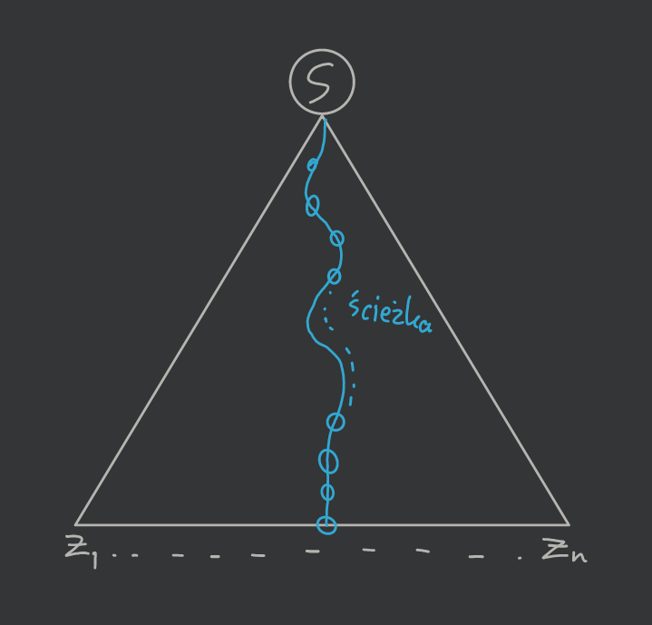
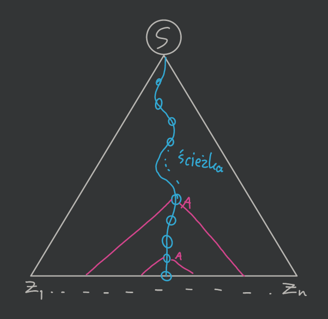
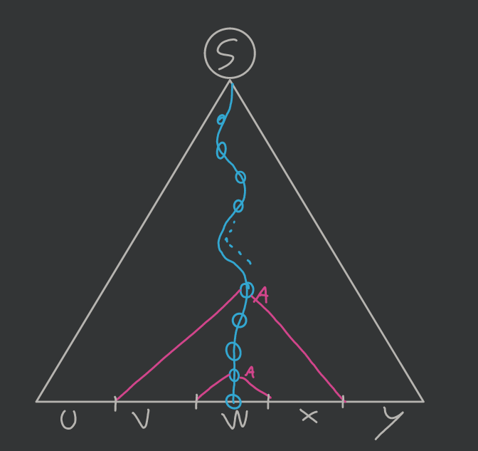
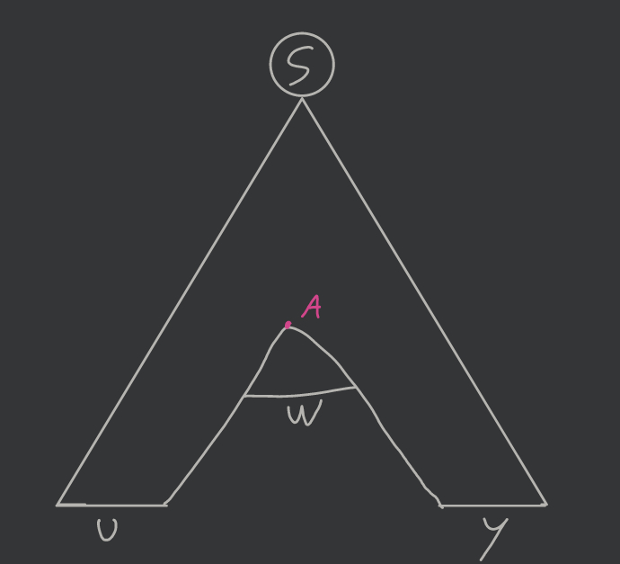
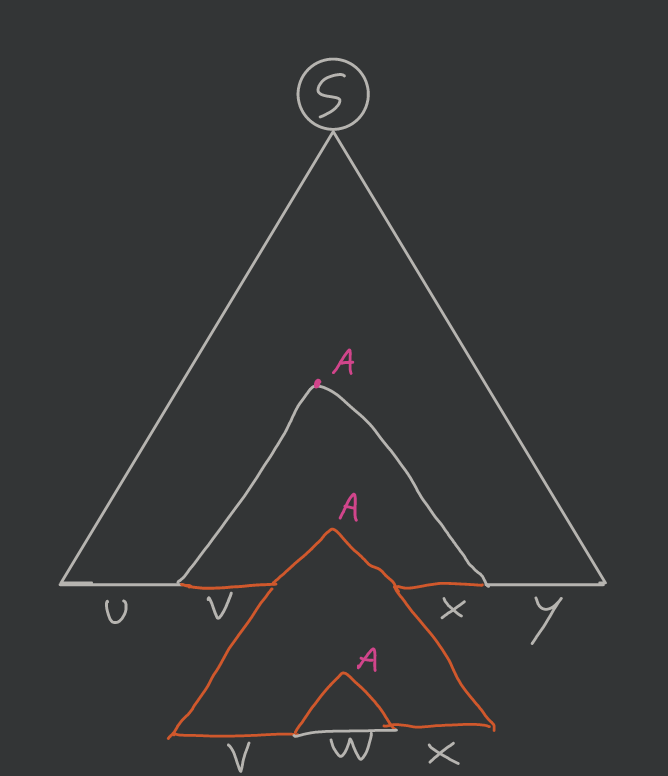
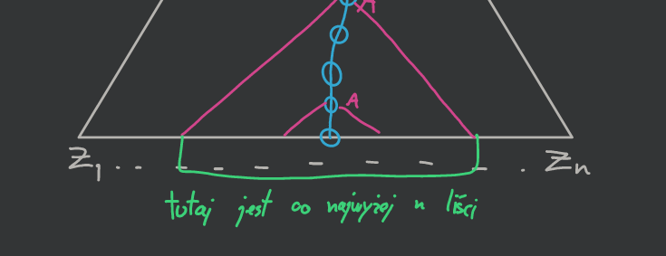
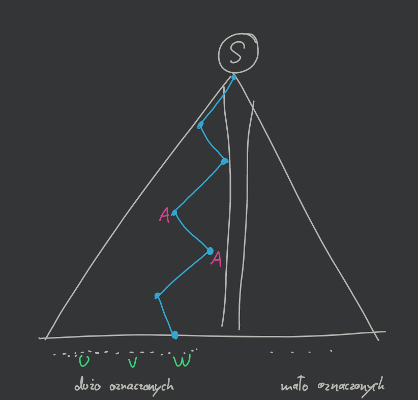
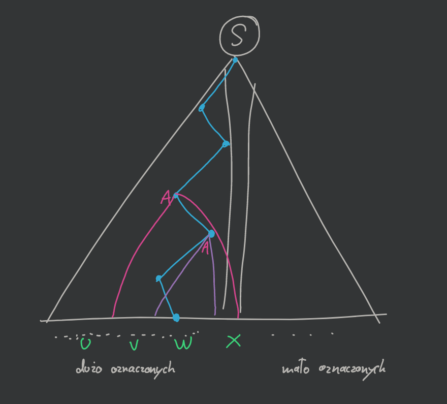
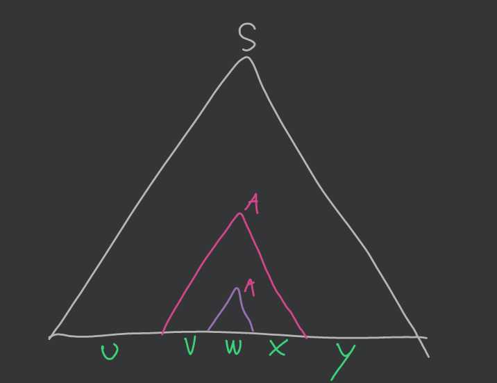

# Własności języków bezkontekstowych

*(2020-11-12)*

- [1. Lemat o pompowaniu dla języków bezkontekstowych](#1-lemat-o-pompowaniu-dla-języków-bezkontekstowych)
    - [1.1. D-d](#11-d-d)
    - [1.2. Przykład](#12-przykład)
    - [1.3. Przykład](#13-przykład)
- [2. Lemat Ogdena — silniejsza wersja lematu o pompowaniu](#2-lemat-ogdena--silniejsza-wersja-lematu-o-pompowaniu)
    - [2.1. D-d](#21-d-d)
    - [2.2. Przykład](#22-przykład)
- [3. Twierdzenie o zamkniętności operacji na j. bezkontekstowych](#3-twierdzenie-o-zamkniętności-operacji-na-j-bezkontekstowych)
    - [3.1. D-d](#31-d-d)
- [Twierdzenie o nie-zamkniętności operacji przecięcia na j. bezkontekstowych](#twierdzenie-o-nie-zamkniętności-operacji-przecięcia-na-j-bezkontekstowych)
    - [D-d](#d-d)

---

## 1. Lemat o pompowaniu dla języków bezkontekstowych

Niech $L$ będzie dowolnym językiem bezkontekstowym. Wówczas istnieje stała pompowania $n$, zależna tylko od $L$, taka, że jeśli słowo $z$ należy do języka $L$ oraz $|z| \ge n$, to $z = uvwxy$, oraz
- $|vx| \ge 1$
- $|vwx| \le n$
- dla każdego $i \ge 0$ mamy $uv^iwx^iy \in L$

(ten lemat rozszerza [ten poprzedni lemat o pompowaniu](../2020-10-22/własności-języków-regularnych.md#1-lemat-o-pompowaniu) dodając jeszcze pole $x$)

### 1.1. D-d

Mamy gramatykę $G(L)$ w [postaci normalnej Chomsky’ego](../2020-10-29/gramatyki-bezkontekstowe.md#12-postać-normalna-chomskyego) (czyli mamy produkcje typu $A \to BC$ lub $A \to a$; drzewo wyprowadzenia jest binarne patrząc na węzły wewnętrzne).

Niech ta nasza gramatyka $G = (N,T,P,S)$ gdzie $|N| = k$.

Ustalmy $n = 2^k$ (stałą pompowania).\
Bierzemy $z \in L$, $z = z_1,\dots,z_n$ (składa się z $n$ symboli).

Drzewo wyprowadzenia:\

Bierzemy najdłuższą ścieżkę, która jest długości co najmniej długości $\lg n = k$. Ścieżka zawiera co najmniej $k+1$ węzłów wewnętrznych, ale mamy tylko $k$ nieterminali — czyli (*pigeonhole principle*) musimy mieć gdzieś powtórkę (oznaczmy przez $A$). Patrząc od dołu zaznaczamy poddrzewa, których korzeniami są te dwie instancje $A$:\

Stosujemy podział słowa $z = uvwxy$:\

I możemy je teraz „pompować”:
1. $uv^0wx^0y$\
    
2. $yv^2wx^2y$\
    

Dlatego [lemat](#1-lemat-o-pompowaniu-dla-języków-bezkontekstowych) jest spełniony.

Chociaż jeszcze należy pokazać, że:\

Wynika to z tego, że szukaliśmy pierwszych powtarzających się symboli od dołu, stąd poddrzewo (czerwone, większe) nie może być wyższe niż $k$. Co daje nam liczbę liści $\le 2^k$.

---

### 1.2. Przykład

Mamy język $L = \left\{ a^i b^i c^i: i \ge 1 \right\}$.

Używamy [lematu](#1-lemat-o-pompowaniu-dla-języków-bezkontekstowych) w celu udowodnienia, że język $L$ nie jest bezkontekstowy.

Weźmy $n$ (stałą pompowania) i słowo $z = a^n b^n c^n$.
1. Zgodnie z lematem możemy pompować w obrębie jednego bloku znaków ($a$ lub $b$ lub $c$) ale wtedy zmienia się liczba tych znaków, a nie zmienia się liczba pozostałych, czyli wychodzimy z języka.
2. Możemy pompować też znaki z dwóch sąsiednich bloków ($a$ i $b$ lub $b$ i $c$) utrzymując ich równoliczność, ale wtedy zostaje problem z trzecim blokiem i także wypadamy z języka.
3. Innych możliwości nie ma więc $L$ nie jest bezkontekstowy.

---

### 1.3. Przykład

Mamy język $L = \left\{ a^i b^j c^k: i \neq j \land j \neq k \right\}$.

Bierzemy słowo $a^n b^{n+1} c^{n+2}$. Ale pompując w sposób $a^n b^{n-1} (b^2)^i (c^2)^i c^n$ dostajemy słowa należące do języka.

**Musimy wzmocnić ten lemat.**

---

## 2. Lemat Ogdena — silniejsza wersja lematu o pompowaniu

Niech $L$ będzie językiem bezkontekstowym. Wówczas istnieje stała pompowania $n$ taka, że jeśli w słowie $z \in L$ oznaczymy co najmniej $n$ liter to możemy słowo $z$ zapisać jako $uvwxy$ i
- $v$ oraz $x$ mają łącznie co najmniej jedną oznaczoną literę
- $vwx$ ma co najwyżej $n$ oznaczonych liter
- dla każdego $i \ge 0$ mamy $u v^i w x^i y \in L$.

### 2.1. D-d

Weźmy $m > n$, gdzie $n = 2^{|N|}$ i nasze słowo $z = z_1 z_2 \dots z_n \dots z_m$. Oznaczamy co najmniej $n$ liter.

Znowu, [tak jak wcześniej](#11-d-d), budujemy drzewo wyprowadzenia i najdłuższą ścieżkę czyli od korzenia do liścia, tylko tym razem w następujący sposób:\
*jeśli jestem w danym wierzchołku to idę do poddrzewa, które ma „więcej” symboli oznaczonych w liściach.*

Wyznaczona ścieżka ma co najmniej długość $\lg n = k$. Co więcej jeśli zignorujemy wierzchołki, w których tylko jedno poddrzewo miało wierzchołki oznaczone to dalej mamy długość $k$.

Znowu, tak samo jak w [poprzednim dowodzie](#11-d-d) mamy powtórki gdzieś wierzchołka $A$.

Więc analogicznie bierzemy poddrzewa:\

Analiza podobna jak w poprzednim dowodzie, ale liczymy tylko symbole oznaczone.

W obu połówkach były symbole oznaczone, to $v$ i $x$ muszą mieć jakiś symbol oznaczony.

3. Analogicznie, skoro liczyliśmy od dołu to wysokość (różowego) poddrzewa jest nie większa niż $k$ wierzchołków dzielących symbole oznaczone, stąd $vwx$ nie ma więcej niż $2^k = n$ symboli.

---

### 2.2. Przykład

[*Kontynuacja przykładu*](#13-przykład)

Mamy język $L = \left\{ a^i b^j c^k: i \neq j \land j \neq k \right\}$.

Mamy $m > n$, gdzie $n$ to stała pompowania.

Bierzemy słowo $z = a^{m + m!} b^m c^{m + m!}$ — powinniśmy pompować najrzadziej występujący symbol.

*Oznaczamy wszystkie litery $b$.*

Zgodnie z lematem możemy:
1. Pompować tylko litery $b$; jeśli pompujemy $k$ liter to dla $i = \frac{m!}{k} + 1$ czyli mamy równość $b$ i $a$.
2. Pompować tylko $a$ i $b$ ($b$ i $c$) — znowu wypadamy z języka bo $b$ zrównają się z $c$ ($b$ z $a$).
3. *Czy możemy równocześnie pompować $a$, $b$ i $c$?* — nie, bo to by nam już nie zapewniło wypadnięcia z języka.

---

## 3. Twierdzenie o zamkniętności operacji na j. bezkontekstowych

Języki bezkontekstowe są zamknięte na sumę, złożenie i domknięcie Kleene’ego.

### 3.1. D-d

Niech
- $G_1 = (N_1, T_1, S_1, P_1)$
- $G_2 = (N_2, T_2, S_2, P_2)$

przy czym $N_1 \cap N_2 = \emptyset$ i $S \notin N_1 \cup N_2$.

1. $G_3 = \left(\{S\} \cup N_1 \cup N_2, T_1 \cup T_2, S, P_1 \cup P_2 \cup \{S \to S_1|S_2\} \right)$ i $L(G_3) = L(G_1) \cup L(G_2)$
2. $G_4 = \left( \{S\} \cup N_1 \cup N_2, T_1 \cup T_2, S, P_1 \cup P_2 \cup \{S \to S_1S_2\} \right)$ i $L(G_4) = L(G_1)L(G_2)$
3. $G_5 = \left( \{S\} \cup N_1, T_1, S, P_1 \cup \{S \to S_1 S | \epsilon\} \right)$ i $L(G_5) = L(G_1)^*$

---

## Twierdzenie o nie-zamkniętności operacji przecięcia na j. bezkontekstowych

*Języki bezkontekstowe nie są zamknięte na przecięcie.*

### D-d

Niech
- $A = \left\{ a^i b^i c^i \right\}$
- $B = \left\{ a^i b^i c^j \right\}$ jest j. bezkontekstowym
    bo $S \to AB, \enspace A \to \epsilon|aAb \enspace B \to \epsilon|cB$
- $C = \left\{ a^j b^i c^i \right\}$ (podobnie jak $B$)

Wówczas zauważmy, że\
$A = B \cap C$ nie jest bezkontekstowy ([przykład](#12-przykład)).

---
