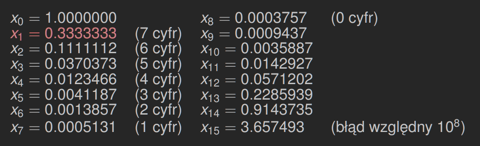

# Numeryczna niestabilność

*(2020-10-13)*

---

## 1. Nieformalna definicja

Proces numeryczny jest *niestabilny* jeśli niewielkie błędy, popełnione w początkowym stadium procesu kumulują się w kolejnych stadiach, powodując poważną utratę dokładności obliczeń.

---

## 2. Przykład (ciąg, rekurencja)

Rozważmy ciąg liczb rzeczywistych zdefiniowany za pomocą rekurencyjnego związku:
$$
\begin{cases}
    x_0 = 1 \quad x_1 = \frac{1}{3}\\
    x_{n+1} = \frac{13}{3}x_n - \frac{4}{3}x_{n-1} & (n \ge 1)
\end{cases}
$$

Powyższy związek generuje ciąg $x_n = \left(\frac{1}{3}\right)^n$.

Dla $n = 0$ oraz $n = 1$ oczywiste.

Załóżmy, że równoważność jest spełniona dla $n \le m$. równoważność dla $n = m+1$ wynika
$$
\frac{13}{3}x_m - \frac{4}{3}x_{m-1} = \frac{13}{3}\left(\frac{1}{3}\right)^m - \frac{4}{3}\left(\frac{1}{3}\right)^{m-1} = \left(\frac{1}{3}\right)^{m-1} \left(\frac{13}{9} - \frac{4}{3}\right) = \left(\frac{1}{3}\right)^{m+1}
$$

Poniżej mamy 15 kolejnych iteracji algorytmu (w arytmetyce `single`)

Niedokładność $x_n$ przenosi się na $x_{n+1}$ z mnożnikiem $\frac{13}{3}$. Zatem niedokładność $x_1$, rzędu $10^{-8}$, przenosi się na $x_{15}$ z wielkim mnożnikiem $\left(\frac{13}{3}\right)^{14} \approx 10^9$.
