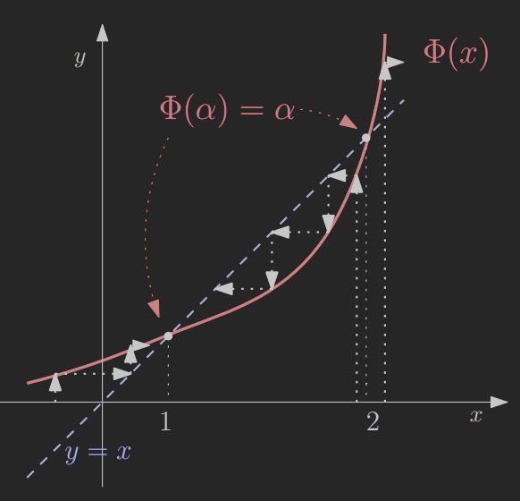

---

- [1. DEF](#1-def)
- [2. Przykład](#2-przykład)
- [3. Punkty stały](#3-punkty-stały)
- [4. Zbieżność, rozbieżność — przypadek ekstremalny](#4-zbieżność-rozbieżność--przypadek-ekstremalny)
- [5. DEF: Odwzorowanie zwężające](#5-def-odwzorowanie-zwężające)
    - [5.1. Twierdzenie o kontrakcji](#51-twierdzenie-o-kontrakcji)
    - [5.2. Przykład](#52-przykład)
- [6. Zbieżność](#6-zbieżność)
    - [6.1. Twierdzenie#1](#61-twierdzenie1)
        - [6.1.1. D-d](#611-d-d)
    - [6.2. Przykład](#62-przykład)
    - [6.3. Przykład](#63-przykład)
    - [6.4. Przykład](#64-przykład)
    - [6.5. Twierdzenie#2](#65-twierdzenie2)
        - [6.5.1. D-d (szkic)](#651-d-d-szkic)

---

## 1. DEF

Będziemy rozpatrywać metody iteracyjne postaci:
$$
x_{n+1} := \Phi(x_n) \quad (n\ge0)
$$
gdzie $\Phi$ jest funkcją $\mathbb{R} \to \mathbb{R}$, a $x_0$ jest początkowym rozwiązaniem.

---

## 2. Przykład

W [metodzie Newtona](../2020-10-20/metoda-newtona.md), dla zadania $f(x) = 0$, $\Phi$ ma następującą postać:
$$
\Phi(x) = x - \frac{f(x)}{f'(x)}
$$

---

## 3. Punkty stały

Oczywiście $x_{n+1} := \Phi(x_n)$ może generować ciągi rozbieżne.
Załóżmy, że $\lim_{n\to\infty} x_n$ istnieje i jest skończona, mianowicie
$$
\lim_{n\to\infty} x_n = \alpha
$$

Jeśli $\Phi$ jest ciągła, to:
$$
\Phi(\alpha) = \Phi\left(\lim_{n\to\infty} x_n\right) = \lim_{n\to\infty} \Phi(x_n) = \lim_{n\to\infty} x_{n+1} = \alpha
$$

Zatem
$$
\Phi(\alpha) = \alpha
$$

**Punkt $\bold\alpha$ nazywamy punktem stałym funkcji $\Phi$.**

---

## 4. Zbieżność, rozbieżność — przypadek ekstremalny

Niech $f(x) = \sqrt[3]{x}$. Zastosujemy [metodę Newtona](../2020-10-20/metoda-newtona.md) dla $f(x) = 0$, $f(0) = 0$.\
Zatem
$$
\Phi(x) = x - \frac{\sqrt[3]{x}}{\frac{1}{3} x^{-\frac{2}{3}}} = -2x
$$

Punktem stałym (jedynym) metody $\Phi$ jest $\alpha = 0$. Metoda $\Phi$ jest zbieżna do $\alpha$ dla $x_0 = 0$. Dla $x_0 \neq 0$ jest rozbieżna:\

---

## 5. DEF: Odwzorowanie zwężające

*Kiedy $\Phi$ jest zbieżna?*

Niech $\Phi: D \to D$ odwzorowuje pewien zbiór domknięty $D \subset \mathbb{R}$ w siebie. Funkcja $\Phi$ jest *odwzorowaniem zwężającym*, jeśli istnieje liczba $\lambda \in [0; 1)$ taka, że $| \Phi(x) - \Phi(y)| \le \lambda|x-y|$ dla dowolnych $x,y\in D$.

---

### 5.1. Twierdzenie o kontrakcji

Niech $D \subset \mathbb{R}$ będzie podzbiorem domkniętym. Jeśli $\Phi: D \to D$ jest odwzorowaniem zwężającym zbioru $D$ w siebie, to $\Phi$ ma [*jedyny punkt stały $\alpha$*](#3-punkty-stały). Ponadto $\alpha$ jest granicą każdego ciągu otrzymanego za pomocą $x_{n+1} := \Phi(x_n)$ z punktu początkowego $x_0 \in D$.

---

### 5.2. Przykład

Rozważmy $x_{n+1} := 3 - \frac{1}{2}|x_n|$, $\Phi(x) = 3 - \frac{1}{2}|x|$.

$$
\left|\Phi(x) - \Phi(y)\right| = \left\lvert 3 - \frac{1}{2}|x| - 3 + \frac{1}{2}|y| \right\rvert = \frac{1}{2}\left\lvert |x| - |y| \right\rvert \le \frac{1}{2} \left\lvert x-y \right\rvert
$$

Stąd $\lambda = \frac{1}{2}$, $D$ jest dowolnie szeroki oraz $\Phi$ jest odwzorowaniem zwężającym. $\Phi(\alpha) = \alpha \implies \alpha 2$ ([punkty stały](#3-punkty-stały)).

---

## 6. Zbieżność

### 6.1. Twierdzenie#1

Przypuśćmy, że równanie $x = \Phi(x)$ ma pierwiastek $\alpha$, tj. $\alpha = \Phi(\alpha)$, $\alpha$ jest punktem stałym. Niech w przedziale $I = \{x: |x - \alpha| \le \Gamma\}$ istnieje pochodna $\Phi'(x)$ taka, że $|\Phi'(x)| \le \rho < 1$.\
Wówczas dla każdego $x_0 \in I$:
1. $x_n \in I, \enspace n \ge 1$
2. $\lim_{n\to\infty} x_n = \alpha_n$
3. $\alpha$ jest jedynym punktem stałym odwzorowania $\Phi$ w $I$.

#### 6.1.1. D-d

Z twierdzenia o wartości średniej i [o kontrakcji](#51-twierdzenie-o-kontrakcji)
$$
\left\lvert \Phi(x) - \Phi(y) \right\rvert = \left\lvert \Phi'(\xi_x) \right\rvert \left\lvert x-y \right\rvert \le \rho |x-y|
$$
dla dowolnych $x,y \in I$, gdzie $\rho = \lambda < 1$.

---

### 6.2. Przykład

Rozważmy równanie $2x = 2^x$ (pierwiastki $r_1 = 1, \enspace r_2 = 2$). Zastosujemy do wyznaczania pierwiastków $x_{n+1} := 2^{x_n -1}$ ($x = \frac{2^x}{2} = 2^{x-1}$).\
$\Phi(\alpha) = \alpha \implies a_1 = 1,\enspace \alpha_2 = 2$ (punkty stałe).

$$
\alpha =
\begin{cases}
    1 & x_0 \in (-\infty; 1]\\
    1 & x_0 \in (1;2)\\
    2 & x_0 = 2\\
    +\infty & x_0 \in (2; +\infty)
\end{cases}
$$

---

### 6.3. Przykład

Rozważmy [metodę Newtona](../2020-10-20/metoda-newtona.md) dla $f(x) = 0$, gdzie $f(x) = x^p, \enspace p>1 \enspace (r=0 \text{ jest pierwiastkiem wielokrotnym})$.\
Zatem
$$
\Phi(x) = x - \frac{f(x)}{f'(x)} = x - \frac{x^p}{px^{p-1}} = \frac{p-1}{p} x
$$

Oczywiście $\left\lvert \Phi'(x) \right\rvert = \frac{p-1}{p} \le \rho < 1$ dla dowolnego $x \in \mathbb{R}$. Stąd $\alpha = 0$ jest jedynym stałym $\Phi$. Ponadto $\lim_{n \to \infty} x_n = \alpha$, punkt początkowy $x_0$ jest dowolny.

Jaki jest wykładnik zbieżności metody $x_{n+1} = \frac{p-1}{p} x_n$?
$$
\left\lvert x_{n+1} - \alpha \right\rvert = \frac{p-1}{p} |x_n| = \frac{p-1}{p} \left\lvert x_n - \alpha \right\rvert = C|x_n - \alpha|^\gamma
$$
gdzie $C = \frac{p-1}{p} \in (0;1)$ i wykładnik zbieżności $\gamma = 1$. Stąd metoda jest zbieżna liniowo.

Należy zauważyć, że metoda Newtona jest zbieżna kwadratowo ($\gamma = 2$) jeśli $f'(r) \neq 0$.

---

### 6.4. Przykład

Rozważmy równanie $x + \ln x = 0$. Zastosujemy tutaj metodę $x_{n+1} := e^{-x_n}$, $\Phi(x) = e^{-x}$, do wyznaczania jego pierwiastków $r$.

Sprawdźmy, czy rzeczywiście można zastosować tę metodę, tj. czy jednym z punktów stałych jest $r$.
$$
\Phi(\alpha), e^{-\alpha} = \alpha, \quad -\alpha = \ln \alpha, \enspace \alpha + \ln \alpha = 0
$$

Zatem punkty stale $\Phi$ pokrywają się z pierwiastkami równania. Sprawdźmy warunek dostateczny zbieżności:
$$
\left\lvert \Phi'(x) \right\rvert = \left\lvert -e^{-x} \right\rvert < 1
$$
dla $x > 0$.

Zatem dla każdego $x_0 > 0$ metoda zbiega do jedynego punktu stałego $\alpha$ (pierwiastka $r$).

---

### 6.5. Twierdzenie#2

Niech $p$-ta pochodna $\Phi^{(p)} (x)$ funkcji iteracyjnej $\Phi(x)$ będzie ciągłą w pewnym otoczeniu $\alpha$. Metoda $x_{n+1} := \Phi(x_n)$ jest zbieżna do $\alpha$ i jest rzędu $p$ wtedy i tylko wtedy, gdy
$$
\Phi(\alpha) = \alpha, \quad \Phi^{(j)}(\alpha) = 0 \enspace j = 1,\dots,(p-1), \quad \Phi^{(p)}(\alpha) \neq 0
$$

Ponadto stała zbieżności $C = \frac{\Phi^{(p)}(\alpha)}{p!}$ (dla $p=1, \enspace \Phi^{(p)} (\alpha) \neq 0$, $C$ musi być takie, że $C \in [0;1)$).

---

#### 6.5.1. D-d (szkic)

Rozwińmy funkcję $\Phi(x_{n+1} := \Phi(x_n))$ w szereg Taylora wokół punktu $\alpha$:
$$
\Phi(x) = \Phi(\alpha) + \Phi^{(1)}(\alpha)(x - \alpha) + \dots +\\
+ \frac{\Phi^{(p-1)}(\alpha)}{(p-1)!} (x - \alpha)^{p-1} + \frac{\Phi^{(p)}(\xi)}{p!}(x - \alpha)^p,
$$
gdzie $\xi$ leży między $x$ i $\alpha$. Połóżmy $x = x_n$. Zatem
$$
\Phi(x_n) = \Phi(\alpha) + \Phi^{(1)}(\alpha)(x_n - a) + \dotsb +\\
+ \frac{\Phi^{(p-1)}(\alpha)}{(p-1)!} (x_n - \alpha)^{p-1} + \frac{\Phi^{(p)}(\xi)}{p!}(x_n - \alpha)^p.
$$

1. „$\Leftarrow$”:

    Z założenia $(x_{n+1} := \Phi(x_n), \Phi(\alpha), \Phi^{(j)}(\alpha) = 0, \Phi^{(p)}(\alpha) \neq 0)$ dostajemy:
    $$
    e_{n+1} = x_{n+1} - \alpha = \frac{\Phi^{(p)}(\xi)}{p!} (x - \alpha)^p = \frac{\Phi^{(p)}(\xi)}{p!} e_n^p \approx \frac{\Phi^{(p)}(\alpha)}{p!} e_n^p = C\cdot e_n^p.
    $$

    Zbieżność $\Phi$ jak w [metodzie Newtona](../2020-10-20/metoda-newtona.md).

2. „$\Rightarrow$” ze zbieżności i definicji wykładnika zbieżności.

$\blacksquare$

---
