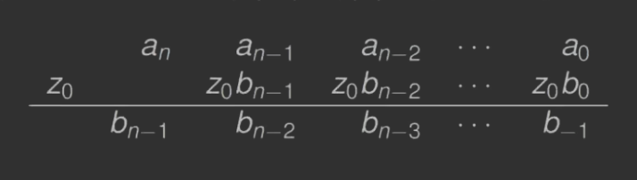

---

- [1. DEF](#1-def)
- [2. *Zasadnicze Twierdzenie Algebry*](#2-zasadnicze-twierdzenie-algebry)
- [3. Twierdzenie#2](#3-twierdzenie2)
    - [3.1. Przykład](#31-przykład)
- [4. Notacja $s(z)$](#4-notacja-sz)
- [5. Twierdzenie#3](#5-twierdzenie3)
    - [5.1. Przykład](#51-przykład)
- [6. Algorytm Hornera](#6-algorytm-hornera)
    - [6.1. Przykład](#61-przykład)
- [7. Zastosowanie metody Newtona](#7-zastosowanie-metody-newtona)
    - [7.1. `Horner`$(n,z_0, a_0, \dots, a_n) \to \big(~p(z_0),~ p'(z_0)~\big)$:](#71-hornernz_0-a_0-dots-a_n-to-bigpz_0-pz_0big)
    - [7.2. `Newton` $(n, z_0, a_0, \dots, a_n, M, \epsilon) \to \big(~ p(r), p'(r), r~ )$:](#72-newton-n-z_0-a_0-dots-a_n-m-epsilon-to-big-pr-pr-r-)
- [8. Twierdzenie#4](#8-twierdzenie4)
    - [8.1. Uwaga](#81-uwaga)
- [9. DEF: Deflacja czynnikiem liniowym](#9-def-deflacja-czynnikiem-liniowym)
    - [Uwagi o deflacji](#uwagi-o-deflacji)
    - [9.1. Przykład](#91-przykład)

---

## 1. DEF

Dany jest wielomian w postaci naturalnej
$$
p(z) = a_n z^n + a_{n-1} z^{n-1} + \dotsb + a_2 z^2 + a_1 z + a_0, \enspace a_n \neq 0
$$
gdzie współczynniki $a_k$ i zmienna $z$ mogą być liczbami zespolonymi $(a_k, z \in \mathbb{C})$.

---

## 2. *Zasadnicze Twierdzenie Algebry*

Dowolny wielomian stopnia $n \ge 1$ nad ciałem liczb zespolonych ma co najmniej jeden pierwiastek zespolony.

Jeśli $a_k \in \mathbb{R}$, to pierwiastki występują w parach sprzężonych. Dzieląc wielomian $p(z) \enspace (n\ge1)$ przez czynnik liniowy $(z-c)$ otrzymamy
$$
p(z) = (z-c) q(z) + R
$$
gdzie
- $q(z)$ jest wielomianem stopnia $n-1$
- $R$ jest resztą.

Jeśli $z = c$, to $p(c) = R$.\
Jeśli $c$ jest pierwiastkiem wielomianu $p$, to $R = 0$ oraz
$$
p(z) = (z-c) q(z).
$$

---

Jeśli $r_1$ jest pierwiastkiem $p$, to $p$ możemy zapisać
$$
p(z) = (z - r_1) q_1(z).
$$

Zgodnie z twierdzeniem $q_1$ ma pierwiastek $r_2$ (chyba że jest wielomianem zerowego stopnia). Możemy więc podzielić $q_1$ przez czynnik liniowy $z - r_2$ i otrzymamy
$$
p(z) = (z - r_1)(z - r_2)q_2(z).
$$

W każdym kroku tego procesu zmniejszamy stopień $q_k$ o jeden, aż $q_n$ będzie stałą. Ostatecznie otrzymamy rozkład $p$
$p(z) = (z - r_1)(z - r_2)\dotsb(z - r_n) q_n$.

Zatem $p$ ma $n$ pierwiastków zespolonych (każdy pierwiastek liczymy tyle razy, ile wynosi jego krotność).\
Jeśli $a_k \in \mathbb{R}$, pierwiastki występują w parach sprzężonych.

 ---

## 3. Twierdzenie#2

Wszystkie zera wielomianu
$$
p(z) = a_n z^n + a_{n-1} z^{n-1} + \dotsb + a_2 z^2 + a_1 z + a_0
$$
leżą wewnątrz koła
$$
\left\{ z \in \mathbb{C}: |z| < \rho = 1 + |a_n|^{-1} \cdot \max_{0 \le k < n}|a_k| \right\}.
$$

### 3.1. Przykład

Znaleźć koło zawierające wszystkie zera wielomianu
$$
p(z) = z^4 - 4z^3 + 7z^2 - 5z - 2.
$$

Promień koła $\rho = 1 + |a_4|^{-1} \cdot \max_{0 \le k <4} |a_k| = 8$.

---

## 4. Notacja $s(z)$

Rozpatrzmy funkcję $s(z) = z^n \cdot p\left(\frac{1}{z}\right)$.\
Wówczas
$$
s(z) = z^n \cdot \left( a_n \left( \frac{1}{z} \right)^n + a_{n-1} \left( \frac{1}{z} \right)^{n-1} + \dotsb + a_0 \right)=\\
= a_n + a_{n-1} z + a_{n-2} z^2 + \dotsb + a_0 z^n.
$$

Oczywiście $p(z_0) = 0 \iff s\left(\frac{1}{z_0}\right) = 0$ dla $z_0 \neq 0$.

---

## 5. Twierdzenie#3

Jeżeli wszystkie zera wielomianu $s$ leżą w kole $\left\{ z \in \mathbb{C}: |z| \le \rho \right\}$, to wszystkie niezerowe miejsca zerowe wielomianu $\rho$ leżą na zewnątrz koła $\left\{ z \in \mathbb{C}: |z| < \rho^{-1} \right\}$.

### 5.1. Przykład

Znaleźć koło, w którym nie ma zer wielomianu $p$
$$
p(z) = z^4 - 4z^3 + 7z^2 - 5z - 2.
$$

Wielomian $s$ ma postać
$$
s(z) = -2z^4 - 5z^3 + 7z^2 - 4z + 1
$$

Zera $s$ leżą w kole o promieniu $\rho = 1 + |a_4|^{-1} \cdot \max_{0 \le k < 4} |a_k| = \frac{9}{2}$. Zera $p$ leżą na zewnątrz koła o promieniu $\frac{2}{9}$. Stąd wszystkie zera wielomianu $p$ leżą w pierścieniu $\frac{2}{9} < |z| < 8$.

---

## 6. Algorytm Hornera

Załóżmy, że wielomian $p$ jest dany w postaci
$$
p(z) = a_n z^n + a_{n-1} z^{n-1} + \dotsb + a_2 z^2 + a_1 z + a_0.
$$

Wielomian $p$ możemy zapisać w postaci
$$
p(z) = (\dots ((a_n z + a_{n-1})z + a_{n-2})z + \dotsb)z + a_0.
$$

Dla danego $z_0$ algorytm Hornera wyznacza $p(z_0)$ oraz wielomian $q(z) = b_0 + b_1 z + \dotsb + b_{n-1} z^{n-1}$ taki, że
$$
p(z) = (z - z_0) q(z) + p(z_0)
$$

Nieznane współczynniki $b_k$ wielomianu $q$ wyznaczamy z równania
$$
a_n z^n + a_{n-1} z^{n-1} + \dotsb + a_2 z^2 + a_1 z + a_0=\\
= (z - z_0) (b_0 + b_1 z + \dotsb + b_{n-1} z^{n-1}) + p(z_0).
$$

---

Otrzymujemy następujący układ równań:
$$
\begin{aligned}
    a_n &= b_{n-1}\\
    a_{n-1} + z_0 b_{n-1} &= b_{n-2}\\
    &\dotsb\\
    a_1 + z_0 b_1 &= b_0\\
    a_0 + z_0 b_0 &= p(z_0)
\end{aligned}
$$

- Dane: $n, z_0, a_0, \dots, a_n$
- Wyniki: $p(z_0), b_0, \dots, b_{n-1}$

1. $b_{n-1} \gets a_n$
2. `for` $k \gets n-1$ `down to` $0$:
    1. $b_{k-1} \gets a_k + z_0 b_k$
3. `return` $b_{-1}, b_0, \dots, b_{n-1}$

W ręcznych obliczeniach $p(z_0)$ oraz $q(z)$ użyteczna jest tabela\

---

### 6.1. Przykład

*Oblicz za pomocą algorytmu Hornera wartość wielomianu $p$ w punkcie $3$ i wielomian $q(z)$.*

$$
p(z) = z^4 - 4z^3 + 7z^2 - 5z - 2.
$$

Konstruujemy tabelę do ręcznych obliczeń\

Czyli
- $p(3) = 19$
- $q(z) = z^3 - z^2 + 4z + 7$
- $p(z) = (z-3) (z_3 - z^2 + 4z + 7) + 19$.

---

## 7. Zastosowanie metody Newtona

Przedstawimy teraz sposób wykorzystania [metody Newtona](../2020-10-20/metoda-newtona.md) do obliczania pierwiastków danego wielomianu $p(z)$
$$
z_{k+1} = z_k - \frac{p(z_k)}{p'(z_k)}.
$$

*Jak efektywnie obliczyć $p(z_k)$ oraz $p'(z_k)$?*

Po zróżnicowaniu równości $p(z) = (z - z_0) q(z) + p(z_0)$ otrzymujemy $p'(z) = q(z) + (z - z_0) q'(z)$.

Następnie dla $z = z_0$ otrzymujemy
$$
p'(z_0) = q(z_0).
$$

Pochodną $p'(z_0)$ możemy więc obliczyć stosując [algorytm Hornera](#6-algorytm-hornera) używając współczynników $b_k$ wielomianu $q(z)$.

### 7.1. `Horner`$(n,z_0, a_0, \dots, a_n) \to \big(~p(z_0),~ p'(z_0)~\big)$:
1. $\alpha \gets a_n$
2. $\beta \gets 0$
3. `for` $k \gets n-1$ `down to` $0$:
    1. $\beta \gets \alpha + z_0 \beta \qquad$ (obliczanie $p'(z_0)$)
    2. $\alpha \gets a_k + z_0 \alpha \qquad$ (obliczanie $p(z_0)$)
4. `return` $\alpha, \beta$

---

### 7.2. `Newton` $(n, z_0, a_0, \dots, a_n, M, \epsilon) \to \big(~ p(r), p'(r), r~ )$:
1. `for` $k \gets 1$ `to` $M$:
    1. $[\alpha, \beta] \gets$ [`Horner`](#71-hornernz_0-a_0-dots-a_n-to-bigpz_0-pz_0big)$(n, z_0, a_0, \dots, a_n) \qquad$ (obliczanie $p(z_0), p'(z_0)$)
    2. $z_1 \gets z_0 - \frac{\alpha}{\beta} \qquad$ ([metoda Newtona](../2020-10-20/metoda-newtona.md))
    3. `if` $|z_1 - z_0| < \epsilon$:
        1. `return` $\alpha, \beta, z_1$

---

## 8. Twierdzenie#4

Niech $x_k$ oraz $x_{k+1}$ będą kolejnymi przybliżeniami skonstruowanymi przez metodę Newtona zastosowaną do wielomianu $p$ stopnia $n$.\
Wówczas istnieje miejsce zerowe wielomianu $p$ oddalone od $x_k$ w płaszczyźnie zespolonej o co najwyżej $n|x_k - x_{k+1}|$.

### 8.1. Uwaga
W celu wyznaczenia pierwiastków zespolonych wielomianu $p(z)$ za pomocą metody Newtona, musimy zaprogramować metodę Newtona w arytmetyce zespolonej.

---

## 9. DEF: Deflacja czynnikiem liniowym

Po wyznaczeniu pierwiastka $r_1$ wielomianu $p$ musimy wyznaczyć pozostałe pierwiastki $r_2, \dots, r_n$.\
„Oddzielamy” więc obliczony pierwiastek $r_1$, tzn. wyznaczamy wielomian $q(z)$ stopnia $n-1$: $p(z) = (z - r_1) q(z)$.\
Proces ten nazywamy *deflacją*.

---

Po znalezieniu pierwiastka $r_1$ wielomianu $p(z)$, np. [metodą Newtona](../2020-10-20/metoda-newtona.md), stosujemy deflację czynnikiem $(z - r_1)$. Następnie wyznaczamy pierwiastek $r_2$, np. metodą Newtona, zredukowanego wielomianu $q_1(z)$ i ponownie wykonujemy deflację czynnkiem $(z - r_2)$. Proces kontynuujemy aż wyznaczymy wszystkie pierwiastki.

### Uwagi o deflacji

- pierwiastki powinny być obliczane w kolejności wzrastających modułów
- pierwiastki obliczamy z maksymalną graniczną dokładnością
- każdy obliczony pierwiastek $\tilde{r}$ zredukowanego wielomianu $q(z)$ poprawiamy przez zastosowanie metody (np. Newtona) do wielomianu $p(z)$ z punktem startowym $\tilde{r}$. Dopiero po tym kroku stosujemy deflację

---

### 9.1. Przykład

*Niech $r_1 = 1$ będzie obliczonym pierwiastkiem wielomianu $p(z) = z^3 + z^2 - z - 1$. Wykonać deflację czynnikiem $(z-1)$, tzn. wyznaczyć wielomian $q(z)$ stopnia $2$.*

Aby wyznczayć $q$ stosujemy [algorytm Hornera](#6-algorytm-hornera). Konstruujemy tabelę do ręcznych obliczeń:\

$p(1) = 0, q(z) = z^2 + 2z + 1$,
$$
p(z) = (z-1) (z^2 + 2z + 1)
$$

---
