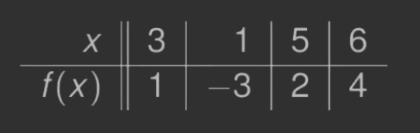

# Ilorazy różnicowe

*(2020-11-10)*

- [1. Ilorazy różnicowe](#1-ilorazy-różnicowe)
- [2. Postać Newtona wzoru interpolacyjnego](#2-postać-newtona-wzoru-interpolacyjnego)
- [3. Twierdzenie o ilorazach różnicowych wyższych rzędów](#3-twierdzenie-o-ilorazach-różnicowych-wyższych-rzędów)
    - [3.1. D-d](#31-d-d)
- [4. Sposób uzyskiwania współczynników](#4-sposób-uzyskiwania-współczynników)
    - [4.1. Przykład](#41-przykład)
- [5. Twierdzenie#4](#5-twierdzenie4)
    - [5.1. D-d](#51-d-d)
- [6. Twierdzenie#5](#6-twierdzenie5)
    - [6.1. D-d](#61-d-d)

---

## 1. Ilorazy różnicowe

Z [Twierdzenie#1](interpolacja-za-pomocą-wielomianów.md#2-twierdzenie1) wiemy, że dla różnych węzłów $x_0, x_1, \dots, x_n$ istnieje dokładnie jeden wielomian $p \in \Pi_n$ interpolujący $f$ taki, że
$$
p(x_i) = f(x_i) \quad (0 \le i \le n).
$$

Wielomian $p$ można przedstawić jako kombinację liniową wielomianów $1,x,x^2, \dots, x^n$ (baza $\Pi_n$). Jednak takie przedstawienie nie jest zalecane, ponieważ prowadzi do układu z macierzą Vandermonde’a (zadanie źle uwarnukowane).\
Przedstawmy $p$ w innej bazie $\Pi_n$:
$$
\begin{aligned}
    q_0(x) &= 1\\
    q_1(x) &= (x-x_0)\\
    q_2(x) &= (x-x_0)(x-x_1)\\
    \dotsb\\
    q_n(x) &= (x-x_0) (x - x_1) \dotsb (x - x_{n-1})
\end{aligned}
$$

Czyli mamy
$$
p(x) = \sum_{j=0}^n c_j q_j(x).
$$

Z faktu, że $p$ spełnia warunki interpolacji, otrzymujemy układ równań, z którego wyznaczamy $c_0, c_1, \dots, c_n$:
$$
\sum_{j=0}^n c_j q_j (x_i) = f(x_i) \qquad (0 \le i \le n)
$$

---

Rozwiązując układ z góry w dół wyznaczamy $c_0, c_1, \dots, c_n$. Możemy zauważyć, że
- $c_0$ zależy od $f(x_0)$
- $c_1$ zależy od $f(x_0)$ oraz od $f(x_1)$
- $\dots$
- $c_n$ zależ od $f$ w punktach $x_0, x_1, \dots, x_n$.

Wprowadzimy notację $c_n = f[x_0, x_1, \dots, x_n]$.\
$f[x_0,x_1,\dots,x_n]$ jest współczynnikiem przy $q_n$.

Jako, że
$$
q_n(x) = (x - x_0) (x - x_1) \dotsb (x - x_{n-1}) = x^n + \dotsb
$$
więc $f[x_0, x_1, \dots, x_n]$ jest współczynnikiem przy $x^n$ wielomianu stopnia co najwyżej $n$ interpolującego $f$ w węzłach $x_0, x_1, \dots, x_n$. Wielkość $f[x_0, x_1, \dots, x_n]$ będziemy nazywali
**ilorazem różnicowym** opartym na węzłach $x_0, x_1, \dots, x_n$.

Na przykład $f[x_0]$ jest współczynnikiem przy $x^0$ wielomianu stopnia $0$ interpolującego $f$ w $x_0$.
$$
f[x_0] = f(x_0).
$$

$f[x_0, x_1]$ jest współczynnikiem przy $x$ wielomianu stopnia $\le 1$ interpolującego $f$ w $x_0, x_1$.
$$
p(x) = f(x_0) + \frac{f(x_1) - f(x_0)}{x_1 - x_0} (x - x_0) = f(x_0) + f[x_0, x_1](x - x_0).
$$

## 2. Postać Newtona wzoru interpolacyjnego

Ogólnie $c_i$ wyznaczamy z wcześniejszego układu równań $c_0 = f[x_0], c_1 = f[x_0, x_1]$ aż do $c_n = f[x_0, x_1, \dots, x_n]$.\
Otrzymujemy **postać Newtona wzoru interpolacyjnego**
$$
p(x) = \sum_{k=0}^n c_k q_k (x) = \sum_{k=0}^n f[x_0, x_1,\dots, x_k] \prod_{j=0}^{k-1} (x - x_j).
$$

Oczywiście:
$$
f[x_i] = f(x_i), \qquad (0 \le i \le n).
$$

---

## 3. Twierdzenie o ilorazach różnicowych wyższych rzędów

Ilorazy różnicowe spełniają równość:
$$
f[x_0,x_1,\dots,x_n] = \frac{f[x_1,x_2,\dots,x_n] - f[x_0,x_1,\dots,x_{n-1}]}{x_n - x_0}.
$$

### 3.1. D-d

Niech $p_k \in \Pi_k$ będzie wielomianem interpolującym $f$ w węzłach $x_0, \dots, x_k$. Potrzebujemy wielomianów $p_n$ oraz $p_{n-1}$. Niech będzie wielomianem $q \in \Pi_{n-1}$ interpolującym $f$ w węzłach $x_1,\dots,x_n$.\
Wówczas
$$
p_n(x) = q(x) + \frac{x - x_n}{x_n - x_0} \left( q(x) - p_{n-1}(x) \right)
$$

Po obu stronach równości są wielomiany stopnia $\le n$. Wartości tych wielomianów w punktach $x_0, x_1, \dots, x_n$ są takie same, co implikuje wielomiany muszą być identyczne. Potrzeba więc mieć po obu stronach identyczne współczynniki przy $x^n$. Współczynnik wielomianu stopnia $\le n$ interpolującego $f$ w punktach $x_0, x_1, \dots, x_n$ jest równy $f[x_0, x_1, \dots, x_n]$. Stąd dostajemy
$$
f[x_0, x_1, \dots, x_n] = \frac{f[x_1, x_1,\dots, x_n] - f[x_0, x_1, \dots, x_{n-1}]}{x_n - x_0}
$$

---

## 4. Sposób uzyskiwania współczynników

Jeżeli dana jest tablica wartości funkcji $(x_i, f(x_i))$, wówczas ilorazy różnicowe łatwo obliczamy konstruując tablicę trójkątną.\
Przykład: ilorazy różnicowe rzędów $0,1,2,3$ obliczamy:\

### 4.1. Przykład

*Skonstruować tablicę ilorazów różnicowych dla wartości z tabeli:*\

Korzystając z [Twierdzenia#3](#3-twierdzenie-o-ilorazach-różnicowych-wyższych-rzędów) konstruujemy tablicę ilorazów różnicowych\

---

## 5. Twierdzenie#4

Ilorazy różnicowe nie zależą od kolejności węzłów. Jeśli $(z_0,z_1, \dots, z_n)$ jest permutacją $(x_0, x_1, \dots, x_n)$, to
$$
f[z_0,z_1,\dots,z_n] = f[x_0,x_1,\dots,x_n].
$$

### 5.1. D-d

Iloraz różnicowy jest równy współczynnikowi przy $x^n$ wielomianu stopnia $\le n$ interpolującego $f$ w węzłach $z_0,z_1,\dots,z_n$. Podobnie iloraz różnicowy $f[x_0,x_1,\dots,x_n]$ jest równy współczynnikowi przy $x^n$ wielomianu stopnia $\le n$ interpolującego $f$ w węzłach $x_0,x_1,\dots,x_n$. Wielomiany oczywiście są równe więc współczynniki są równe.

---

## 6. Twierdzenie#5

Niech $p \in \Pi_n$ interpolującym $f$ różnych węzłach $x_0,x_1,\dots,x_n$. Jeżeli $t \neq x_i$, wówczas
$$
f(t) - p(t) = f[x_0,x_1,\dots,x_n,t] \prod_{j=0}^n (t-x_j).
$$

### 6.1. D-d

Niech $q \in \Pi_{n+1}$ będzie wielomianem interpolującym $f$ w węzłach $x_0,x_1,\dots,x_n,t$. Wielomian $q$ możemy otrzymać z $p$ przez dodanie jednego czynnika ([postać Newtona](#2-postać-newtona-wzoru-interpolacyjnego))
$$
q(x) = p(x) + f[x_0,x_1,\dots,x_n,t] \prod_{j=0}^n (x-x_j).
$$

Ponieważ $q(t) = f(t)$ dla $x = t$. Zatem
$$
f(t) - p(t) = f[x_0,x_1,\dots,x_n,t] \prod_{j=0}^n (t - x_j).
$$

---
