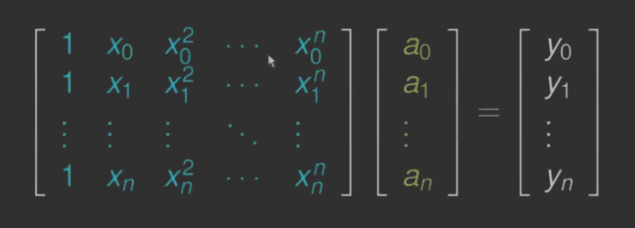

---

- [1. DEF](#1-def)
- [2. Twierdzenie#1](#2-twierdzenie1)
    - [2.1. D-d](#21-d-d)
- [3. Postać Lagrange’a wzoru interpolacyjnego](#3-postać-lagrangea-wzoru-interpolacyjnego)
- [4. Twierdzenie o błędzie interpolacji wielomianowej](#4-twierdzenie-o-błędzie-interpolacji-wielomianowej)
    - [4.1. Przykład](#41-przykład)
    - [4.2. D-d](#42-d-d)

---

## 1. DEF

Rozpatrzmy następujący problem. Mamy dane $n+1$ punktów $(x_i, y_i)$:\

Węzły $x_i, \enspace i=0,\dots,n$ są parami różne. Trzeba znaleźć wielomian $p \in \Pi_{n}$ taki, że
$$
p(x_i) = y_i \quad (0 \le i \le n).
$$

Gdybyśmy chcieli otrzymać wielomian interpolacyjny w postaci
$$
p(x) = a_0 + a_1 x + a_2 x^2 + \dotsb + a_n x^n,
$$
spełniający
$$
p(x_i) = y_i
$$
dla $0 \le i \le n$, wówczas musimy wyznaczyć $n+1$ współczynników $a_0, a_1, \dots, a_n$. Co prowadzi do układu równań z macierzą Vandermonde’a, źle uwarunkowaną:\

---

## 2. Twierdzenie#1

Dla węzłów $x_i$ i liczb $y_i$ istnieje dokładnie jeden wielomian $p \in \Pi_{n}$ spełniający warunki interpolacji
$$
p(x_i) = y_i \quad (0 \le i \le n).
$$

### 2.1. D-d

Wprowadźmy wielomian $l_i$ stopnia $n$
$$
l_i(x) = \prod_{j=0, j\neq i}^n \frac{x - x_j}{x_i - x_j}, \quad
l_i(x) =
\begin{cases}
    0 & x = x_j\\
    1 & x = x_i
\end{cases}.
$$

Otrzymujemy wielomian $L_n \in \Pi_n$ spełniający warunki interpolacji
$$
L_n(x) = \sum_{i=0}^n y_i l_i(x), \quad L_n(x_j) = \sum_{i=0}^n y_i l_i(x_j) = y_j.
$$

(Jednoznaczność) Załóżmy, że istnieją dwa wielomiany $L_1, L_2 \in \Pi_n$. Spełniające warunki interpolacji. Zatem
$$
(L_1 - L_2) (x_j) = 0 \quad (0 \le j \le n).
$$

$(L_1 - L_2) \in \Pi_n$ oraz $n+1$ miejsc zerowych (sprzeczność). Stąd $L_1 \equiv L_2$.

---

## 3. Postać Lagrange’a wzoru interpolacyjnego

$$
L_n(x) = \sum_{i=0}^n y_i \prod_{j=0, j\neq i} \frac{x - x_j}{x_i - x_j}
$$

---

## 4. Twierdzenie o błędzie interpolacji wielomianowej

Niech
- $f \in C^{n+1} [a,b]$
- $p \in \Pi_n$ będzie wielomianem interpolacyjnym na węzłach $x_0, x_1, \dots, x_n \in [a,b]$.

Wówczas istnieje $\zeta_x \in (a,b)$ (zależna od $x$) taka, że
$$
f(x) - p(x) = \frac{1}{(n+1)!} f^{(n+1)} (\zeta_x) \prod_{i=0}^n (x - x_i).
$$

### 4.1. Przykład
*Jaki jest błąd interpolacji funkcji $f(x) = \sin x$ za pomocą wielomianu stopnia $9$ w przedziale $[0;1]$.*

Korzystamy z [Twierdzenia#2](#4-twierdzenie-o-błędzie-interpolacji-wielomianowej). Szacujemy $\left\lvert f^{(10)}(\zeta_x) \right\rvert \le 1$, $\prod_{i=0}^9 \left\lvert (x-x_i) \right\rvert \le 1$ dla $x \in [0;1]$.

$$
\left\lvert \sin x - p(x) \right\rvert = \frac{\left\lvert f^{(10)}(\zeta_x) \right\rvert}{10!} \prod_{i=0}^9 \left\lvert (x-x_i) \right\rvert \le \frac{1}{10!} < 2.8 \cdot 10^{-7}.
$$

### 4.2. D-d

Jeżeli $x$ jest węzłem interpolacyjnym $x_i$ to obie strony równanie się zerują (w twierdzeniu).\
Ustalmy $x$ taki, że $x \neq x_i$ i zdefiniujmy funkcję $\phi$
$$
w(t) = \prod_{i=0}^n (t - x_i), \quad \phi \equiv f - p - \lambda w.
$$
gdzie $\lambda$ jest liczbą rzeczywistą dobraną tak, aby $\phi(x) = 0$. Stąd $\lambda = \frac{f(x) - p(x)}{w(x)}$.\
Funkcja $\phi \in C^{n+1} [a;b]$ oraz $\phi$ zeruje się w $n+2$ punktach $x, x_0, x_1, \dots, x_n$. Z twierdzenia Rolle’a pochodna $\phi'$ ma co najmniej $n+1$ miejsc zerowych. Podobnie $\phi''$ ma co najmniej $n$ miejsc zerowych. Stosując dalej twierdzenie Rolle’a, dostajemy, że $\phi^{n+1}$ ma co najmniej jedno zero, powiedzmy $\zeta_x \in (a;b)$.
$$
\phi^{(n+1)} = f^{(n+1)} - p^{(n+1)} - \lambda w^{(n+1)} = f^{(n+1)} - (n-1)! \lambda.
$$

Stąd
$$
0 = \phi^{(n+1)} (\zeta_x) = f^{(n+1)} (\zeta_x) - (n+1)! \lambda = f^{(n+1)} (\zeta_x) - (n+1)! \frac{f(x) - p(x)}{w(x)}.
$$
Ostatecznie
$$
f(x) - p(x) = \frac{1}{(n+1)!} f^{(n+1)} (\zeta_x) \prod_{i=0}^n (x-x_i).
$$
$\square$

---
