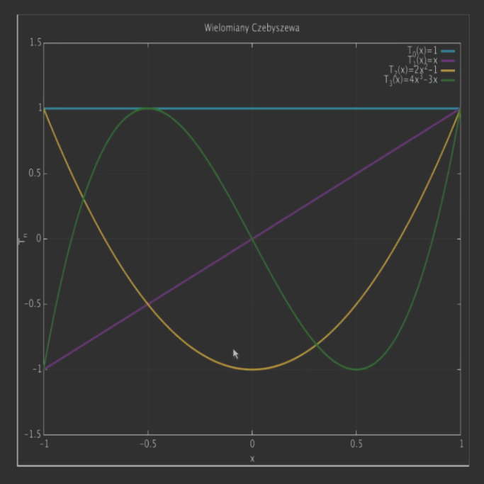

---

- [1. DEF](#1-def)
- [2. Twierdzenie#1](#2-twierdzenie1)
    - [2.1. D-d](#21-d-d)
- [3. Własności wielomianów Czebyszewa](#3-własności-wielomianów-czebyszewa)
- [4. Twierdzenie#2](#4-twierdzenie2)
- [5. Problem interpolacji](#5-problem-interpolacji)
- [6. Twierdzenie#3](#6-twierdzenie3)

---

## 1. DEF

Zgodnie z [twierdzeniem o błędzie interpolacji](../2020-11-10/interpolacja-za-pomocą-wielomianów.md#4-twierdzenie-o-błędzie-interpolacji-wielomianowej) wielkość błędu zależy od dwóch czynników $f^{(n+1)}(\zeta_x)$ oraz $\prod_{i=0}^n (x - x_i)$.\
Na pierwszy z nich raczej nie mammy wpływu. Drugi natomiast zależy od wyboru węzłów interpolacji. Zajmiemy się wyborem węzłów, aby
$$
\max_{x \in [a;b]} \left\lvert \prod_{i=0}^n (x - x_i) \right\rvert \to \min.
$$

Proces optymalizacji prowadzi do *wielomianów Czebyszewa* (I-szego rodzaju), który można zdefiniować rekurencyjnie
$$
\begin{cases}
    T_0(x) = 1\\
    T_1(x) = x\\
    T_{n+1} = 2x T_n(x) - T_{n-1}(x) \quad (n \ge 1)
\end{cases}
$$

Jak widać, wielomiany mają miejsca zerowe jednokrotne w przedziale $[-1;1]$.

## 2. Twierdzenie#1

Dla $x \in [-1;1]$ wielomiany Czebyszewa można przedstawić w postaci $T_n(x) = \cos\left( n \cdot \arccos(x) \right) \enspace (n\ge0)$.

### 2.1. D-d

Ze wzoru $\cos(\alpha + \beta) = \cos\alpha \cos\beta - \sin\alpha \sin\beta$ dostajemy
$$
\begin{aligned}
    \cos(n+1)\theta &= \cos\theta \cos n\theta - \sin\theta \sin n\theta\\
    \cos(n-2)\theta &= \cos\theta \cos n\theta + \sin\theta \sin n\theta
\end{aligned}
$$

Dodając powyższe równości otrzymujemy
$$
\cos(n + 1)\theta = 2\cos\theta \cos n\theta - \cos(n-1)\theta
$$

Podstawiając $\theta = \arccos x,\, x = \cos\theta$ i definiując funkcję $f_n(x) = \cos(n\arccos x)$ łatwo zauważyć, że $f_n$ spełnia zależność rekurencyjną
$$
\begin{cases}
    f_0(x) = 1\\
    f_1(x) = x\\
    f_{n+1} = 2x f_n(x) - f_{n-1}(x) \quad (n\ge1)
\end{cases}
$$

Zatem $f_n = T_n$.

---

## 3. Własności wielomianów Czebyszewa

Z [Twierdzenie#1](#2-twierdzenie1) wynikają następujące własności wielomianów Czebyszewa:
- wielomian $T_n$, $n = 1,2,\dots$ ma zera $r_j$ jednokrotne rzeczywiste leżące w przedziale $(-1,1)$ i równe $r_j = \cos\frac{(2j + 1)\pi}{2n}, \quad j = 0,1,\dots,(n-1)$.
- $T_n$ ma również $n+1$ punktów ekstremalnych $y_j$ w przedziale $[-1;1]$: $y_j = \cos\frac{j\pi}{n},\quad j = 0,1,\dots,n$, $T_n(y_j) = (-1)^j$.
- łatwo sprawdzić (patrząc na [definicję rekurencyjną](#1-def)), że współczynnik $a_n$ przy najwyższej potędze w $T_n(x) = a_n x^n + \dotsb$ jest równy $2^{n-1}$. Zdefiniujmy wielomian
$$
\tilde{T}_n(x) = \frac{1}{2^{n-1}} T_n(x) = (x-x_0) (x - x_1) \dotsb (x - x_{n-1})
$$
gdzie $x_i$ są zerami wielomianu Czebyszewa $T_n(x)$.

---

## 4. Twierdzenie#2

Spośród wszystkich wielomianów stopnia $n$ o współczynniku przy najwyższej potędze równym $1$, $w_n(x) = x^k + \dotsb$, wielomian $\tilde{T}_n$ ma najmniejsza normę
$$
\frac{1}{2^{n-1}} = \max_{x\in [-1;1]} \left\lvert \tilde{T}_n(x) \right\rvert \le \max_{x \in [-1;1]} |w_n(x)|.
$$

*Używamy tutaj normy [$||\cdot||_\infty$](../2020-10-13/uwarunkowanie-zadania.md#511-przykład).*

## 5. Problem interpolacji

Rozpatrzmy problem interpolacji w przedziale $[-1; 1]$. Oczywiście węzły $x_i$ należą do $[-1;1]$. Jeżeli $x \in [-1;1]$ to
$$
\max_{x \in [-1;1]} \left\lvert f(x) - p(x) \right\rvert \le \frac{1}{(n+1)!} \max_{x \in [-1;1]} \left\lvert f^{(n+1)}(x) \right\rvert \max_{x \in [-1;1]} \left\lvert \prod_{i=0}^n (x - x_i) \right\rvert
$$
([twierdzenie o błędzie interpolacji](../2020-11-10/interpolacja-za-pomocą-wielomianów.md#4-twierdzenie-o-błędzie-interpolacji-wielomianowej))

Z [Twierdzenie#2](#4-twierdzenie2) wiemy, że $\max_{x \in [-1;1]} \left\lvert \prod_{i=0}^n (x - x_i) \right\rvert \ge 2^{-n}$ oraz że wartość minimalna jest osiągana dla wielomianu $\tilde{T}_{n+1}(x) = \frac{T_{n+1}}{2^n}$. Otrzymujemy więc twierdzenie o optymalnym doborze węzłów interpolacji.

## 6. Twierdzenie#3

Jeżeli w przedziale $[-1;1]$ za węzły interpolacji $x_i$ przyjmiemy zera wielomianu Czebyszewa $T_{n+1}$, wówczas
$$
\left\lvert f(x) - p(x) \right\rvert \le \frac{1}{2^n (n+1)!} \max_{t \in [-1;1]} \left\lvert f^{(n+1)}(t) \right\rvert.
$$

---
