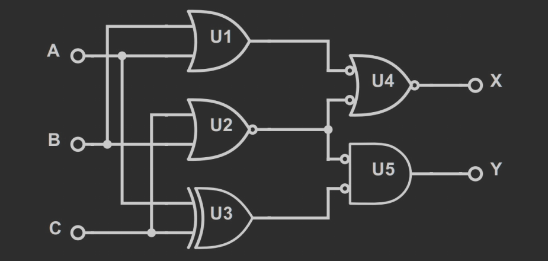
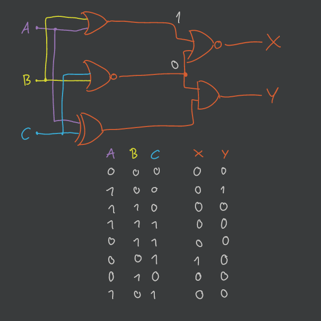
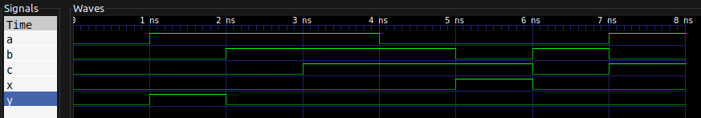

> Na tych laboratoriach zrobimy pierwsze kroki w kierunku pisania programów w języku VHDL.
> Jest to język opisu sprzętu Hardware Description Language – HDL, który pozwala na stworzenie modelu działania komponentów cyfrowych i weryfikację jego poprawności.

- [Zadanie 1. oraz Zadanie 2.](#zadanie-1-oraz-zadanie-2)
- [Zadanie 3.](#zadanie-3)
- [Zadanie 4.](#zadanie-4)

[strona]: https://ghdl.readthedocs.io/en/latest/quick_start/README.html

---

## Zadanie 1. oraz Zadanie 2.

> Wykonaj kroki opisane w sekcji Hello world program na [tej stronie][strona].
> Przeanalizuj ten kod, postaraj się znaleźć analogie do innych znanych Ci języków programowania.

> Spróbuj odszukać źródła biblioteki `textio` (używa jej program z poprzedniego zadania).
> Przeanalizuj źródła i spróbuj dopisać do poprzedniego programu możliwość odczytania linii z klawiatury i wypisaniu jej z powrotem.

[Kod programu `hello.vhdl`](hello.vhdl)

1. Przed uruchomieniem należy skompilować program  przy pomocy `make build`.
2. Następnie należy wykonać polecenie `make r=hello_world`.

---

## Zadanie 3.

> Wykonaj kolejne kroki ze [strony][strona], z sekcji *Full adder module and testbench*.
> Ponownie przeanalizuj kod pierwszego i drugiego programu.

- [Kod programu dodawania `adder.vhdl`](adder.vhdl)
- [Kod programu testującego (testbench) `adder_tb.vhdl`](adder_tb.vhdl)

1. Przed uruchomieniem należy skompilować program przy pomocy `make build`.
2. Następnie należy wykonać polecenie `make wave r=adder_tb`.

---

Słowa kluczowe:

1. `ENTITY` — określa sposób komunikacji, wejście i wyjście naszego układu
2. `ARCHITECTURE` — określa zachowanie układu (behaviour)
3. `PROCESS` — zawarta w `ARCHITECTURE` lista kroków określająca konkretny program
4. `COMPONENT` — deklarowany w `ARCHITECTURE` odwołuje się do niższego w hierarchii komponentu, `ENTITY`
5. `PORT` — wejście lub wyjście dla danego układu

> Co to jest adder i jak działa?

Adder jest to komponent w układzie liczącym sumę dwóch liczb binarnych.
Na wejściu dostajemy cyfry dwóch liczb binarnych oraz tzw. *carry*, który zawiera nadwyżkę z dodawania cyfr niżej (overflow).
Dodajemy zadane cyfry wraz ze wspomnianą nadwyżką.
Na wyjście podajemy cyfrę wyniku wraz z kolejną nadwyżką, jeżeli taka nastąpiła.

> W jaki sposób jest testowany sumator?

Sumator jest „wpinany” w testbench poprzez stworzenie nowej instancji komponentu.
Dzięki temu jesteśmy w stanie komunikować się z naszym adder-em.
Następnie określamy wszystkie możliwe wejścia wraz z wszystkimi możliwymi wyjściami adder-a.
Na wejściu mamy trzy różne bity, więc mamy $2^3 = 8$ możliwych kombinacji.
Po kolei sprawdzamy, czy nasze predykcje zgadzają się z faktycznym wynikiem danym przez adder.
Za każdym razem czekamy jedną nanosekundę, czyli wszystkie porty adder-a będą widoczne przez jedną nanosekundę.

> Uruchom program `gtkwave` z wygenerowanym plikiem przebiegów (`adder.ghw`). Zbadaj przebiegi sygnałów `i0`, `i1`, `ci`, `s`, `co`.

Jak powyżej zostało wspomniane — każda kombinacja utrzymuje się przez jedną nanosekundę.
Wykres przedstawia binarny stan każdego z portów podczas wszystkich testów.

---

## Zadanie 4.

> Bazując na zdobytej wiedzy, napisz kod jednostki i testujący dla następującego układu logicznego:
>
> 

Analiza ręczna układu:

---

- [Kod programu symulującego układ `ex-4.vhdl`](ex-4.vhdl)
- [Kod programu testującego \(testbench\) `ex-4_tb.vhdl`](ex-4_tb.vhdl)

1. Przed uruchomieniem należy skompilować program przy pomocy `make build`.
2. Następnie należy wykonać polecenie `make wave r=ex4_tb`.

---

Wynik programu GTKWave:

---
