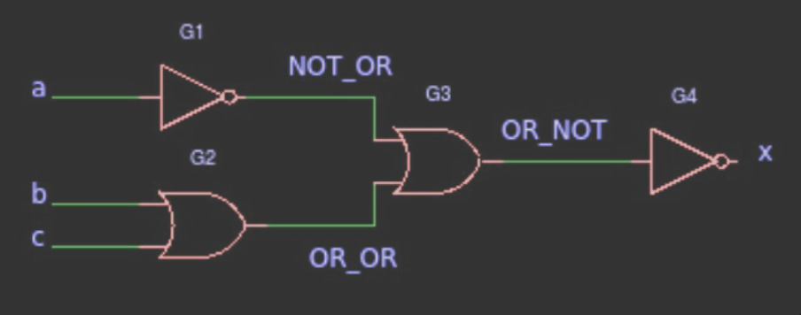
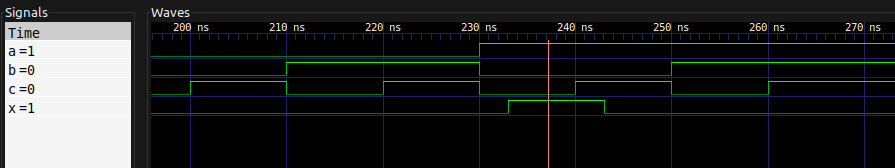
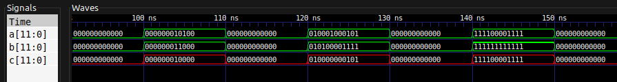
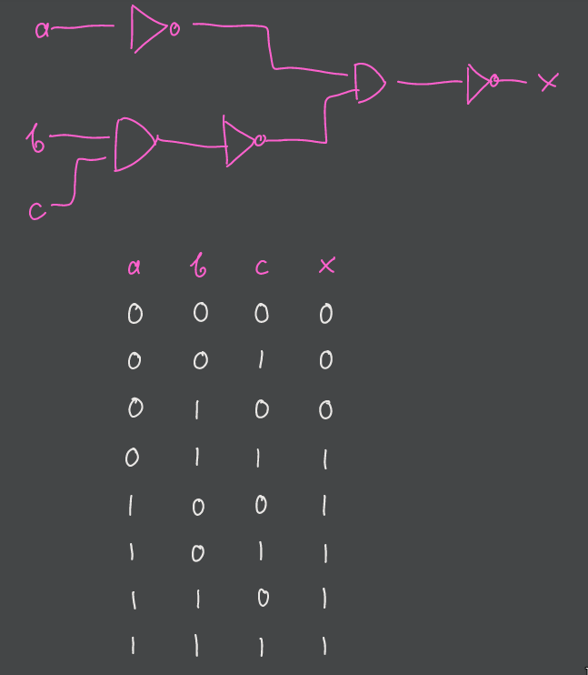
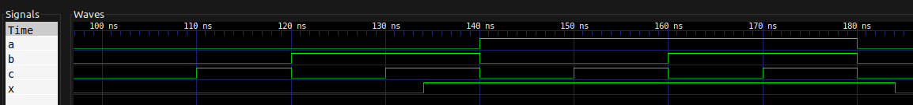

- [Nota](#nota)
- [Kompilacja i uruchomienie programów](#kompilacja-i-uruchomienie-programów)
- [Zadanie 1.](#zadanie-1)
- [Zadanie 2.](#zadanie-2)
- [Zadanie 3.](#zadanie-3)
- [Zadanie 4.](#zadanie-4)
- [Zadanie 5.](#zadanie-5)

---

## Nota

> Na poprzednich laboratoriach przeprowadził(eś|aś) symulację układu, którego opis działania składał się z dwóch wyrażeń boolowskich.
> *Układ był faktycznie połączeniem kilku bramek logicznych — był to typowy układ kombinacyjny,*
> *którego każde wyjście można opisać jako jednoznaczną funkcję wejść.*
> Teraz pójdziemy krok dalej — ale będziemy się trzymać podobnego przykładu.
> Język VHDL pozwala opisać działanie układu na kilka sposobów.
> Przeczytaj ponownie drugie zdanie w powyższym akapicie.
> Tam też schowane są dwa różne sposoby opisania tego układu!
> Jeden to powiedzenie, jaką zależnością są połączone ze sobą wejście i wyjście,
> a drugie to, z jakich współdziałających komponentów układ się składa.
>
> Na tych laboratoriach
> - zobaczysz, jak można komponować układ z podzespołów,
> - poznasz działanie pragmy `generic`,
> - oraz przypomnisz sobie, co to jest multiplekser.

---

## Kompilacja i uruchomienie programów

Przed uruchomieniem któregokolwiek z programów należy wykonać polecenie

```bash
make build
```

celem kompilacji wszystkich programów.

Następnie można wykonać polecenia:

```bash
make r=‹PROGRAM›
```

żeby po prostu uruchomić dany program, lub

```bash
make wave r=‹PROGRAM›
```

żeby pokazać wynik danego programu w programie GTKWave.

Wartość `PROGRAM` jest jednym z:

- `example`,
- `example_tb`,
- `Xand`,
- `Xand_tb`,
- `ex5`,
- lub `ex5_tb`.

---

## Zadanie 1.

> Pobierz ZIP do tego laboratorium.
> Przejrzyj kod, zapoznaj się z opisami działania bramek oraz multipleksera.

W pliku [`lab2-gates.vhd`](lab2-gates.vhd) znajduje się definicja czterech bramek logicznych `AND`, `OR`, `NOT` oraz `XOR`.
Oprócz nich znajduje się multiplekser `mux` z określonym `zachowanie`-m.
Multiplekser na podstawie liczby binarnej otrzymywanej z wejść `s0` oraz `s1` określa, które z wejść właściwych przekazać do wyjścia multipleksera.

---

## Zadanie 2.

> Zapoznaj się z realizacją układu example – sprawdź przebiegi sygnałów, deklaracje komponentów `G1`, `G2`, `G3`, `G4` – czy odpowiadają rysunkowi poniżej.
>
> 

Plik [`example.vhd`](example.vhd) zawiera `entity example` określające takie same wejścia oraz wejście jak na obrazku.
W układzie używamy dwie pary bramek `NOT` oraz `OR`.
Pierwsze osiem linijek `architecture` układu `example` odwołuje się właśnie do tych bramek (tworząc nowe instancje przy pomocy klauzuli `component`).

Następnie deklarujemy sygnały `NOT_OR`, `OR_OR` oraz `OR_NOT`.
Na koniec (w ciele właściwym zachowania układu) złączamy wszystko w jedną całość.
Wykorzystujemy wcześniej zadeklarowane komponenty bramek `OR` oraz `NOT` i mapujemy ich wejścia i wyjścia zgodnie z załączonym obrazkiem.

Przykładowo, na wejściu bramki `G2` (`OR`) mamy sygnały `b` oraz `c`.
Wyjście przekierowujemy do wewnętrznego sygnału `OR_OR`.
Robimy to przy pomocy klauzuli mapującej:

```vhdl
G2: gateOR  port map (b, c, OR_OR);
```

---

## Zadanie 3.

> Zajrzyj do `example-tb.vhd`.
> Znajdziesz tam kilka nowości, między innymi `std_logic_vector` — wektor bitów.
> Zobacz, jak i gdzie się go używa w tym wypadku.

Wektor bitów działa jak liczba binarna, gdzie liczba cyfr jest taka sama jak długość wektora.
W tym przykładzie używamy wektora jako alternatywnej formy wprowadzania danych testowych do testbench-a.
Zaczynamy od liczby binarnej równej zeru i w pętli dodajemy jedynkę.
Za każdym razem wpinamy bity liczby w sygnały `a`, `b` oraz `c`.

Co do notacji mamy dwie możliwości.
Możemy użyć zapisu wektorowego, wówczas musimy za każdą iteracją odpowiednio przekształcać wektor na liczbę,
dodać jedynkę i na koniec wrócić do wektora.
Alternatywą jest po prostu użycie `unsigned` co tworzy nam liczbę całkowitą bez znaku.

> Wykaż, że układ example realizuje funkcję logiczną zgodnie z rysunkiem.

Żeby łatwiej nam było zrozumieć, co robi ten układ, możemy go nieco skompresować.
Bramki `G3` oraz `G4` możemy zamienić na jedną bramkę `NOR`.
Teraz wiemy, że `x` jest prawdą, tylko wtedy, kiedy na wejściu `G3` mamy same fałsze.
Sygnał `a` jest na wejściu odwracany.
Czyli interesują nas tylko te przypadki, w których `a` jest prawdą.
Sygnały `b` oraz `c` są „spłaszczane” do jednego przy pomocy bramki `OR`.
Czyli oba te sygnały muszą być fałszem.

Ostatecznie dochodzimy do wniosku, że jedynym układem wejść, w którym `x` jest prawdą, jest układ `a = 1, b = 0, c = 0`.
W pozostałych przypadkach `x` jest fałszem.

Tak też się dzieje:



---

## Zadanie 4.

> Zajrzyj do pliku `Xand.vhd`.
> Postaw tezę dotyczącą działania pragmy `generic`.
> Zbuduj test, który pomoże Ci zweryfikować, czy masz rację.
> Deklarując komponent z pragmą `generic`, możesz wykorzystać ten szablon:
>
> ```vhdl
> component Xand is
>     generic (width : integer);
>     port ( clk : in std_logic;
>     A,B : in std_logic_vector(width-1 downto 0);
>     C : out std_logic_vector(width-1 downto 0)
>     );
>     end component;
> -- ...
> UUT : Xand generic map (width => 12)
>     port map ( ... );
> ```

Pragma `generic` działa trochę jak typy generyczne w innych językach programowania.
Jednak tutaj nie określamy typu abstrakcyjnego będącego w pewnym związku z typem właściwym,
a określamy dodatkowy parametr wpływający na parametry właściwe.

W tym przypadku parametr `width` określa szerokość, długość wektora będącego typem zmiennych właściwych.

Spodziewamy się zwykłej operacji `AND` na bitach dwóch wektorów.
Innymi słowy, operacji *bitwise* na dwóch liczbach binarnych.

Dla przykładu w testbench-u w pliku [`Xand_tb.vhd`](Xand_tb.vhd) najpierw ładujemy nasz komponent `Xand`,
a następnie wprowadzamy pewne dane testowe.

Wynik:



Jak widać na powyższym obrazku, tam gdzie w obu liczbach `a` oraz `b` mamy jedynki,
w liczbie wyjściowej `c` również mamy jedynkę.
Jeśli jedna z cyfr liczb wejściowych jest zerem, cyfra liczby wyjściowej również jest zerem.

---

## Zadanie 5.

> Bazując na poprzednich zadaniach, zbuduj układ zadany przez prowadzącego.

Przykładowy układ:



W pliku [`ex5_tb.vhd`](ex5_tb.vhd) znajduje się testbench, który sprawdza,
czy faktyczne wartości generowane przez [układ `ex5`](ex5.vhd) zgadzają się z powyższą analizą ręczną.

Zapis z programu GTKWave:



---
