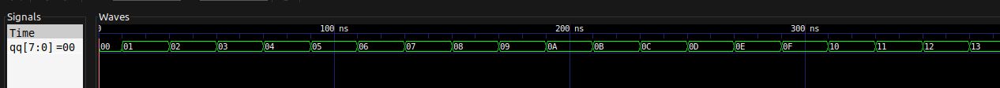

- [Wstęp](#wstęp)
- [Kompilacja i uruchomienie programów](#kompilacja-i-uruchomienie-programów)
- [Zadanie 1.](#zadanie-1)
    - [Z1. Akt pierwszy](#z1-akt-pierwszy)
    - [Z1. Akt drugi](#z1-akt-drugi)
- [Zadanie 2.](#zadanie-2)
- [Zadanie 3.](#zadanie-3)
    - [Z3. Akt pierwszy](#z3-akt-pierwszy)
    - [Z3. Akt drugi](#z3-akt-drugi)

---

## Wstęp

> Ostatnio okazało się, że VHDL pozwala na tworzenie układów komponentów przez łączenie ich sygnałami za pomocą instrukcji `port map` oraz `generic map`.
> Były to na razie proste układy logiczne.
> W odróżnieniu od nich układy sekwencyjne są to układy pamiętające
> — ich wyjście zależy od aktualnego stanu.
> Najprostszym przykładem są liczniki – następne wyjście zależy od poprzednich wejść (a więc stanu licznika).
> Pojęcie procesu już się pojawiło przelotnie, teraz pora na bliższą znajomość.
> Proces jest zestawem instrukcji wykonywanych sekwencyjnie (tj. w kolejności ich zapisania w procesie).
> Jednakże sam proces jest wykonywany współbieżnie z innymi instrukcjami współbieżnymi (np. przypisanie podstawowe ( `a <= "010"` ), warunkowe:
>
> ```vhdl
> y <= a when s = ’0’ else
>      b when s = ’1’ else ’X’;
> ```
>
> (nb. – jakie działanie opisuje ten kod?).

Powyższy kod opisuje przypisanie wartości do zmiennej `y` warunkowo,
na podstawie wartości zmiennej `s`.

> Inną instrukcją współbieżną jest przypisanie
> selektywne:
>
> ```vhdl
> with s select
>     y <= a when "00"
>          b when "01"
>          c when "10"
>      "XXX" when others;
> ```
>
> *Ponawiam pytanie: co opisuje ten kod?*

Tak jak wcześniej,
przypisujemy wartość do zmiennej `y` na podstawie wartości zmiennej `s`.

> Tak czy inaczej, są to instrukcje, które występują bezpośrednio w ciele opisu architektury i są wykonywane równolegle.
> Wszystkie.
> Razem z procesami.
> A wracając do procesów, te są wykonywane linia po linii.
> To trochę zagmatwane, ale proces jest po prostu bardziej złożoną pojedynczą instrukcją
> — umożliwia podejmowanie decyzji, wykonywanie operacji itd.
> Z procesem powiązana jest jego lista czułości
> — zestaw sygnałów podanych w nawiasie zaraz za jego nazwą.
> Jeśli którykolwiek z tych sygnałów zmieni swój stan
> — powoduje to uruchomienie procesu.
> To *nie jest* lista argumentów funkcji, chociaż na to wygląda.
> Jeśli proces nie ma listy czułości, to by znaczyło, że będzie działał zawsze i w kółko.
> Tak być nie może, więc VHDL nakazuje, by wewnątrz takiego procesu została użyta instrukcja `wait [for|until]`.

---

## Kompilacja i uruchomienie programów

Przed uruchomieniem któregokolwiek z programów należy wykonać polecenie

```bash
make build
```

celem kompilacji wszystkich programów.

Następnie można wykonać polecenia:

```bash
make r=‹PROGRAM›
```

żeby po prostu uruchomić dany program, lub

```bash
make wave r=‹PROGRAM›
```

żeby pokazać wynik danego programu w programie GTKWave.

Wartość `PROGRAM` jest jednym z:

- `lfsr`,
- `lfsr_tb`,
- `simple`,
- `simple_tb`,
- `twoway`,
- lub `twoway_tb`.

Oprócz VHDL w zadaniu 3. program napisany w C można skompilować przy pomocy polecenia

```bash
make lfsr-c.o
```

a następnie uruchomić przy pomocy

```bash
./main.o ‹liczba bajtów›
```

---

## Zadanie 1.

### Z1. Akt pierwszy

> Przeanalizuj kod dla [`simple.vhd`](simple.vhd), odpowiedz na zadane w komentarzu pytanie.

Wycinek z pliku [`simple.vhd`](simple.vhd):

```vhdl
-- you can add like this:
    q <= q + 1;
-- or like this
-- q <= q + "00000001";
-- but can't do it this way (why?)
-- q <= q + '1';
```

Opcja z dodaniem `'1'` nie może zadziałać, bo mamy niezgodność typów,
której nie da się rozwiązać.
Otóż `q` jest liczbą całkowitą bez znaku, kiedy `'1'` jest bitem
— bez określenia pozycji (*wieku*) tego bitu.

W przypadku `"00000001"` nie ma tego problemu,
bo bit ma określoną pozycję,
dodajemy liczbę, która po prostu jest zapisana w postaci binarnej.

---

### Z1. Akt drugi

> Uruchom [`simple_tb.vhd`](simple_tb.vhd) i zmodyfikuj czasy zadania sygnału `rst`, aby licznik doliczył do 195,
> a potem do 182.

W postaci pierwotnej pliku [`simple_tb`](simple_tb.vhd) proces zajmujący się zegarem `clk` działał bez końca.
W celu rozwiązania tego problemu dodałem sygnał `stopp`,
który przez większość działania programu ustawiony jest na `'0'`.
Ustawiamy go na `'1'` dopiero na koniec drugiego procesu,
kiedy liczba `qq` osiąga żądane wartości.

Żeby liczba `qq` doliczyła do żądanej wartości,
musimy wysłać odpowiednią liczbę sygnałów do programu `simple`.
Program ten oczekuje na przejścia zegara `clk`.
W testbench-u określony jest okres zegara `clk`.
Program `simple` zaczyna (resetuje liczbę `q`) od wartości `160` (`0xA0`).

Żądanymi wartościami są:
- `195` (`0xC3`),
- `182` (`0xB6`).

Zatem, musimy wysłać liczbę sygnałów równą różnicy między `160` a żądanymi wartościami.
(Oczywiście resetujemy `q` do początkowej wartości przed liczeniem do drugiej żądanej wartości.)

Żeby wysłać zadaną liczbę sygnałów, mnożymy wspomnianą różnicę przez okres zegara.

Wycinek programu `simple_tb` po zmianach:

```vhdl
stim_proc: PROCESS
BEGIN
    -- let it run
    wait for 50 ns;

    -- apply reset
    rst <= '1';

    wait for 700 ns;
    -- and let it go
    rst <= '0';

    wait for 50 ns;

    -- apply reset
    rst <= '1';

    wait for 440 ns;
    -- and let it go
    rst <= '0';

    -- stop
    stopp <= '1';
    wait;
END PROCESS;
```

Wynik programu GTKWave:


Jak widać na powyższych obrazkach,
dochodzimy do żądanych wartości,
a następnie sygnał `qq` jest resetowany do początkowej wartości.

---

## Zadanie 2.

> Zapoznaj się z realizacją układu zawartego w [`twoway.vhd`](twoway.vhd).
> Postaw tezę na temat działania tego licznika, napisz test (możesz wykorzystać ten z zad. 1.).
> Czy wszystko działa, jak powinno?
> Jeśli nie, to popraw.

Teza: licznik liczy od zera do maksymalnej liczby mieszącej się w 8 bitach.
Przed przekroczeniem zakresu licznik zmienia kierunek (`dir` — *direction*).
Kiedy licznik dociera do zera, kierunek jest zmieniany ponownie.

Potrzebne poprawki:

1. Deklaracja zmiennej `dir` — początkowa wartość powinna wynosić `'1'`, nie `'0'`.
    Zaczynamy od zera, więc chcemy dodawać, nie odejmować.

    ```vhdl
    VARIABLE dir: STD_LOGIC := '1';
    ```

2. Warunek zmiany kierunku przy dojściu do wartości maksymalnej.
    Poniższy `IF` sprawdza, czy `x` jest równy największej możliwej wartości.
    W pierwotnej wersji programu kierunek `dir` był zmieniany za późno,
    już po przekroczeniu wartości maksymalnej.

    ```vhdl
    IF x >= 2 ** NBit - 1 THEN
    ```




Jak widać na powyższych obrazkach,
licznik (po odpowiednich poprawkach) działa poprawnie.
Zmienia kierunek, jeśli dochodzi do któregoś z momentów krytycznych.

*Testbench do programu `twoway` znajduje się w pliku [`twoway_tb.vhd`](twoway_tb.vhd)*

---

## Zadanie 3.

> W pliku [`lfsr.vhd`](lfsr.vhd) znajdziesz prostą implementację rejestru LFSR *(Linear Feedback Shift Register)*.
>
> - Napisz program testowy, pozwalający na wydobycie z LFSR sekwencji bajtów pseudolosowych.
> - Użyj programu z <http://lfsr-generator.sourceforge.net/>,
>     aby wygenerować rejestr LFSR i porównać go do swojego modelu w VHDL (możesz zmodyfikować kod w lfsr.vhd)
>
> Porównaj wyniki z obu programów.
> Narysuj wykres generowanych bajtów w czasie dla różnych wartości początkowych.

### Z3. Akt pierwszy

Najbliższym implementacji z pliku [`lfsr.vhd`](lfsr.vhd) programem generowanym przez `lfsr-generator` jest:

```bash
lfsr-generator --length=16 --shift-amounts=1 --taps=16,15,14,5 --shift-left
```

Jedyną różnicą jest bramka `NOT` w [`lfsr.vhd`](lfsr.vhd) przy generowaniu następnego bitu.
W programie wygenerowanym przez `lfsr-generator` bramka ta jest nieobecna.

Jeżeli usuniemy bramkę `NOT` z [`lfsr.vhd`](lfsr.vhd) otrzymamy te same wyniki.

Dla przykładu dla wartości początkowej równej `2`:

[z3.one-c]: z3.one-c.png
{width=50%}

[z3.one-vhdl]: z3.one-vhdl.png
{width=50%}

![][z3.one-c]
![][z3.one-vhdl]

Oraz dla `10`:

[z3.five-c]: z3.five-c.png
{width=50%}

[z3.five-vhdl-alt]: z3.five-vhdl-alt.png
{width=50%}

![][z3.five-c]
![][z3.five-vhdl-alt]

Chociaż warto zauważyć, że dla wartości początkowych nieparzystych mamy niezgodność pierwszego bajtu.
Przykład dla `1`:

[z3.two-c]: z3.two-c.png
{width=50%}

[z3.two-vhdl]: z3.two-vhdl.png
{width=50%}

![][z3.two-c]
![][z3.two-vhdl]

---

### Z3. Akt drugi

Jeśli przywrócimy program [`lfsr.vhd`](lfsr.vhd) do jego pierwotnej wersji,
otrzymamy następujące wyniki:

Dla `0`:

[z3.three-c]: z3.three-c.png
{width=50%}

[z3.three-vhdl]: z3.three-vhdl.png
{width=50%}

![][z3.three-c]
![][z3.three-vhdl]

Dla `1`:

[z3.four-c]: z3.four-c.png
{width=50%}

[z3.four-vhdl]: z3.four-vhdl.png
{width=50%}

![][z3.four-c]
![][z3.four-vhdl]

Dla `10`:

[z3.five-c]: z3.five-c.png
{width=50%}

[z3.five-vhdl]: z3.five-vhdl.png
{width=50%}

![][z3.five-c]
![][z3.five-vhdl]

Powyższe rysunki zostały stworzone przy pomocy skryptu [`graph.py`](graph.py) w następujący sposób:

```bash
make lfsr-c.o && ./main.o 16 | ./graph.py 'C lang'
```

oraz

```bash
make build && ghdl -r lfsr_tb -gquantity=16 | ./graph.py 'VHDL'
```

przy różnych wartościach początkowych.

*Testbench do programu `lfsr` znajduje się w pliku [`lfsr_tb.vhd`](lfsr_tb.vhd)*

---
