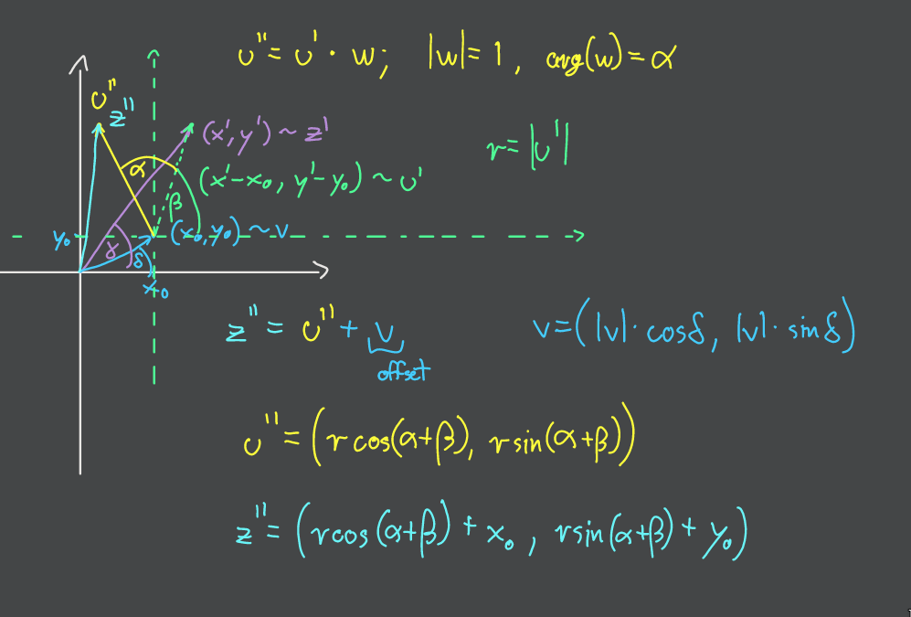

- [Zadanie 1.](#zadanie-1)
    - [Z1. Pomocnicze procedury](#z1-pomocnicze-procedury)
        - [Z1. «Czy punkt jest w środku prostokąta»](#z1-czy-punkt-jest-w-środku-prostokąta)
        - [Z1. «Znajdź przecięcie punktu z krawędziami prostokąta»](#z1-znajdź-przecięcie-punktu-z-krawędziami-prostokąta)
    - [Z1. Procedura właściwa](#z1-procedura-właściwa)
- [Zadanie 2.](#zadanie-2)
    - [Z2. Procedura pomocnicza «Czy jest w półpłaszczyźnie»](#z2-procedura-pomocnicza-czy-jest-w-półpłaszczyźnie)
    - [Z2. Procedura właściwa](#z2-procedura-właściwa)
- [Zadanie 5.](#zadanie-5)
    - [Z5. Akt pierwszy](#z5-akt-pierwszy)
    - [Z5. Akt drugi](#z5-akt-drugi)
- [Zadanie 6.](#zadanie-6)
    - [Z6. Akt pierwszy](#z6-akt-pierwszy)
    - [Z6. Akt drugi](#z6-akt-drugi)

---

## Zadanie 1.

> Napisz procedurę, która dla danego odcinka
> $\left[ (x_1, y_1), (x_2, y_2) \right]$
> i dla danego prostokąta $P = \left[ x_{\min},x_{\max} \right] \times \left[ y_{\min},y_{\max} \right]$,
> wyznacza odcinek $S' = \left[ (x_1', y_1'), (x_2', y_2') \right] = S \cap P$.

### Z1. Pomocnicze procedury

#### Z1. «Czy punkt jest w środku prostokąta»

$\operatorname{is-inside}(x,y)$:
1. `if` $x \in [x_{\min}; x_{\max}]$:
    1. `if` $y \in [y_{\min}; y_{\max}]$:
        1. `return` $\mathrm{True}$
2. `return` $\mathrm{False}$

---

#### Z1. «Znajdź przecięcie punktu z krawędziami prostokąta»

$\operatorname{find-throughpoints}(S[(x_1, y_1); (x_2, y_2)])$:
1. $a = \frac{y_2 - y_1}{x_2 - x_1}$ \[znajdź nachylenie prostej, na której leży odcinek\]
2. $b = y - ax = y_1 - ax_1$ \[znajdź offset (wysokość) prostej\]
3. $\mathrm{points} = \{\}$ \[przejdź przez wszystkie krawędzie prostokąta\]
4. `if` $y_1 = y_2$:
    1. `if` $x_{\min} \in [x_1; x_2]$:
        1. $\mathrm{points} = \mathrm{points} \cup \left\{ (x_{\min}, y_1) \right\}$
    2. `if` $x_{\max} \in [x_1; x_2]$:
        1. $\mathrm{points} = \mathrm{points} \cup \left\{ (x_{\max}, y_1) \right\}$
5. `elif` $x_1 \neq x_2$:
    1. `if` $y_{\min} \in [y_1, y_2]$:
        1. $\mathrm{points} = \mathrm{points}\, \cup\, \left\{\left(\frac{y_{\min} - b}{a}, y_{\min}\right)\right\}$
    2. `if` $y_{\max} \in [y_1, y_2]$:
        1. $\mathrm{points} = \mathrm{points}\, \cup\, \left\{\left(\frac{y_{\max} - b}{a}, y_{\max}\right)\right\}$
6. `if` $x_1 = x_2$:
    1. `if` $y_{\min} \in [y_1, y_2]$:
        1. $\mathrm{points} = \mathrm{points} \cup \left\{ (x_1, y_{\min}) \right\}$
    2. `if` $y_{\max} \in [y_1, y_2]$:
        1. $\mathrm{points} = \mathrm{points} \cup \left\{ (x_1, y_{\max}) \right\}$
7. `elif` $y_1 \neq y_2$:
    1. `if` $x_{\min} \in [x_1; x_2]$:
        1. $\mathrm{points} = \mathrm{points}\, \cup\, \{(x_{\min}, a x_{\min} + b)\}$
    2. `if` $x_{\max} \in [x_1; x_2]$:
        1. $\mathrm{points} = \mathrm{points}\, \cup\, \{(x_{\max}, a x_{\max} + b)\}$
8. $\mathrm{points} = \left\{ p \in \mathrm{points}: \operatorname{is-inside}(p)  \right\}$
9.  `return` $\mathrm{points}$

---

### Z1. Procedura właściwa

1. `if` $\operatorname{is-inside}(x_1, y_1) \land \operatorname{is-inside}(x_2, y_2)$:
    1. `return` $S$ \[oba punkty w środku, nie ma potrzeby skracania odcinka\]
2. `elif` $\operatorname{is-inside}(x_1, y_1) \oplus \operatorname{is-inside}(x_2, y_2)$:
    1. `assume` $\operatorname{is-inside}(x_1, y_1)$
    2. $(x_2', y_2') =$ `take first from` $\operatorname{find-throughpoints}(S)$ \[spodziewamy się tylko jednego punktu, dlatego wyciągamy go ze zbioru\]
    3. `return` $[(x_1, y_1), (x_2', y_2')]$
3. `else`: \[oba punkty są na zewnątrz\]
    1. `return` $\operatorname{find-throughpoints}(S)$ \[zwracamy po prostu przecięcia, które znaleźliśmy; może ich być $2$, $1$, lub $0$\]

---

## Zadanie 2.

> Napisz procedurę, która dla danego odcinka
> $S = \left[ (x_1, y_1), (x_2, y_2) \right]$
> i dla danej półpłaszczyzny $H = \left\{ (x,y) \in \mathbb{R}^2: ax + by + c \le 0 \right\}$,
> wyznacza odcinek $S' = \left[ (x_1', y_1'); (x_2', y_2') \right] = S \cap H$.

*Sytuacja podobna do [zadania 1.](#zadanie-1)*

### Z2. Procedura pomocnicza «Czy jest w półpłaszczyźnie»

*Metoda określa czy dany punkt znajduje się na płaszczyźnie czy nie.*

$\operatorname{is-inside}(x,y)$:
1. `if` $ax + by + c \le 0$:
    1. `return` $\mathrm{True}$
2. `else`:
    1. `return` $\mathrm{False}$

---

### Z2. Procedura właściwa

1. `if` $\operatorname{is-inside}(x_1, y_1) \land \operatorname{is-inside}(x_2, y_2)$:
    1. `return` $S$ \[bez zmian\]
2. `elif` $\operatorname{is-inside}(x_1, y_1) \oplus \operatorname{is-inside(x_2, y_2)}$:
    1. `assume` $\operatorname{is-inside}(x_1, y_1)$
    2. `if` $x_1 = x_2$:
        1. `return` $\left[ (x_1, y_1); \left(x_2, -\frac{a}{b}x_2 - \frac{c}{b}\right) \right]$
    3. `elif` $y_1 = y_2$:
        1. `return` $\left[ (x_1, y_1); \left(-\frac{b}{a}y_2 - \frac{c}{a}, y_2\right) \right]$
    4. `else`:
        1. $y_S = a_S x_S + b_S$
        2. $a_S = \frac{y_2 - y_1}{x_2 - x_1}$
        3. $b_S = y_1 - a_S \cdot x_1$
        4. $y_H = a_H x_H + b_H$, gdzie $a_H = -\frac{a}{b},\, b_H = -\frac{c}{b}$
        5. $(x_2', y_2')$ \[punkt przecięcia\]
        6. $x_2' = \frac{b_H - b_S}{a_S - a_H}$ \[$a_S - a_H \neq 0$, bo linie na pewno nie mają takiego samego nachylenia; jeśli $S$ jest równe linii $H$ podpada to pod przypadek 1., a jeśli $S$ jest tylko równoległe, to również zachodzi przypadek 1.\]
        7. $y_2' = a_S x_2' + b_S$
        8. `return` $\left[ (x_1, y_1); (x_2', y_2') \right]$
3. `else`: \[oba punkty są poza półpłaszczyzną\]
    1. `return` $\emptyset$

---

## Zadanie 5.

### Z5. Akt pierwszy

> Wyznacz punkt $(x'', y'')$ będący obrotem punktu $(x', y')$ wokół punktu $(0,0)$ o kąt $\alpha$.

Myślimy o płaszczyźnie $\reals^2$ jak o zbiorze liczb zespolonych $\Complex$.
Wówczas możemy zapisać punkt $(x', y')$ jako liczbę
$$
z' = r(\cos \beta + i \sin \beta),
$$
gdzie $r = |z'| = \sqrt{(x')^2 + (y')^2}$, a $\beta = \arg(z')$ jest kątem nachylenia liczby zespolonej w wektorowym wcieleniu.

W świecie liczb zespolonych mnożenie dwóch liczb sprowadza się do dodania ich kątów nachylenia oraz pomnożenia ich długości.\
Dla przypomnienia:
$$
a, b \in \Complex, \enspace \alpha = \arg(a),\, \beta = \arg(b)
\\[10pt]
a \cdot b = |a| \cdot |b| \cdot \left( \cos\alpha + i\sin\alpha \right) \cdot \left( \cos\beta + i\sin\beta \right) =
\\
= |a| \cdot |b| \cdot \left( \cos\alpha \cos\beta - \sin\alpha \sin\beta + i\left( \cos\alpha \sin\beta + \sin\alpha \cos\beta \right) \right) =
\\
= |a| \cdot |b| \cdot \left( \cos\left( \alpha + \beta \right) + i \sin\left( \alpha + \beta \right) \right)
$$

Niech $w \in \Complex \enspace |w| = 1,\, \arg(w) = \alpha$ — będzie to nasza *utility* liczba, która obróci liczbę $z'$ o kąt $\alpha$.\
Wówczas:
$$
z'' = z' \cdot w = r \cdot \left( \cos(\alpha + \beta) + i\sin(\alpha + \beta) \right).
$$

Zatem z definicji funkcji trygonometrycznych mamy:
$$
y'' = r \cdot \sin(\alpha + \beta),
\\
x'' = r \cdot \cos(\alpha + \beta).
$$

---

### Z5. Akt drugi

> Dla jakiej macierzy $M$ rozmiaru $2\times 2$ zachodzi ${x'' \brack y''} = M {x' \brack y'}$?

Z wyniku [części pierwszej](#z5-akt-pierwszy) wiemy, że różnica między punktami $(x', y')$ a $(x'', y'')$ leży jedynie w argumentach funkcji trygonometrycznych. Długość $r$ pozostaje taka sama, więc możemy usunąć $r$ *out of the picture* macierzy.

Czyli mamy:
$$
\begin{bmatrix}
    \cos(\alpha + \beta)\\
    \sin(\alpha + \beta)
\end{bmatrix}
=
M
\begin{bmatrix}
    \cos(\beta)\\
    \sin(\beta)
\end{bmatrix}.
$$

Zatem zadanie sprowadza się do wykorzystania tożsamości trygonometrycznych (w kwestii sum argumentów funkcji tryg.):

$$
\begin{bmatrix}
    \cos\alpha & -\sin\alpha\\
    \sin\alpha & \cos\alpha
\end{bmatrix}
\times
\begin{bmatrix}
    \cos\beta\\
    \sin\beta
\end{bmatrix}.
$$

Po prostu dobieramy elementy macierzy $M$, żeby funkcje trygonometryczne wyniku $(x'', y'')$ się zgadzały z tym, do czego doszliśmy wcześniej.

---

## Zadanie 6.

### Z6. Akt pierwszy

> Wyznacz punkt $(x'', y'')$ będący obrotem punktu $(x', y')$ wokół punktu $(x_0, y_0)$ o kąt $\alpha$.

Sytuacja podobna do [zadania 5](#zadanie-5), dlatego stosujemy taką samą metodologię z liczbami zespolonymi.

1. Przesuwamy liczbę $z'$ o wektor $\overrightarrow{[(0,0); (x_0, y_0)]}$.
2. Następnie wykonujemy tą samą czynność co w [akcie pierwszym zadania 5.](#z5-akt-pierwszy) czyli obracamy przesuniętą liczbę $z'$ (nazwijmy ją $u'$).
3. Na koniec przesuwamy wynikową liczbę $u''$ o wektor odwrotny do tego z punktu pierwszego.

Ostatecznie wynikiem będzie punkt

$$
z'' = \left( r \cos(\alpha + \beta) + x_0, r \sin(\alpha + \beta) + y_0 \right).
$$

Obrazek poglądowy dla przykładowego ułożenia punktów:

---

### Z6. Akt drugi

> Czy przekształcenie da się zapisać w postaci macierzy $2 \times 2$ jak w poprzednim zadaniu?

Przez to, że do koordynatów wynikowego punktu dodajemy wartości punktu $(x_0, y_0)$ nie możemy sprowadzić sytuacji macierzy z samymi funkcjami trygonometrycznymi jak to miało miejsce w [zadaniu 5.](#z5-akt-drugi).

---
