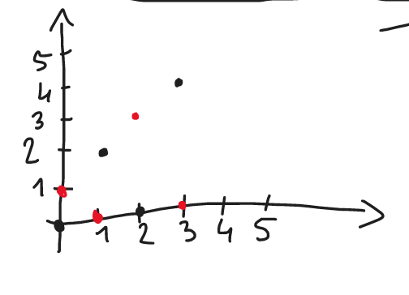
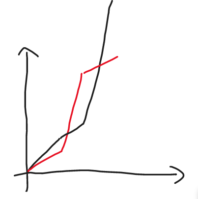

---

- [Zadanie 1](#zadanie-1)
- [Zadanie 2](#zadanie-2)
- [Zadanie 4](#zadanie-4)
- [Zadanie 5](#zadanie-5)
- [Zadanie 8](#zadanie-8)
    - [8.a)](#8a)
    - [8.b)](#8b)
    - [8.c)](#8c)
    - [8.d)](#8d)
    - [8.e)](#8e)

---

## Zadanie 1

> Dla $f, g \in \mathbb{R}^\mathbb{N}$ niech:
> $$
> (f \unlhd g) \Leftrightarrow (f = O(g)) \Leftrightarrow (\exists C > 0)(\exists N)(\forall n \ge N)(|f(n)| \le C|g(n)|)
> $$
> Pokaż, że $(\mathbb{R}^\mathbb{N}, \unlhd)$ jest preporządkiem ($\unlhd$ jest relacją zwrotną na $\mathbb{R}^\mathbb{N}$ oraz przechodnią), ale nie jest częściowym porządkiem.

Musimy pokazać, że $(\mathbb{R}^\mathbb{N}, \unlhd)$ jest relacją zwrotną, przechodnią, ale nie jest słabo antysymetryczna.

1. „relacja $(\mathbb{R}^\mathbb{N}, \unlhd)$ jest zwrotna”:\
    mamy $f \in \mathbb{R}^\mathbb{N}$\
    chcemy pokazać, że $f \unlhd f$\
    weźmy $C = 1$ oraz $N = 0$\
    mając $|f(n)| = |f(n)|$ mamy również $|f(n)| \le |f(n)|$ co spełnia nasz warunek na relację $(\mathbb{R}^\mathbb{N}, \unlhd)$ dla naszej funkcji $f$. $\blacksquare$
---
2. „relacja $(\mathbb{R}^\mathbb{N}, \unlhd)$ jest przechodnia”:\
    mamy funkcje $f, g, h \in \mathbb{R}^\mathbb{N}$\
    chcemy pokazać, że $f \unlhd g \land g \unlhd h \implies f \unlhd h$\
    mamy:
    $$
    (\exists C_1)(\exists N_1)(\forall n \ge N_1)(|f(n)| \le C_1|g(n)|)
    \\
    (\exists C_2)(\exists N_2)(\forall n \ge N_2)(|g(n)| \le C_2|h(n)|)
    $$
    weźmy taki $N_3$, że $N_3 \ge N_2 \land N_3 \ge N_1$\
    wówczas:
    $$
    (\exists C_1)(\exists N_3)(\forall n \ge N_3)(|f(n)| \le C_1|g(n)|)
    \\
    (\exists C_2)(\exists N_3)(\forall n \ge N_3)(|g(n)| \le C_2|h(n)|)
    $$
    skoro
    $$
    |f(n)| \le C_1 |g(n)| \land |g(n)| \le C_2 |h(n)|
    $$
    oraz obie zmienne $C_1, C_2 > 0$ to mamy:
    $$
    C_1 \cdot |g(n)| \le C_2 \cdot C_1 \cdot |h(n)|
    $$
    wtedy:
    $$
    |f(n)| \le C_3 |h(n)|
    $$
    gdzie $C_3 = C_2 \cdot C_1$ co kończy dowód. $\blacksquare$

---
3. „relacja $(\mathbb{R}^\mathbb{N}, \unlhd)$ nie jest słabo antysymetryczna”:
    $$
    \neg((\forall x,y \in X)((x \unlhd y \land y \unlhd x) \implies x = y)) \equiv
    \\
    \equiv (\exists x,y \in X)((x \unlhd y \land y \unlhd x) \land x \neq y)
    $$

    weźmy funkcje $f(x) = x$ oraz $g(x) = 2x$\
    mamy spełnione $f \unlhd g$ (dla $C = 1, N = 1$) oraz mamy spełnione $g \unlhd f$ (dla $C = 3, N = 1$)\
    a ten jeden przypadek wystarcza do spełnienia tego wyrażenia. $\blacksquare$

---

## Zadanie 2

> Przypomnij standardową metodę służącą do produkowania częściowego porządku z preporządku (zabijającą kontrprzykłady na brak słabej antysymetrii).

$f,g \in \mathbb{R}^\mathbb{N}$

$f \equiv g \Leftrightarrow f \unlhd g \land g \unlhd f$

$X = \mathbb{R}^\mathbb{N}_{/\equiv}$

Nowa relacja $\preccurlyeq$ na $X$:\

$f, g \in \mathbb{R}^\mathbb{N}$\
$[f]_\equiv \preccurlyeq [g]_\equiv \Leftrightarrow f \unlhd g$.\
// To działa!

---

## Zadanie 4

> Czy porządek $\unlhd$ jest liniowy? Czy porządek $\unlhd$ ograniczony do funkcji rosnących jest liniowy?

Pytanie jest o to, czy $\forall f,g \in \mathbb{R}^\mathbb{N}:~ f \unlhd g \lor g \unlhd f$?

czarna:
$$
f(n) =
\begin{cases}
0, & n\in 2\mathbb{N}\\
n, & \text{oth.}
\end{cases}
$$

czerwona:
$$
g(n) =
\begin{cases}
0, & n \in (2\mathbb{N}+1)\\
n, & \text{oth.}
\end{cases}
$$

---
Co z rosnącymi?

$f'(n) = f'(n-1) + g(n-1) ~~~~~ f'(0) = 0$

$g'(n) = g'(n-1) + f(n-1) ~~~~~ g'(0) = 0$

---

(*) Czy można wskazać $\aleph_0$ funkcji parami nieporównywalnych?

(**) Continuum?

---

$f(0) = 1 ~~~~~ g(0) = 1$

$$
f(n+1) =
\begin{cases}
    f(n) + 1 & \text{dla } n \in 2\mathbb{N}\\
    f(n) + \bold{n}\cdot  g(n) & \text{oth.}
\end{cases}
\\
g(n+1) =
\begin{cases}
    g(n) + 1 & \text{dla } n \in 2\mathbb{N} + 1\\
    g(n) + \bold{n} \cdot f(n) & \text{oth.}
\end{cases}
$$

---

## Zadanie 5

> Pokaż, że jeśli $f \lhd g$ to istnieje funkcja $h$ taka, że $f \lhd h \lhd g$. ($f \lhd g$ oznacza, że $f \unlhd g$ oraz $\neg g \unlhd f$.)

1. $(\exists c \exists N)(\forall n > N)(|c \cdot g(n)| \ge |f(n)|)$

2. $(\forall c \forall N)(\exists n > N)(|c \cdot f(n)| < |g(n)|)$

3. $\sqrt{fg}(n)$

4. $(\exists c \exists N)(\forall n > N)(|c \cdot g(n)| \ge |\sqrt{fg}(n)|)$ (mamy z 1.)

5. $|c^2 \cdot g(n)| \ge |f(n)|$

6.  mamy już $g \unrhd \sqrt{fg}$

7.  teraz pokazujemy $g \cancel{\unlhd} \sqrt{fg}$

8.  $(\forall c \forall N)(\exists n \ge N)(|c \cdot \sqrt{fg}(n)| < |g(n)|)$

9.  $|c^2 \cdot f(n)| < |g(n)|$ (mamy z 2.)

Podobnie pokazujemy $\sqrt{fg} \unrhd f$, ale $\sqrt{fg} \cancel{\unlhd} f$\
$\blacksquare$

---
Uwaga! Możemy założyć, że $|f|, |g| \ge 1$.\
W przeciwnym razie $f, g \in O(1)$.

---

Nieprawda, że jeśli $0 \le f, g \le 1$, to $f \equiv g$, np.: $\frac{1}{n} \rhd \frac{1}{n^2}$

To powiedziawszy, rozwiązanie $\sqrt{f\cdot g}$ jest OK niezależnie od tego, czy $f,g \le 1$, czy nie. Istotna jest monotoniczność $\sqrt{}$.

## Zadanie 8

> Rzucamy $n$ razy kostką.

### 8.a)
> Opisz przestrzeń probabilistyczną dla tego doświadczenia.

$\Omega = \{(a_1, a_2, \dots, a_n): a_1, a_2, \dots, a_n \in \{1,2,...,6\}\}$

### 8.b)
> Zapisz precyzyjnie następujące zdarzenia\
> $A =$ suma oczek uzyskanych w pierwszym i drugim rzucie jest parzysta

$A = \{\omega \in \Omega: a_1 + a_2 = 2k, k\in \mathbb{Z}\}$

> $B =$ suma oczek uzyskanych we wszystkich rzutach jest parzysta\

$B = \{\omega \in \Omega: \sum_{i=1}^{n} a_i = 2k, k\in \mathbb{Z}\}$

> $C =$ suma oczek uzyskanych w rzutach parzystych jest taka sama jak w rzutach nieparzystych.

$C = \left\{\omega \in \Omega: \sum_{i=1}^{\lfloor \frac{n}{2}\rfloor}a_{2i} = \sum_{i=1}^{\lfloor \frac{n}{2}\rfloor}a_{2i+1} \right\}$

---

### 8.c)
> Znajdź prawdopodobieństwa zdarzeń.

$$
P(A) = \frac{3^2 + 3^2}{36} = \frac{1}{2}
$$

$$
P(B) = \begin{cases}
\frac{\frac{1}{2} + 1}{n+1} & \text{dla } n \text{ parzystych}\\
\frac{\frac{n+1}{2}}{n+1} = \frac{1}{2} & \text{dla } n \text{ nieparzystych}
\end{cases}
$$

| liczba nieparzystych cyfr | liczba parzystych cyfr |
| ------------------------- | ---------------------- |
| $0$                       | $n$                    |
| $1$                       | $n-1$                  |
| $\dots$                   | $\dots$                |
| $n$                       | $0$                    |

---

$P(\sum_{i=1}^{n+1} x_i \in 2\mathbb{N}) = P\left(\left(\sum_{i=1}^{n} x_i \in 2\mathbb{N} \land x_{n+1} \in 2\mathbb{N}\right) \lor \left(\sum_{i=1}^{n} \in 2\mathbb{N} + 1 \land x_{n+1} \in 2\mathbb{N} + 1\right)\right)$

Założenie indukcyjne: $P\left(\sum_{i=1}^{n}x_i \in 2\mathbb{N}\right) = \frac{1}{2}$

---

### 8.d)

$\mathrm{E}X = \mathrm{E}X_1 + \mathrm{E}X_2 + \dotsb + \mathrm{E}X_n = n(1 + \frac{1}{6} + 2 \cdot \frac{1}{6} + \dotsb + 6 \cdot \frac{1}{6}) = n \cdot 3\frac{1}{2}$

$\mathrm{E}Y = \mathrm{E}Y_1 + \mathrm{E}Y_2 + \dotsb + \mathrm{E}Y_n = n\cdot (0 \cdot \frac{1}{6} + 2 \cdot \frac{1}{6} + 0 \cdot \frac{1}{6} + \dotsb + 6\cdot \frac{1}{6} = 2\cdot n$

---

### 8.e)

$\mathrm{E}X^2_i = 1^2 \cdot \frac{1}{6} + 2^2 \cdot \frac{1}{6} + \dotsb + 6^2 \cdot \frac{1}{6} = \frac{91}{6}$\
$\mathrm{Var}X_i = \frac{91}{6} - \left(\frac{21}{6}\right)^2 = \frac{35}{12}$\
$\mathrm{Var}X = \mathrm{E}X^2 - (\mathrm{E}X)^2 = n\cdot \frac{35}{12}$

$\mathrm{E}Y^2_i = 0^2 \cdot \frac{1}{6} + 2^2 \cdot \frac{1}{6} + \dotsb + 6^2 \cdot \frac{1}{6} = \frac{56}{6}$\
$\mathrm{Var}Y_i = \frac{56}{6} - 2^2 = \frac{32}{6} = \frac{16}{3}$\
$\mathrm{Var}Y = \frac{16}{3}n$
