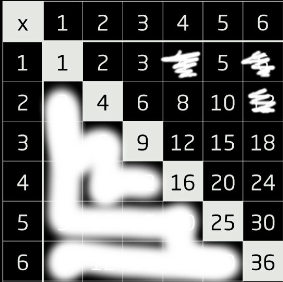
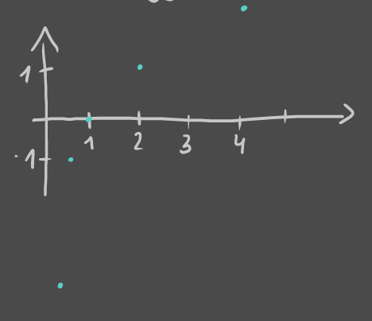
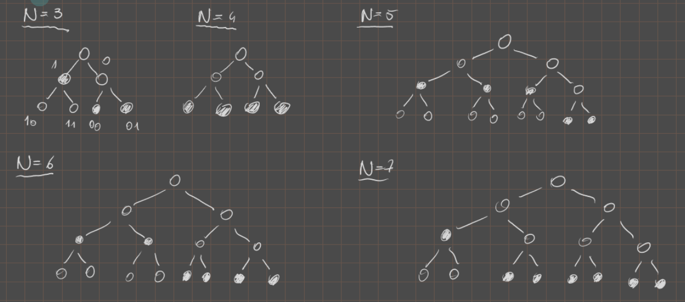

# Lista 1

- [Zadanie 1.](#zadanie-1)
    - [1.a)](#1a)
    - [1.b)](#1b)
- [Zadanie 2.](#zadanie-2)
    - [2.a)](#2a)
    - [2.b)](#2b)
- [Zadanie 3.](#zadanie-3)
- [Zadanie 4.](#zadanie-4)
- [Zadanie 5.](#zadanie-5)
- [Zadanie 6.](#zadanie-6)
- [Zadanie 7.](#zadanie-7)
- [Zadanie 8.](#zadanie-8)
- [Zadanie 9.](#zadanie-9)

---

## Zadanie 1.

> Oblicz entropię wyniku w następujących eksperymentach

### 1.a)

>  Rzucamy dwiema kostkami sześciennymi i sumujemy liczbę oczek.

$|\Omega| = 11$

$\Omega = \{ 2, 3, \dots, 12 \}$

$$
P(\omega) =
\begin{cases}
    2, 3, 11, 12 & \frac{1}{36}\\
    4, 5, 9, 10 & \frac{2}{36}\\
    6, 7, 8 & \frac{3}{36}\\
\end{cases}
$$

$\mathrm{H}(\Omega) = \mathrm{E}I$

$I(\omega) = -\log_2\left(P(\omega)\right)$

$\mathrm{E}I = \sum_{\omega \in \Omega} (P(\omega) \cdot \log_2(\frac{1}{P(\omega)})) = 4 \cdot \frac{1}{36} \cdot \log_2(36) + 4 \cdot \frac{2}{36} \cdot \log_2(18) + 3 \cdot \frac{3}{36} \cdot \log_2(12) = \frac{1}{36}( \log_2(36^4 \cdot 18^4 \cdot 12^3) ) = \dots$

---

### 1.b)

> Rzucamy dwiema kostkami sześciennymi i mnożymy liczbę oczek.

$\Omega = \{ x\cdot y: x,y \in \{1,\dots,6\}\}$

alternatywnie $\Omega = \{ x\in \{1,\dots, 36\}: x = a\cdot b \land a,b \in \{1,2,\dots,6\} \}$

$|\Omega| = 18$

$$
P(\omega) =
\begin{cases}
    1, 9, 16, 25, 36 & \frac{1}{36}\\
    2, 3, 5, 8, 10, 15, 18, 20, 24, 30 & \frac{2}{36}\\
    4 & \frac{3}{36}\\
    6, 12 & \frac{4}{36}\\
\end{cases}
$$

$\mathrm{E}I = 5 \cdot \frac{1}{36} \cdot \log 36 + 10 \cdot \frac{2}{36} \cdot \log \frac{36}{2} + 1 \cdot \frac{3}{36} \cdot \frac{36}{3} + 2 \cdot \frac{4}{36} \cdot \log \frac{36}{4} \simeq 4,39$

---

## Zadanie 2.

>  Oblicz entropię wyniku w następujących eksperymentach

### 2.a)

> Rzucamy $n$ razy symetryczną monetą i liczymy liczbę orłów.

$|\Omega| = n+1$

$\Omega = \{ 0, \dots, n \}$

$$
P(\omega) =
\begin{cases}
    0 & \frac{1}{2^n}\\
    1 & \frac{n}{2^n}\\
    2 & \frac{\binom{n}{2}}{2^n}\\
    \dots\\
    \lfloor \frac{n}{2} \rfloor & \frac{\binom{n}{\lfloor \frac{n}{2} \rfloor}}{2^n}\\
    \dots\\
    n-2 & \frac{\binom{n}{n-2}}{2^n}\\
    n-1 & \frac{n}{2^n}\\
    n & \frac{1}{2^n}
\end{cases}
$$

$$
\mathrm{E}I = \sum_{i=0}^{n}(P(\omega) \cdot \log_2(\frac{1}{P(\omega)}) =\\
=
\frac{1}{2^n}\left(\begin{cases}
    \sum_{i=0}^{\frac{n}{2}} \binom{n}{i} \cdot \log_2\left(\frac{2^n}{\binom{n}{i}}\right) & \text{gdy } n \text{ jest parzyste}\\
    \sum_{i=0}^{\frac{n+1}{2}} \binom{n}{i} \cdot \log_2\left(\frac{2^n}{\binom{n}{i}}\right) & \text{gdy } n \text{ jest nieparzyste}
\end{cases}\right) = (*)
$$

$$
(*) =
\frac{1}{2^n} \cdot \sum_{i=0}^{k} \binom{n}{i} \cdot \left(n - \log_2\left(\binom{n}{i}\right)\right)
$$

---

### 2.b)

> Rzucamy symetryczną monetą do uzyskania pierwszego orła. Wynikiem jest liczba wykonanych rzutów.

$H(X) = \frac{1}{2}\log_2(2) + \frac{1}{4}\log_2(4) + \dots = \sum_{i=1}^{\infty}\frac{1}{2^i}\log_2 2^i = \sum_{i=1}^{\infty}i\frac{1}{2^i} = \sum_{i=1}^{\infty} \frac{1}{2^i} + \sum_{i=2}^{\infty} + \dotsb = \frac{\frac{1}{2}}{1 - \frac{1}{2}} + \frac{\frac{1}{4}}{1 - \frac{1}{2}} + \dotsb = 1 + \frac{1}{2} + \frac{1}{4} + \dots = \sum_{i=0}^{\infty}\frac{1}{2^i} = \frac{1}{1-\frac{1}{2}} = 2$

---

## Zadanie 3.

>  Niech X będzie dyskretną zmienną losową. Jaka będzie zależność między entropią X a entropią Y jeśli:
>
> a) $Y = X + 4$\
> b) $Y = 2^X$\
> c) $Y = X^2$\
> d) $Y = \sin X$

Niech $y = g(x)$, wówczas:
$$
P(y) = \sum_{x:~ y=g(x)} P(x)
$$

$$
\sum_{x:~ y=g(x)}P(x) \log_2P(x) \le \sum_{x:~ y=g(x)}P(x) \log_2 P(y) = P(y) \log_2 P(y)
$$

$$
H(X) = -\sum_{x} P(x)\log_2P(x) = -\sum_{y}\sum_{x: y=g(x)} P(x) \log_2 P(x) \ge\\
\ge -\sum_{y} P(y) \log_2 P(y) = H(Y)
$$

---
a), b) $H(X) = H(Y)$\
c), d) $H(X) > H(Y)$

---

## Zadanie 4.

> Jaka jest maksymalna entropia dyskretnej zmiennej losowej o $N$ wartościach. Podaj wszystkie możliwe rozkłady spełniające to maksimum.

$f(P(x_i) \lambda) \sum_{x_i \in X} \log\frac{1}{P(x_i)} P(x_i) + \lambda(1 - \sum_{x_i \in X}P(x_i))$

$1 = \sum P(x_i)$

$P(x_i) = \beta_i^2$

$\frac{\delta}{\delta} \frac{f(P(x_i), \lambda)}{\beta_i} = 2\beta_i \log\frac{1}{\beta_i^2} - 2\beta_i\frac{1}{\beta_i^2}\beta_i^2 + 2\lambda\beta_i = 0$

$2 \log\frac{1}{\beta_i} - 1 + \lambda = 0 \implies \log\frac{1}{\beta_i} = \frac{1 - \lambda}{2} = C$ ($\beta_i = 2^C = C$)

$\frac{\delta}{\delta} \frac{f(P(x_i), \lambda)}{\lambda} = 1 - \sum \beta_i^2 = 0 \implies 1 = N \cdot P(x_i) \implies P(x_i) = \frac{1}{N}$

---

## Zadanie 5.

> Jaka jest minimalna entropia dyskretnej zmiennej losowej o $N$ wartościach. Podaj wszystkie możliwe rozkłady spełniające to minimum.

Hipoteza: Minimalna entropia zachodzi dla rozkładu, gdzie $(\exists i)(p_i = 1)$, gdyż wtedy mamy najwięcej wiedzy wejściowej.

D-d:

Weźmy zatem układ $(p_1, \dots, p_N)$, gdzie $p_i = 1 \land (\forall j \neq i)(p_j = 0)$

$H(X) = -\sum_{k=1}^{N} p_k \log_2 p_k = -p_i \log_2 p_i = -\log_2 (1) = 0$

Skoro entropia jest sumą po liczbach postaci $p \log_2 \frac{1}{p}$, gdzie $p \in [0;1]$ to wiemy, że ów iloczyn nie może przyjąć wartość ujemnej, bo $\log_2 \frac{1}{2} \ge 0$ oraz $p \ge 0$.

Zatem rozkład pokazany powyżej daje najmniejszą możliwą wartość entropii. Takich rozkładów jest $N$, gdyż możemy wybrać dowolny $x_i$ jako ten, którego $2(x_i) = 1$.

---

Jedyny taki rozkład, bo:

$H(X) = -\sum_{i=0}^{N} p_i \underbrace{\log_2 p_i}_{<0} > 0$,
$$
\begin{cases}
    (\exists i) (p_i > 0)\\
    (\forall i) (p_i \neq 1)\\
\end{cases}

\implies

(\exists j) (p_j \in (0;1))
$$

Logarytm dla $p_j \in (0;1)$ jest zawsze ujemny zatem suma będzie zawsze dodatnia, bo mnożymy przez $-1$.

---

## Zadanie 6.

> Załóżmy, że mamy dwa źródła $X$ i $Y$ o entropiach $H(X)$ i $H(Y)$, takie że zbiory ich symboli są rozłączne. Przeprowadzamy losowanie i z prawdopodobieństwem p podajemy symbol ze źródła $X$, a z prawdopodobieństwem $1 − p$ ze źródła $Y$. Jaka jest entropia wyniku takiej procedury?

$H(Z) = -\sum_{s \in X} p\cdot q_{x_s} \cdot \log(pq_{x_s} - \sum_{x\in Y}(1-p)q_{y_s} \log((1-p) q_{y_s}) = -p\sum_{s \in X} q_{x_s}(\log p + \log q_{x_s}) - (1-p)\sum_{s \in Y}q_{y_s}(\log (1-p) + \log y_{y_s}) = -p\log p \sum_{s \in X} q_{x_s} - p\sum q_{x_s} \log q_{x_s} - (1-p) \sum q_{y_s} \log q_{y_s} - (1-p) \log(1-p) \sum_{x \in Y} q_{y_s} = -p\log p + p \cdot H(X) + (1-p) \cdot H(Y) - (1-p) \log(1-p) = H(P) + p\cdot H(X) + (1-p) \cdot H(Y)$

---

## Zadanie 7.

> Podaj naturalna miarę ilości informacji informacji w przypadku, gdy dysponujemy alfabetem o $a$ znakach. Wypisz jej naturalne własności. Udowodnij, że taka miara jest jedyna.

$f: \mathbb{R}^+ \to \mathbb{R}$ o własnościach:
1. $f(x \cdot y) = f(x) + f(y)$
2. $\sout{f(1) = 0}$ (niepotrzebny)
3. $f(2) = 1 \qquad$ (może być $f(a) = 1$)

Jeśli $f$ jest ciągła, wówczas $f(x) = \log_2(x) \qquad (\log_a (x))$.

**D-d**

Najpierw patrzymy na pewne oczywiste wartości dyskretne

- $f(1) = f(1 \cdot 1) = f(1) + f(1)$
- $f(1) = 0$
- $f(2^n) = f(2 \cdot 2^{n-1}) = f(2) + f(2^{n-1}) = 1 + f(2^{n=1}) = \dots = n$
- $f(1) = f\left(\frac{1}{2} \cdot 2\right) = f\left(\frac{1}{2}\right) + f(2) = f\left(\frac{1}{2}\right) + 1$
- $f\left(\frac{1}{2}\right) = 0-1 = -1$
- Indukcyjnie $f(2^{-n}) = -n$

Czyli narazie mamy:\

*Tylko co z gęstymi kawałkami dziedziny?*

$\frac{p}{2^n},~ p\in \mathbb{N}$

$f\left(\frac{p}{q}\right) = f(p) + f\left(\frac{1}{q}\right)$

---

$f\left(\frac{1}{q}\right) = -f(q) \qquad f(1) = f\left(q \cdot \frac{1}{q}\right) = \dots$

---

$f\left(2^{\frac{p}{q}}\right) = f\left( \left( 2^{\frac{1}{q}} \right) \right) = p\cdot f\left( 2^{\frac{1}{a}} \right) = p\cdot f$

*do dokończenia — co z liczbami pomiędzy tymi dyskretnymi, które znaleźliśmy?*

---

## Zadanie 8.

> Dla rozkładu $P({x_1}) = \frac{1}{2}, P({x_2}) = \frac{1}{8}, P({x_3}) = P({x_4}) = \dots = P({x_8}) = \frac{1}{16}$ znajdź kody (prefiksowe), tak by średnia długość słowa kodowego była równa entropii.

- $X = \{x_1, \dots, x_8\}$
- $H(X) = \frac{1}{2} \log_2 (2) + \frac{1}{8} \log_2(8) + 6 \cdot \frac{1}{16} \log_2 (16) = \frac{1}{2} + \frac{3}{8} + \frac{6}{4} = \frac{19}{8} = 2,375$

$\mathrm{E}L$ musi wynosić $\frac{19}{8}$

*(kod prefixowy $\implies$ żadne ze słów kodujących nie jest prefixem innego)*

$\mathrm{E}L = \frac{1}{2} \cdot 1 + \frac{1}{8} \cdot 3 + 6 \cdot 4 \cdot \frac{1}{16} = \frac{8}{16} + \frac{6}{16} + \frac{24}{16} = \frac{38 }{16} = \frac{19}{8}$

---

## Zadanie 9.

> Niech $X = \{x_1, x_2, \dots, x_N\}$. Dla jakich $N$ istnieje rozkład mający kody (prefiksowe) o średniej długości równej entropii?

Dodajmy dodatkowe założenie, że $(\forall i)(P(x = x_i) \in (0;1))$ gdyż inaczej jesteśmy w stanie znaleźć trywialny rozkład z zerami.

Zauważmy, że warunkiem aby entropia była równa średniej długości kodu jest to, że prawdopodobieństwa są potęgami dwójki. Inaczej entropia będzie mniejsza.

Ten warunek możemy sformułować jako dwa pod-warunki:
- $a_n \cdot \frac{1}{2^N} + \dotsb a_1 \cdot \frac{1}{2} = 1$ , suma prawdopodobieństw
- $\sum_{i=1}^{N} a_i = N$, mamy $N$ wartości zmiennej losowej

Pytanie czy $\forall N$ znajdziemy takie, $a_n, \dots, a_1$ aby ten warunek zachodził?

Spójrzmy na przykłady z użyciem drzewa binarnego:

Patrząc na te przykłady można wysnuć hipotezę, któ©ą spróbujemy udowodnić:
- $h = \lceil \log_2 N \rceil$, taka wysokość drzewa wystarcza
- $a_n = 2N - 2^h \land a_{n-1} = 2^h - N \land (\forall i \neq h,h-1) (a_i = 0)$

Dodając $1$ do $N$ schodzimy jednym wierzchołkiem z poziomu $h-1$ na dwa wierzchołki na poziomie $h$.

**D-d**

- $a_N \cdot \frac{1}{2^N} + \dotsb + a_1 \cdot \frac{1}{2} = 1$\
    $\frac{a_h}{2^h} + \frac{a_{h-1}}{2^{h-1}} = \frac{2N \cdot 2^h}{2^h} + \frac{2^h - N}{2^{h-1}} + \frac{N - 2^{h-1} + 2^h - N}{2^{h-1}} = \frac{2-1}{1} = 1$
- $\sum_{i=1}^{N} a_i = N$\
    $\sum_{i=1}^{N} a_i = a_h + a_{h-1} = 2N - 2^h + 2^h - N = N$

---

Dla podanego rozkładu oba warunki zachodzą, sprawdźmy zatem czy jego średnia długość kodu równa się entropii.

- $\mathrm{E}\alpha = \overbrace{h}^{\text{długość kodu}} \cdot \overbrace{a_h}^{\text{ilość znaków o tej długości}} \cdot \overbrace{\frac{1}{2^h}}^{\text{prawdopodobieństwo}} + (h-1) a_{h-1} \cdot \frac{1}{2^{h-1}} = \frac{h \cdot a_h}{2^h} + \frac{(h-1)\cdot a_{h-1}}{2^{h-1}}$
- $H = -\sum_{i=1}^{N} p_i \log_2 p_i = a_h \cdot \left( \frac{1}{2^h} \log_2 2^h \right) + a_{h-1} \left( \frac{1}{2^{h-1}} \log_2 2^{h-1} \right) = \frac{h \cdot a_h}{2^h} + \frac{(h-1) \cdot a_{h-1}}{2^{h-1}} = \mathrm{E}\alpha$

Zatem $\forall N$ podany rozkłąd ma średnią długość kodu prefiksowego równą entropii.

---

Przykład użycia $N = 6$ ($h = \lceil \log_2 N \rceil = 3$)

- $a_2 = 2^3 - 6 =2$
- $a_3 = 2\cdot 6 - 2^3 = 12 - 8 = 4$

Kody:
- $p_1, p_2 = \frac{1}{4}: \enspace 00,~ 11$
- $p_3,\dots,p_8 = \frac{1}{8}: \enspace 100,~ 101,~ 110,~ 111$

Obliczenia:
- $\mathrm{E}\alpha = \frac{4}{4} + \frac{12}{8} = 2.5$
- $H - 2\cdot \frac{1}{4} \cdot \log_2 (4) + 4 \cdot \frac{1}{8} \log_2 (8) = \frac{4}{4} + \frac{12}{8} = 2.5$

---
