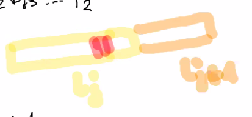

# Kod Shannona

*(2020-10-15)*

- [1. Kod Shannona](#1-kod-shannona)
    - [1.1. Uwaga](#11-uwaga)
    - [1.2. Przykład](#12-przykład)
- [2. Procedura dająca zawsze kod prefiksowy](#2-procedura-dająca-zawsze-kod-prefiksowy)
    - [2.1. D-d](#21-d-d)

---

## 1. Kod Shannona

Kodem Shannona nazywamy kod prefiksowy spełniający zależność
$$
l_i = \left\lceil \log_2 \frac{1}{p_i} \right\rceil
$$

### 1.1. Uwaga
Jak dobry jest kod Shannona?

$$
\log_2\frac{1}{p_i} \le l_i < \log_2\frac{1}{p_i} + 1
$$

$$
\begin{aligned}
\sum_{i=1}^{N} p_i \log_2 \frac{1}{p_i} &\le& \sum_{p_i l_i} &< \sum_{i=1}{N} \left( p_i \log_2 \frac{1}{p_i} + p_i \right)\\
H &\le& L &< H+1
\end{aligned}
$$

---

### 1.2. Przykład

Pokażemy, że takie kody istnieją!

Zrobimy kod Shannona.

$p_1 = \frac{1}{2} \qquad p_2 = \frac{1}{8} \qquad p_3 = p_4 = \dots = p_8 = \frac{1}{16}$

$l_1 = \log_2 (2) = 1 \qquad l_2 = \log_2 (8) = 3 \qquad l_3 = \dots = l_8 = 4$

- $P_1 = 0 = 0.\bold{0}0000_2 \qquad c(x_1) = 0$
- $P_2 = p_1 = \frac{1}{2} = 0.\bold{100}0_2 \qquad c(x_2) = 100$
- $P_3 = p_1 + p_2 = \frac{1}{2} + \frac{1}{8} = 0.\bold{1010}0_2 \qquad c(x_3) = 1010$
- $P_4 = p_1 + p_2 + p_3 = \frac{1}{2} + \frac{1}{8} + \frac{1}{16} = 0.\bold{1011}00_2 \qquad c(x_4) = 1011$
- $P_5 = \frac{1}{2} + \frac{1}{4} = 0.\bold{1100}0_2 \qquad c(x_5) = 1100$
- $P_6 = \frac{1}{2} + \frac{1}{4} + \frac{1}{6} = 0.\bold{1101}0_2 \qquad c(x_6) = 1101$
- $P_7 = \frac{1}{2} + \frac{1}{4} + \frac{1}{8} = 0.\bold{1110}0_2 \qquad c(x_7) = 1110$
- $P_8 = \frac{1}{2} + \frac{1}{4} + \frac{1}{8} + \frac{1}{16} = 0.\bold{1111}00\dots_2 \qquad c(x_8) = 1111$

## 2. Procedura dająca zawsze kod prefiksowy
Opisana w [powyższym przykładzie](#12-przykład) zawsze daje kod prefiksowy o własności $l_i = \left\lceil \log \frac{1}{p_i} \right\rceil$.

### 2.1. D-d

- $P_j = \sum_{i=1}^{j-1} p_i \qquad \text{zakładamy, że } p_1 \ge p_2 \ge \dots \ge p_N$

- $P_j$ zapisujemy w systemie binarnym $\qquad P_j = \sum_{k=1}^{\infty} \frac{b_{jk}}{2^k} = (0.b_{j1} b_{j2} b_{j3}\dots)_2$

- $c(x_j) = b_{j1}b_{j2}\dots b_{jl_j}$

- Wówczas $l_1 \le l_2 \le \dots l_N$.

- $l_j = \left\lceil \log \frac{1}{p_j} \right\rceil$
    - $\log\frac{1}{p_j} \le l_j \le \log\frac{1}{p_j} + 1$
    - $\frac{1}{p_j} \le 2^{l_j} < \frac{2}{p_j}$
    - $\frac{p_j}{2} < \frac{1}{2^{l_j}} \le p_j$
    - $P_{j+1} = P_j + p_j \ge P_j + \frac{1}{2^{l_j}}$ $(*)$

$(*) \implies$ Zatem $c(x_j)$ nie jest prefiksem $c(x_{j+1})$

w tych $l_j$ bitach mamy inne bity, dlatego mamy kod prefiksowy

dla $j<k \qquad c(x_j) < c(x_k) \upharpoonright l_j$

*Dowód formalny przez indukcję względem $k-j$; dla $k-j = 1$ zrobiliśmy.*

$\blacksquare$

---
