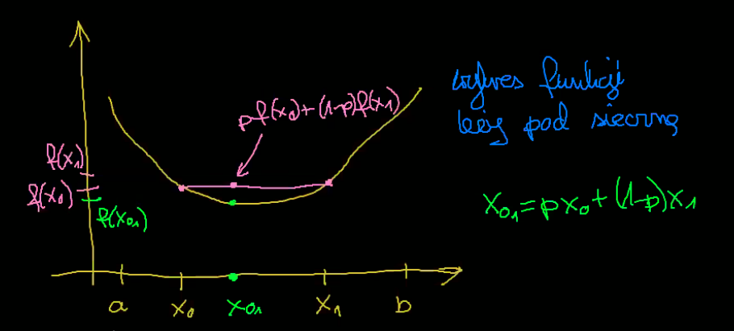

# Przypomnienie — funkcja wypukła

*(2020-10-22)*

- [1. DEF: Funkcja wypukła](#1-def-funkcja-wypukła)
- [2. DEF: Funkcja ściśle wypukła](#2-def-funkcja-ściśle-wypukła)
- [3. Fakt#1](#3-fakt1)
    - [3.1. D-d](#31-d-d)
- [4. Przykład](#4-przykład)
    - [4.1. Ćwiczenie](#41-ćwiczenie)

---

## 1. DEF: Funkcja wypukła

$f: [a;b] \to \mathbb{R}$ jest wypukła $\iff$ gdy $\forall x_0, x_1 \in [a;b] \enspace \forall p\in [0;1]$
$$
p\cdot f(x_0) + (1-p) \cdot f(x_1) \ge f(p x_0 + (1-p) x_1)
$$

---

## 2. DEF: Funkcja ściśle wypukła

$\forall x_0, x_1 \in [a;b] \enspace \forall p\in (0;1)$\
$x_0 \neq x_1$
$$
pf(x_0) + (1-p)f(x_1) > f(px_0 + (1-p) x_1)
$$

## 3. Fakt#1
*(praktyczny)*

1. Jeśli $f''(x) \ge 0$,\
to $f$ jest wypukła.

2. jeśli $f''(x) < 0$\
to $f$ jest ściśle wypukła.

### 3.1. D-d

- $f: [a;b] \to \mathbb{R}$
- $y,y'$ takie, że $y < y'$
- $\frac{f'(y') - f'(y)}{y' - y} = f''(\xi)$ dla pewnego $\xi \in (y,y')$ z twierdzenia Lagrange’a

Zatem
$y < y' \to f'(y) \le f'(y')$

Stąd, dla $x_0, x_1, \enspace p\in (0;1)$\
$f(px_0 +(1-p)x_1) - pf(x_0) - (1-p)f(x_1) = p\left( f(px_0 + (1-p)x_1) - f(x_0) \right) - (1-p)\left( f(x_1) - f(px_0 + (1-p)x_1) \right) = p\left( \frac{f(px_0 + (1-p)x_1) - f(x_0)}{px_0 + (1-p)x_1 - x_0} \right)(1-p)(x_1 - x_0) - (1-p)\left( \frac{f(x_0) - f(px_0 + (1-p) x_1)}{x_1 - px_0 - (1-p)x_1} \right) \cdot p \cdot (x_1 - x_0) = p(1-p)(x_1 - x_0)\left( f'(y) - f'(y') \right) = (*)$\
*z twierdzenia Langrage’a*\
dla pewnych $y \in (x_0; px_0 + (1-p)x_1)$ oraz $y' \in (px_0 + (1-p) x_1; x_1)$ (tu : $y' > y$)\
$(*) \le 0$\
$(*) < 0$ dla $f$ ściśle wypukłej

---

## 4. Przykład

$g(x) = |x|$ jest wypukła, ale nie ma pochodnej (w $x=0$).

### 4.1. Ćwiczenie
Zrób $g$ ściśle wypukłą bez drugiej pochodnej.

---
