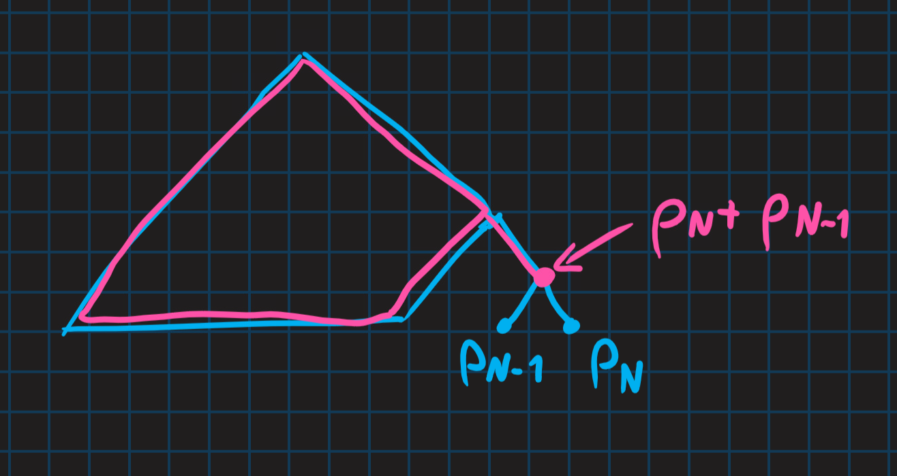

---

- [1. Overview](#1-overview)
- [2. Przykład](#2-przykład)
- [3. Fakt o słowach kodowych Huffmana](#3-fakt-o-słowach-kodowych-huffmana)
    - [3.1. D-d](#31-d-d)
- [4. Fakt o własnościach optymalnych kodów](#4-fakt-o-własnościach-optymalnych-kodów)
    - [4.1. D-d](#41-d-d)
- [5. Fakt#3](#5-fakt3)
    - [5.1. D-d](#51-d-d)
- [6. Twierdzenie o kodach Huffmana](#6-twierdzenie-o-kodach-huffmana)
    - [6.1. D-d](#61-d-d)

---

## 1. Overview

$X = \{x_1, x_2, \dots, x_N\} \quad p_1 \ge p_2 \ge \dots \ge p_N$

0. Budujemy las o drzewach jednoelementowych:

    $$
    \underset{x_1}{\overset{p_1}{\circ}}\quad
    \underset{x_2}{\overset{p_2}{\circ}}\quad
    \underset{x_3}{\overset{p_3}{\circ}}\quad
    \dots\quad
    \underset{x_N}{\overset{p_N}{\circ}}.
    $$

1. Wybieramy dwa drzewa o najmniejszych „wagach” i robimy z nich drzewo.
2. Dostajemy las o drzewach:

    $$
    \underset{x_1}{\overset{p_1}{\circ}}\quad
    \underset{x_2}{\overset{p_2}{\circ}}\quad
    \dots\quad
    \underset{x_{N-2}}{\overset{p_{N-2}}{\circ}}
    $$
    oraz\
    .

3. Sortujemy las względem „wag” i kończymy, jeśli zostało tylko jedno drzewo lub idziemy do kroku 1.

Na „dowidzenia” dostaniemy drzewo binarne (o wadze $1$) i liściach etykietowanych $\{x_1, x_2, \dots, x_N\}$. Możemy z tego odczytać kody!

Gratis: **owe kody są prefiksowe.**

---

## 2. Przykład

Mamy
- $X = \{x_1, x_2, x_3, x_4, x_5\}$
- $p_1 = \frac{1}{2}, \enspace p_2 = \frac{1}{3},\enspace p_3 = p_4 = p_5 = \frac{1}{18}$

Czyli mamy las początkowy:
$$
    \underset{x_1}{\overset{\frac{1}{2}}{\circ}}\quad
    \underset{x_2}{\overset{\frac{1}{3}}{\circ}}\quad
    \underset{x_3}{\overset{\frac{1}{18}}{\circ}}\quad
    \underset{x_4}{\overset{\frac{1}{18}}{\circ}}\quad
    \underset{x_5}{\overset{\frac{1}{18}}{\circ}}.
$$

Iterujemy:\
\
\

Czyli teraz możemy policzyć kody poszczególnych symboli:
- $c(x_1) = 0$
- $c(x_2) = 10$
- $c(x_3) = 111$
- $c(x_4) = 1100$
- $c(x_5) = 1101$

---

## 3. Fakt o słowach kodowych Huffmana

1. $l_1 \le l_2 \le l_3 \le \dots \le l_N$ ($l_i = |c(x_i)|$)
2. $l_{N-1} = l_N$
3. $c(x_N)$ oraz $c(x_{N-1})$ różnią się tylko ostatnim bitem.

### 3.1. D-d

*Punkty 2. oraz 3. są oczywiste.*\
(patrz [przykład](#2-przykład) — pierwsze połączone wisienki)

1. mniej oczywiste, zaraz zostanie wyjaśnione

---

## 4. Fakt o własnościach optymalnych kodów

1. $l_1 \le l_2 \le l_3 \le \dots \le l_N$
2. $l_{N-1} = l_N$

### 4.1. D-d

1. Załóżmy, że $l_i > l_j$ dla pewnego $i<j$

    $|c(x_k)| = l_k$.\
    Robimy kodowanie $\tilde{c}$:
    - $\tilde{c}(x_i) = c(x_j) \quad \tilde{c}(x_j) = c(x_i)$
    - $\tilde{c}(x_k) = c(x_k)$ dla $k \notin \{i,j\}$

    $l_{\tilde{c}} = \sum_{k=1}^N p_k \tilde{l}_k = \sum_{k \neq i,j} p_k \tilde{l}_k + p_i \tilde{l}_i + p_j \tilde{l}_j = \sum_{k \neq j,i} p_k l_k + p_i l_j + p_j l_i < \sum_{k} p_k l_k$,\
    ponieważ\
    $p_i l_j + p_j l_i < p_i l_i + p_j l_j$,\
    $p_i (l_j - l_i) < p_j (l_j - l_i)$,\
    $p_i > p_j$\
    (*ostrość!*)

    *generalnie $p_i < p_j \implies l_i \le l_j$*

2. Jeśli $l_N \neq l_{N-1}$, to $l_n > l_{N-1}$ oraz $l_N$ jedyna;\
    tzn. $\{N\} = \{i: l_i = l_N\}$

    $c(x_N) = \varepsilon_1 \varepsilon_2 \dots \varepsilon_{l_N} \qquad \tilde{c}(x_N) = \varepsilon_1 \varepsilon_2 \dots \varepsilon_{N-1}$\
    $\tilde{c}(x_k) = c(x_k)$ dla $k < N$\
    $\tilde{L} < L \quad$ *sprzeczność*

    Eureka: $\tilde{c}$ jest prefiksowy!

---

## 5. Fakt#3

Istnieje kod optymalny $c$ (dla $p_1 \ge p_2 \ge p_3 \ge \dots \ge p_N$) spełniający warunki:
1. $l_1 \le l_2 \le \dots l_N$
2. $l_{N-1} = l_N$
3. $c(x_N)$ oraz $c(x_{N-1})$ różnią się tylko ostatnim bitem.

### 5.1. D-d

Punkty 1. i 2. OK.

Aby zrobić 3., trzeba zmodyfikować kod optymalny, który mamy $c'$.

Liczby $l_1, \dots, l_N$ spełniają [nierówność Kraft’a](../2020-10-15/nierówność-krafta.md). Można zrobić kod prefiksowy spełniający dodatkowo punkt 3.

$\square$

---

## 6. Twierdzenie o kodach Huffmana
***— Kody Huffmana są optymalne!***

### 6.1. D-d

(przez indukcję względem $N$; $N=1,2$ nie sprawia problemu)

Mamy $\{p_1, p_2, \dots, p_N\}$ i robimy $\{q_1, q_2, \dots, q_{N-1}\}$ gdzie $q_i = p_i$ dla $i \le N-2$; $q_{N-1} = p_{N-1} + p_N$.

Niech:
- $L^*_N$ — średnia długość optymalnego kodu (prefiksowego) dla $p$.
- $L^*_{N-1}$ średnia długość optymalnego kodu (prefiksowego) dla $q$.

$L_N$ — średnia długość kodu Huffmana dla $p$.

$L_N = \sum_{i=1}^N p_i l_I = \sum_{i=1}^{N-2} p_i l_i + \underbrace{p_{N-1} l_{N-1} + p_N l_N}_{(p_{N-1} + p_N) l_N} = (*)$\
i niech:
- $p_{N-1} + p_n = q_k'$ („$'$”, bo uporządkowane)
- $l_N = l_{N-1} = l_k' + 1$

Dalej:
$$
(*) = \sum_{i\neq k}q_i' l_i' + q_k- (l_k' + 1) = \bold{L_{N-1}^* + p_{N-1} + p_N}.
$$

---

Weźmy teraz optymalne kodowanie dla układu $\{p_1,\dots,p_N\}$. Ma ono średnią długość $L_N^*$.

Wiemy, że optymalne kodowanie można zrobić tak, aby kody odpowiadające $p_{N-1}$ i $p_N$ były bliźniakami (czyli stanowiły jedną wisienkę).

Optymalne „drzewa kodów” („$*$”) $\{p_1,\dots,p_N\}$ przerabiamy robiąc pewne drzewo kodów dla $\{p_1,\dots, p_{N_2}, p_{N-1} + p_N\} = \{q_1, \dots, q_{N-1}\}$.

$$
L_N^* = \sum_{i=1}^N l_i^* p_i
\\[10pt]
L_{N-1}' = \sum_{i=1}^{N-1} l_i' q_i = \sum_{i=1}^{N-2} l_i* p_i + \underbrace{(l_{N-1}^* - 1)}_{l_N^*} (p_{N-1} + p_N) =\\[5pt]
\sum_{i=1}^N l_i^* p_i - p_{N-1} - p_N
$$

Czyli
$$
L_{N-1}' + p_{N-1} + p_N = L_N^*.
$$

Wcześniej mieliśmy $L_{N-1}^* + p_{N-1} + p_N = L_N$

Co jest dobre, ponieważ $L_{N}^* \le L_N$, bo $L_{N}^*$ jest tym kodem idealnym. To samo się dzieje dla $(N-1)$: $L_{N-1}^* \le L_{N-1}'$.

Zatem (z powyższych nierówności i równości), mamy
$$
L_N = L_N^* \quad (\text{oraz } L_{N-1}' = L_{N-1}^*)
$$

$\square$

---
