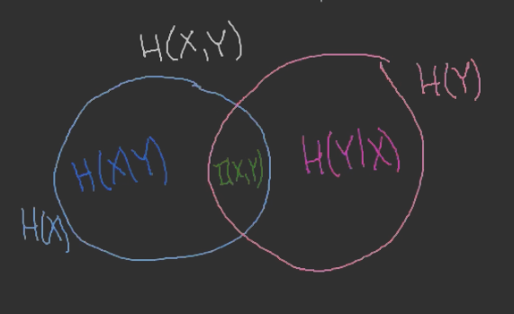

---

- [1. Zmienna losowa](#1-zmienna-losowa)
- [2. DEF: Entropia łączna](#2-def-entropia-łączna)
    - [2.1. Przykład (oczywisty)](#21-przykład-oczywisty)
    - [2.2. Przykład](#22-przykład)
- [3. Twierdzenie#1](#3-twierdzenie1)
    - [3.1. D-d](#31-d-d)
- [4. DEF: Informacja wzajemna zmiennych losowych](#4-def-informacja-wzajemna-zmiennych-losowych)
    - [4.1. Fakt#1 (oczywisty)](#41-fakt1-oczywisty)
    - [4.2. Fakt#2 (oczywisty)](#42-fakt2-oczywisty)
    - [4.3. Fakt#3 (oczywisty)](#43-fakt3-oczywisty)
    - [4.4. Równoważnie](#44-równoważnie)
- [5. Odległość Kullbacha-Leiblera](#5-odległość-kullbacha-leiblera)
- [6. DEF: Entropia warunkowa](#6-def-entropia-warunkowa)
    - [6.1. Przykład (oczywisty)](#61-przykład-oczywisty)
- [7. Fakt#4](#7-fakt4)
    - [7.1. D-d](#71-d-d)
- [8. Reguła łańcucha](#8-reguła-łańcucha)
    - [8.1. Fakt#5](#81-fakt5)
        - [8.1.1. D-d](#811-d-d)
- [9. Pomniejsze uwagi](#9-pomniejsze-uwagi)
- [10. Diagram Vienna](#10-diagram-vienna)
- [11. Trzy zmienne](#11-trzy-zmienne)
- [12. Twierdzenie (reguła łańcucha dla entropii łącznej)](#12-twierdzenie-reguła-łańcucha-dla-entropii-łącznej)
    - [12.1. D-d](#121-d-d)
- [13. Twierdzenie (reguła łańcucha dla entropii warunkowej)](#13-twierdzenie-reguła-łańcucha-dla-entropii-warunkowej)

---

## 1. Zmienna losowa

*Myślimy tu o entropii zmiennej losowej.*

$$
X: \Omega \to \mathcal{X} \quad (\text{u nas } \mathcal{X} \text{ jest skończona})
$$

Zamiast $P(X = x), \enspace x \in \mathcal{X}$ będziemy pisać $p(x)$.

$$
H(X) = \sum_{x \in \mathcal{X}} p(x) \log \frac{1}{p(x)}.
$$

---

## 2. DEF: Entropia łączna

Mamy zmienne losowe:

$$
X: \Omega \to \mathcal{X}, \enspace Y: \Omega \to \mathcal{Y}.
$$

Przez entropię łączną rozumiemy

$$
H(X,Y) = \sum_{x \in \mathcal{X}} \sum_{y \in \mathcal{Y}} p(x,y) \log \frac{1}{p(x,y)}
$$

gdzie

$$
p(x,y) = P(X = x, Y = y) = P(X = x \land Y = y).
$$

Można myśleć o tym jak o zmiennej losowej

$$
T: \Omega \to \mathcal{X} \times \mathcal{Y}
\\[10pt]
T(\omega) = \left( X(\omega), Y(\omega) \right)
\\[10pt]
H(X,Y) = H(T)
$$

Umawiamy się, że $0 \cdot \log \frac{1}{0} = 0$.

---

### 2.1. Przykład (oczywisty)

Mamy
$$
H(X,X) = \sum_{x\in\mathcal{X}} \sum_{x' \in \mathcal{X}} p(x,x') \cdot \log \frac{1}{p(x,x')} = (*)
$$
gdzie
$$
p(x,x') = P(X = X \land X = x') =
\begin{cases}
    0 & x \neq x'\\
    p(x) & x = x'\\
\end{cases}
$$
co daje nam
$$
(*) = \sum_{x\in\mathcal{X}} p(x) \log \frac{1}{p(x)} = H(X).
$$

---

### 2.2. Przykład

Załóżmy, że $X$ i $Y$ są niezależne, czyli

$$
P(X = x, Y = y) = P(X = x) \cdot P(Y = y), \quad p(x,y) = p(x) \cdot p(y),
$$

wówczas

$$
H(X,Y) = \sum_{x,y} p(x,y) \log \frac{1}{p(x,y)} = \sum_{x,y} p(x) p(y) \frac{1}{p(x) p(y)} =\\
=\sum_{x,y} p(x) p(y) \left( \log \frac{1}{p(x)} + \log \frac{1}{p(y)} \right) =\\
= \sum_{x,y} p(x) p(y) \log \frac{1}{p(x)} + \sum_{x,y} p(x) p(y) \log\frac{1}{p(y)} =\\
= \left( \sum_y p(y) \right) \left( \sum_x p(x) \log \frac{1}{p(x)} \right) + \left( \sum_x p(x) \right) \left( \sum_y p(y) \log \frac{1}{p(y)} \right) =\\
= H(X) + H(Y).
$$

---

## 3. Twierdzenie#1

$$
H(X,Y) \le H(X) + H(Y)
$$

Ponadto mamy tutaj równość, wtedy i tylko wtedy gdy zmienne losowe są niezależne.

### 3.1. D-d

$$
H(X,Y) = \sum_{x,y} p(x,y) \log\frac{1}{p(x,y)}
$$

[Wcześniej wyrachowaliśmy](#3-przykład), że

$$
H(X) + H(Y) = \sum_{x,y} p(x) p(y) \log \frac{1}{p(x) p(y)} =\\
= \sum_x p(x) \log \frac{1}{p(x)} + \sum_{y} p(y) \log\frac{1}{p(y)} =\\
= \sum_{x,y} p(x,y) \log\frac{1}{p(x)} + \sum_{x,y} p(x,y) \log \frac{1}{p(y)} = (*)
$$

Tutaj korzystamy z naturalnego faktu, że

$$
p(x) = \sum_y p(x,y).
$$

Dalej:

$$
\sum_{x,y} p(x,y) \left( \log \frac{1}{p(x)} + \log \frac{1}{p(y)} \right) =
\\[10pt]
\sum_{x,y}p(x,y) \log \frac{1}{p(x) p(y)}
$$

Mamy też:

$$
\sum_{x,y} p(x,y) = 1
\\[10pt]
\sum_{x,y} p(x) p(y) = 1
$$

Z [twierdzenia](../2020-10-29/kody-huffmana.md#6-twierdzenie-o-kodach-huffmana) (o $p_N, q_N, \dots$) mamy $H(X,Y) \le H(X) + H(Y)$.

$\square$

---

Ponadto

$$
H(X,Y) = H(X) + H(Y)
$$

wtedy i tylko wtedy, gdy $(p_N = q_N)$:

$$
p(x,y) = p(x) p(y)
$$

co oznacza, że zmienne $X$ i $Y$ są niezależne.

$\square$

---

## 4. DEF: Informacja wzajemna zmiennych losowych

Informacją wzajemną zmiennych $X,Y$ nazywamy

$$
I(X,Y) = H(X) + H(Y) - H(X,Y).
$$

### 4.1. Fakt#1 (oczywisty)

$$
I(X,Y) = 0 \iff X,Y \text{ są niezależne}
$$

### 4.2. Fakt#2 (oczywisty)

$$
I(X,Y) \ge 0.
$$

### 4.3. Fakt#3 (oczywisty)

$$
I(X,X) = H(X) + H(X) - H(X,X) = H(X).
$$

---

### 4.4. Równoważnie

$$
I(X,Y) = \sum_{x,y} p(x,y) \log \frac{1}{p(x) p(y)} + \sum_{x,y} p(x,y) \log \frac{1}{p(x,y)} =\\
= \sum_{x,y} p(x,y) \log \frac{p(x,y)}{p(x) p(y)}
$$

---

## 5. Odległość Kullbacha-Leiblera

$$
D(p || q) = \sum_{a \in A} p(a) \log \frac{p(a)}{q(a)}
$$

gdzie $A$ to skończona przestrzeń probabilistyczna.

$$
(A, p), \enspace (A, q), \enspace \mathcal{F} = \mathcal{P}(A)
$$

W [$I(X,Y)$](#5-def-informacja-wzajemna-zmiennych-losowych) mamy dwie funkcje prawdopodobieństw na zbiorze $\mathcal{X} \times \mathcal{Y}$:

$$
\begin{aligned}
    {p_1(\{(x,y)\})} = p_1(x,y) &= p(x,y)\\
    p_2(x,y) &= p(x) p(y)
\end{aligned}
$$

Mamy $D(p || q) \ge 0$ oraz $D(p || q) = 0 \iff p = q$.

*Czy funkcja $D( \cdot || \cdot )$ ma coś jeszcze wspólnego z metryką?*

---

## 6. DEF: Entropia warunkowa

*Mierzymy ilość informacji potrzebną do odkodowania $X$ jeśli znamy $Y$.*

Entropię warunkową $X$ od $Y$ definiujemy przez

$$
H(X | Y) = \sum_{y \in \mathcal{Y}} p(y) H(X | y),
$$

gdzie
$$
H(X | y) = \sum_{x \in \mathcal{X}} p(x | y) \log \frac{1}{p(x | y)}
$$

Równoważnie:

$$
H(X | Y) = \sum_{x,y} p(y) p(x | y) \log \frac{1}{p(x | y)} =\\
= \sum_{x,y} p(x,y) \log \frac{1}{p(x | y)},
$$

bo warto pamiętać, że:

- $p(x | y) = P(X = x | Y = y)$,
- $p(y) \cdot p(x | y) = p(y) \cdot \frac{p(x,y)}{p(y)}$.

---

### 6.1. Przykład (oczywisty)

$$
H(X | X) = \sum_{x \in \mathcal{X}} p(x) \sum_{x' \in \mathcal{X}} p(x'|x) \log\frac{1}{p(x'|x)} = (*),
$$
ale najpierw
$$
p(x'|x) = P(X = x' | X = x) =
\begin{cases}
    1 & x' = x\\
    0 & x' \neq x\\
\end{cases}
$$

Czyli
$$
(*) = \sum_{x \in \mathcal{X}} p(x) \cdot 0 = 0.
$$

---

## 7. Fakt#4

$$
H(X,Y) = H(X | Y) + H(Y).
$$

### 7.1. D-d

$$
H(X | Y) + H(Y) = \sum_{x,y} p(x,y) \log \frac{1}{p(x | y)} + \sum_{x,y} p(x,y) \log \frac{1}{p(y)} =\\
\sum_{x,y} p(x,y) \log \frac{1}{p(x | y) \cdot p(y)}
$$

---

## 8. Reguła łańcucha

$$
H(X,Y) = H(X|Y) + H(Y).
$$

### 8.1. Fakt#5

$$
I(X,Y) = H(X) - H(X|Y)
$$
czyli *na jak dużo nam pozwala $Y$, żeby zrozumieć $X$.*

#### 8.1.1. D-d

$$
I(X,Y) = H(X) + H(Y) - H(X,Y) = (*)
$$
*wykorzystujemy regułę łańcucha*
$$
H(X) + H(Y) - H(X|Y) - H(Y) = H(X) - H(X|Y)
$$

$\square$

---

## 9. Pomniejsze uwagi

1. $H(X,Y) = H(Y,X)$
2. $I(X,Y) = I(Y,X)$

Wnioski:
1. $I(X,Y) = H(Y) - H(Y|X)$
2. $I(X,Y) \le \min\{H(X), H(Y)\}$

---

## 10. Diagram Vienna

---

## 11. Trzy zmienne

$$
H(X,Y,Z) = H(X,Y;Z) = H(X;Y,Z).
$$

Czyli
$$
\sum_{x,y,z} p(x,y,z) \log\frac{1}{p(x,y,z)} = \sum_{x,y} \sum_z p((x,y), z) \log \frac{1}{p((x,y),z)}
$$

$$
p(x,y,z) = P(X = x \land Y = y \land Z = z) =
\\[10pt]
P((X,Y) = (x,y) \land Z = z) = p((x,y),z)
$$

*Ale w przypadku $I$ sytuacja się zmienia!*

---

## 12. Twierdzenie (reguła łańcucha dla entropii łącznej)

$$
H(X_1, X_2, \dots, X_m) = \sum_{i=1}^n \underbrace{H(X_i | X_{i+1}, \dots, X_n)}_{H(X_i | (H_{i+1}, \dots, X_1))} = (*)
$$

$$
(*) = \sum_{i=1}^n H(X_i | X_{i-1}, \dots, X_1)
$$

### 12.1. D-d

*indukcja względem $n$*

1. $n = 1$

    $$
    H(X_1) = \sum_{i=1}^1 H(X_i | X_{i+1}, \dots, X_1) = H(X_1).
    $$

2. $n = 2$

    $$
    H(X_1, X_2) = H(X_1 | X_2) + H(X_2) = (*)
    $$
    ([reguła łańcucha](#8-reguła-łańcucha))

    alternatywnie:
    $$
    (*) = H(X_1) + H(X_2 | X_1)
    $$

3. $n \Rightarrow n+1$

    $$
    H(X_1; X_2, \dots, X_n; X_{n+1}) = (*)
    $$
    grupujemy $n$ ostatnich zmiennych (oddzielamy pierwszą od reszty)
    $$
    (*) = H(X_1 | X_2, \dots, X_{n}, X_{n+1}) + H(X_2, \dots, X_n, X_{n+1}) = (*)
    $$
    *wykorzystujemy założenie indukcyjne dla ciągu $X_2,\dots,X_{n+1}$*
    $$
    \begin{aligned}
        (*) = H(X_1 | X_2, \dots, X_{n+1}) &+ H(X_2 | X_3, X_4, \dots, X_{n+1}) +\\
        &+ H(X_3 | X_4, \dots, X_{n+1}) +\\
        &+ H(X_4 | X_5, \dots, X_{n+1}) +\\
        &\dots\\
        &+ H(X_n | X_{n+1}) +\\
        &+ H(X_{n+1}) = \sum_{i=1}^{n+1} H(X_i | X_{i+1}, \dots, X_{n+1})
    \end{aligned}
    $$

---

## 13. Twierdzenie (reguła łańcucha dla entropii warunkowej)

$$
H(X_1, X_2, \dots, X_n | Y) = \sum_{i=1}^n H(X_i | X_{i+1}, \dots, X_n, Y) = \sum_{i=1}^n H(X_1| X_{i-1}, \dots, X_1, Y)
$$

---
