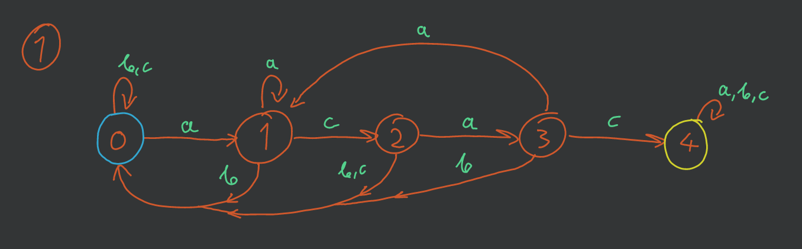

# Lista-3

*(Termin oddania: 2020-11-30)*

- [Zadanie 1.](#zadanie-1)
- [Zadanie 2.](#zadanie-2)
- [Zadanie 3.](#zadanie-3)
- [Zadanie 4.](#zadanie-4)

---

## Zadanie 1.

> Niech $\mathcal{L}$ będzie językiem nad alfabetem $\{a, b, c\}$ złożonym ze słów, które zawierają ciąg $acac$. Opisać odpowiedni automat skończony oraz przedstawić OGF dla $\mathcal{L}$.

Mamy:
- alfabet $\mathcal{A} = (A = \{a,b,c\}, |\cdot| = \{x \in A: x \to 1\})$
- [wzorzec blokowy](../../wyk/2020-10-26/języki.md#4-wzorce-blokowe) $\overline{p} = acac$

Budujemy odpowiedni automat skończony ([DFA](../../../../5th-semester/jftt/wyk/2020-10-08/języki-formalne-wprowadzenie.md#2-deterministyczny-automat-skończony-dfa)):\
\
który akceptuje słowo, które ma w sobie ciąg $\overline{p}$.

Definiujemy klasy kombinatoryczne bazujące na powyższym automacie:
- $\mathcal{L}_0 = \{a\}\mathcal{L}_1 + \{b\}\mathcal{L}_0 + \{c\}\mathcal{L}_0$
- $\mathcal{L}_1 = \{a\}\mathcal{L}_1 + \{b\}\mathcal{L}_0 + \{c\}\mathcal{L}_0$
- $\mathcal{L}_2 = \{a\}\mathcal{L}_3 + \{b\}\mathcal{L}_0 + \{c\}\mathcal{L}_0$
- $\mathcal{L}_3 = \{a\}\mathcal{L}_1 + \{b\}\mathcal{L}_0 + \{c\}\mathcal{L}_4$
- $\mathcal{L}_4 = \{a\}\mathcal{L}_4 + \{b\}\mathcal{L}_4 + \{c\}\mathcal{L}_4 + \{\epsilon\}$

oraz odpowiadające im OGFs:
- $L_0(z) = 2zL_0(z) + zL_1(z)$
- $L_1(z) = zL_0(z) + zL_1(z) + zL_2(z)$
- $L_2(z) = 2zL_0(z) + zL_3(z)$
- $L_3(z) = zL_1(z) + zL_4(z) + zL_0(z)$
- $L_4(z) = 3zL_4(z) + 1$

Po rozwiązaniu układu równań otrzymujemy:
$$
L_0(z) = \frac{-z^4}{(3z-1)(z^4 - 3z^3 + z^2 - 3z + 1)}.
$$

Jako, że $\mathcal{L} = \mathcal{L}_0$ żądana OGF jest równa podanej powyżej $L_0$.

---

## Zadanie 2.

> Ile jest słów długości n nad alfabetem $\{a, b, c, d, e, f, g\}$, które zawierają wzorzec blokowy $aabbaa$?

Skorzystamy tutaj ze [wzoru z wykładu](../../wyk/2020-10-26/języki.md#42-ciągi-długości-n-z-wzorcem-overlinep) na OGF dla klasy ciągów bez danego wzorca blokowego:
$$
S(z) = \frac{C(z)}{z^k + (1 - mz) \cdot C(z)}.
$$

W naszym przypadku:
- $m = 7$ (liczba liter w alfabecie)
- $C(z) = 1 + z^4 + z^5$ (wielomian charakterystyczny dla $\overline{p}$)
- $k = 6$ (długość wzorca $\overline{p}$)

Oczywiście, w zadaniu chcemy uzyskać takie słowa, które akurat mają ten wzorzec przynajmniej raz — wystarczy odjąć od wszystkich możliwych słów:
$$
\mathcal{L} \cong \operatorname{SEQ}(\mathcal{A}) - \mathcal{S}
$$
(użyty tutaj „$-$” jest *debatable*, ale reprezentuje naszą ideę)\
co daje nam OGF:
$$
L(z) = \frac{1}{1-7z} - \frac{1 + z^4 + z^5}{z^6 + (1 - 7z)(1 + z^4 + z^5)} =\\
= \sum_{n\ge0} 7^n z^n - (1 + z^4 + z^5) \cdot \left( \frac{1}{1 - (6z^6 + 6z^5 - z^4 + 7z)} \right)
$$

Odpowiedzią będzie po prostu $[z^n]L(z) = 7^n - [z^n]\left( \frac{1 + z^4 + z^5}{1 - (6z^6 + 6z^5 - z^4 + 7z)} \right)$

Sprawdzenie:
- dla $n < 6$, czyli np. $n = 5$ wynik $[z^n]\left( \frac{1 + z^4 + z^5}{1 - (6z^6 + 6z^5 - z^4 + 7z)} \right)$ wynosi dokładnie $7^5$ ([WolframAlpha](https://www.wolframalpha.com/input/?i=SeriesCoefficient%5B+%281+%2B+z%5E4+%2B+z%5E5%29%2F%281+-+6z%5E6+-+6z%5E5+%2B+z%5E4+-+7z%29%2C+%7Bz%2C+0%2C+5%7D%5D+%3D+7%5E5)) co daje wynik ostateczny $[z^n]L(z) = 7^5 - 7^5 = 0$.
- dla $n \ge 6$ mamy już jakieś słowa, które się zaliczają ([WolframAlpha](https://www.wolframalpha.com/input/?i=7%5E8+-+SeriesCoefficient%5B+%281+%2B+z%5E4+%2B+z%5E5%29%2F%281+-+6z%5E6+-+6z%5E5+%2B+z%5E4+-+7z%29%2C+%7Bz%2C+0%2C+8%7D%5D)) i np. dla $n = 8$ mamy już $147$ takich wyrazów.

---

## Zadanie 3.

> Zastosować tw. Lagrange’a do policzenia współczynnika przy wyrazie $z^n$ dla funkcji $L(z)$, będącej rozwiązaniem równania
> $$
> \frac{L(z)}{z} = 1 + (L(z))^3
> $$

Na początku uprośćmy wyrażenie:
$$
L(z) = z\left(1 + (L(z))^3\right)
$$

Teraz według [twierdzenia Lagrange’a o inwersji](../../wyk/2020-11-09/tw-lagrangea-o-inwersji.md) określamy funkcję pomocniczą $\varphi$:
$$
\varphi(x) = 1 + x^3
$$
co daje nam możliwość zredefiniowania funkcji
$$
L(z) = z \cdot \varphi(L(z)).
$$

Następnie korzystamy ze wzoru $[z^n] y(z) = \frac{1}{n} [x^{n-1}] \varphi^n(x)$ gdzie $y$ to tutaj $L$:
$$
[z^n] L(z) = \frac{1}{n}[x^{n-1}] \varphi^n(x) =\\
= \frac{1}{n} [x^{n-1}] \left( 1 + x^3 \right)^n =\\
= \frac{1}{n} [x^{n-1}] \sum_{k=0}^n x^{3k} \binom{n}{k}=\\
=\frac{1}{n} \cdot
\begin{cases}
    \binom{n}{\frac{n-1}{3}} & n \equiv 1 \mod 3\\
    0 & \text{oth.}
\end{cases}
$$

---

## Zadanie 4.

> Napisz wzór OGF $S^{(4)}(z)$ takiej, że współczynnik przy wyrazie $z^n$ będzie liczbą Strilinga II rodzaju ${ n \brace 4}$ to znaczy $[z^n]S^{(4)}(z) = {n \brace 4}$.

Liczba Stirlinga ${n \brace 4}$ określa liczbę sposobów, na jakich możemy podzielić zbiór $n$-elementowy na $4$ niepuste podzbiory.

Dla każdego elementu w wejściowym zbiorze $n$-elementowym możemy przypisać jakąś indywidualną liczbę naturalną — etykietę. Wówczas mamy odpowiadający wejściowemu zbiorowi zbiór $\{1,\dots,n\}$.

Żeby podzielić teraz ten zbiór na cztery podzbiory, najpierw wybieramy liderów. Teraz dobieramy kolejne elementy do każdego podzbioru — chcemy, żeby były one większe niż ich liderzy. Wówczas jednym z liderów musi być zawsze „$1$”.

Idea jest taka: zaczynając od jedynki, napotykamy kolejne elementy — narazie należą one do podzbioru $s_1$ o liderze $1$. Następnie natrafiamy na kolejnego lidera drugiego podzbioru $s_2$ — idąc dalej, natrafiamy na kolejne elementy, które mogą należeć albo do podzbioru $s_1$ albo $s_2$. Kiedy napotykamy lidera podzbioru $s_3$ mamy tą samą sytuację — i tak dalej aż do wyczerpania elementów zbioru wejściowego.

Ta powyższa *bajeczka* jest prawdziwa, ponieważ takie podejście załatwia nam zachowanie *jednego* porządku elementów, co jest ważne, bo nie chcemy liczyć wielu rozstawień elementów. Mówimy o zbiorach, gdzie kolejność elementów nie ma znaczenia.

Możemy powyższą *historyjkę* opisać klasą kombinatoryczną:
$$
\begin{aligned}
\mathcal{S}^{(4)} \cong& s_1\, \operatorname{SEQ}(s_1)\, s_2 \operatorname{SEQ}(s_1 + s_2)\,\\
&s_3\, \operatorname{SEQ}(s_1 + s_2 + s_3)\, s_4\, \operatorname{SEQ}(s_1 + s_2 + s_3 + s_4)
\end{aligned}
$$
a stąd mamy też OGF:
$$
S^{(4)}(z) = z^4 \cdot \frac{1}{(1-z)(1-2z)(1-3z)(1-4z)}
$$

---
