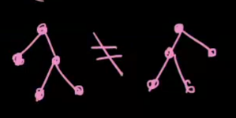
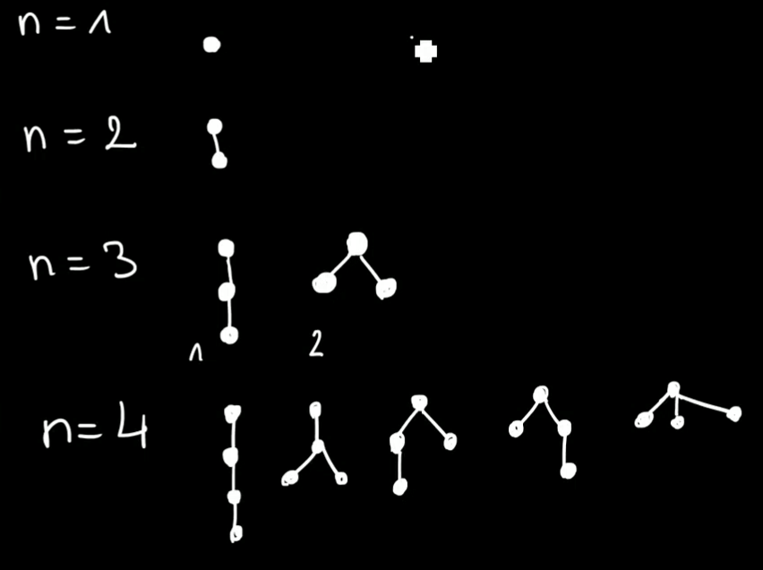
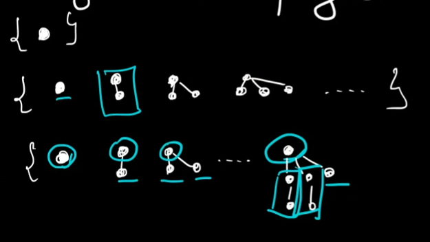

# Przykładowe zastosowanie — Plane Trees

*(2020-10-19)*

- [1. Drzewa uporządkowane](#1-drzewa-uporządkowane)
- [2. Klasa kombinatoryczna](#2-klasa-kombinatoryczna)
    - [2.1. OGF](#21-ogf)

---

## 1. Drzewa uporządkowane

Drzewa takie, w których zachowujemy orientację całego drzewa\
\
i dokładną pozycję każdego z węzłów.

Nie chodzi nam o drzewa w rozumieniu grafów.

Lista możliwych drzew dla liczby węzłów $[0;4]$:\

---

## 2. Klasa kombinatoryczna

Spójrzmy na drzewa uporządkowane nieco „z góry”:\

Można zauważyć, że każde drzewo jest zbudowane z korzenia oraz z pewnej liczby poddrzew.

Czyli mamy:
$$
\mathcal{T} \cong \mathcal{Z} \times \operatorname{SEQ}(\mathcal{T})
$$

---

Możemy też podejść do sprawy nieco inaczej:\
$T^{(i)}$ — klasa drzew o głębokości $<i$
- $T^{(1)} = \mathcal{Z} \times \operatorname{SEQ}(\emptyset)$
- $T^{(2)} = \mathcal{Z} \times \operatorname{SEQ}(\mathcal{T}^{(1)})$
- $T^{(3)} = \mathcal{Z} \times \operatorname{SEQ}(\mathcal{T}^{(2)})$

wizualnie:\

- $\mathcal{T}^{(i)} \subseteq \mathcal{T}^{(i+1)}$
- $\bigcup_{i=1}^{\infty} \mathcal{T}^{(i)} \cong \lim_{i\to\infty} \mathcal{T}^{(i)}$
- $\lim_{i\to \infty} T^{(i)}(z) = T(z)$

---

### 2.1. OGF

Jednakże do liczenia OGF użyjemy tej pierwszej metody:
$$
\mathcal{T} \cong \mathcal{Z} \times \operatorname{SEQ}(\mathcal{T})
$$

czyli mamy OGF: $T(z) = z \cdot \frac{1}{1 - T(z)}$
- $T(z)(1-T(z)) = z$
- $(T(z))^2 - T(z) + z = 0$
    - $\bold{T(z) = \frac{1}{2}\left( 1 - \sqrt{1 - 4z} \right)}$
    - $\sout{T(z) = \frac{1}{2}\left( 1 + \sqrt{1 - 4z} \right)}$

Mamy też coś takiego: $\sqrt{1 - 4z} = \sum_{n=0}^\infty (4z)^n \cdot \binom{\frac{1}{2}}{n} = \sum_{n=0}^\infty \frac{1}{n} \binom{2n - 2}{n-1} \cdot z^n$

Sprawdźmy dla $n=4$:\
$\frac{1}{4} \cdot \binom{6}{3} = 5$\
i to się zgadza z [tym, co otrzymaliśmy wcześniej](#1-drzewa-uporządkowane)

---
