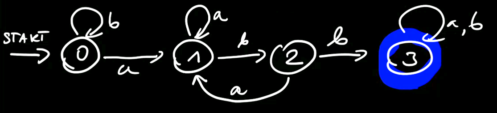

---

- [1. Słowa, języki](#1-słowa-języki)
    - [1.1. Przykład](#11-przykład)
    - [1.2. Przykład](#12-przykład)
    - [1.3. Przykład](#13-przykład)
    - [1.4. Przykład](#14-przykład)
- [2. Wzorce ukryte](#2-wzorce-ukryte)
    - [2.1. Przykład](#21-przykład)
        - [2.1.1. **Złe** rozwiązanie](#211-złe-rozwiązanie)
        - [2.1.2. **Dobre** rozwiązanie](#212-dobre-rozwiązanie)
- [3. Automaty skończone](#3-automaty-skończone)
    - [3.1. Przykład](#31-przykład)
- [4. Wzorce blokowe](#4-wzorce-blokowe)
    - [4.1. Zgodność prefiksowo-sufiksowa](#41-zgodność-prefiksowo-sufiksowa)
    - [4.2. Ciągi długości $n$ z wzorcem $\overline{p}$](#42-ciągi-długości-n-z-wzorcem-overlinep)

---

## 1. Słowa, języki

Mamy $\mathcal{A} = (\left\{ a_1, a_2, \dots, a_m \right\}, |\cdot|)$, gdzie $\forall i \enspace |a_i| = 1$.

Wówczas $\mathcal{W} = \operatorname{SEQ}(\mathcal{A})$\
oraz $W(z) = \frac{1}{1 - mz}$, bo $A(z) = m\cdot z$.

---

### 1.1. Przykład

*Ile jest słów długości $n$ takich, że *nie ma* $k$ liter $a$ z rzędu?*\
$n=4,~ k=2 \qquad bbbb \quad abbb \quad abab \quad baba \quad \dots$

- $\mathcal{L} \cong a^{<k} \operatorname{SEQ}(b \cdot a^{<k})$
- $a^{<k} = \epsilon, a, aa, aaa, \dots, \underbrace{a\dots a}_{k-1}$
- $a^{<k}(z) = \frac{1 - z^k}{1-z}$
- $b\cdot a^{<k}(z) = \frac{z(1 - z^k)}{1-z}$
- $L(z) = \frac{1 - z^k}{1-z} \cdot \frac{1}{1 - \frac{z\cdot(1-z^k)}{1-z}} = \frac{1-z^k}{1 - 2z + z^{k-1}}$

---

### 1.2. Przykład

*Co, gdy chcemy policzyć, ile jest słów takich, że jest co najwyżej $k$ liter $a$ oraz $b$ z rzędu.*

- $\mathcal{W}^{(k,k)} \cong \operatorname{SEQ}_{\le k}(b) \cdot \operatorname{SEQ}(a \cdot \operatorname{SEQ}_{<k}(a) \cdot b \cdot \operatorname{SEQ}_{<k}(b)) \cdot \operatorname{SEQ}_{\le k}(a)$
- $W^{(k,k)}(z) = \left( \frac{1 - z^{k+1}}{1-z} \right)^2 \cdot \left( \frac{1}{1 - \frac{z^2}{\left( 1 - \left( \frac{1 - z^k}{1-z} \right) \right)^2}} \right)$
- jeżeli chcemy policzyć, ile jest ciągów, w których mamy dokładnie $k$-literowych podciągów naszych liter robimy: $W^{(k,k)}_n - W^{(k - 1, k - 1)}_n$

---

### 1.3. Przykład

*Ile jest słów nad $\{a,b\}$ długości $n$ takich, że jest dokładnie $k$ wystąpień litery (symbolu) «$b$»?*

Standardowo, oczywiście $\binom{n}{k}$ jako, że wybieramy z $n$ miejsc $k$ miejsc, na których stawiamy litery (symbole) «$b$».

Ale popatrzmy na to zadanie w nieco inny sposób.

Mamy
$$
\underbrace{a\dots a}_{0–\infty}\, \overset{1}{b}\, \underbrace{a\dots a}_{0–\infty}\, \overset{2}{b}\, \underbrace{a\dots a}_{0–\infty}\, \overset{3}{b}\, \dots \overset{k}{b}\, \underbrace{a\dots a}_{0–\infty}
$$

Czyli mamy
$$
\operatorname{SEQ}(\{a\}) \enspace \{b\} \enspace \operatorname{SEQ}(\{a\}) \enspace \{b\} \enspace \operatorname{SEQ}(\{a\}) \{b\} \dots \{b\} \operatorname{SEQ}(\{a\})
$$

Ostatecznie mamy język określony przez klasę kombinatoryczną:
$$
\mathcal{L} \cong (\operatorname{SEQ}(\{a\}))^{k+1} (\{b\})^k,\\
L(z) = \left( \frac{1}{1-z} \right)^{k+1} \cdot z^k.
$$

---

### 1.4. Przykład

*Ile jest ciągów nad alfabetem $\{a,b\}$ takich, że jest $k$ liter «$b$» oraz odległość każdego «$b$» od swojego poprzednika to co najwyżej $d$?*

Popatrzmy na przykład słowa należącego do takiego języka. Weźmy $k=3, d=3$:
$$
aaaaaaaaaaaaa\, b\, a\, b\, aaa\, b\, aaaaaaaa
$$

Jesteśmy w stanie określić klasę kombinatoryczną:
$$
\mathcal{L} \cong \operatorname{SEQ}(\{a\})\, \{b\}\, \operatorname{SEQ}_{\le d}(\{a\})\, \{b\}\, \operatorname{SEQ}_{\le d}(\{a\})\, \dots\, \{b\}\, \operatorname{SEQ}(\{a\})
$$

Wówczas OGF:
$$
L(z) = \left( \frac{1}{1-z} \right)^2 \cdot z^k \cdot \left( 1 + z + z^2 + \dots + z^d \right)^{k-1} =\\
= \left( \frac{1}{1-z} \right)^2 \cdot z^k \cdot \left( \frac{1 - z^{d-1}}{1-z} \right)^{k-1} =\\
= \frac{z^k\left( 1 - z^{d-1} \right)^{k-1}}{(1-z)^{k-1}}
$$

Podzielmy na części OGF:
$$
A_1(z) = \frac{z^k}{(1-z)^{k+1}} = \sum_{n\ge0} a^{(1)}_n z^n\\
A_2(z) = \left( 1-z^{d+1} \right)^{k-1} = \sum_{n\ge0} a^{(2)}_n z^n
$$

Czyli $L(z) = A_1(z) A_2(z)$, wówczas:
$$
l_n = \sum_{k=0}^n a^{(1)}_k \cdot a^{(2)}_{n-k}
$$

---

## 2. Wzorce ukryte

Mamy pewny ciąg liter, który ma w sobie ukryte dane słowo.

Np. mamy tekst:

_**Kom**u **bi**je dzwo**n**_\
_**A** **t**ego **r**aczej nie wiem._\
_B**y**ć może **ka**żdemu._

I ukryte słowo «_kombinatoryka_».

### 2.1. Przykład

*Ile jest słów nad alfabetem $\mathcal{A}$ (mamy $m$ symboli), które zawierają ukryty wzorzec ze słowem «kombinatoryka»?*

#### 2.1.1. **Złe** rozwiązanie
$$
B \cong \operatorname{SEQ}(\mathcal{A})\, \{k\}\, \operatorname{SEQ}(\mathcal{A})\, \{o\}\, \dots\, \operatorname{SEQ}(\mathcal{A})
$$

Wówczas OGF:
$$
B(z) = \frac{z^{13}}{(1 - mz)^{14}}.
$$

#### 2.1.2. **Dobre** rozwiązanie

Naszą klasę trzeba nieco zmodyfikować:
$$
\operatorname{SEQ}(\mathcal{A} \setminus \{k\})\, \{k\}\, \operatorname{SEQ}(\mathcal{A} \setminus \{o\})\, \{o\}\, \dots\, \operatorname{SEQ}(\mathcal{A} \setminus \{a\})\, \{a\}\, \operatorname{SEQ}(\mathcal{A})
$$

Czyli OGF wynosi:
$$
B(z) = \frac{z^{13}}{\left( 1 - (m-1)z \right)^{13}} \cdot \frac{1}{1-mz}
$$

---

## 3. Automaty skończone

### 3.1. Przykład
*Czy słowo zawiera ciąg $abb$?* ($\mathcal{A} = \{a,b\}$)

$\mathcal{L}_i$ — klasa słów akceptowanych przez powyższy automat jeśli zaczynamy ze stanu $i$.

- $\mathcal{L}_3 = \mathcal{E} + a \mathcal{L}_3 + b \mathcal{L}_3$
- $\mathcal{L}_2 = b\mathcal{L}_3 + a\mathcal{L}_1$
- $\mathcal{L}_1 = a\mathcal{L}_1 + b\mathcal{L}_2$
- $\mathcal{L}_0 = a\mathcal{L}_1 + b\mathcal{L}_0$

Czyli:
- $L_0(z) = zL_1(z) = zL_0(z)$
- $L_1(z) = zL_1(z) + zL_2(z)$
- $L_2(z) = zL_1(z) + zL_3(z)$
- $L_3(z) = zL_3(z) + zL_3(z) + 1$

a po rozwiązaniu układu równań:
$$
L_0(z) = \frac{z^3}{(1-z)(1-2z)(1-z-z^2)} \overset{\operatorname{Apart}}{=}\\
= \frac{1}{1-2z} - \frac{2+z}{1-z-z^2} + \frac{1}{1-z}
$$

Liczymy współczynnik:
$$
[z^n]L_0(z) = 2^n - F_{n+3} + 1
$$

---

## 4. Wzorce blokowe

Tym razem, w odróżnieniu od [wzorców ukrytych](#2-wzorce-ukryte), musimy mieć w tekście dany blok liter koło siebie, w odpowiedniej kolejności.

Np. *Dobry ptero**daktyl** jest!* ma w sobie wzorzec blokowy «daktyl».

### 4.1. Zgodność prefiksowo-sufiksowa

Określamy ciąg $c = (c_0, c_1, \dots, c_{k-1})$ oraz liczby $c_i = \llbracket p_1 p_2 \dots p_{k-i} = p_{i+1} \dots p_k \rrbracket$ gdzie $\llbracket \cdot \rrbracket$ jest notacją Iversona. Czyli porównujemy końcówki z początkami danego słowa. Ciąg $c$ nazywamy *ciągiem charakterystycznym dla słowa $\overline{p}$.

Np. weźmy $aabbaa$ — jego ciągiem charakterystycznym jest $c = (c_0, c_1, \dots, c_{k-1}) = (1,0,0,0,1,1)$ bo tylko dwie literki $aa$ na początku i na końcu czynią zadość równości.

Określamy również wielomian charakterystyczny:
$$
C(z) = \sum_{j=0}^{k-1} c_j z^j
$$
i znowu dla $aabbaa$ będzie to po prostu $C(z) = 1 + z^4 + z^5$.

---

### 4.2. Ciągi długości $n$ z wzorcem $\overline{p}$

*Ile jest ciągów długości $n$ nad alfabetem $\mathcal{A}$, które zawierają wzorzec blokowy $\overline{p}$?*

Mamy:
- alfabet $\mathcal{A}$ o $m$ literach
- wzorzec $\overline{p} = p_1 p_2 \dots p_k$

Szukamy języka (klasy) słów zawierających blok $\overline{p}$.

Weźmy
- $\mathcal{S}$ — słowa bez bloku $\overline{p}$
- $\mathcal{T}$ — słowa, które mają na końcu $\overline{p}$, ale nie mają innego wystąpienia $\overline{p}$

Wówczas
$$
\mathcal{S} + \mathcal{T} \cong \{\epsilon\} + \mathcal{S} \times \mathcal{A}
$$
ponieważ możemy wziąć takie słowo, które nie ma na pewno na końcu $\overline{p}$ albo wziąć takie, któremu brakuje jednej literki i tutaj wystarczy dokleić jedną literkę z alfabetu $\mathcal{A}$.

Dodatkowo
$$
\mathcal{S} * \overline{p} \cong \mathcal{T} * \sum_{\forall i\enspace c_i \neq 0} \left\{ p_{k-i+1}, \dots, p_k \right\}
$$
($*$ to konkatenacja)\
a to dlatego, że w $\mathcal{T}$ będzie końcówka, która będzie się zgadzać z początkiem tego wzorca:\

Z powyższych własności mamy:
$$
S(z) + T(z) = 1 + S(z) \cdot mz
$$
oraz
$$
S(z) \cdot z^k = T(z) \cdot C(z)
$$
co daje nam
$$
S(z) = \frac{C(z)}{z^k + (1 - mz) \cdot C(z)}
$$

---
