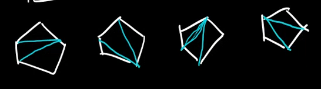
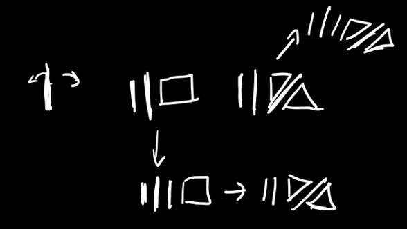

---

- [1. Przykładowe triangulacje $(n+2)$–kąta](#1-przykładowe-triangulacje-n2kąta)
- [2. Klasa kombinatoryczna](#2-klasa-kombinatoryczna)
    - [2.1. Definicja *kinda* rekurencyjna](#21-definicja-kinda-rekurencyjna)
- [3. OGF](#3-ogf)

---

## 1. Przykładowe triangulacje $(n+2)$–kąta

1. $2$-kąt możemy podzielić na $0$ sposobów:\
    $|$
2. $3$-kąt możemy podzielić na $1$ sposób:\
    $\triangle$
3. $4$-kąt możemy podzielić na $2$ sposoby:\
    $\cancel\square$ + odbicie
4. $5$–kąt możemy podzielić na $5$ sposobów:\
    

*(Liczby Catalana)*

---

## 2. Klasa kombinatoryczna

$\mathcal{T} \cong \mathcal{E} + \mathcal{T} \times \mathcal{Z} \times \mathcal{T}$

($\mathcal{E}$ odpowiada $2$-kątowi, kiedy $\mathcal{Z}$ odpowiada trójkątowi)

Rozumujemy to jako jeden trójkąt, który może mieć po dwóch stronach pewne wielokąty do triangulacji. Ten trójkąt dzieli dwa wielokąty do podziału.

### 2.1. Definicja *kinda* rekurencyjna

Mamy podstawowy $2$-kąt: $\boldsymbol{|}$ który ma $0$ triangulacji oraz podstawowy trójkąt $\triangle,$ który ma tylko $1$ triangulację.

Przykładowo dla $4$-kąta:\

## 3. OGF

- $T(z) = 1 + z\cdot(T(z))^2$
- $T(z) = \sum_{n=0}^{\infty} \frac{1}{n+1} \binom{2n}{n} \cdot z^n$

---
