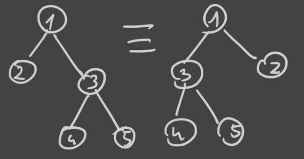
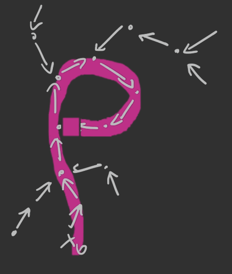

# Struktury etykietowane i EGF

*(2020-11-16, 2020-11-23, 2020-11-30)*

- [1. Struktury etykietowane](#1-struktury-etykietowane)
- [2. Klasa kombinatoryczna (etykietowana)](#2-klasa-kombinatoryczna-etykietowana)
- [3. EGF](#3-egf)
- [4. Przykłady](#4-przykłady)
    - [4.1. Przykład](#41-przykład)
    - [4.2. Przykład (*Urny*)](#42-przykład-urny)
    - [4.3. Przykład](#43-przykład)
- [5. Produkt etykietowany (star product)](#5-produkt-etykietowany-star-product)
    - [5.1. Przykład](#51-przykład)
    - [5.2. Definicja formalna](#52-definicja-formalna)
- [6. EGF klas pochodnych](#6-egf-klas-pochodnych)
    - [6.1. Przykład (permutacje)](#61-przykład-permutacje)
    - [6.2. Przykład (nieporządki)](#62-przykład-nieporządki)
    - [6.3. Przykład (suriekcje)](#63-przykład-suriekcje)
- [7. Drzewo etykietowane (non-ordered labelled tree)](#7-drzewo-etykietowane-non-ordered-labelled-tree)
- [8. *Mappings*](#8-mappings)
- [9. Metoda $\rho$-Pollarda](#9-metoda-rho-pollarda)

---

## 1. Struktury etykietowane

Obiekt etykietowany to graf o $n$ wierzchołkach, w którym każdy elementy ma unikalną etykietę ze zbioru $\{1,\dots,n\}$.

Czyli jak wcześniej mieliśmy $\mathcal{Z}_1 \times \mathcal{Z}_2$, która zawierała tylko jedną parę $(\circ, \circ)$ to tutaj zaczynamy rozróżniać te dwa elementy w parze — każdy element dostaje etykietę.

---

## 2. Klasa kombinatoryczna (etykietowana)

$\mathcal{A} = \left\{ A, |\cdot|, \beta \right\}$\
gdzie $\forall a \in A \quad \beta: a \to \{1,\dots,n\}$.

## 3. EGF

$A(z) = \sum_{\alpha \in A} \frac{z^{|\alpha|}}{|\alpha|!} = \sum_{n=0} \frac{A_n}{n!} z^n$\
gdzie $A_n = n! \cdot [z^n] A(z)$.

## 4. Przykłady

### 4.1. Przykład

- $\mathcal{Z} = \left\{ (1), |(1)| = 1, \beta \right\} \qquad Z(z) = z$
- $\mathcal{E} = \left\{ \epsilon, |\epsilon| = 0 \right\} \qquad E(z) = 1$

Zobaczmy $\operatorname{SEQ}(\mathcal{Z}) \cong P$

mamy $\epsilon \quad (1) \quad (1,2); (2,1) \quad (1,2,3); (1,3,2); \dots (3,2,1)$ (czyli faktycznie $n!$)

$P(z) = \sum_{n\ge0} \frac{n!}{n!} z^n = \frac{1}{1-z}$

---

### 4.2. Przykład (*Urny*)

Ile jest urn, które zawierają $i$ elementów?

0. $\epsilon$
1. $(1)$
2. $(1),(2)$
3. $(1),(2),(3)$
4. $\dots$

zawsze jest tylko jedna taka urna, czyli ciąg $u_n = (1,1,1,1,\dots)$.

EGF: $\sum_{n\ge0} u_n \frac{z^n}{n!} = \sum_{n\ge0} \frac{z^n}{n!} = \exp(z)$.

---

### 4.3. Przykład

Ile jest cykli z etykietowanymi elementami?

1. 1: $(1)$
2. 1: $(1) \to (2) \to (1)$
3. 2: $(1) \to (2) \to (3) \to (1) \qquad (1) \to (3) \to (2) \to (1)$
4. 6: $(1) \to (2) \to (3) \to (4) \to 1 \dots$

Możemy zauważyć, że permutujemy $n$ elementów. Jedyne co to jeszcze możemy dowolnie przesuwać otrzymane sekwencje, bo rozmawiamy o cyklach, czyli mamy ich $\frac{n!}{n} = (n-1)!$.

Czyli EGF:
$$
C(z) = \sum_{n\ge0} \frac{(n-1)!}{n!} z^n = \sum_{n\ge0} \frac{z^n}{n} = \ln \frac{1}{1-z}
$$

---

## 5. Produkt etykietowany (star product)

Mając dane dwie klasy etykietowane $\mathcal{A}$ oraz $\mathcal{B}$,\
$\mathcal{A} \star \mathcal{B}$ to klasa uporządkowanych par $(a,b)$ takich, że $a \in A$ oraz $b \in B$, poetykietowanych tak, że został zachowany porządek względny.

### 5.1. Przykład

Mamy
- $\mathcal{A} = (A, |\cdot|, \gamma_1)$
- $\mathcal{B} = (B, |\cdot|, \gamma_2)$
- $\mathcal{A} \star \mathcal{B} = (A \times B, |\cdot|, \gamma)$

Jeśli $\alpha \in A$, $\beta \in B$:
- $\alpha = (1)–(2)$
- $\beta = (2)–(1)–(3)$

wówczas $\alpha \star \beta:$
- $(1)–(2) \enspace (4)–(3)–(5)$
- $(1)–(3) \enspace (4)–(2)–(5)$
- $(2)–(5) \enspace (3)–(1)–(4)$

Możemy to zrobić na $\binom{|\alpha| + |\beta|}{|\alpha|}$ czyli tutaj $\binom{5}{2}$.

---

Funkcję etykietowaną $\gamma$ definiujemy w taki sposób, że
- $\forall x,y \in A \quad \gamma_1(x) < \gamma_1(y) \implies \gamma(x) < \gamma(y)$
- $\forall x,y \in B \quad \gamma_2(x) < \gamma_2(y) \implies \gamma(x) < \gamma(y)$

Czyli jeśli $|a|_A = n$ oraz $|b|_B = m$ wówczas $|a \star b| = \binom{n+m}{n}$.

### 5.2. Definicja formalna

Mając $\mathcal{C} = \mathcal{A} \star \mathcal{B}$ mamy $C_n = \bigcup\left\{ a \star b: |a| + |b| = n \right\} = \bigcup_{k=0}^n \left\{ a\star b: |a| = k \land |b| = n-k \right\}$.

Czyli $c_n = \sum_{k=0}^n a_k \cdot b_{n-k} \binom{n}{k}$.

EGF: $C(z) = \sum_{n\ge0} \frac{z^n}{n!} \left( \sum_{k=0}^n \binom{n}{k} a_{k} b_{n-k} \right) = \left( \sum_{n\ge0}\frac{a_n z^n}{n!} \right) \cdot \left( \sum_{n\ge0}\frac{b_n z^n}{n!} \right) = A(z) \cdot B(z)$ co jest bardzo dobre!

Ważne:
$$
\frac{a_k \cdot b_{n-k} \cdot z^{k + (n-k)}}{k! (n-k)!} = \frac{\binom{n}{k} a_k a_{n-k} z^n}{n!}
$$

---

## 6. EGF klas pochodnych

Niech
- $\mathcal{A}, \mathcal{B}$ będą klasami kombinatorycznymi
- $A(z), B(z)$ będą ich EGF

Wówczas
1. $\mathcal{A} + \mathcal{B} \iff A(z) + B(z)$
2. $\mathcal{A} * \mathcal{B} \iff A(z) \cdot B(z)$
3. $\operatorname{SEQ}(\mathcal{A}) \iff \frac{1}{1 - A(z)}$
4. $\operatorname{CYC}(\mathcal{A}) \iff \ln \frac{1}{1 - A(z)} = \sum_{n\ge1} \frac{A^n(z)}{n}$
5. $\operatorname{MSET}$ *nie działa*
6. $\operatorname{SET}(\mathcal{A})(z) = 1 + A(z) + \frac{A^2(z)}{2!} + \frac{A^3(z)}{3!} + \dots = \exp(A(z))$

---

### 6.1. Przykład (permutacje)

Mamy permutację:
$$
\begin{aligned}
    1 && 2 && 3 && 4 && 5 && 6\\
    3 && 1 && 2 && 6 && 5 && 4
\end{aligned}
$$
Można na nią spojrzeć na następujące sposoby:
1. $(3)–(1)–(2)–(6)–(5)–(4)$
2. $(1)\to(3)\to(2)\to(1)$\
    $(4)\to(6)\to(4)$\
    $(5)\to(5)$

Permutacje określa klasa
$$
\mathcal{P} = \operatorname{SEQ}(\mathcal{Z})\\
P(z) = \frac{1}{1-z}
$$

A formę cykli określa klasa
$$
\mathcal{P}' = \operatorname{SET}(\operatorname{CYC}(\mathcal{Z}))
$$
czyli OGF $P'(z) = \exp\left(\ln\frac{1}{1-z}\right)$, ale przecież $\exp\left( \ln \frac{1}{1-z} \right) = \frac{1}{1-z}$ — czyli obie sposoby „patrzenia” na permutacje są równoważne.

---

### 6.2. Przykład (nieporządki)

*Nieporządki to permutacje bez punktów stałych — innymi słowy składają się z cykli o długości większej niż jeden.*

Opisuje tę sytuację klasa $\mathcal{D} = \operatorname{SET}(\operatorname{CYC}_{>1}(\mathcal{Z}))$ z OGF $D(z) = \exp(A(z))$ gdzie $A(z) = \ln\frac{1}{1-z} - z$, bo odejmujemy ten jeden cykl zwrotny.

Czyli $D(z) = \exp\left( \ln\frac{1}{1-z} - z \right) = \frac{\exp(-z)}{1 - z}$.

---

### 6.3. Przykład (suriekcje)

*funkcje „na”*

Mamy $\{1,\dots,n\} \to \{1,\dots,r\}$ gdzie $r \le n$. Każdy przeciwobraz każdego elementu ze zbioru $\{1,\dots,r\}$ jest niepusty.

Możemy suriekcje utożsamić z urnami, gdzie dla każdego elementu z $\{1,\dots,r\}$ mamy urnę, gdzie jest przynajmniej jeden element z $\{1,\dots,n\}$.

Klasa kombinatoryczna: $\mathcal{S} = \operatorname{SEQ}_{=r}\left( \operatorname{SET}_{\neq 0}(\mathcal{Z}) \right)$ z EGF $S(z) = (e^z - 1)^r$.

Zapisujemy $s_n^r = n! [z^n] (e^z - 1)^r$ jako liczbę suriekcji ze zbioru $n$-elementowego do zbioru $r$-elementowego.

---

## 7. Drzewo etykietowane (non-ordered labelled tree)

Mamy drzewa gdzie każdy węzeł etykietujemy pewną liczbą naturalną, przy czym nie rozróżniamy w jakiej kolejności mamy uporządkowane gałęzie tego drzewa.\
Czyli następujące drzewa są równoważne:\

Wówczas taka struktura może być reprezentowana przez klasę $\mathcal{T} = \mathcal{Z} \times \operatorname{SET}(\mathcal{T})$ z EGF $T(z) = z \cdot \exp(T(z))$.

Wówczas (z [twierdzenia lagrange’a o inwersji](../2020-11-09/tw-lagrangea-o-inwersji.md)) mamy
$$
T_n = n! [z^n] T(z) = n! \left( \frac{1}{n} [x^{n-1}] \cdot \left( e^x \right)^n \right) =\\
= \frac{n!}{n} \cdot \left( [x^{n-1}] \sum_{k\ge0} \frac{(x\cdot n)^k}{k!} \right) = \frac{n!}{n} \cdot \frac{n^{n-1}}{(n-1)!} = n^{n-1},
$$
czyli liczbę drzew o $n$ wierzchołkach.

*Cayley’s formula*

---

## 8. *Mappings*

Mamy $\{1,\dots,n\} \to \{1,\dots,r\}$ gdzie $r \le n$. Takich funkcji mamy $r^n$, bo dla każdego elementu z $\{1,\dots,n\}$ mamy zawsze do dyspozycji $r$ elementów.

Klasa kombinatoryczna: $\mathcal{F} = \operatorname{SEQ}_{=r}\left( \operatorname{SET}(\mathcal{Z}) \right)$ z EGF $F(z) = \left( e^z \right)^r = e^{zr}$.

Liczba *mappings* z $\{1,\dots,n\}$ w $\{1,\dots,r\}$ wynosi:
$$
F_n = n! [z^n] F(z) = n! [z^n] \sum_{k\ge0} \frac{(zr)^k}{k!} =\\
= n! \cdot \frac{r^n}{n!} = r^n
$$

---

## 9. Metoda $\rho$-Pollarda

Szukamy konfliktów danej funkcji hashującej $f$, czyli dla $x_0 \neq x_1$ mamy $f(x_0) = f(x_1)$.

Zamysł: bierzemy losowy $x_0$ i tworzymy ciąg $x_n = f(x_{n_1})$.\
Szukamy kolejnych wyrazów ciągu aż nie znajdziemy powtórki — wówczas mamy takie *graficzne $\rho$*:\

Okazuje się, że klasę takich funkcji możemy określić przez $\mathcal{F} = \operatorname{SET}\left( \operatorname{CYC}(\mathcal{T}) \right)$, gdzie $\mathcal{T} = \mathcal{Z} \times \operatorname{SET}(\mathcal{T})$ ([drzewa etykietowane](#7-drzewo-etykietowane-non-ordered-labelled-tree)).

Czyli mamy
$$
F(z) = \exp\left( \ln \frac{1}{1-T(z)} \right) = \frac{1}{1 - T(z)}=\\
= \sum_{k\ge0} \frac{T^k(z)}{k!}
$$
i znowu stosując [twierdzenia Lagrange’a o inwersji (tym razem drugi punkt)](../2020-11-09/tw-lagrangea-o-inwersji.md) możemy wyjść z rekursji w funkcji $T(z)$.

---
