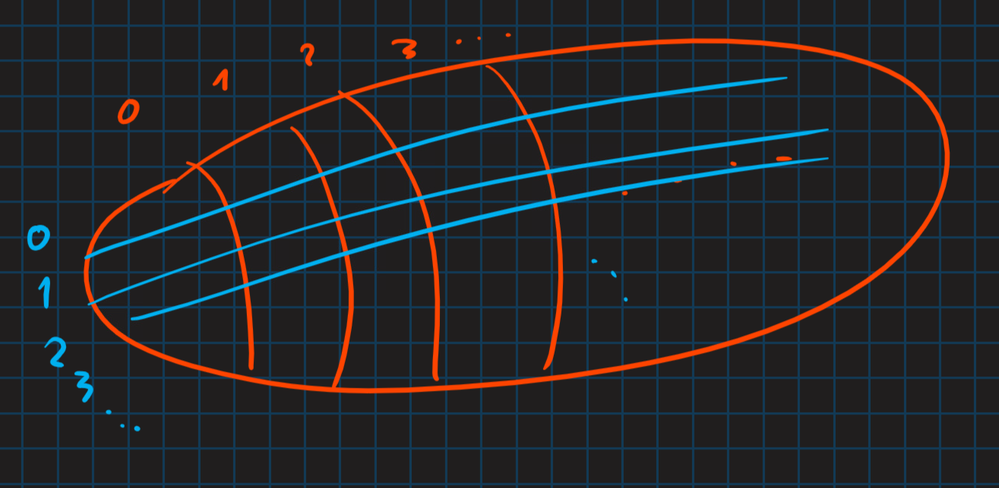

# Bivariate generating functions (BGF)

*(2020-11-30, 2020-12-07)*

- [1. Klasa kombinatoryczna (zmodyfikowana)](#1-klasa-kombinatoryczna-zmodyfikowana)
- [2. Przykład](#2-przykład)
- [3. Przykład](#3-przykład)
- [4. Liczba elementów wagi $a_n$](#4-liczba-elementów-wagi-a_n)
- [5. Interpretacja graficzna](#5-interpretacja-graficzna)
    - [5.1. Przykład](#51-przykład)
- [6. Przykład (ciągi binarne)](#6-przykład-ciągi-binarne)
- [7. PGF (Probability generating functions)](#7-pgf-probability-generating-functions)
    - [7.1. Wartość oczekiwana](#71-wartość-oczekiwana)
        - [7.1.1. Przykład](#711-przykład)
    - [7.2. Przykład](#72-przykład)
    - [7.3. Wariancja](#73-wariancja)
    - [7.4. Przykłady](#74-przykłady)
    - [7.5. Przykład](#75-przykład)
        - [7.5.1. Liczby Stirlinga partycyjne (II rodzaju)](#751-liczby-stirlinga-partycyjne-ii-rodzaju)
        - [7.5.2. Liczby Stirlinga permutacyjne (I rodzaju)](#752-liczby-stirlinga-permutacyjne-i-rodzaju)
        - [7.5.3. Jeszcze jedna maszynka](#753-jeszcze-jedna-maszynka)
        - [7.5.4. Idea](#754-idea)

---

## 1. Klasa kombinatoryczna (zmodyfikowana)

Tym razem oprócz funkcji rozmiaru $|\cdot|$ mamy drugą funkcję wagi $\chi$. Czyli mamy trójkę\
$\mathcal{A} = (A, |\cdot|, \chi)$\
z BGF $A(z,u) = \sum_{n,k} a_{n,k} z^n u^k$,\
gdzie $a_{n,k} = \left\lvert \left\{a \in A: |a| = n \land \chi(a) = k\right\} \right\rvert$.

- $A(z,u) = \sum_{a \in A} z^{|a|} u^{\chi(a)}$

---

## 2. Przykład

Mamy elementy:
- waga 1kg, cena 3zł,
- waga 1kg, cena 2zł,
- waga 2kg, cena 10zł.

Wówczas BGF: $F(z,u) = z u^3 + zu^2 + z^2 u^{10}$.

---

## 3. Przykład

Mamy alfabet $\{0,1\}$ z funkcjami wag:
- $|\cdot|$ — długość ciągu,
- $\chi$ — waga Hamminga.

$$
W(z,u) = \sum_{k,n}\binom{n}{k} z^n u^k = \sum_{n} z^n \left( \sum_{k} \binom{n}{k} u^k \right)=\\
= \sum_n z^n (1 + u)^n = \frac{1}{1 - z(1+u)}
$$

Ustalmy sobie pewne $k$:
$$
W^{(k)}(z) = \sum_n \binom{n}{k} z^n = \frac{z^k}{(1-z)^{k+1}}\\
W(z,u) = \sum_k u^k \cdot \frac{z^k}{(1-z)^{k+1}} = \frac{1}{1-z} \sum_k \frac{(zu)^k}{(1-z)^k} = \frac{1}{1-z} \cdot \frac{1}{1 - \frac{zu}{1-z}} =\\
= \frac{1}{1-z(1+u)}
$$

---

## 4. Liczba elementów wagi $a_n$

- $A(z,u) = \sum_{n,k} a_{n,k} z^n u^k$
- $a_n = \left\lvert \left\{ a \in A: |a| = n \right\} \right\rvert$
- $a_n = [z^n] A(z,1) = [z^n] \sum_{n,k} a_{n,k} \cdot z^n = \sum_{k} a_{n,k}$

---

## 5. Interpretacja graficzna

Mając $F(z,u) = \sum_{n,k} f_{n,k} z^n u^n$ możemy podzielić na części:
- $f_n(u) = \sum_k f_{n,k} u^k$ gdzie $n$ jest stałą
- $f^{<k>}(z) = \sum_{n} f_{n,k} z^n$ gdzie $k$ jest stałą

Czyli dzielimy tę klasę na warstwy, przy czym możemy patrzeć na to z dwóch perspektyw — $n$ i $k$ (jak dwie złączone ze sobą klasy kombinatoryczne):\

Zatem
$$
\sum_n f_n(u) z^n = \sum_k u^k f^{<k>}(z) = F(z,u).
$$

### 5.1. Przykład

*Kontynuacja [przykładu wcześniejszego](#2-przykład)*

Przez to, że $F(u,z) = z u^2 + z u^3 + z^2 u^{10}$ mamy:
- $M^{<1>}(z) = 0$
- $M^{<2>}(z) = z$
- $M_1(u) = u^2 + u^3$

---

## 6. Przykład (ciągi binarne)

*Kontynuacja [przykładu wcześniejszego](#3-przykład)*

Mamy alfabet $\{0,1\}$ ze słowami oczywiście $x \in \{0,1\}^*$. Definiujemy funkcje wag:
- $|\cdot|$ — długość ciągu,
- $\chi(x)$ — waga Hamminga (liczba jedynek).

Czyli np. $|010| = 3,\, \chi(010) = 1$.

Mamy $W(z,u) = \sum_{n,k} \binom{n}{k} u^k z^n$, jako że ciągów długości $n$ i wadze Hamminga $k$ jest $\binom{n}{k}$ (wybieramy $k$ jedynek).

Warto zauważyć, że
$$
W(z,u) = \sum_{n\ge0} (1+u)^n \cdot z^n
$$
bo przecież mamy tam zagnieżdżoną znaną równość
$$
\sum_{k=0}^n \binom{n}{k}u^k 1^{n-k} = (1 + u)^k
$$
gdzie to $k$ jest zależne od naszego $n$. Zakładamy, że $\binom{n}{k}$ dla $k > n$ jest równe zero, więc możemy to włożyć właśnie do naszej funkcji.

Dalej
$$
\sum_{n\ge0} (1+u)^n \cdot z^n = \frac{1}{1-z(1+u)}.
$$

- $W^{<k>}(z) = \sum_n \binom{n}{k} z^n = \frac{z^k}{(1-z)^{k+1}}$ gdzie $k$ jest stałe
- $W(z,u) = \sum_{k} u^k W^{<k>}(z) = \sum_k \frac{(uz)^k}{(1 - z)^{k+1}} = \frac{1}{1-z} \sum_k \left( \frac{uz}{1-z} \right) = \frac{1}{1-z} \cdot \frac{1}{1 - \frac{uz}{1-z}}$ a to po odpowiednich przekształceniach da nam to co wcześniej osiągnęliśmy przy $W(z,u)$.

---

## 7. PGF (Probability generating functions)

Mamy pewne prawdopodobieństwa $p_0,p_1,\dots$. Funkcja PGF ma postać $\sum p_i u^i$ gdzie $p_i = \operatorname{Pr}[X = i]$.

Inaczej $\operatorname{Pr}_{(n),x} [\chi(x) = k] = \frac{a_{n,k}}{a_n}$ gdzie $n$ to jest oczywiście pewna stała. Czyli *jakie jest prawdopodobieństwo, że wylosowane $x$ będzie akurat wagi $k$*.\
Równoważny zapis:
$$
\operatorname{Pr}_{(n),x} [\chi(x) = k] = \frac{[u^k]\left( [z^n](A(z,u)) \right)}{[z^n] A(z,1)},
$$
a co za tym idzie
$$
\sum_k \operatorname{Pr}[\chi(x) = k] u^k = \frac{[z^n] A(z,u)}{[z^n] A(z,1)}.
$$

---

### 7.1. Wartość oczekiwana

Wszystkie momenty:
$$
\mathbb{E}\big(\chi (\chi -1) \dots \chi (\chi - 1) (\chi - r+1)\big) =
\\[10pt]
= \frac{[z^n] \partial^r_u A(z,u)|_{u=1}}{[z^n] A(z,1)}
$$
gdzie $\chi$ jest zmienną losową oznaczającą wartość funkcji $\chi(x)$ dla $x$ losowy o rozmiarze $|x| = n$.

Patrzymy na wartość oczekiwaną
$$
\operatorname{E}(\chi) = \frac{[z^n] \partial_u A(z,u) |_{u=1}}{[z^n] A(z,1)}
$$

Mając $A(z,u) = \sum_{n,k} a_{n,k} z^n u^k$ liczymy pochodną:
$$
\partial_u A(z,u) = \sum_{n,k} k a_{n,k} z^n u^{k-1}\\
\partial_u A(z,1) = \sum_{n,k} k a_{n,k} z^n
$$
czyli
$$
[z^n]\partial_u A(z,1) = \sum_k k a_{n,k}
$$

i jeszcze
$$
[z^n] A(z,1) = \sum_k a_{n,k}.
$$

#### 7.1.1. Przykład

*Kontynuacja [przykładu wcześniejszego](#2-przykład)*

Np. dla masy 1kg średnia cena (oczekiwana wartość) będzie wynosić $\frac{1 \cdot 2 + 1 \cdot 3}{2} = 2.5$.

---

### 7.2. Przykład

*Kontynuacja [przykładu wcześniejszego](#3-przykład)*

Mamy $W(z,u) = \frac{1}{1 - z(1+u)}$.

Wówczas
$$
\operatorname{E}(\chi) = \frac{[z^n] \partial_u W(z,u) |_{u=1}}{[z^n] W(z,1)} = \frac{[z^n] \frac{z}{(1-2z)^2}}{[z^n] \frac{1}{1-2z}} = \frac{2^{n-1} \cdot n}{2^n} = \frac{n}{2}
$$
co się zgadza, bo liczba jedynek w losowych ciągach długości $n$ powinna być $\frac{n}{2}$, bo może być albo $1$ albo $0$ i oba te znaki mają takie samo p-o wystąpienia.

---

### 7.3. Wariancja

Ze [wzoru ogólnego](#71-wartość-oczekiwana) mamy
$$
\operatorname{E}(\chi^2) = \frac{[z^n] \partial^2 A(z,u) |_{u=1}}{[z^n] A(z,1)} + \frac{[z^n] \partial_u A(z,u) |_{u=1}}{[z^n] A(z,1)}
\\[10pt]
\operatorname{Var}(\chi) = \operatorname{E}(\chi^2) - \big(\operatorname{E}(\chi)\big)^2
\\[10pt]
\sigma(\chi) = \sqrt{\operatorname{Var}(\chi)} \quad (\text{odchylenie standardowe})
$$

---

### 7.4. Przykłady

[Zadania 3. oraz 4. z listy 4. z laboratorium](../../lab/lista-4/lista-4.md)

---

### 7.5. Przykład

Motywacja: czasami chcielibyśmy wiedzieć ile mamy cykli w danym algorytmie w celu jego analizy.

Mamy losową permutację o długości $n$.

***Ile jest w niej cykli?***

#### 7.5.1. Liczby Stirlinga partycyjne (II rodzaju)
— określa nam liczbę sposobów na jakie możemy podzielić $n$-elementowy zbiór na $k$ niepustych podzbiorów.
$$
{n \brace k}
$$

#### 7.5.2. Liczby Stirlinga permutacyjne (I rodzaju)
— określa nam liczbę permutacji $n$-elementowych o $k$ cyklach.
$$
{n \brack k}
$$

#### 7.5.3. Jeszcze jedna maszynka

$$
[z^n] \frac{1}{1-z} \cdot \ln\frac{1}{1-z} = [z^n] \left( \sum_{n\ge0} z^n \right)\left( \sum_{n\ge1} \frac{z^n}{n} \right) =
\\[10pt]
= [z^n] \left( \sum_{k=1}^n \frac{z^n}{k} \right) = 1 + \frac{1}{2} + \frac{1}{3} + \dotsb + \frac{1}{n} = H_n
$$
A wiadomo, że
$$
H_n \approx \ln n + \gamma + O\left(\frac{1}{n}\right)
$$
gdzie $\gamma \approx 0.52$.

#### 7.5.4. Idea

$$
\operatorname{CYC}(\mathcal{Z}) \leftrightarrow \ln\frac{1}{1-z}
$$

Permutacje o $k$ cyklach:
$$
\mathcal{A} = \operatorname{SEQ}_{=k}(\operatorname{CYC}(\mathcal{Z}))
\\[10pt]
A(z) = \underbrace{\frac{1}{k!}}_{\text{bo nie obchodzi nas kolejność}} \left( \ln \frac{1}{1-z} \right)^k
$$

Czyli
$$
{n \brack k} = n! [z^n] \frac{1}{k!} \left( \ln\frac{1}{1-z} \right)^k
$$

Nasze rozwiązanie będzie wywodzić się z
$$
\operatorname{Pr}[\#\text{cykli jest }k] = \frac{{n \brack k}}{n!}.
$$

Mamy
$$
P^{<k>}(z) = \frac{1}{k!} \left( \ln\frac{1}{1-z} \right)^k
$$
co określa nam permutacja o dokładnie $k$ cyklach.\
Dalej, chcemy wziąć wszystkie permutacje i tylko *oznaczyć* te, które mają $k$ cykli.
$$
\begin{aligned}
    P(z,u) &= \sum_{k\ge0} u^k \cdot P^{<k>}(z) =\\
    &= \sum_{k\ge0} \frac{u^k}{k!} \left( \ln\frac{1}{1-z} \right)^k =\\
    &= \exp(u \ln\frac{1}{1-z}) =\\
    &= \left( \frac{1}{1-z} \right)^u =\\
    &= \sum_{n,k} {n \brack k} \cdot z^n u^k
\end{aligned}
$$
Oczywiście $\chi$ określa liczbę cykli.

Liczymy:
$$
\begin{aligned}
    \operatorname{E}(\chi) &= \frac{[z^n] \partial_u P(z,u) |_{u=1}}{[z^n] P(z,1)} =\\[10pt]
    &= \frac{[z^n]\left( \frac{1}{1-z} \right)^u \cdot \ln \frac{1}{1-z}\big|_{u=1}}{1} =\\[10pt]
    &= [z^n] \frac{1}{1-z} \ln\frac{1}{1-z}
\end{aligned}
$$
korzystamy z [wcześniej obliczonego wyrażenia](#753-jeszcze-jedna-maszynka) i mamy
$$
\operatorname{E}(\chi) = H_n \approx \ln n.
$$

---
