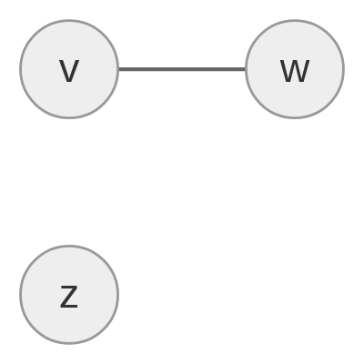
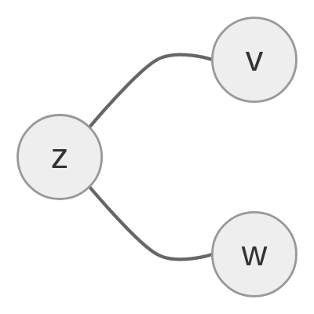
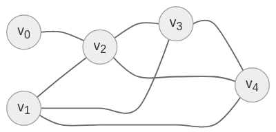
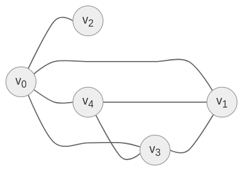
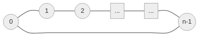

# Lista-1 *Wstęp do teorii grafów*

## Index
  - [Zadanie 1](#zadanie-1)

## Zadanie 1

1.
   1. Jeśli $G$ jest spójny to *done*.
   2. *Oth*
      1. Weźmy trójkę wierzchołków $v, w, z$ z grafu $G$ przy czym $v$ oraz $w$ są połączone kiedy $z$ jest w innej składowej niż para $v$ oraz $w$.
      2. W dopełnieniu $\overline{G}$ tracimy połączenie $v$ a $w$, ale uzyskujemy połączenia pomiędzy $v$ a $z$ oraz $w$ a $z$.
      3. Wówczas nadal mamy połączenie pomiędzy $v$ a $w$ poprzez $z$ oraz uzyskujemy połączenie pomiędzy składowymi, które wcześniej były oddzielone.

    $G$:

      

    $\overline{G}$:

      
1'.
   1. Załóżmy, że $G$ nie jest spójny, czyli $(\exists{A,B\in{V}}): \neg{A \sim_G B}$
   2. Weźmy dowolne $c \in V$, wówczas $\neg{(A \sim_G C \land C \sim_G B)}$, czyli istnieje $( \neg(A \sim_G C) \lor \neg(C \sim_G B) )$
   3. Analogicznie dla dowolnego $D \in V$
   4. Albo jest tak, że $( \neg(A \sim_G C) \lor \neg(A \sim_G D) )$ albo $( \neg(B \sim_G C) \land \neg(B \sim_G D) )$ albo jedno z pary $A,B$ nie jest połączone z $C$, a drugie z $D$
   5. Wtedy w każdym przypadku $C \sim_{\overline{G}} D$

## Zadanie 2

Graf $G = (V, E)$ prosty

$|E| > \binom{|V|-1}{2}$

**Pokaż, że $G$ jest spójny.**

1. $|V| = n$
2. $X = E\upharpoonleft_{(V-{v_0})^2}$
3. $H = ( V - \{v_0\}, X)$
4. $|X| = ?$
5. $|X| = (n-1)(n-2) \frac{1}{2} = \binom{n-1}{2} = \binom{|V| - 1}{2}$
6. 
7. 
8. $|X| \le \binom{|V-V_0|}{2}$
9. $|Y| = E\upharpoonleft_{[V_0]^2}$
10. $H = (V_0, Y)$
11. $|Y| \le \binom{|V_0|}{2}$
12. $|X| + |Y| \le \binom{n-k}{2} + \binom{k}{2} = \binom{n}{2} - k(n-k) \le \binom{n-1}{2} = (*)$ - nierówność zachodzi dla $k=1$ i $k=n-1$
13. $(*) < |E|$

Zatem $E \supsetneq X \cup Y$, czyli graf jest spójny.

## Zadanie 3

$n = |V|$\
$( \forall{v\in{V}}: 0 \le deg(v) \le n-1 )$

$\exists{v_0}: deg(v_0) = 0 \implies \neg\exists{v_1}: deg(v_1) = n-1$

Więcej wierzchołków niż rzędów bo *Dirichlet*.

## Zadanie 4

$V = \{ v_0, v_1, ..., v_{n-1} \}$\
$V_1 \dot{\cup} V_2 = V$\
$E = \{ e_0, e_1, ..., e_{n-1} \}$

$$\phi(e_k) =
\begin{cases}
      (v_k, v_{k+1}): k < n-1\\
      (v_{n-1}, v_0): k = n-1
\end{cases}
$$

$v_{n-1} \notin V_1$

$\neg( \exists{k<n}: \psi(e_k) = (v, w) \land ( v \in V_1 \land w \in V_1) \lor ( v \in V_2 \land w \in V_2 ) ) )$

$\neg\exists{k}: n-1 = 2k \equiv 2 \not{\lvert} n-1$

$\neg(\exists{k<n>}: \phi(e_k) = (v, w) \land ( v \in V_1 \land w \in V_1 ) \lor ( v \in V_2 \land w \in V_2 ) ) )$

$v_0 \in V_1 \implies v_1 \in V_2 \implies v_2k \in V_1 \land v_{1+2k} \in V_2$\
$0 \le k \le floor(\frac{n-2}{2})$

## Zadanie 5

*Hiper-kostki*

- regularny $\forall{w, v \in V}: deg(w) = deg(v)$
- $|V| = 2^n$
- $|E| = 2^{n-1}n$

Rząd elementów $\frac{2^{n-1}n2}{2^n}$

\<insert hiper-kostka\>

$V \ni (0,0,0,0,...,0)$ *(n zer)*\
$V \ni (1,1,1,1,...,1)$ *(n jedynek)*

$diam(Q_n) = n$

## Zadanie 6

$n \ge 1$\
$Q$ - graf dwudzielny\
$f(v)$ - liczba jedynek w zapisie binarnym wierzchołka $v$

Dla każdego sąsiada $w$ wierzchołka $v$\
$f(w) = f(v) + 1 \lor f(w) = f(v) - 1 \implies f(w) \not\equiv f(v)~mod~2$

$V = X \cup Y$\
$X = \{ v \in V: f(v) \equiv 0~mod~2 \}$\
$Y = V \setminus X$

## Zadanie 7

$Q_2$

1. $\phi: V_1 \rightarrow V_2$ na, 1-1
2. $( \forall{x,y \in V_1} )(\{ x,y \} \in E_1 \leftrightarrow \{ \phi(x), \phi(y) \} \in E_2 )$

