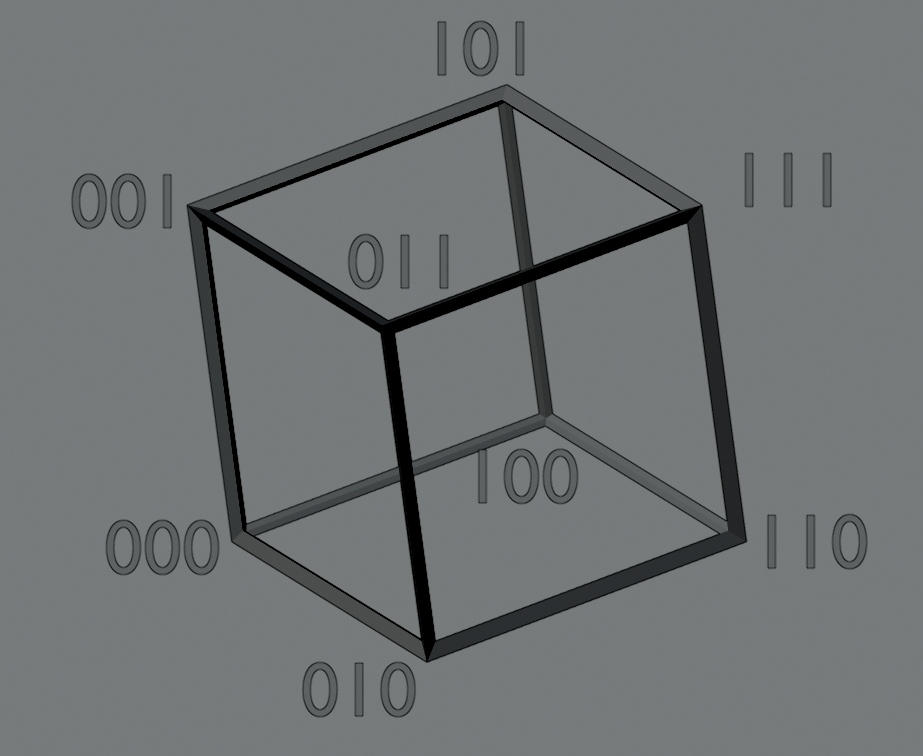
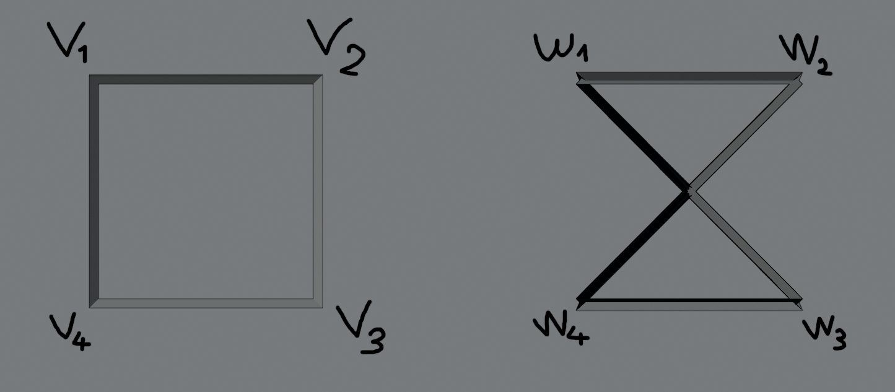

# Lista-1 *Wstęp do teorii grafów*

## Index

  - [Zadanie 1](#zadanie-1)
  - [Zadanie 2](#zadanie-2)
  - [Zadanie 3](#zadanie-3)
  - [Zadanie 4](#zadanie-4)
  - [Zadanie 5](#zadanie-5)
  - [Zadanie 6](#zadanie-6)
  - [Zadanie 7](#zadanie-7)
  - [Zadanie 8](#zadanie-8)
  - [Zadanie 9](#zadanie-9)
  - [Zadanie 10](#zadanie-10)
  - [Zadanie 11](#zadanie-11)
  - [Zadanie 12](#zadanie-12)
  - [Zadanie 13](#zadanie-13)
  - [Zadanie 14](#zadanie-14)
  - [Zadanie 15](#zadanie-15)
  - [Zadanie 16](#zadanie-16)
  - [Zadanie 19](#zadanie-19)

## Zadanie 1

> Niech $G$ będzie grafem prostym. Pokaż, że $G$ jest spójny lub $\overline{G}$ (dopełnienie grafu $G$) jest spójny. Podaj przykład takiego grafu $G$,że zarówno $G$ jak i $\overline{G}$ są grafami spójnymi.

1.
   1. Jeśli $G$ jest spójny to *done*.
   2. *Oth*
      1. Weźmy trójkę wierzchołków $v, w, z$ z grafu $G$ przy czym $v$ oraz $w$ są połączone kiedy $z$ jest w innej składowej niż para $v$ oraz $w$.
      2. W dopełnieniu $\overline{G}$ tracimy połączenie $v$ a $w$, ale uzyskujemy połączenia pomiędzy $v$ a $z$ oraz $w$ a $z$.
      3. Wówczas nadal mamy połączenie pomiędzy $v$ a $w$ poprzez $z$ oraz uzyskujemy połączenie pomiędzy składowymi, które wcześniej były oddzielone.

    $G$:

      

    $\overline{G}$:

      
1'.
   1. Załóżmy, że $G$ nie jest spójny, czyli $(\exists{a,b\in{V}}): \neg{a \sim_G b}$
   2. Weźmy dowolne $c \in V$, wówczas $\neg{(a \sim_G c \land c \sim_G b)}$, czyli istnieje $( \neg(a \sim_G c) \lor \neg(c \sim_G b) )$
   3. Analogicznie dla dowolnego $d \in V$
   4. Albo jest tak, że $( \neg(a \sim_G c) \lor \neg(a \sim_G d) )$ albo $( \neg(b \sim_G c) \lor \neg(b \sim_G d) )$ albo jedno z pary $a,b$ nie jest połączone z $c$, a drugie z $d$
   5. Wtedy w każdym przypadku $c \sim_{\overline{G}} d$
---
2. Przykładowym grafem $G$ takim, że $G$ lub $\overline{G}$ jest spójny, jest graf z jednym wierzchołkiem lub graf $C_4$ bez jednej krawędzi.

## Zadanie 2

> Niech $G = (V, E)$ będzie grafem prostym takim, że $|E| > \binom{|V|−1}{2}$. **Pokaż, że G jest grafem spójnym.**

Udowodnimy, że graf $\overline{G}$ jest niespójny.

Niech $|V| = n$.\
W grafie $G$ mamy $|E| > \binom{n-1}{2}$.

Wówczas w grafie $\overline{G} = (V,E')$ mamy
$$
E' = \binom{n}{2} - |E| < \binom{n}{2} - \binom{n-1}{2} =
\\
= \frac{n\cdot (n-1)}{2} - \frac{(n-1)(n-2)}{2} =
\\
= \frac{1}{2}((n-1) \cdot (n - (n-2))) =
\\
= \frac{1}{2}((n-1) \cdot 2) =
\\
= n-1
$$
co daje nam za małą (o jeden) liczbę krawędzi, żeby zbudować spójny graf. Zatem skoro $\overline{G}$ jest niespójny, wówczas $G$ jest spójny na mocy wyniku [zadania pierwszego](#zadanie-1).

## Zadanie 3

> Pokaż, że w każdym grafie prostym o co najmniej dwóch wierzchołkach są dwa wierzchołki o takim samym rzędzie.

$n = |V|$\
Case #1:\
$( \forall{v\in{V}}: 0 \le deg(v) \le n-1 )$\
$\exists{v_0}: deg(v_0) = 0 \implies \neg\exists{v_1}: deg(v_1) = n-1$

Case #2:\
$\neg\exists v\in V: \deg(v) = 0 \implies \forall v \in V: \deg: V \to \{1,\dots,n-1\}$

Więcej wierzchołków niż rzędów bo *Dirichlet* (pigeon principle).

## Zadanie 4

> Pokaż, że graf cykliczny $C_n$ jest grafem dwudzielny wtedy i tylko wtedy, gdy $n$ jest
liczbą parzystą.


$V = \{ v_0, v_1, ..., v_{n-1} \}$\
$V_1 \dot{\cup} V_2 = V$\
$E = \{ e_0, e_1, ..., e_{n-1} \}$

$$\varphi(e_k) =
\begin{cases}
      (v_k, v_{k+1}): k < n-1\\
      (v_{n-1}, v_0): k = n-1
\end{cases}
$$

$v_{n-1} \notin V_1$

$\neg\big(\exists{k<n}: \varphi(e_k) = (v, w) \land \left( v \in V_1 \land w \in V_1\right) \lor \left( v \in V_2 \land w \in V_2 \right) \big)$

$\neg(\exists{k}: n-1 = 2k) \equiv 2 \not{\lvert}~(n-1)$

$\neg\big(\exists{k<n}: \varphi(e_k) = (v, w) \land ( v \in V_1 \land w \in V_1 ) \lor ( v \in V_2 \land w \in V_2 ) \big)$

$v_0 \in V_1 \implies v_1 \in V_2 \implies v_{2k} \in V_1 \land v_{1+2k} \in V_2$\
$0 \le k \le \lfloor\frac{n-2}{2}\rfloor$

## Zadanie 5

> Wyznacz średnicę i rzędy elementów w hiper-kostce $Q_n$.

*Hiper-kostki*

- $n$-regularny $\forall{w, v \in V}: deg(w) = deg(v)$
- $\forall_{v \in V}: \deg(v) = n$
- $|V| = 2^n$
- $|E| = \frac{2^{n}\cdot n}{2} = 2^{n-1}\cdot n$



$V \ni (0,0,0,0,...,0)$ *(n zer)*\
$V \ni (1,1,1,1,...,1)$ *(n jedynek)*

$diam(Q_n) = n$

*Trzeba odwrócić wszędzie tam gdzie są jedynki na zera lub odwrotnie, a miejsc mamy właśnie $n$.*

## Zadanie 6

> Pokaż, że dla każdego $n\ge1$ hiper-kostka $Q_n$ jest grafem dwudzielnym.

$n \ge 1$\
$Q_n$ - graf dwudzielny\
$f(v)$ - liczba jedynek w zapisie binarnym wierzchołka $v$

Dla każdego sąsiada $w$ wierzchołka $v$\
$f(w) = f(v) + 1 \lor f(w) = f(v) - 1 \implies f(w) \not\equiv f(v)\mod2$

$V = X \dot\cup Y$\
$X = \{ v \in V: f(v) \equiv 0 \mod 2 \}$\
$Y = V \setminus X$

## Zadanie 7

> Pokaż, że grafy $Q_2$ i $K_{2,2}$ są izomorficzne.



| $a$   | $\varphi(a)$ |
| ----- | ------------ |
| $v_1$ | $w_1$        |
| $v_2$ | $w_2$        |
| $v_3$ | $w_4$        |
| $v_4$ | $w_3$        |

1. $\varphi: V_1 \xrightarrow[1-1]{\text{na}} V_2$

2. $( \forall{x,y \in V_1} )(\{ x,y \} \in E_1 \iff \{ \phi(x), \phi(y) \} \in E_2 )$

## Zadanie 8

> Niech $(V,E,\varphi)$ będzie grafem. Dla $e\in E$ określamy
> $$
> w(e) = \deg(x) + \deg(y)
> $$
> jeśli $\varphi(e) = \{x,y\}$. Pokaż, że
> $$
> \sum_{e\in E}w(e) = \sum_{v\in V}\deg^2(x)
> $$

Musimy dokonać podziału na pętle oraz krawędzie pomiędzy dwoma różnymi wierzchołkami:\
$L = \{ e \in E: |\varphi(e)| = 1 \}$\
$D = \{ e \in E: |\varphi(e)| = 2 \}$

Liczymy $\sum_{e}w(e)$ dla obu powyższych zbiorów osobno.

$$
\sum_{e \in L}w(e) = \sum_{e \in L}\sum_{x}\llbracket\varphi(e) = \{x\}\rrbracket(2\cdot \deg(x))=
\\
= \sum_{x} 2 \cdot \deg(x) \cdot \sum_{e \in L}\llbracket \varphi(e) = \{x\} \rrbracket
$$

$$
\sum_{e \in D}w(e) =
\sum_{\{x,y\} \in D}( \deg(x) + \deg(y) )
\\
= \frac{1}{2}\sum_{\{x,y\} \in V} \llbracket\{x,y\} \in D\rrbracket\Big( \deg(x) + \deg(y) \Big)=
\\
= \frac{1}{2}\bigg( \sum_{x \in V} \sum_{y \in V}\Big( \llbracket \{x,y\} \in D\rrbracket \deg(x) ) + \sum_{x \in V} \sum_{y \in V} \Big( \llbracket \{x,y\} \in D \rrbracket \deg(y) \Big) \bigg) =
\\
= \frac{1}{2}\bigg( \sum_x\deg(x)\Big( \sum_y \llbracket\{x,y\} \in D\rrbracket \Big) + \sum_y\deg(y) \Big( \sum_x\llbracket\{x,y\} \in D\rrbracket \Big) \bigg) =
\\
= \sum_x\deg(x)\sum_{e\in D}\llbracket \varphi(e) = \{x,y\} \rrbracket
$$

Łączymy:
$$
\sum_{x}\deg(x)\left( 2 \cdot \sum_{e \in L}\llbracket \varphi(e) = \{x\} \rrbracket + \sum_{e\in D}\llbracket \varphi(e) = \{x,y\} \rrbracket \right)=
\\
=\sum_{x\in L \cup D}\deg(x)\deg(x) = \sum_{x\in E}\deg(x)
$$

## Zadanie 9

> Pokaż, że w każdym spójnym grafie prostym o dwóch lub więcej wierzchołkach istnieją co najmniej dwa nierozcinające wierzchołki.
>
> *Uwaga*: Odłóżmy to zadanie do czasu aż zapoznacie się z pojęciem drzewa.
>
> *Uwaga*: Wierzchołek x nazywamy nierozcinającym jeśli jego usunięcie nie zwiększa liczby składowych spójnych grafu.
>
> *Wskazówka*: Sprawdź, że teza jest prawdziwa dla grafów o 2 oraz 3 wierzchołkach. Zastosuj indukcję matematyczną n → n + 1 startując od n=3; będziesz miał do rozważenie kilka przypadków.

```
.-----.

```
$nr(G)$ - liczba wierzchołków nierozcinających w grafie $G$

$nr(G_1) \ge 2$\
$G_1 = (V_1, E_1)$\
$G_2 = (V_2, E_2)$\
$V_2 = V_1 \cup \{v\}$\
$E_1 \subseteq E_2$, $E_2 \upharpoonright_{[V_1]^2}  = E_1$

1. $\ge$ dwie krawędzie $\implies nr(G_2) > nr(G_1)$
2. 1 krawędź do rozcinającego $\implies nr(G_2) = nr(G_1) +1$
3. 1 krawędź do nierozcinającego $\implies nr(G_2) = nr(G_1)$\
  $nr(G_2) \ge nr(G_1) \ge 2$

## Zadanie 10

> Załóżmy, że spójny graf prosty ma dokładnie dwa nierozcinające wierzchołki. Pokaż, że jest to graf liniowy.
>
> Uwaga: Odłóżmy to zadanie do czasu aż zapoznacie się pojęciem drzewa.

jeśli liniowy $nr(G) = 2$

```
.___.___.___.___.
```

$nr\big(\left(V,E \cup \{e_0\}\right)\big) \ge nr\big(\left(V,E\right)\big)$

1. $nr(G) = nr(G)$\
   $nr\big((V, E_0)\big) \le nr\big(V \cup \{v_0\}, E_1\big)$ : $E_0 \subseteq E_1$
   dodając wierzchołek dostanę albo graf liniowy albo graf o większym $nr$

Jeśli dodamy krawędź $\{v_1, v_2\}$, to wszystkie punkty leżące na ścieżce między $v_1$ i $v_2$ stają się nierozspójniające, czyli $nr(\cdot)$ rośnie

## Zadanie 11

> Niech $G = G(X,Y)$ będzie [grafem dwudzielnym](../../definicje/grafy/grafy.md#graf-dwudzielny).
>
> 1. Pokaż, że $\sum_{x\in X}\deg(x) = \sum_{y\in Y}\deg(y)$.
>
>    *Wskazówka*: Możesz zacząć tak:
>    $$
>    \sum_{x\in X}\deg(x) = \sum_{x\in X}\sum_{y\in Y}\big\lVert\{x,y\} \in E\big\rVert = \dots
>    $$
> 2. Pokaż, że jeśli $G$ jest regularny, to $|X| = |Y|$.
>
>    *Wskazówka*: Wystarczy, że sobie przypomnisz co to znaczy że graf jest regularny i skorzystasz z poprzedniego punktu.

$G = G[X,Y]$ $\leftarrow$ dwudzielny


1. $\sum_{x \in X}\deg(x) = |E| = \sum_{y \in Y}\deg(y)$
2. zał. że $G$ - regularny\
   $\forall v \in V~\deg(v) = d$\
   $\sum_{i=1}^{|X|}d = |X| \cdot d = \sum_{i=1}^{|Y|}d = |Y| \cdot d \implies |X| = |Y|$

$\blacksquare$

## Zadanie 12

> Podaj przykład dwóch nieizomorficznych grafów o tym samym ciągu stopni wierzchołków.


$\neg(G_1 \cong_{IZO} G_2)$, bo w $G_2$ wierzchołki o stopniu $3$, *nie licząc bezpośredniej krawędzi*, dzielą ich dwa wierzchołki, a w $G_1$ tylko jeden.

## Zadanie 13

> Rozstrzygnij czy następujące ciągi są graficzne i jeśli ciąg jest graficzny, to znajdź graf prosty o tym ciągu stopni:
> 1. (4, 3, 2, 1, 0)
> 2. (4, 3, 3, 2, 2, 1, 1)
> 3. (6, 4, 4, 4, 3, 1, 1, 1)

1. $(4,3,2,1,0) \rightarrow (2,1,0,\underline{-1})$
2. $(4,3,3,2,2,1,1) \rightarrow (2,2,1,1,1,1) \rightarrow (1,1,1,1,0)$
    
3. $(6,4,4,3,1,1,1) \rightarrow (3,3,3,2,0,0,1) \rightarrow (3,3,3,2,1,0,0) \rightarrow (2,2,1,0,0) \rightarrow (1,0,1,0,0)$
    

## Zadanie 14

> Pokaż, że grafy proste $G_1$ oraz $G_2$ są izomorficzne wtedy i tylko wtedy, gdy ich dopełnienia $\overline{G_1}$ oraz $\overline{G_2}$ są izomorficzne.
>
> *Wskazówka*: $\vDash \Big(\big(p \leftrightarrow q\big) \leftrightarrow \big((\neg p) \leftrightarrow (\neg q)\big)\Big)$

Mamy izomorfizm $\varphi: V_1 \xrightarrow[„na”]{1-1} V_2$\
gdzie $V_1 = V(G_1), V_2 = V(G_2)$.

Niech $E_1' = V(\overline{G_1}), E_2' = V(\overline{G_2})$.

Skoro
$$
\{u,v\} \in E_1 \iff \{\varphi(u), \varphi(v)\} \in E_2
$$
oraz
$$
\{u,v\} \notin E_1 \iff \{\varphi(u), \varphi(v)\} \notin E_2
$$
wówczas
$$
\{u,v\} \in E_1' \iff \{\varphi(u), \varphi(v)\} \in E_2'
$$
$\forall~ u,v \in V_1$.

## Zadanie 15

> Wyznacz wszystkie grafy proste o czterech wierzchołkach z dokładnością do izomorfizmu.


## Zadanie 16

> Załóżmy, że $G[X,Y]$ jest grafem dwudzielnym takim, że $\forall~x\in X \land y\in Y$ mamy $\deg(x) \ge \deg(y) > 0$.\
**Pokaż, że $|X| \le |Y|$**.
>
> *Wskazówka*: Dowód jest dość pomysłowy: zauważ, że:
>    $$
>    |X| = \sum_{x\in X}1 = \sum_{x\in X}\sum_{y\in Y}\llbracket\{x,y\} \in E\rrbracket \frac{1}{\deg(x)}
>    $$

$$
|X| = \sum_{x\in X}1 = \sum_{x\in X}\sum_{y\in Y}\big\lVert\{x,y\} \in E\big\rVert \frac{1}{\deg(x)} \le\\

\le \sum_{x\in X}\sum_{y\in Y}\left(\left\lVert\{x,y\}\in E\right\rVert\cdot\frac{1}{\deg(y)}\right) = \sum_{y\in Y}=|Y|
$$

## Zadanie 19

> **Produktem kartezjańskim** grafów $G_1 = (V_1, E_1)$ oraz $G_2 = (V_2, E_2)$ nazywamy graf $G_1 \times G_2$ o zbiorze wierzchołków $V_1 \times V_2$ oraz zbiorze krawędzi
> $$
> E = \Big\{~
  \{(x_1,y_1), (x_2,y_2)\}:\\
  (x_1 = x_2 \land \{y_1,y_2\}\in E_2\})
  \lor (\{x_1, x_2\} \in E_1 \land y_1=y_2)
  \Big\}
> $$
> 1. Wyznacz grafy $L_3 \times L_4$, $C_2 \times C_5$
> 2. Wyznacz $\deg\big((x,y)\big)$ w $G_1 \times G_2$
> 3. Wyznacz liczbę krawędzi w grafie $G_1 \times G_2$

### 19.1

$L_3 \times L_4$

$L_3$:
```
.---.---.
```
$L_4$
```
.---.---.---.
```
