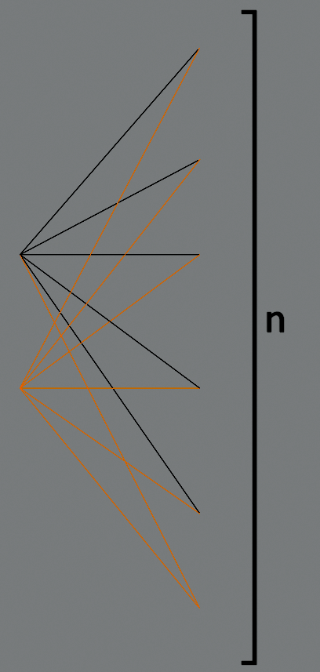

# Lista-3
*Drzewa*

- [Lista-3](#lista-3)
  - [Zadanie 25](#zadanie-25)
  - [Zadanie 26](#zadanie-26)
  - [Zadanie 33](#zadanie-33)
  - [Zadania 38, 39](#zadania-38-39)

## Zadanie 25

> Załóżmy, że $G = (V, E)$ jest takim grafem prostym, że $|E| \ge |V|$. Pokaż, że graf $G$ zawiera
cykl.

Niech $|V| = n$. Wówczas $|E| \ge n$.

Minimalną liczbą krawędzi jaką musi mieć graf spójny jest $n-1$ – mamy wtedy [drzewo](../../wyk/2020-03-18/2020-03-18.md), w którym nie ma żadnych cykli. Jednakże mamy do dyspozycji przynajmniej $n$ krawędzi, co daje nam możliwość „doklejenia” gdzieś w naszym drzewie jednej krawędzi zamykając cykl jednej ze już istniejących ścieżek w drzewie.

W przypadku grafów niespójnych (mamy więcej niż jedną składową) sytuacja jest podobna – tutaj mamy nawet więcej możliwości budowania cykli z już istniejących ścieżek.

## Zadanie 26

> Niech $G = (V, E)$ będzie grafem prostym. Załóżmy, że $v \in V$ jest wierzchołkiem o stopniu nieparzystym. Pokaż, że istnieje inny wierzchołek $u \in V$ o rzędzie nieparzystym od którego jest jakaś droga od $v$.\
> *Wskazówka: Zajmij się komponentą spójną grafu G do której należy wierzchołek v.*

W każdym spójnym grafie (a możemy tutaj według wskazówki ograniczyć się do komponenty gdzie mamy nasze $v$ oraz $u$ i traktować to jako osobny graf) zachodzi:
$$
\sum_{x \in V} \deg(v) = 2\cdot|E|
$$

Co oznacza, że albo każdy wierzchołek ma parzysty $\deg$ (poza zakresem zadania) albo liczba wierzchołków o nieparzystym $\deg$ jest parzysta. Jako, że wiemy o istnieniu takiego wierzchołka $v$, że $2 \nmid \deg(v)$ to ta liczba musi wynosić przynajmniej $2$ – czyli istnieje drugi wierzchołek $u$ o takim samym $\deg$.

## Zadanie 33

> Wyznacz liczbę grafów rozpinających w grafach $K_{2,n}$.

Nazwijmy dwie części grafu $A$ oraz $B$ gdzie $A$ to dwa wierzchołki z pierwszej składowej $K_{\bold{2},n}$, a $B$ to pozostałe $n$ wierzchołków z drugiej składowej.

Wyznaczmy pierwsze drzewo startując na jednym z wierzchołków ze zbioru $A$:

Wybieramy jeden wierzchołek z $B$ który łączymy z wszystkimi wierzchołkami ze zbioru $A$.

Teraz musimy doliczyć wszystkie pozostałe drzewa rozpinające.
Zauważmy, że musi być zawsze jeden wierzchołek z $B$ łączący oba wierzchołki z $A$ (swego rodzaju *mediator* pomiędzy wierzchołkami z $A$). Mamy $n$ możliwości do wyboru takiego wierzchołka.

Następnie musimy rozdystrybuować resztę $n-1$ wierzchołków z $B$ pomiędzy dwa wierzchołki z $A$. Robimy to na $2^{n-1}$ sposobów jako, że iterując po wszystkich pozostałych $n-1$ wierzchołkach z $B$ za każdym razem mamy dwie opcje do wyboru.

Zatem ostatecznym wynikiem będzie $n\cdot 2^{n-2}$.

## Zadania 38, 39

> ### Zadanie 38
> W dodatku A znajduje się kod prostej klasy języka Python implementującą graf prosty.
>
> 1. Dodaj do taj klasy metody służące do wyznaczania $\delta(G)$, $\overline{d}(G)$ oraz $\Delta(G)$
> 2. Dodaj do tej klasy metodę `ecc` która służy do obliczania ekscentryczności wierzchołka
> 3. Dodaj do tej klasy metodę służącą do wyznaczania promienia i średnicy grafu.
>
> ### Zadanie 39
> Do klasy z dodatku A dodaj metodę służącą do wyznaczania drzewa rozpinającego grafu.

[kod](ex-38-39.py)
