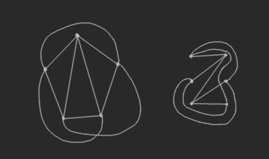
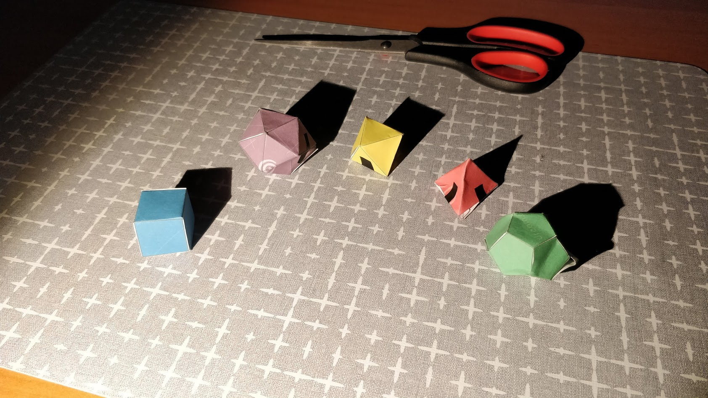
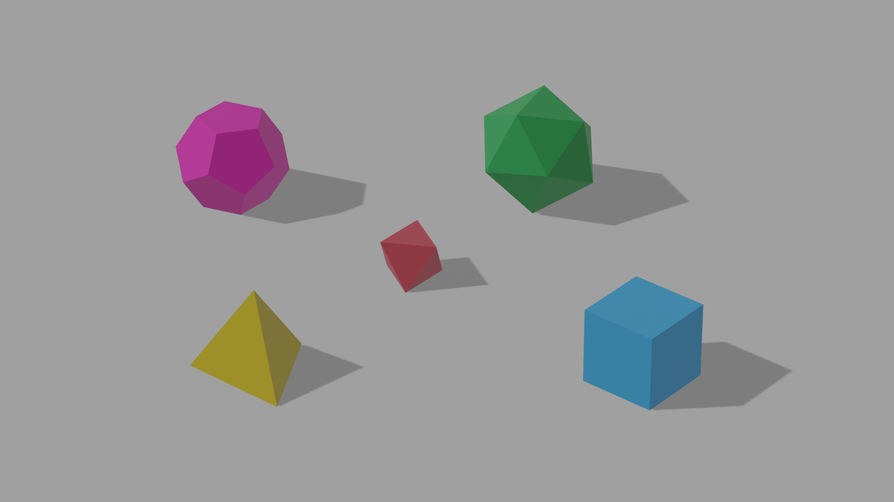
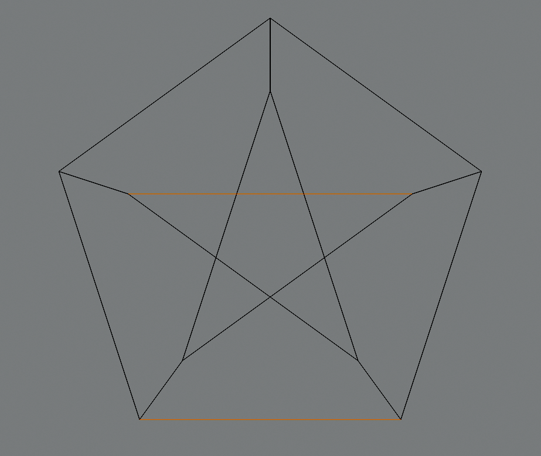
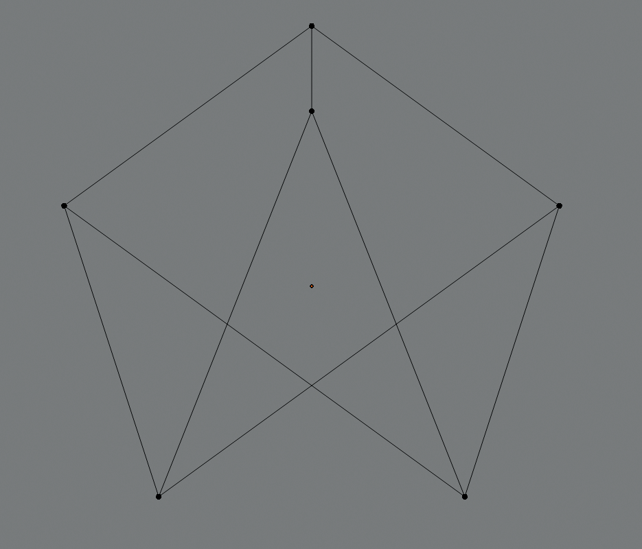
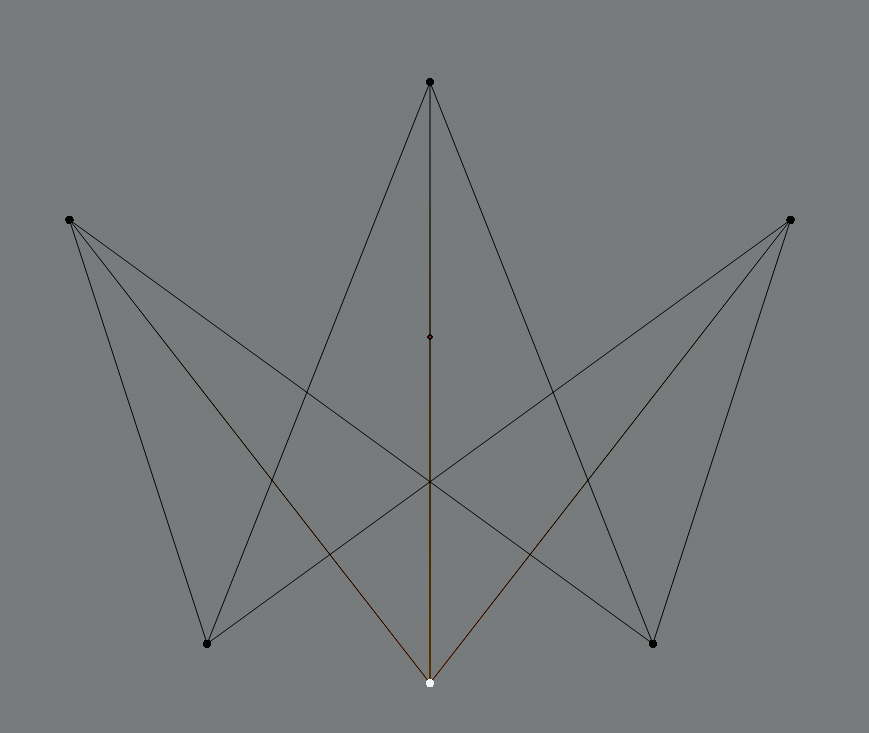
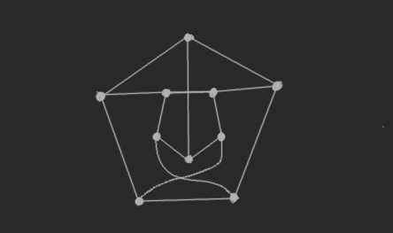

---

- [Zadanie 42](#zadanie-42)
- [Zadanie 43 *świąteczne*](#zadanie-43-świąteczne)
- [Zadanie 44](#zadanie-44)
- [Zadanie 45](#zadanie-45)
- [Zadanie 48](#zadanie-48)

---

## Zadanie 42

> Przedstaw grafy $K_{3,3}$ i $K_5$ jako grafy na płaszczyźnie z minimalną liczbą przecięć.

## Zadanie 43 *świąteczne*

> Zaopatrz się w brystol, wytnij na podstawie następującego rysunku [rysunek] szablony brył platońskich i sklej je.

## Zadanie 44

> Pokaż, że graf Petersena nie jest planarny.
> *Wskazówka: Usuń dwie ”poziome” krawędzie i skorzystaj z twierdzenia Kuratowskiego.*

Usuwamy dwie „poziome” krawędzie według wskazówki:

Następnie kondensujemy zaznaczone krawędzie:

Wówczas otrzymujemy graf $K_{3,3}$ który nie jest planarny:

Możemy dodatkowo przesunąć górny wierzchołek na dół, żeby ujrzeć bardziej *klasyczną* wersję tego grafu.

## Zadanie 45

> Narysuj na płaszczyźnie graf Petersena tak aby na rysunku były tylko dwa przecięcia
krawędzi.

## Zadanie 48

> Pokaż, że każde drzewo jest planarne.
>
> *Wskazówka: To jest proste ćwiczenie na indukcję matematyczną; indukcję zrób po liczbie
wierzchołków.*

Niech zadane drzewo będzie $T$.

Stworzymy graf izomorficzny z drzewem $T$. Bierzemy wierzchołek $r \in V(T)$, który traktujemy jako korzeń drzewa. Wszystkie wierzchołki należące do sąsiedztwa $r$ dorysowujemy na nowym grafie w takiej samej odległości jednak każdy skierowany w inną stronę i łączymy te wierzchołki krawędziami z $r$. Teraz dla każdego z tych wierzchołków sąsiednich do $r$ powtarzamy tę procedurę aż nie skończą się nam wierzchołki.\
Kształt powstałego grafu może przypominać gwiazdę, bo rysując kolejne krawędzie oddalamy się od $r$ i nie przecinamy żadnych innych krawędzi podczas rysowania nowych – mamy taką możliwość, ponieważ żyjemy w przestrzeni $\reals\times\reals$, która daje nam nieskończoną precyzję i nieskończone możliwości kładzenia kolejnych krawędzi i wierzchołków :).
