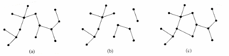

---

- [$Definicja$ Graf *acykliczny*](#definicja-graf-acykliczny)
- [Lemat A](#lemat-a)
    - [D-d Lemat A](#d-d-lemat-a)
- [$Definicja$ Krawędź $e$ w grafie spójnym](#definicja-krawędź-e-w-grafie-spójnym)
- [Lemat B](#lemat-b)
- [$Twierdzenie$ #1](#twierdzenie-1)
    - [$\circlearrowleft$:](#circlearrowleft)
- [D-d $Twierdzenia$ #1](#d-d-twierdzenia-1)
- [$Twierdzenie$ #2](#twierdzenie-2)
    - [D-d Twierdzenie #2](#d-d-twierdzenie-2)
- [$Definicja$ Drzewo rozpinające](#definicja-drzewo-rozpinające)
- [$Twierdzenie$ #3](#twierdzenie-3)
    - [D-d abstrakcyjny $Twierdzenia$ #3](#d-d-abstrakcyjny-twierdzenia-3)
    - [D-d *bardziej algorytmiczny* $Twierdzenia$ #3](#d-d-bardziej-algorytmiczny-twierdzenia-3)

---

## $Definicja$ Graf *acykliczny*

Graf **bez cykli** nazywamy acyklicznym.\
**Drzewem** nazywamy dowolny graf acykliczny.\
**Drzewem** nazywamy spójny acykliczny graf.

**Liściem** w drzewie nazywamy wierzchołek o stopniu $1$.

Każdy las jest sumą rozłącznych drzew.

- $(a)$ - drzewo
- $(b)$ - las
- $(c)$ - **nie** drzewo

## Lemat A

Każde skończone drzewo $T(V,E)$ dla $|V|\ge 2$ ma co najmniej dwa liście.
Po usunięciu liścia z drzewa z $n$ wierzchołkami otrzymujemy o $n-1$ wierzchołkach.

### D-d Lemat A

1. Stosujemy fajny *(typowy dla teorii grafów)* trik: rozważmy drogę $x_1x_2 \dots x_k$ o największej długości *(jest taka droga, bo graf jest skończony)* i pokazujemy, że $x_1$ oraz $x_k$ mają stopień równy $1$.
2. Łatwe: jeśli
   - $\deg(x) = 1$
   - $a,b \in V \setminus \{x\}$

    to droga od $a$ do $b$ nie może przechodzić przez $x$.

## $Definicja$ Krawędź $e$ w grafie spójnym

Krawędź $e \in E$ w grafie spójnym $G=(V,E)$ nazywamy mostem jeśli graf $G-e = (V,E\setminus\{e\})$ nie jest spójny. Na poniższym rysunku krawędź będąca mostem ma czerwony kolor.

Zauważ, że po usunięciu mostu z grafu z tego rysunku graf rozpada się na dwie składowe spójne. Tak jest zawsze - jest to jedno z zadań które pojawi się na [liście](https://cs.pwr.edu.pl/cichon/2019_20_b/Grafy/GraphsZadania.pdf).

## Lemat B

Jeśli krawędź należy do cyklu to nie jest [mostem](../../definicje/ścieżki/ścieżki.md#bridge).

## $Twierdzenie$ #1

Niech $G=(V,E)$ będzie grafem prostym przy czym $|V|=n\ge 1$.

### $\circlearrowleft$:

  1. $G$ jest spójny i nie ma cykli *(czyli $G$ jest drzewem)*
  2. $G$ jest spójny i $|E| = n-1$
  3. $G$ ma $|E| = n-1$ i nie ma cykli

Na Twierdzenie to można spojrzeć tak: mając trzy własności $\big\{$spójność, acykliczność, posiadanie $n-1$ wierzchołków $\big\}$ każda dwójka z nich implikuje trzecią.

## D-d $Twierdzenia$ #1

$1.\implies2.$\
(indukcja po $n$ $|V(G)|$)\
Dla $n=1$ jest OK.\
Zakładamy, że dla grafów $G$ takich, że $|V(G)| = n$ implikacja ta jest prawdziwa. Bierzemy graf $H$ taki, że $|H| = n+1$. Na mocy [Lematu A](#lemat-a) ma on liście. Niech $a$ będzie takim liściem. Rozważamy graf $H$ - $\{a\}$. […]

$2.\implies3.$\
Załóżmy, że $G$ jest spójny, ma $n-1$ krawędzi ale ma cykl. Weźmy krawędź $e$ z tego cyklu. Na mocy [Lematu B](#lemat-b) krawędź $e$ nie jest mostem. Zatem graf $G - e$ jest spójny, ale ma on $n-2$ krawędzi. A to jest sprzeczne z [ostatnim twierdzeniem z drugiego wykładu](../2020-03-04/2020-03-04.md#twierdzenie-2).

$3.\implies1$.\
Załóżmy, że $G$ rozkłada się na składowe spójne $V_1,\dots,V_k$. Niech $n_1 = |V_1|,\dots,n_k=|V_k|$. Każda ze składowych jest spójna i nie ma cykli. Wiemy, już że $1.\implies2.$. Zatem $V_i$ ma $n_i-1$ krawędzi. Więc graf $G$ ma $(n_1-1) + \dots + (n_k-1)$ krawędzi.\
Ale $(n_1-1) + \dots + (n_k-1) = (n_1 + \dots + n_k) -k = n-k$\
więc $k=1$.\
*Komentarz: wiemy, że jeśli graf spójny ma $n$ wierzchołków, to musi mieć co najmniej $n-1$ wierzchołków; zatem drzewo to graf spójny o minimalnej liczbie krawędzi.*

## $Twierdzenie$ #2

Niech $G=(V,E)$ będzie prostym grafem o $n\ge1$ wierzchołkach.

$\circlearrowleft$:
1. $G$ jest drzewem
2. dla dowolnej pary wierzchołków $a,b \in V$ istnieje dokładnie jedna droga od $a$ do $b$

### D-d Twierdzenie #2

$1.\implies2.$:\
Załóżmy, że mamy dwie różne drogi $P$ i $Q$ od $a$ do $b$.\
Niech krawędź $e$ będzie na drodze $P$ ale nie na $Q$.\
Niech $e = \{x,y\}$.\
Zbuduj drogę od $x$ do $y$; po dodaniu $e$ do tej drogi otrzymamy cykl:

$2.\implies1.$ - trywialne.

## $Definicja$ Drzewo rozpinające

Graf $T = (V, E_T)$ jest **drzewem rozpinającym** grafu $G = (V,E)$ jeśli $T$ jest drzewem i $E_T \subseteq E$.

Na poniższym rysunku jest graf i jedno z jego drzew rozpinających (czarne kreski):

## $Twierdzenie$ #3

**Każdy spójny graf ma drzew rozpinające**.

### D-d abstrakcyjny $Twierdzenia$ #3
Niech $(V,E)$ będzie grafem spójnym. Niech $\mathcal{E}$ będzie rodziną wszystkich podzbiorów $H \subseteq E$ takich, że $(V,H)$ jest spójny.\
Niech $T$ będzie $\subseteq$-minimalnym elementem $\mathcal{H}$. Wtedy $(V,T)$ jest drzewem.

### D-d *bardziej algorytmiczny* $Twierdzenia$ #3
Usuwajmy kolejno z $E$ krawędzie z cykli tak długo jak jest jakiś cykl. Na mocy [Lematu B](#lemat-b) nie psujemy spójności. A uzyskamy acykliczność. Otrzymamy więc w ten sposób drzewo.\
Na [liście zadań](../../cw/lista-3/lista-3.md#zadanie-39) będzie do przemyślenia jeszcze inny sposób budowania drzewa rozpinającego.
