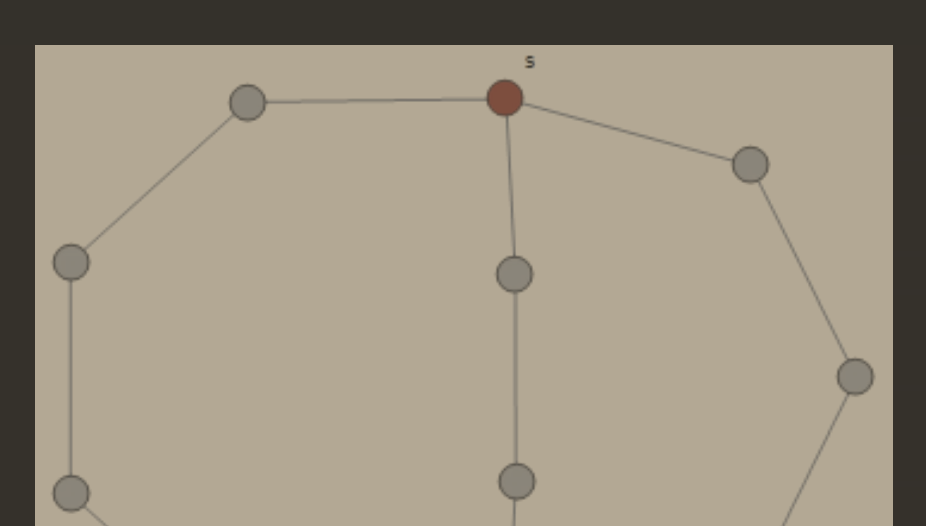
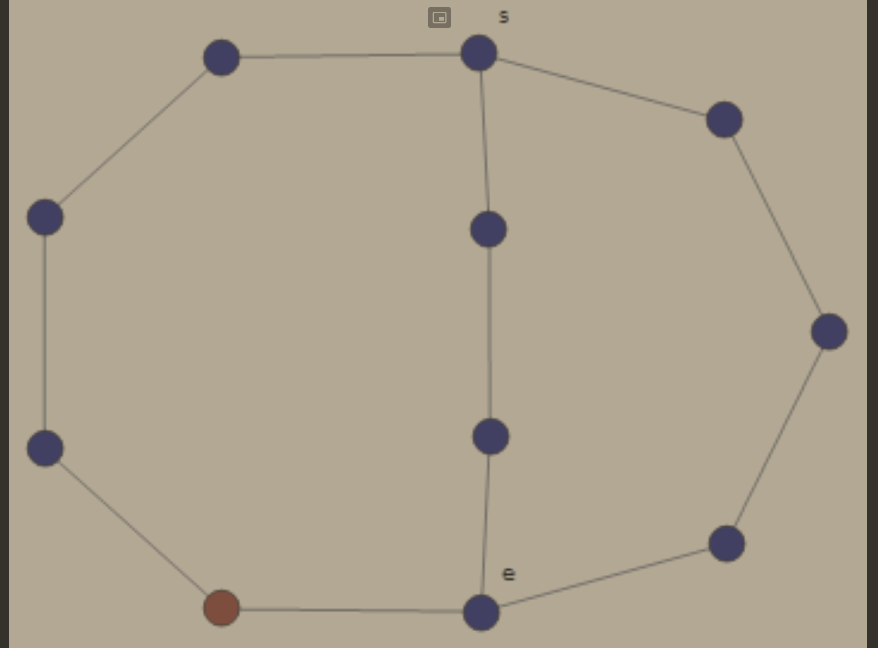

# Drzewa\*
*\*odwołany z powodu koronawirusa*\
*(2020-03-25)*

## $Fakt$ #1

Załóżmy, że $G$ jest lasem o $k$ składowych.\
Wówczas $\lvert E(G)\rvert = \lvert V(G)\rvert - k$.

### Dowód $Faktu$ #1

Niech $X_1,\dots,X_k$ będą składowymi spójnymi lasu $G$. Wtedy $G[X_i] = (X_i, E~\cap~[X_i]^2)$ jest drzewem.\
Zatem
$$
\lvert E(G)\rvert = \sum_{i=1}^{k}\Big\lvert E\big(G[X_i]\big)\Big\rvert = \sum_{i=1}^{k}\bigg(\Big\lvert V\big(G[X_i]\big)\Big\rvert -1\bigg) = \dots = \big\lvert E(G) \big\rvert -k
$$

## $Twierdzenie$ (Cayley)

Niech $n \ge 2$.\
Zbiór wszystkich drzew na zbiorze $\{1,\dots\}$ istnieje $n^{n-2}$ drzew.

Istnieje wiele dowodów tego twierdzenia. Najbardziej obrazowym jest dowód używający ciągów Prüfera.

### Dowód $Twierdzenia$ Cayleya z ciągami Prüfera
Pokażemy, że możemy przejść z drzewa mającego $n$ wierzchołków do ciągu $(a_1,a_2,\dots,a_{n-2})$ gdzie $\forall_{i\in\{1\dots n-2\}}~a_i \in \{1\dots n\}$. Jeśli pokażemy taką zależność udowodnimy powyższe twierdzenie jako, że takich ciągów jest dokładnie $n^{n-2}$.

Dla $n\in \{1,2\}$ jest OK.

Mamy drzewo $T$ posiadające $n$ wierzchołków oraz *(narazie)* pusty ciąg $P$.

Niech $b_1$ będzie najmniejszą liczbą będącą label-em liścia drzewa $T$, za to $a_1$ będzie liczbą będącą label-em sąsiada tego wierzchołka z label-em $b_1$.

Usuwamy wierzchołek z label-em $b_1$ i krawędź łączącą go z resztą $T$ i do ciągu $P$ append-ujemy $a_1$.

Powtarzamy proces, aż nie otrzymamy $P = (a_1,a_2,\dots,a_{n-2})$ a drzewo $T$ będzie $K_2$ (będzie miało tylko dwa wierzchołki).

Teraz w drugą stronę.

Mamy ciąg $P = (a_1,a_2,\dots,a_{n-2})$ oraz pusty graf $T$.

Niech $b_1$ będzie najmniejszą liczbą $\in \{1\dots n\}$, która nie występuje ciągu $P$ i połączmy ze sobą wierzchołki $a_1$ oraz $b_1$.

Usuwamy $a_1$ z $P$ oraz usuwamy $b_1$ z naszego alfabetu liczb $A=\{1\dots n\}$.\
Czyli teraz $A = \{1\dots n\} \setminus \{b_1\}$.

Powtarzamy proces aż nie wykorzystamy wszystkich elementów ciągu $P$.

Zatem, pokazaliśmy proces przejścia z drzewa do ciągu Prüfera oraz na odwrót co kończy dowód.\
$\blacksquare$

Bardzo obrazowo i klarownie dowód został przedstawiony przez dr Sarada Herke [tu](https://www.youtube.com/watch?v=Ve447EOW8ww) oraz [tutaj](https://www.youtube.com/watch?v=utfW-xsDp3Y).

## $Definicje$ rzędy wierzchołków

Mamy graf $G$.

### Minimalny rząd wierzchołka
$\delta(G) = \min\{\deg(x):~x \in V(G)\}$
### Średni rząd wierzchołka
$\overline{d}(G) = \frac{\sum_{x\in V(G)}\deg(x)}{\lvert V(G) \rvert}$
### Maksymalny rząd wierzchołka
$\Delta(G) = \max\{\deg(x):~x\in V(G)\}$

Oczywiście mamy:
$$
\delta(G) \le \overline{d}(G) \le \Delta(G)
$$

## $Definicje$ w grafie spójnym

Mamy spójny graf $G$.

### Ekscentryczność wierzchołka

$v\in V(G)$\
$\mathrm{ecc}(v) = \max\big\{d(v,y):~y \in V(G)\big\}$

[Algorytm wyznaczania $\mathrm{ecc}$ wierzchołka](#algorytm-wyznaczania-ekscentryczno%c5%9bci-wierzcho%c5%82ka)

### Promień grafu

$\min\big\{\mathrm{ecc}(x):~x \in V(G)\big\}$

### Średnica grafu

$\max\big\{d(x,y):~x,y \in V(G)\big\}$

## Algorytm wyznaczania ekscentryczności wierzchołka

Zakładamy, że dla każdego wierzchołka $x$ mamy metodę wyznaczania listy jego sąsiadów $N(x)$.

`INPUT  :` $v \in V$\
`OUTPUT :` $\mathrm{ecc}(v)$

```python
L = 0
visited = [v]
active  = N(v)
while active != []:
  L += 1 # (1)
  visited += active
  active = [y for x in active for y in N(x) if y not in visited]

return L
```
Zauważmy, że po operacji `(1)` mamy `active` $=\{x \in V(G):~d(v,x) = L\}$ przez cały czas działania pętli.

Metodę tę nazywamy metodą *„przeszukiwania grafu wszerz”*.





Powyższa metoda została opisana również na [wykładzie AiSD](../../../../4th-semester/aisd/wyk/2020-05-18/breadth-first-search.md)
